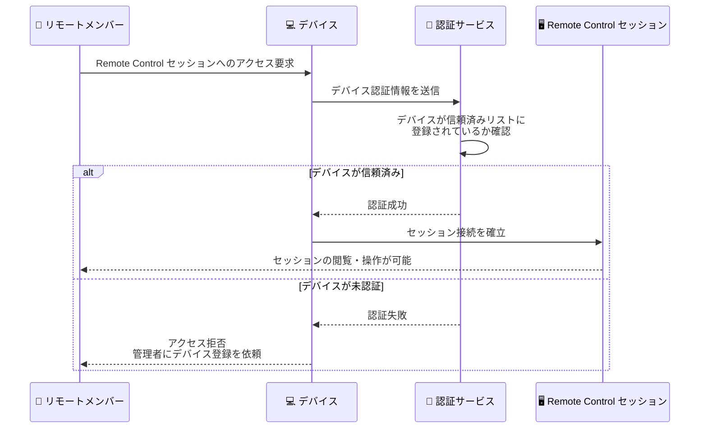
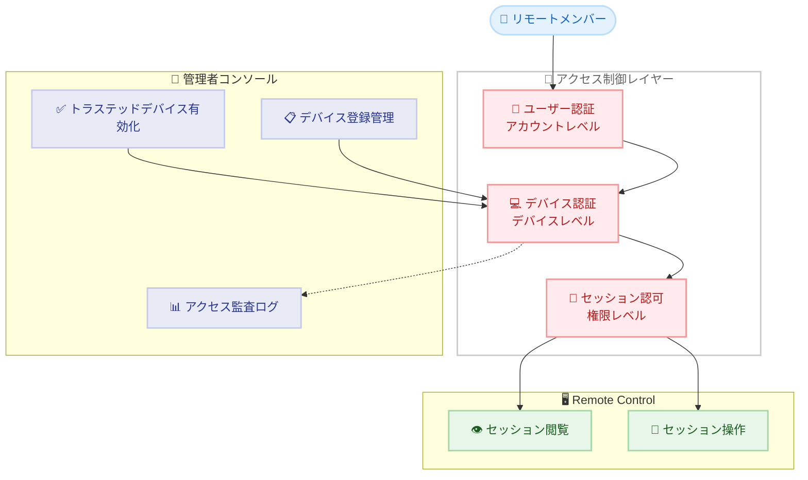

# Claude Code Remote Control にトラステッドデバイス認証が追加

## メタデータ

| 項目 | 内容 |
|------|------|
| 発表日 | 2026-06-25 |
| ソース | Claude Apps Release Notes |
| カテゴリ | Claude Apps アップデート / セキュリティ |
| 公式リンク | [Release Notes](https://support.claude.com/en/articles/12138966-release-notes) |

## 概要

Anthropic は 2026 年 6 月 25 日、Claude Code の Remote Control 機能にトラステッドデバイス (信頼済みデバイス) 認証を追加したことを発表した。Team プランおよび Enterprise プランの管理者は、組織メンバーがリモートから Claude Code セッションを閲覧・操作する前に、デバイス認証を必須として設定できるようになった。これにより、未認証のデバイスからのリモートアクセスを防止し、エンタープライズ環境におけるセキュリティが大幅に強化される。

## 詳細

### 背景

Claude Code の Remote Control 機能は、チームメンバーが他のメンバーのローカル Claude Code セッションをリモートから閲覧・操作できる機能として先行リリースされていた。この機能はペアプログラミングやコードレビュー、チーム間のコラボレーションを円滑にする一方で、エンタープライズ環境においては不正アクセスのリスクが懸念されていた。

特に以下のような課題が存在していた。

- 認証済みアカウントであっても、未承認のデバイスからアクセスされるリスク
- 共有デバイスや紛失デバイスからのセッション閲覧の可能性
- コンプライアンス要件として、デバイスレベルの認証を求める企業ニーズ

### 主な変更点

1. **トラステッドデバイス設定の追加**: 管理者が組織設定でデバイス認証を有効化できる
2. **デバイス検証フロー**: Remote Control セッションへのアクセス前にデバイスの検証が必須となる
3. **未認証デバイスのブロック**: 信頼済みとして登録されていないデバイスからのリモートセッションアクセスを自動的に拒否する

### 技術的な詳細

この機能は Remote Control のアクセス制御に新しいレイヤーを追加する。従来のユーザー認証 (アカウントレベル) に加え、デバイスレベルの認証を導入することで、多層防御 (Defense in Depth) を実現している。

**対象プラン:**

- Team プラン
- Enterprise プラン

**有効化方法:**

管理者が組織の管理コンソールから「Enable Trusted Devices for Remote Control」を有効にすることで、組織全体にデバイス認証要件が適用される。

## デバイス認証フロー

## 管理者への影響

### 対象

- Team プランおよび Enterprise プランの組織管理者
- Remote Control 機能を利用しているチーム
- セキュリティポリシーの策定担当者

### 必要なアクション

1. **設定の確認**: 組織の管理コンソールでトラステッドデバイス設定を確認する
2. **ポリシーの策定**: デバイス登録・承認のワークフローを定義する
3. **メンバーへの周知**: デバイス登録が必要であることをチームに通知する
4. **既存セッションへの影響確認**: 有効化後、未登録デバイスからの接続が切断される可能性を考慮する

### エンタープライズユースケース

| ユースケース | メリット |
|-------------|---------|
| リモートワーク環境 | 会社承認デバイスのみからセッションにアクセス可能 |
| コンプライアンス対応 | デバイスレベルの監査証跡を確保 |
| BYOD 環境 | 個人デバイスからの不正アクセスを防止 |
| セキュリティインシデント対応 | 紛失・盗難デバイスの即時アクセス無効化 |

## セキュリティアーキテクチャ

## 関連リンク

- [Claude Apps Release Notes](https://support.claude.com/en/articles/12138966-release-notes)
- [Claude Code ドキュメント - Remote Control](https://docs.anthropic.com/en/docs/claude-code)

## まとめ

トラステッドデバイス認証の追加は、Claude Code の Remote Control 機能をエンタープライズ環境で安全に運用するための重要なセキュリティ強化である。従来のユーザー認証に加えてデバイスレベルの検証を導入することで、多層防御アプローチを実現し、未承認デバイスからのリモートセッションアクセスを確実に防止する。Team プランおよび Enterprise プランの管理者は、組織のセキュリティポリシーに応じてこの機能を有効化し、リモートコラボレーションの安全性を高めることが推奨される。
