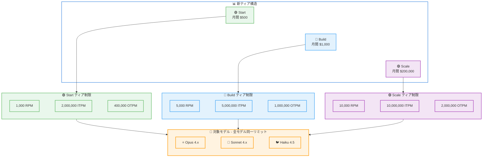

# Claude API レートリミット統合: 全モデルで Opus 同等の制限値に統一

## メタデータ

| 項目 | 内容 |
|------|------|
| 発表日 | 2026-06-26 |
| ソース | Claude API Release Notes |
| カテゴリ | API アップデート / レート制限 |
| 公式リンク | https://platform.claude.com/docs/en/release-notes/overview |

## 概要

Anthropic は 2026 年 6 月 26 日、Claude API のレートリミット体系を大幅に刷新した。従来のティア構造を 3 つのティア (Start、Build、Scale) に統合し、Claude Sonnet 4.x および Claude Haiku 4.5 のレートリミットを Claude Opus 4.x と同一水準に引き上げた。この変更により、モデル選択時にレートリミットの差異を考慮する必要がなくなり、開発者はコスト・性能のトレードオフのみに集中できるようになる。既存の組織は自動的に新ティアに移行され、いずれの組織も従来より低い制限を受けることはない。

## 詳細

### 背景

従来の Claude API レートリミット体系では、モデルごとに異なるレートリミットが設定されており、特に Sonnet や Haiku などの軽量モデルでは Opus よりも低い制限値が適用されていた。また、使用ティアが細分化されていたため、組織がどのティアに属するかの把握や、スケールアップ時の計画立案が複雑になっていた。

今回の変更は、開発者体験の簡素化とスケーラビリティの向上を目的としたもので、以下の 2 つの柱で構成される。

1. **モデル間のレートリミット統一**: Sonnet と Haiku を Opus と同一水準に引き上げ
2. **ティア構造の簡素化**: 従来の多段階ティアを 3 段階に統合

### 主な変更点

- **Claude Sonnet 4.x と Claude Haiku 4.5 のレートリミットが Claude Opus 4.x と完全に一致**
- 使用ティアが **Start、Build、Scale** の 3 段階に統合
- ほとんどの組織が自動的に上位ティアへ移行
- どの組織も従来より低いリミットにはならない (下方修正なし)
- ユーザー側のアクション不要

### 技術的な詳細

#### 新レートリミット構造

##### Start ティア (月間利用上限: $500)

| モデル | RPM | ITPM | OTPM |
|--------|-----|------|------|
| Claude Fable 5 | 1,000 | 500,000 | 100,000 |
| Claude Opus 4.x | 1,000 | 2,000,000 | 400,000 |
| Claude Sonnet 4.x | 1,000 | 2,000,000 | 400,000 |
| Claude Haiku 4.5 | 1,000 | 2,000,000 | 400,000 |

##### Build ティア (月間利用上限: $1,000)

| モデル | RPM | ITPM | OTPM |
|--------|-----|------|------|
| Claude Fable 5 | 2,000 | 1,500,000 | 300,000 |
| Claude Opus 4.x | 5,000 | 5,000,000 | 1,000,000 |
| Claude Sonnet 4.x | 5,000 | 5,000,000 | 1,000,000 |
| Claude Haiku 4.5 | 5,000 | 5,000,000 | 1,000,000 |

##### Scale ティア (月間利用上限: $200,000)

| モデル | RPM | ITPM | OTPM |
|--------|-----|------|------|
| Claude Fable 5 | 4,000 | 4,000,000 | 800,000 |
| Claude Opus 4.x | 10,000 | 10,000,000 | 2,000,000 |
| Claude Sonnet 4.x | 10,000 | 10,000,000 | 2,000,000 |
| Claude Haiku 4.5 | 10,000 | 10,000,000 | 2,000,000 |

#### 用語解説

- **RPM** (Requests Per Minute): 1 分間あたりのリクエスト数
- **ITPM** (Input Tokens Per Minute): 1 分間あたりの入力トークン数
- **OTPM** (Output Tokens Per Minute): 1 分間あたりの出力トークン数

## 開発者への影響

### 対象

- Claude API を利用するすべての開発者および組織
- 特に Sonnet や Haiku を高スループットで利用しているプロジェクト
- モデル間でリクエストを分散させてレートリミットを回避していたシステム

### 必要なアクション

**ユーザー側のアクションは不要。** 移行は自動的に行われ、すべての組織が同等以上のリミットを受け取る。

現在のティアとリミットは Claude Console の設定画面 (`/settings/limits`) で確認できる。

### 移行ガイド

1. **確認**: [Claude Console](https://console.anthropic.com/settings/limits) で新しいティアとリミットを確認
2. **レートリミット処理の見直し**: Sonnet/Haiku のリミットが Opus と同一になったため、モデルごとに異なるレートリミット処理を実装していた場合は簡素化が可能
3. **モデル選択の再評価**: レートリミットの制約がなくなったため、純粋にコストと性能の観点からモデルを選択可能

## コード例

```python
import anthropic

client = anthropic.Anthropic()

# レートリミットが統一されたため、モデル選択はコスト・性能のみで判断
# Sonnet でも Opus と同じ RPM/ITPM/OTPM が利用可能

# 現在のレートリミットヘッダーを確認する例
response = client.messages.create(
    model="claude-sonnet-4-6-20260612",
    max_tokens=1024,
    messages=[{"role": "user", "content": "Hello"}],
)

# レスポンスヘッダーからレートリミット情報を取得
# x-ratelimit-limit-requests: 5000 (Build ティアの場合)
# x-ratelimit-limit-input-tokens: 5000000
# x-ratelimit-limit-output-tokens: 1000000
# x-ratelimit-remaining-requests: 4999
# x-ratelimit-reset-requests: 2026-06-26T12:00:00Z

# 従来はモデルごとに異なるバックオフ戦略が必要だったが、
# 統一後は共通のレートリミットハンドラーで対応可能
from anthropic import RateLimitError

def call_with_retry(model: str, messages: list, max_retries: int = 3):
    """全モデル共通のリトライロジック"""
    for attempt in range(max_retries):
        try:
            return client.messages.create(
                model=model,
                max_tokens=1024,
                messages=messages,
            )
        except RateLimitError as e:
            if attempt == max_retries - 1:
                raise
            import time
            # 全モデルで同一のバックオフ戦略を適用可能
            wait_time = 2 ** attempt
            time.sleep(wait_time)
```

## アーキテクチャ図



## 関連リンク

- [Claude API Release Notes](https://platform.claude.com/docs/en/release-notes/overview)
- [Claude Console - Rate Limits](https://console.anthropic.com/settings/limits)
- [Claude API Rate Limits Documentation](https://docs.anthropic.com/en/docs/about-claude/models#rate-limits)

## まとめ

今回のレートリミット統合は、Claude API の利用体験を大幅に簡素化する重要なアップデートである。主要なポイントは以下の通り。

1. **モデル間の公平性**: Claude Sonnet 4.x と Claude Haiku 4.5 が Claude Opus 4.x と同一のレートリミットを持つようになり、モデル選択時の制約が解消された
2. **ティア構造の明確化**: Start、Build、Scale の 3 段階に整理され、組織のスケール状況に応じた明確なパスが提供された
3. **下位互換性の保証**: いずれの組織も従来より低いリミットにはならず、多くの組織が自動的に上位ティアへ移行される
4. **ゼロアクション移行**: 開発者側でのアクションは一切不要

この変更により、開発者はレートリミットの制約を気にすることなく、アプリケーションの要件に最適なモデルを純粋にコストとパフォーマンスの観点から選択できるようになる。
