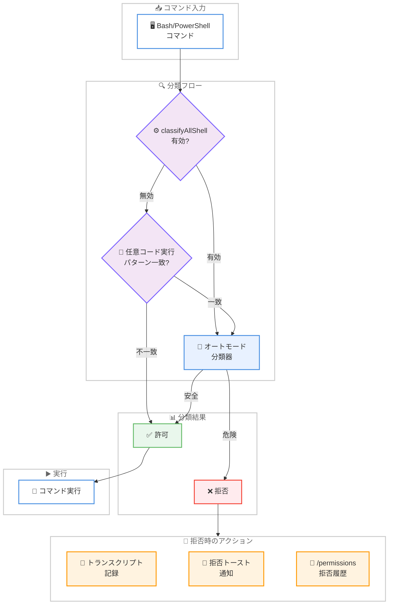
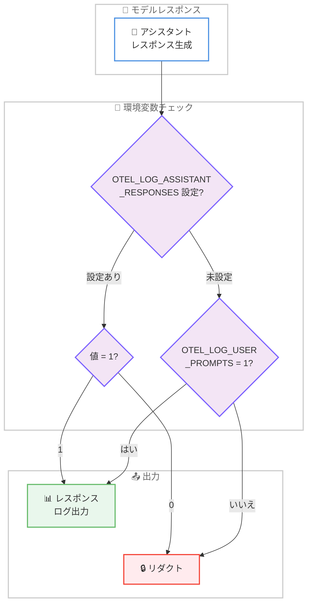

# Claude Code v2.1.193 アップデート: オートモード分類器強化と OpenTelemetry レスポンスログ

## メタデータ

| 項目 | 内容 |
|------|------|
| 発表日 | 2026-06-26 |
| ソース | Claude Code Changelog |
| カテゴリ | Claude Code アップデート |
| 公式リンク | https://github.com/anthropics/claude-code/blob/main/CHANGELOG.md |

## 概要

Claude Code v2.1.193 が 2026 年 6 月 26 日にリリースされた。本リリースでは、オートモードの分類器をすべてのシェルコマンドに拡張する `autoMode.classifyAllShell` 設定の追加、OpenTelemetry へのアシスタントレスポンスログ出力、バックグラウンドシェルの自動メモリプレッシャーリーピング、MCP 認証の自動再接続など、セキュリティ・可観測性・リソース管理の観点で重要な機能強化が行われた。加えて、バックグラウンドエージェントに関する複数のバグ修正により、マルチエージェント環境の安定性が大幅に向上している。

## 詳細

### 背景

Claude Code のオートモード (auto-mode) は、ユーザーの承認なしにコマンドを実行する際のセキュリティ分類を担う重要な機構である。従来は任意コード実行パターンに一致するコマンドのみが分類器を通過していたが、v2.1.193 ではすべての Bash/PowerShell コマンドを分類対象にできるオプションが追加された。また、エンタープライズ環境での可観測性向上を目的とした OpenTelemetry ログイベントの拡充、アイドル状態のバックグラウンドシェルに対するメモリプレッシャーリーピングなど、大規模デプロイメントを意識した改善が多数含まれている。

### 主な変更点

#### 新機能 (Added)

- **`autoMode.classifyAllShell` 設定**: すべての Bash/PowerShell コマンドをオートモード分類器にルーティングする新しい設定を追加。従来は任意コード実行パターンに該当するコマンドのみが分類対象だったが、本設定を有効にすることでセキュリティポリシーの適用範囲を拡大できる
- **オートモード拒否理由の可視化**: 分類器がコマンドを拒否した理由がトランスクリプト、拒否トースト通知、`/permissions` の最近の拒否一覧に表示されるようになった
- **`claude_code.assistant_response` OpenTelemetry ログイベント**: モデルのレスポンステキストを含む新しい OpenTelemetry ログイベントが追加された。デフォルトではリダクトされ、`OTEL_LOG_ASSISTANT_RESPONSES=1` を設定することで有効化される。未設定時は `OTEL_LOG_USER_PROMPTS` の値に従うため、既にプロンプトコンテンツをログしているデプロイメントではアップグレード時にレスポンスコンテンツも自動的にログされる
- **bash モードのライブファイルパスオートコンプリート**: `!` で起動する bash モードでファイルパスのライブオートコンプリートが利用可能になった
- **MCP サーバー認証通知**: 起動時に MCP サーバーが認証を必要とする場合、`/mcp` コマンドへの誘導を含む通知が表示されるようになった
- **バックグラウンドシェルの自動メモリプレッシャーリーピング**: アイドル状態のバックグラウンドシェルコマンドに対して、メモリプレッシャーが検出された際に自動的にリソースを解放する機能が追加された。`CLAUDE_CODE_DISABLE_BG_SHELL_PRESSURE_REAP=1` で無効化可能

#### バグ修正 (Fixed)

- **`/model` および UI のステール状態**: `/login` 実行直後にクライアントデータに依存する UI が古い状態や空の状態を表示する問題を修正
- **バックグラウンド化時の誤キャンセル**: 全ての実行中タスクが引き継がれる場合でも「N background tasks would be abandoned」と表示されて誤ってキャンセルされる問題を修正
- **ピン留めバックグラウンドエージェントの再プロンプト**: 自動アップデート後にピン留めされたバックグラウンドエージェントが毎回「Continue from where you left off」と再プロンプトされる問題を修正
- **ファントムサブエージェントの生成**: メインターンをバックグラウンド化した際に、メイン会話を再実行するファントム「general-purpose (resumed)」サブエージェントが生成される問題を修正
- **エージェントパネルの表示**: サブエージェントを表示中に兄弟エージェントが非表示になる問題を修正

#### 改善 (Improved)

- **バックグラウンドエージェントの動作改善**: エージェント起動時のレスポンスに「end your response」という指示が含まれなくなり、エージェントの実行中も他のタスクに継続して取り組めるようになった
- **MCP `headersHelper` 認証の自動再接続**: ツール呼び出しが 401/403 を返した場合、ヘルパーが自動的に再実行され接続が再確立されるようになった
- **プラグイン自動リネーム**: マーケットプレイスの `renames` マップが自動的に適用され、設定が新しいプラグイン名に自動更新されるようになった
- **`/add-dir` メッセージ改善**: 既にワーキングディレクトリとして追加されているディレクトリに対するメッセージが改善された

### 技術的な詳細

#### オートモード分類器の拡張アーキテクチャ

`autoMode.classifyAllShell` 設定は、従来のパターンマッチングによるフィルタリングをバイパスし、全てのシェルコマンドを分類器に送信する。これにより、正規表現パターンでは捕捉できない潜在的に危険なコマンドも事前に評価される。

分類器が拒否した場合、以下の 3 箇所に拒否理由が記録される。

1. **トランスクリプト**: 会話のコンテキストとして保存され、モデルが次のアクションを判断する際の参考情報となる
2. **拒否トースト**: ユーザーへの即座のフィードバックとして UI に表示される
3. **`/permissions` 最近の拒否**: パーミッション管理画面から過去の拒否履歴を確認可能

#### OpenTelemetry レスポンスログの動作

新しい `claude_code.assistant_response` ログイベントは以下の制御フローに従う。

| 環境変数 | 動作 |
|---------|------|
| `OTEL_LOG_ASSISTANT_RESPONSES=1` | レスポンスをログ出力 |
| `OTEL_LOG_ASSISTANT_RESPONSES=0` | レスポンスをリダクト |
| 未設定 + `OTEL_LOG_USER_PROMPTS=1` | レスポンスをログ出力 (フォールバック) |
| 未設定 + `OTEL_LOG_USER_PROMPTS=0` | レスポンスをリダクト |
| 両方未設定 | レスポンスをリダクト |

**重要**: 既に `OTEL_LOG_USER_PROMPTS=1` を設定しているデプロイメントでは、v2.1.193 へのアップグレード時にレスポンスコンテンツも自動的にログされるようになる。プロンプトのみのログを維持したい場合は、明示的に `OTEL_LOG_ASSISTANT_RESPONSES=0` を設定する必要がある。

#### メモリプレッシャーリーピング

アイドル状態のバックグラウンドシェルコマンドは、システムのメモリプレッシャーが一定の閾値を超えた際に自動的に解放される。これにより、長時間稼働するセッションでのメモリ消費が最適化される。`CLAUDE_CODE_DISABLE_BG_SHELL_PRESSURE_REAP=1` を設定することで無効化可能であり、メモリに余裕のある環境やデバッグ目的で使用できる。

## アーキテクチャ図

### オートモード分類器フロー



### OpenTelemetry レスポンスログ制御フロー



## 開発者への影響

### 対象

- Claude Code を利用する全ての開発者
- エンタープライズ環境で Claude Code をデプロイしている組織
- OpenTelemetry によるモニタリングを実施している運用チーム
- バックグラウンドエージェントを活用するマルチタスク開発者
- MCP サーバーを利用した外部ツール連携を行う開発者

### 必要なアクション

1. **Claude Code を最新バージョンに更新する**

```bash
claude update
```

2. **OpenTelemetry ログの確認** (該当する場合): 既に `OTEL_LOG_USER_PROMPTS=1` を設定している環境では、アップグレード後にレスポンスコンテンツもログされるようになる。プロンプトのみのログを維持する場合は以下を設定する

```bash
export OTEL_LOG_ASSISTANT_RESPONSES=0
```

3. **オートモード分類器の拡張** (オプション): より厳格なセキュリティポリシーを適用したい場合、設定ファイルに以下を追加する

```json
{
  "autoMode": {
    "classifyAllShell": true
  }
}
```

4. **メモリプレッシャーリーピングの確認**: デフォルトで有効のため、メモリに余裕がある環境でバックグラウンドシェルを長時間維持したい場合は以下で無効化する

```bash
export CLAUDE_CODE_DISABLE_BG_SHELL_PRESSURE_REAP=1
```

### 移行ガイド (該当する場合)

本リリースには 1 つの暗黙的な動作変更が含まれている。

**OpenTelemetry レスポンスログのフォールバック動作**: `OTEL_LOG_USER_PROMPTS=1` を設定済みかつ `OTEL_LOG_ASSISTANT_RESPONSES` を未設定の環境では、アップグレード後にレスポンスコンテンツが自動的にログされる。これはプライバシーポリシーに影響する可能性があるため、アップグレード前に環境変数の設定を確認し、必要に応じて `OTEL_LOG_ASSISTANT_RESPONSES=0` を明示的に設定すること。

## コード例

### autoMode.classifyAllShell の設定

```json
// .claude/settings.json
{
  "autoMode": {
    "classifyAllShell": true
  }
}
```

### OpenTelemetry 環境変数の設定

```bash
# レスポンスログを明示的に有効化
export OTEL_LOG_ASSISTANT_RESPONSES=1

# レスポンスログを無効化 (プロンプトログのみ維持)
export OTEL_LOG_ASSISTANT_RESPONSES=0

# メモリプレッシャーリーピングを無効化
export CLAUDE_CODE_DISABLE_BG_SHELL_PRESSURE_REAP=1
```

## 関連リンク

- [Claude Code Changelog](https://github.com/anthropics/claude-code/blob/main/CHANGELOG.md)
- [Claude Code npm パッケージ](https://www.npmjs.com/package/@anthropic-ai/claude-code)
- [OpenTelemetry ドキュメント](https://opentelemetry.io/docs/)
- [MCP (Model Context Protocol) 仕様](https://modelcontextprotocol.io/)

## まとめ

Claude Code v2.1.193 は、セキュリティ、可観測性、リソース管理の 3 つの柱で重要な機能強化を実現したリリースである。`autoMode.classifyAllShell` によりシェルコマンドのセキュリティ分類の適用範囲が拡大され、エンタープライズ環境でのガバナンスが強化された。OpenTelemetry レスポンスログの追加により、AI システムの可観測性が向上し、監査やデバッグが容易になった。メモリプレッシャーリーピングは長時間セッションでのリソース効率を自動的に最適化する。バックグラウンドエージェントに関する 5 件のバグ修正により、マルチエージェント環境の信頼性が大幅に改善された。MCP `headersHelper` の自動再接続やプラグイン自動リネームなど、日常的な開発体験を向上させる改善も多数含まれている。
