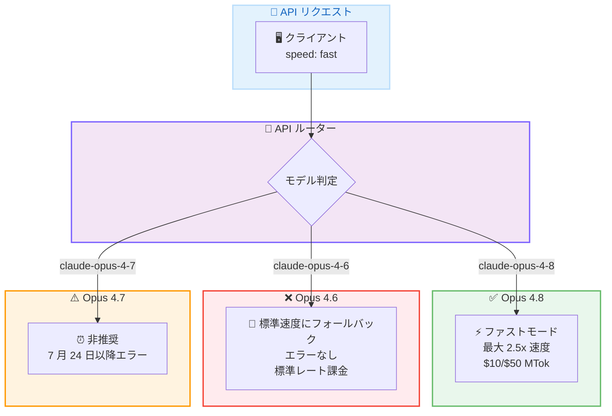
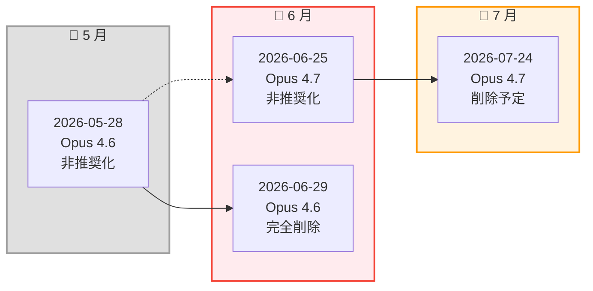

# Claude Opus 4.6 のファストモード完全削除 -- speed: "fast" はサイレントに標準速度へフォールバック

## メタデータ

| 項目 | 内容 |
|------|------|
| 発表日 | 2026-06-29 |
| ソース | Claude API Release Notes |
| カテゴリ | API アップデート / ファストモード削除 |
| 公式リンク | [Release Notes](https://platform.claude.com/docs/en/release-notes/overview) |

## 概要

2026 年 6 月 29 日、Anthropic は Claude Opus 4.6 (`claude-opus-4-6`) のファストモードを完全に削除しました。この変更により、`claude-opus-4-6` に対して `speed: "fast"` パラメータを指定したリクエストは、エラーを返すことなくサイレントに標準速度で実行されます。課金も標準レートが適用され、レスポンスの `usage.speed` フィールドには `"standard"` が返されます。

ファストモードの利用を継続する場合は、Claude Opus 4.8 (`claude-opus-4-8-20260528`) への移行が必要です。

## 詳細

### 背景

ファストモード (Fast Mode) は、Claude API において最大 2.5 倍の出力トークン毎秒を実現する高速推論機能です。プレミアム料金で提供され、ベータヘッダー `fast-mode-2026-02-01` の指定が必要です。

Anthropic はモデルのライフサイクル管理の一環として、旧バージョンのモデルに対するファストモードのサポートを段階的に終了しています。Claude Opus 4.6 のファストモードは 2026 年 5 月 28 日 (Opus 4.8 発表時) に非推奨化が発表され、本日 2026 年 6 月 29 日に完全削除されました。

#### ファストモード廃止のタイムライン

| 日付 | イベント | 動作 |
|------|---------|------|
| 2026 年 5 月 28 日 | Opus 4.6 ファストモード非推奨化 | 動作するが移行推奨 |
| **2026 年 6 月 29 日** | **Opus 4.6 ファストモード削除 (本日)** | **サイレントに標準速度で実行** |
| 2026 年 6 月 25 日 | Opus 4.7 ファストモード非推奨化 | 動作するが移行推奨 |
| 2026 年 7 月 24 日 | Opus 4.7 ファストモード削除予定 | **エラーを返す** |

### 主な変更点

1. **ファストモードの完全削除**: `claude-opus-4-6` に対する `speed: "fast"` パラメータが無効化されました
2. **サイレントフォールバック**: エラーは返されず、標準速度で実行されます
3. **標準料金での課金**: プレミアム料金ではなく、標準レートが適用されます
4. **usage.speed フィールド**: レスポンスで実際に使用された速度 (`"standard"`) が確認可能です

### 技術的な詳細

#### Opus 4.6 と Opus 4.7 の削除後動作の違い

Claude Opus 4.6 と Opus 4.7 では、ファストモード削除後の動作が異なります。

| モデル | 削除後の動作 | 課金 |
|--------|-------------|------|
| Claude Opus 4.6 (本日削除) | エラーなし、標準速度で実行 | 標準レート |
| Claude Opus 4.7 (7 月 24 日予定) | **エラーを返す** | リクエスト失敗 |

この違いは重要です。Opus 4.6 の場合、`speed: "fast"` を指定してもエラーにならないため、アプリケーションが気づかないまま標準速度で動作し続ける可能性があります。レイテンシに依存するシステムでは、パフォーマンスの低下として顕在化します。

#### ファストモードの現在の対応状況

| モデル | 状態 | ファストモード料金 |
|--------|------|-------------------|
| Claude Opus 4.8 | 利用可能 | 入力: $10/MTok、出力: $50/MTok |
| Claude Opus 4.7 | 非推奨 (7 月 24 日削除) | 入力: $30/MTok、出力: $150/MTok |
| Claude Opus 4.6 | **削除済み** | 適用なし (標準レートで課金) |

#### フォールバック検出方法

レスポンスの `usage.speed` フィールドを確認することで、リクエストが実際にファストモードで処理されたかを判定できます。

```json
{
  "usage": {
    "input_tokens": 100,
    "output_tokens": 500,
    "speed": "standard"
  }
}
```

`speed: "fast"` を指定したにもかかわらず `usage.speed` が `"standard"` を返す場合、ファストモードが適用されていないことを意味します。

## 開発者への影響

### 対象

以下の開発者が直接影響を受けます。

- `claude-opus-4-6` に対して `speed: "fast"` を指定しているすべてのアプリケーション
- ファストモードの高スループット特性 (最大 2.5 倍) に依存しているリアルタイムシステム
- レスポンス速度を前提としたタイムアウト設定を行っているサービス

### 必要なアクション

**即座に対応が必要です。** ファストモードは既に削除されており、該当リクエストは現時点で標準速度にフォールバックしています。

1. **影響範囲の特定**: コードベース内で `claude-opus-4-6` と `speed: "fast"` の組み合わせを使用している箇所を洗い出す
2. **usage.speed の確認**: レスポンスの `usage.speed` フィールドを確認し、フォールバックが発生していないか検証する
3. **モデル ID の更新**: `claude-opus-4-6` を `claude-opus-4-8-20260528` に変更
4. **料金の確認**: Opus 4.8 ファストモードの料金 (入力: $10/MTok、出力: $50/MTok) が予算内であるか確認
5. **ベータヘッダーの確認**: `anthropic-beta: fast-mode-2026-02-01` ヘッダーが設定されているか確認

### 移行ガイド

#### モデル ID の変更

| 変更前 | 変更後 |
|--------|--------|
| `claude-opus-4-6` | `claude-opus-4-8-20260528` |

#### 料金の比較

| 項目 | Opus 4.6 標準 | Opus 4.8 ファストモード |
|------|--------------|----------------------|
| 入力 | $15/MTok | $10/MTok |
| 出力 | $75/MTok | $50/MTok |
| 速度 | 標準 | 最大 2.5 倍 |

#### 注意事項

- Claude Opus 4.8 のファストモードではベータヘッダー `anthropic-beta: fast-mode-2026-02-01` が必要です
- `speed: "fast"` パラメータの仕様自体に変更はありません。モデル ID を更新すれば移行完了です
- `usage.speed` フィールドでファストモードの適用状況を必ず監視してください
- Opus 4.7 経由の移行は推奨されません (7 月 24 日に削除予定のため)

## コード例

### Python: フォールバック検出と Opus 4.8 への移行

**変更前 (現在サイレントに標準速度で実行)**:

```python
import anthropic

client = anthropic.Anthropic()

# 注意: エラーは発生しないが、ファストモードは適用されない
response = client.messages.create(
    model="claude-opus-4-6-20250219",
    speed="fast",
    max_tokens=4096,
    messages=[
        {
            "role": "user",
            "content": "このテキストを要約してください。"
        }
    ],
    extra_headers={
        "anthropic-beta": "fast-mode-2026-02-01"
    }
)

# usage.speed を確認するとフォールバックが判明
print(f"Speed used: {response.usage.speed}")  # "standard" が返される
```

**変更後 (推奨: Opus 4.8 への移行)**:

```python
import anthropic

client = anthropic.Anthropic()

response = client.messages.create(
    model="claude-opus-4-8-20260528",
    speed="fast",
    max_tokens=4096,
    messages=[
        {
            "role": "user",
            "content": "このテキストを要約してください。"
        }
    ],
    extra_headers={
        "anthropic-beta": "fast-mode-2026-02-01"
    }
)

# ファストモードが適用されていることを確認
assert response.usage.speed == "fast", "Fast mode not applied!"
print(f"Speed used: {response.usage.speed}")  # "fast" が返される
print(response.content[0].text)
```

### Python: フォールバック検出ユーティリティ

```python
import anthropic


def create_fast_message(client: anthropic.Anthropic, **kwargs):
    """ファストモードでメッセージを作成し、フォールバックを検出する。"""
    response = client.messages.create(
        speed="fast",
        extra_headers={"anthropic-beta": "fast-mode-2026-02-01"},
        **kwargs
    )

    if response.usage.speed != "fast":
        import warnings
        warnings.warn(
            f"Fast mode not applied for model {kwargs.get('model')}. "
            f"Actual speed: {response.usage.speed}. "
            f"Consider migrating to claude-opus-4-8-20260528.",
            UserWarning,
            stacklevel=2
        )

    return response


# 使用例
client = anthropic.Anthropic()
response = create_fast_message(
    client,
    model="claude-opus-4-8-20260528",
    max_tokens=4096,
    messages=[{"role": "user", "content": "要約してください。"}]
)
```

### curl: Opus 4.8 ファストモードへのリクエスト例

```bash
curl https://api.anthropic.com/v1/messages \
     --header "x-api-key: $ANTHROPIC_API_KEY" \
     --header "anthropic-version: 2023-06-01" \
     --header "anthropic-beta: fast-mode-2026-02-01" \
     --header "content-type: application/json" \
     --data \
'{
    "model": "claude-opus-4-8-20260528",
    "speed": "fast",
    "max_tokens": 4096,
    "messages": [
        {
            "role": "user",
            "content": "このテキストを要約してください。"
        }
    ]
}'
```

## アーキテクチャ図

### ファストモードリクエストフローの変化



### ファストモード廃止タイムライン



## 関連リンク

- [Claude Developer Platform Release Notes](https://platform.claude.com/docs/en/release-notes/overview)
- [Fast Mode Documentation](https://platform.claude.com/docs/en/build-with-claude/fast-mode)
- [Fast Mode - Supported Models](https://platform.claude.com/docs/en/build-with-claude/fast-mode#supported-models)
- [Claude Models Overview](https://platform.claude.com/docs/en/about-claude/models/overview)
- [Claude Model Deprecations](https://platform.claude.com/docs/en/about-claude/model-deprecations)

## まとめ

Claude Opus 4.6 のファストモードが 2026 年 6 月 29 日に完全削除されました。最も重要な特徴は、**エラーが返されずサイレントに標準速度へフォールバックする**という動作です。これにより、アプリケーションは表面上正常に動作し続けますが、期待される 2.5 倍の高速レスポンスは得られません。

開発者は `usage.speed` フィールドを確認し、ファストモードが適用されているかを監視する仕組みを導入することを推奨します。ファストモードが必要な場合は、Claude Opus 4.8 (`claude-opus-4-8-20260528`) へ速やかに移行してください。

なお、Claude Opus 4.7 のファストモードも 2026 年 7 月 24 日に削除予定ですが、こちらは Opus 4.6 とは異なり**エラーを返す**動作となるため、Opus 4.7 経由での一時的な回避は推奨されません。直接 Opus 4.8 への移行を計画してください。
