# Claude Code v2.1.196 - 組織デフォルトモデル、セキュリティ強化、バックグラウンドセッション信頼性向上

## メタデータ

| 項目 | 内容 |
|------|------|
| 発表日 | 2026-06-30 |
| ソース | Claude Code Changelog |
| カテゴリ | Claude Code アップデート |
| 公式リンク | [Changelog](https://github.com/anthropics/claude-code/blob/main/CHANGELOG.md) |

## 概要

Claude Code v2.1.196 は、組織管理者がデフォルトモデルを設定できる機能の追加、MCP サーバーの不正起動を防ぐセキュリティ修正、バックグラウンドセッションの大幅な信頼性向上を中心とした包括的なリリースである。20 件以上のバグ修正に加え、`/code-review` のトークン使用量 25% 削減、ストリーミングアイドルウォッチドッグの全プロバイダーでのデフォルト有効化など、開発者体験を改善する多数の変更が含まれている。

## 詳細

### 背景

前バージョン v2.1.195 ではフックマッチャーの完全一致への変更やバックグラウンドエージェントの安定性向上が行われた。v2.1.196 では、エンタープライズ環境での利用を強化する組織レベルのモデル管理機能や、信頼できないリポジトリからの MCP サーバー起動を防ぐセキュリティ修正が追加され、チームでの利用における安全性と管理性が大幅に向上している。

### 主な変更点

#### 新機能

- **組織デフォルトモデルのサポート**: 管理者が組織コンソールでデフォルトモデルを設定可能になった。ユーザーが個別にモデルを選択していない場合、`/model` コマンドで "Org default" (またはロールベースの場合 "Role default") として表示される。
- **セッションの読みやすいデフォルト名**: セッション開始時に人間が読みやすい名前が自動的に付与されるようになり、複数セッションの識別やメッセージングが容易になった。
- **クリック可能なファイル添付**: チャット内のファイル添付が Cmd/Ctrl + クリックで Finder/Explorer で直接開けるようになった。

#### セキュリティ修正

- **MCP サーバーの不正起動防止**: `claude mcp list`/`get` コマンドが、リポジトリにコミットされた `.claude/settings.json` を通じて自己承認された `.mcp.json` サーバーを起動しなくなった。信頼できないワークスペースでは `Pending approval` と表示される。

#### バグ修正

- **バックグラウンドジョブ復帰時のデータ消失修正**: バックグラウンドジョブを起こした際に、トランスクリプトプローブが実際のトランスクリプトを誤読すると会話が永久に削除され元のプロンプトが再実行されていた問題を修正。ファイルは退避され、削除されなくなった。
- **レート制限警告のちらつき修正**: 複数の並行リクエストが使用量制限に到達した際に、レート制限警告が点滅して消え、テレメトリが過剰にカウントされていた問題を修正。
- **バックグラウンドセッション後の重複リキャップ修正**: スキーマが拒否した StructuredOutput の試行がリトライと並んでレンダリングされていた問題を修正。
- **PowerShell での終了コード処理修正**: `git diff`/`git grep`、`egrep`/`fgrep`、`|` を含むクォートされた検索パターンが終了コード 1 で失敗として報告されていた問題を修正。Bash の動作と統一された。
- **`claude agents` サイドパネルの複数修正**: エージェント展開時のキーボードフォーカス固定、バックグラウンドジョブのサブエージェントタイプ消失、実行中セッションの不正なステータス表示を修正。
- **`--dangerously-skip-permissions` の動作修正**: `claude agents` でこのフラグを使用した際に、バイパス免責事項を表示せずサイレントに auto モードにフォールバックしていた問題を修正。スポーンされたエージェントにもバイパスモードが適用されるようになった。
- **Remote セッションの中断復旧修正**: サーバー再起動で中断されたセッションが次のワーカーで自動再開されるようになった。
- **`/cd` 後のセッション表示修正**: 特殊文字を含むパスで `/cd` を使用した後、非正常終了時に旧ディレクトリのレジュームリストにセッションが再表示されていた問題を修正。
- **`claude plugin validate` の修正**: ソースが "." のローカルプラグインがスキップされ、最初のエラークラスで停止していた問題を修正。
- **Esc Esc リワインドメニューの修正**: アイドルプロンプトで Esc Esc を押してもリワインドメニューが開かなかったリグレッションを修正。
- **MCP OAuth スコープの修正**: スコープが指定されていない場合に認可サーバーの全 `scopes_supported` カタログを要求し、GitLab セルフホストなどのエンタープライズ IdP で `invalid_scope` エラーが発生していた問題を修正。
- **`/context` の Bedrock トークン表示修正**: Bedrock 使用時に全ツールグループで 0 トークンと表示されていた問題を修正。
- **`/deep-research` のレポート修正**: 検証失敗が "all claims refuted" と誤報告されていた問題を修正。正しく `unverified` と表示されるようになった。
- **プラグイン依存バージョンピンの修正**: マーケットプレイスが git リポジトリに基づくローカルフォルダパスとして追加されている場合に、バージョンピンが無視されていた問題を修正。
- **`claude agents` セッションステータスの修正**: 完了した行が "Done" と "Needs your input" を交互に表示する問題を修正。停止中のエージェントは "Needs attention" とラベル付けされ、PR に言及する結果にはクリック可能なリンクが表示されるようになった。
- **音声ディクテーションの修正**: 音声モード有効時に高速タイピング中にスペースが消失したり、意図しない録音が開始されたりする問題を修正。

#### 改善

- **バックグラウンドセッションの信頼性向上**: 長時間実行されるコマンドやワークフローが、セッションプロセスの停止・再起動・更新後も継続するようになった。Windows ではバックグラウンドシェルが強制終了ではなくハンドオフされる。
- **バックグラウンドエージェントの自動再開**: デーモン再起動により強制終了されたワーカーが、次回 agents ビュー表示時に中断地点から自動的に再開されるようになった。
- **`/code-review` のトークン使用量削減**: 5 つのクリーンアップファインダーを 1 つに統合し、トークン使用量を約 25% 削減した。
- **ターミナル UI レンダリングの最適化**: ストリーミング中の無操作サブツリーウォークをスキップすることで、フレームごとのレンダリング負荷を低減した。

#### その他の変更

- **ストリーミングアイドルウォッチドッグのデフォルト有効化**: 全プロバイダーで、レスポンスストリームが 5 分間イベントを生成しない場合に自動的に中断・リトライする機能がデフォルトで有効になった。`CLAUDE_ENABLE_STREAM_WATCHDOG=0` で無効化可能。
- **Remote Control の制限強化**: `ANTHROPIC_BASE_URL` が非 Anthropic ホストを指す場合、Remote Control が無効化されるようになった。`CLAUDE_CODE_USE_BEDROCK`/`_VERTEX`/`_FOUNDRY` と同様の動作である。
- **agents ビューのナビゲーション変更**: フォアグラウンドセッションから agents ビューを開く際に、2 回ではなく 1 回の `←` キー押下で遷移するよう変更された。

### 技術的な詳細

#### MCP セキュリティモデルの変更

従来は `.claude/settings.json` に記載された MCP サーバー設定がリポジトリにコミットされている場合、`claude mcp list` や `claude mcp get` 実行時にサーバーが自動的に起動されていた。これは悪意のあるリポジトリが自己承認した MCP サーバーを利用者のマシンで起動できるセキュリティリスクを含んでいた。

v2.1.196 では、信頼できないワークスペースの MCP サーバーは起動されず、明示的なユーザー承認が必要となった。

#### バックグラウンドセッションのプロセス生存メカニズム

従来のバックグラウンドセッションでは、プロセスが停止するとシェルも終了し、実行中のコマンドが失われていた。新しい実装では以下の仕組みが導入されている。

1. **シェルハンドオフ** (Windows): バックグラウンドシェルを別プロセスに引き継ぎ、Claude Code プロセスの終了後もコマンドが継続する
2. **自動再開メカニズム**: デーモン再起動でワーカーが強制終了された場合、次回起動時に中断地点から自動再開する
3. **トランスクリプトファイルの保護**: ジョブ復帰時にトランスクリプトファイルを削除せず退避する

#### ストリーミングウォッチドッグの動作

```
レスポンスストリーム開始
    ↓
5 分間イベントなし → タイムアウト検知
    ↓
ストリーム中断 → 自動リトライ
```

全プロバイダー (Anthropic API、Bedrock、Vertex、Foundry) で統一的に動作し、ネットワーク障害やプロバイダー側の問題によるハングを防止する。

## 開発者への影響

### 対象

- **組織管理者**: デフォルトモデルの一元管理が可能になり、チーム全体のモデル使用を統制できる
- **エンタープライズ環境のユーザー**: MCP セキュリティ修正により、信頼できないリポジトリからの攻撃ベクトルが排除される
- **バックグラウンドエージェントを多用する開発者**: セッションの信頼性が大幅に向上し、長時間タスクが安定して完了する
- **Windows ユーザー**: バックグラウンドシェルのハンドオフにより、プロセス再起動時のコマンド喪失が解消される
- **GitLab セルフホスト利用者**: MCP OAuth スコープの修正により認証エラーが解消される
- **`/code-review` を頻繁に使用する開発者**: トークン使用量が約 25% 削減されコスト効率が向上する

### 必要なアクション

1. **MCP サーバー設定の確認**: 組織でリポジトリに `.claude/settings.json` をコミットして MCP サーバーを共有している場合、ユーザーが初回使用時に承認プロンプトを受けることを周知する。
2. **ストリーミングウォッチドッグの確認**: 特殊なプロバイダー構成で 5 分以上レスポンスがない正常なケースがある場合は `CLAUDE_ENABLE_STREAM_WATCHDOG=0` で無効化する。
3. **組織デフォルトモデルの設定**: 管理者は組織コンソールからチーム全体のデフォルトモデルを設定できる。
4. **キーバインドの確認**: Esc Esc がリワインドメニュー、Ctrl+C または Ctrl+X Ctrl+K がバックグラウンドエージェント停止に割り当てられている。

### 移行ガイド (該当する場合)

#### ストリーミングウォッチドッグの無効化

特殊な環境でウォッチドッグが不要な場合。

```bash
# 環境変数で無効化
export CLAUDE_ENABLE_STREAM_WATCHDOG=0
```

#### MCP サーバーの承認フロー

リポジトリにコミットされた MCP サーバーを使用する場合、初回実行時にユーザーの明示的な承認が必要となる。

```
$ claude mcp list
  my-server  ⏸ Pending approval
```

ユーザーが承認するまでサーバーは起動されない。

## コード例

```bash
# Claude Code のアップデート
claude /update

# 組織デフォルトモデルの確認
claude /model
# 出力例: Current model: Org default (claude-sonnet-4-6)

# ストリーミングウォッチドッグの無効化 (必要な場合のみ)
export CLAUDE_ENABLE_STREAM_WATCHDOG=0

# ファイル添付のクリック操作
# チャット内のファイル添付を Cmd+クリック (macOS) / Ctrl+クリック (Windows/Linux) で
# ファイルを Finder/Explorer で直接表示
```

## アーキテクチャ図 (該当する場合)

```mermaid
flowchart TD
    subgraph Security["🔒 MCP セキュリティモデル v2.1.196"]
        direction LR
        Repo["📁 リポジトリ<br/>.claude/settings.json"]
        MCPList["🔧 claude mcp list/get"]
        Check{"🛡️ 信頼性<br/>チェック"}
        Approved["✅ 起動"]
        Pending["⏸ Pending approval"]
        Repo ~~~ MCPList ~~~ Check
    end

    subgraph Background["⚙️ バックグラウンドセッション信頼性"]
        direction LR
        Session["🖥️ セッション"]
        Stop["🔄 プロセス停止"]
        Handoff["🤝 シェルハンドオフ"]
        Resume["▶️ 自動再開"]
        Session ~~~ Stop ~~~ Handoff ~~~ Resume
    end

    subgraph OrgModel["🏢 組織デフォルトモデル"]
        direction LR
        Admin["👤 管理者"]
        Console["🖥️ 組織コンソール"]
        Users["👥 ユーザー"]
        Admin ~~~ Console ~~~ Users
    end

    Repo --> MCPList
    MCPList --> Check
    Check -->|信頼済み| Approved
    Check -->|未信頼| Pending

    Session --> Stop
    Stop --> Handoff
    Handoff --> Resume

    Admin --> Console
    Console -->|"Org default"| Users

    classDef platform fill:none,stroke:#CCCCCC,stroke-width:2px,color:#666666
    classDef security fill:#FFEBEE,stroke:#F44336,stroke-width:2px,color:#B71C1C
    classDef process fill:#E8F1FF,stroke:#4A90E2,stroke-width:2px,color:#333333
    classDef success fill:#E9F7EC,stroke:#66BB6A,stroke-width:2px,color:#333333
    classDef warning fill:#FFF3E0,stroke:#FF9800,stroke-width:2px,color:#333333
    classDef org fill:#F3E5F5,stroke:#7B61FF,stroke-width:2px,color:#333333

    class Security,Background,OrgModel platform
    class Repo,MCPList process
    class Check security
    class Approved,Resume,Handoff success
    class Pending warning
    class Admin,Console,Users,Session,Stop org
```



## 関連リンク

- [Claude Code Changelog](https://github.com/anthropics/claude-code/blob/main/CHANGELOG.md)
- [Claude Code GitHub リポジトリ](https://github.com/anthropics/claude-code)
- [Claude Code ドキュメント](https://docs.anthropic.com/en/docs/claude-code)
- [前バージョン v2.1.195 レポート](./2026-06-27-claude-code-v2-1-195.md)

## まとめ

Claude Code v2.1.196 は、エンタープライズ環境での利用を強化する組織デフォルトモデル機能と MCP セキュリティ修正を中心に、バックグラウンドセッションの信頼性を大幅に向上させたリリースである。特にバックグラウンドセッションのプロセス生存メカニズムは、長時間タスクを安定して実行するために重要な改善であり、Windows でのシェルハンドオフやデーモン再起動後の自動再開により、本番環境でのエージェント運用が一層信頼できるものとなった。`/code-review` のトークン使用量 25% 削減やストリーミングウォッチドッグの全プロバイダーでのデフォルト有効化は、日常の開発ワークフローのコスト効率と安定性を向上させる。20 件以上のバグ修正はプラットフォーム全体の品質を底上げしており、特に PowerShell での終了コード処理統一や MCP OAuth スコープの修正は、クロスプラットフォームおよびエンタープライズ環境での障壁を取り除くものである。
