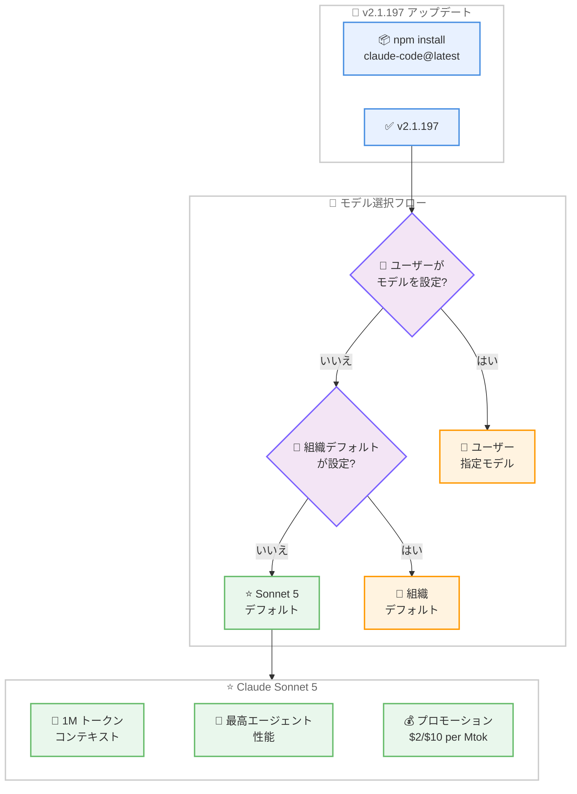

# Claude Code v2.1.197 — Claude Sonnet 5 がデフォルトモデルに

## メタデータ

| 項目 | 内容 |
|------|------|
| 発表日 | 2026-06-30 |
| ソース | Claude Code Changelog |
| カテゴリ | Claude Code アップデート |
| 公式リンク | [Changelog](https://github.com/anthropics/claude-code/blob/main/CHANGELOG.md) |

## 概要

Claude Code v2.1.197 では、デフォルトモデルが Claude Sonnet 5 に変更された。Sonnet 5 はネイティブ 1M トークンのコンテキストウィンドウを備え、2026 年 8 月 31 日まで入力 $2/Mtok、出力 $10/Mtok のプロモーション価格で提供される。全 Claude Code ユーザーが最もエージェント性能の高い Sonnet モデルを標準で利用できるようになる重要なマイルストーンである。

## 詳細

### 背景

Claude Sonnet 5 は 2026 年 6 月 30 日に発表された最新の Sonnet モデルであり、コーディングタスクにおいて前世代を大幅に上回る性能を持つ。これまで Claude Code のデフォルトモデルは Claude Sonnet 4.5 であったが、v2.1.197 からは Sonnet 5 がデフォルトとなり、ユーザーはモデルを手動で切り替えることなく最新の高性能モデルを利用できる。

Sonnet 5 の主な特徴は以下の通りである。

- **ネイティブ 1M トークンコンテキストウィンドウ**: 大規模なコードベース全体を一度に処理可能
- **最高レベルのエージェント性能**: 複雑なマルチステップタスクの計画・実行能力が向上
- **プロモーション価格**: 2026 年 8 月 31 日まで入力 $2/Mtok、出力 $10/Mtok で利用可能

### 主な変更点

#### デフォルトモデルの変更

- **Claude Sonnet 5 がデフォルトモデルに**: v2.1.197 にアップデートすると、自動的に Sonnet 5 がデフォルトモデルとして設定される
- ユーザーが個別にモデルを固定設定している場合や、組織デフォルトモデル (v2.1.196 で追加) が設定されている場合は、そちらが優先される
- `/model` コマンドでモデルの確認・変更が可能

#### v2.1.196 からの主要な改善点 (参考)

v2.1.196 で導入された以下の機能も引き続き利用可能である。

- **組織デフォルトモデルのサポート**: 管理者が組織コンソールでデフォルトモデルを一元設定
- **読みやすいデフォルトセッション名**: セッション識別が容易に
- **クリック可能なファイル添付**: Cmd/Ctrl + クリックでファイルを直接表示
- **MCP セキュリティ強化**: 信頼できないリポジトリからの MCP サーバー自動起動を防止
- **バックグラウンドセッション信頼性向上**: プロセス停止後の自動再開、シェルハンドオフ
- **`/code-review` トークン使用量 25% 削減**: 5 つのクリーンアップファインダーを統合
- **ストリーミングアイドルウォッチドッグ**: 5 分間イベントなしで自動中断・リトライ

### 技術的な詳細

#### Sonnet 5 のコンテキストウィンドウ

Sonnet 5 はネイティブで 1M トークンのコンテキストウィンドウをサポートしている。従来の Sonnet 4.5/4.6 が 200K トークンであったのに対し、5 倍の容量となる。これにより、Claude Code が大規模なリポジトリのコンテキストをより多く保持しながらタスクを実行できるようになった。

#### プロモーション価格体系

| 項目 | 価格 | 期間 |
|------|------|------|
| 入力トークン | $2/Mtok | 2026 年 8 月 31 日まで |
| 出力トークン | $10/Mtok | 2026 年 8 月 31 日まで |

この価格は API 経由での利用に適用される。Claude Pro/Max サブスクリプションでは、プランの利用枠内で Sonnet 5 が利用可能である。

#### モデル選択の優先順位

```
1. ユーザーが /model で明示的に設定したモデル
    ↓ (未設定の場合)
2. 組織デフォルトモデル (管理者が設定)
    ↓ (未設定の場合)
3. Claude Code バージョンのデフォルトモデル (v2.1.197 = Sonnet 5)
```

## 開発者への影響

### 対象

- **全 Claude Code ユーザー**: アップデートするだけで Sonnet 5 をデフォルトで利用可能
- **API 経由で Claude Code を使用する開発者**: プロモーション価格により、高性能モデルを低コストで活用可能
- **大規模コードベースを扱う開発者**: 1M トークンコンテキストにより、より広範なファイルを参照しながらの作業が可能
- **組織管理者**: 組織デフォルトモデルとの優先順位関係を理解し、必要に応じて設定を調整する

### 必要なアクション

1. **バージョンアップデート**: v2.1.197 にアップデートして Sonnet 5 をデフォルトで利用する
2. **モデル設定の確認**: 既存のモデル固定設定がある場合、Sonnet 5 に切り替えるか検討する
3. **コスト見積もりの更新**: 1M トークンコンテキストの活用により、トークン使用量が増加する可能性があるため、プロモーション価格期間中にコストを確認する
4. **組織設定の見直し** (管理者向け): 組織デフォルトモデルを Sonnet 5 に更新するか、ユーザーごとのバージョンアップデートに任せるか判断する

## コード例

```bash
# Claude Code を最新バージョンに更新
npm install -g @anthropic-ai/claude-code@latest

# バージョン確認
claude --version
# Claude Code v2.1.197

# デフォルトモデルが Sonnet 5 に変更済み
claude
```

```bash
# 現在のモデルを確認
claude /model
# 出力例: Current model: claude-sonnet-5 (default)

# 別のモデルに切り替える場合
claude /model claude-opus-4-6
```

## アーキテクチャ図



## 関連リンク

- [Claude Code Changelog](https://github.com/anthropics/claude-code/blob/main/CHANGELOG.md)
- [Claude Sonnet 5 発表](https://www.anthropic.com/news)
- [Claude Code GitHub リポジトリ](https://github.com/anthropics/claude-code)
- [Claude Code ドキュメント](https://docs.anthropic.com/en/docs/claude-code)
- [前バージョン v2.1.196 レポート](./2026-06-30-claude-code-v2-1-196.md)

## まとめ

Claude Code v2.1.197 は、デフォルトモデルを Claude Sonnet 5 に変更するシンプルながら重要なリリースである。Sonnet 5 のネイティブ 1M トークンコンテキストウィンドウと向上したエージェント性能により、Claude Code ユーザーは大規模コードベースに対するより高度な推論と操作が可能になる。2026 年 8 月 31 日までのプロモーション価格 (入力 $2/Mtok、出力 $10/Mtok) は、高性能モデルへの移行を促進するものであり、全ユーザーがバージョンアップデートのみで最新モデルの恩恵を受けられる。v2.1.196 で追加された組織デフォルトモデル機能との組み合わせにより、個人開発者からエンタープライズチームまで、柔軟なモデル管理が実現されている。
