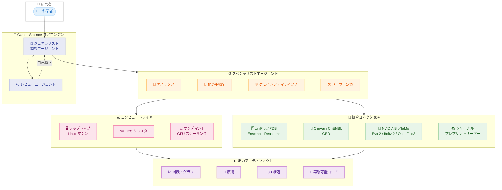

# Claude Science — 科学者向け AI ワークベンチの提供開始

## メタデータ

| 項目 | 内容 |
|------|------|
| 発表日 | 2026-06-30 |
| ソース | Anthropic News |
| カテゴリ | 新製品・新機能 |
| 公式リンク | [Claude Science AI Workbench](https://www.anthropic.com/news/claude-science-ai-workbench) |

## 概要

Anthropic は 2026 年 6 月 30 日、科学者向けの AI ワークベンチ「Claude Science」の提供開始を発表した。Claude Science は、研究ツールを監査可能なアーティファクトと柔軟なコンピューティングリソースと統合し、断片化されたツール群を単一の研究環境に集約するプラットフォームである。ゲノミクス、シングルセル生物学、プロテオミクス、構造生物学、ケモインフォマティクスなどの分野の科学者を主要な対象としており、macOS および Linux でベータ版として利用可能となっている。

## 詳細

### 背景

科学研究の現場では、データ解析、可視化、論文執筆、計算リソース管理など、多数のツールが個別に存在し、研究者はそれらを横断的に利用する必要があった。このツールの断片化は、再現性の確保、ワークフローの効率化、共同研究における情報共有において大きな障壁となっていた。

Claude Science は、これらの課題を解決するために設計された統合的な AI ワークベンチであり、研究のあらゆるステップにおいて AI がアシストしつつ、完全な再現性と監査可能性を維持する。

### 主な変更点

1. **リッチな科学アーティファクトと完全な再現性**
   - 図表や原稿をコードとともに生成
   - 3D タンパク質構造、ゲノムブラウザトラック、化学構造をネイティブにレンダリング
   - すべての出力に正確なコード・環境情報、平易な言語での説明、完全なメッセージ履歴を含む
   - インライン注釈と平易な言語での編集が可能

2. **コンピュート管理**
   - 単一 GPU から数百台まで、オンデマンドでスケーリング
   - ジョブのセットアップ、サブミット、モニタリング、結果取得を自動化
   - ラボのインフラ (ラップトップ、Linux マシン、HPC ログインノード) 上で動作
   - 機密データが既存システムから外部に出ることがない
   - セッションフォーキングによるアプローチの比較

3. **レビューエージェント**
   - 出力を検査し、不正確な引用、追跡不能な数値、コードと一致しない図表をフラグ付け
   - 実行中に自己修正を実施

4. **統合コネクタ**
   - 60 以上のキュレーションされたスキルとコネクタを提供
   - UniProt、PDB、Ensembl、Reactome、ClinVar、ChEMBL、GEO、ジャーナル、プレプリントサーバーに対応
   - NVIDIA BioNeMo Agent Toolkit (Evo 2、Boltz-2、OpenFold3) との連携
   - カスタムパイプラインを再利用可能なスキルとして保存可能

### 技術的な詳細

#### マルチエージェントアーキテクチャ

Claude Science は、ジェネラリスト調整エージェントがスペシャリストエージェントにアクセスする階層的アーキテクチャを採用している。

- **ジェネラリスト調整エージェント**: 研究タスク全体を俯瞰し、適切なスペシャリストに作業を委任
- **スペシャリストエージェント**: 特定の分野やタスクに特化したサブエージェント
- **ユーザー作成スペシャリストエージェント**: 研究者が独自のスペシャリストを定義可能
- **アクタークリティックペア**: 1 つが成果物を作成し、もう 1 つがレビューを行う構成

#### セキュリティとデータ管理

- 計算処理はラボの既存インフラ上で実行
- 機密データは既存システムの外に送信されない
- 完全な監査証跡により、すべての処理ステップを追跡可能

## 開発者への影響

### 対象

- ゲノミクス、シングルセル生物学、プロテオミクスの研究者
- 構造生物学者
- ケモインフォマティクスの専門家
- バイオインフォマティクスの開発者
- 計算生物学のラボ管理者

### 必要なアクション

1. **利用資格の確認**: Pro、Max、Team、Enterprise プランのいずれかに加入していることを確認する
2. **管理者承認** (Team/Enterprise の場合): 管理者に Claude Science の有効化を依頼する
3. **プラットフォーム要件**: macOS または Linux 環境を準備する
4. **助成金プログラムへの応募**: 最大 $30,000 のクレジットを獲得できる助成金プログラムへの応募を検討する (2026 年 7 月 15 日締切)

### 利用プランと料金

| プラン | 利用可否 | 備考 |
|--------|---------|------|
| Pro | 利用可能 | - |
| Max | 利用可能 | - |
| Team | 利用可能 | 管理者による有効化が必要 |
| Enterprise | 利用可能 | 管理者による有効化が必要 |
| 学術・非営利ラボ | 利用可能 | Team プランの割引あり |

### 助成金プログラム

| 項目 | 内容 |
|------|------|
| 対象プロジェクト数 | 最大 50 件 |
| クレジット上限 | 1 プロジェクトあたり最大 $30,000 |
| コンピュート提供 | Modal による最大 $2,000/プロジェクト |
| 応募締切 | 2026 年 7 月 15 日 |
| 通知日 | 2026 年 7 月 31 日 |
| プロジェクト期間 | 2026 年 9 月 1 日 ~ 12 月 1 日 |
| 重点分野 | 生物学およびバイオメディカル研究 |

## 実際のユースケース

### 1. Manifold Bio: 組織標的医薬品のターゲット候補選定

Manifold Bio は Claude Science を使用して、組織を標的とする医薬品のターゲット候補の指名プロセスを実施している。

### 2. Allen Institute: 計算レビューテンプレート

Allen Institute の Jerome Lecoq 氏は、約 20 のカスタムスキルを使用した計算レビューテンプレートを構築し、研究成果のレビュープロセスを自動化している。

### 3. UCSF: 神経膠腫の分子疫学

UCSF の Stephen Francis 氏は、神経膠腫における分子疫学の研究で Claude Science を活用し、従来比約 10 倍の速度で研究を進めている。

## アーキテクチャ図

## アクタークリティックアーキテクチャ

## 関連リンク

- [Claude Science AI Workbench - 公式発表](https://www.anthropic.com/news/claude-science-ai-workbench)
- [Anthropic News](https://www.anthropic.com/news)
- [NVIDIA BioNeMo](https://www.nvidia.com/en-us/clara/bionemo/)
- [Modal - クラウドコンピュート](https://modal.com/)

## まとめ

Claude Science は、科学研究における AI 活用の新しいパラダイムを提示する製品である。従来は断片化されていた研究ツール群 (データベースアクセス、計算処理、可視化、論文執筆) を単一の AI ワークベンチに統合し、完全な再現性と監査可能性を確保しながら研究を加速する。ジェネラリスト調整エージェントとスペシャリストエージェントの階層的アーキテクチャ、アクタークリティックペアによる品質保証、60 以上の統合コネクタにより、ゲノミクスから構造生物学まで幅広い分野の研究者に即座に価値を提供する。ベータ版は macOS および Linux で Pro、Max、Team、Enterprise ユーザーに提供されており、学術・非営利ラボ向けの割引プランや最大 $30,000 の助成金プログラムも用意されている。生物学およびバイオメディカル研究を初期の重点分野とし、2026 年 7 月 15 日まで助成金への応募を受け付けている。
