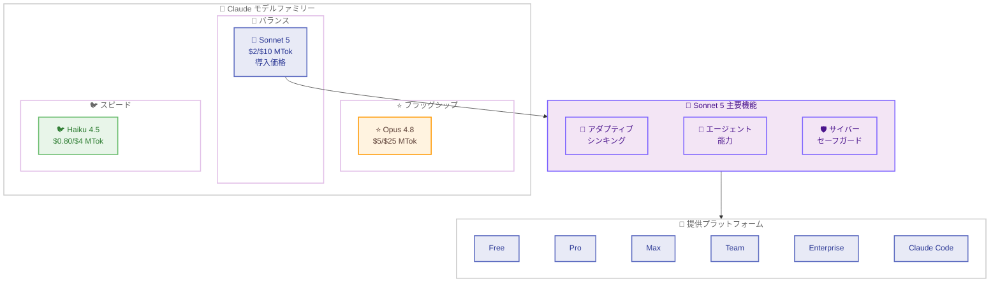

# Claude Sonnet 5 --- 次世代 Sonnet モデルのリリース

## メタデータ

| 項目 | 内容 |
|------|------|
| 発表日 | 2026-06-30 |
| ソース | Anthropic News / Claude API Release Notes |
| カテゴリ | モデルリリース |
| 公式リンク | https://www.anthropic.com/news/claude-sonnet-5 |

## 概要

Anthropic は 2026 年 6 月 30 日、Claude Sonnet モデルファミリーの次世代モデル「Claude Sonnet 5」(`claude-sonnet-5`) をリリースした。Sonnet 5 は、Sonnet 4.6 からの厳密な改善であり、Opus 4.8 に近いパフォーマンスをより低い価格帯で実現する。計画立案、ツール使用、自律的な動作において最も高い能力を持つ「最もエージェンティックな Sonnet」として位置づけられている。

導入価格として 2026 年 8 月 31 日まで入力 $2/MTok、出力 $10/MTok で提供され (その後は $3/$15)、新しいトークナイザー、アダプティブシンキングのデフォルト有効化、サイバーセーフガードのデフォルト有効化など、多数の技術的変更を含む。

## 詳細

### 背景

Claude Sonnet シリーズは、パフォーマンスとコストのバランスに優れたモデルとして広く利用されてきた。前世代の Sonnet 4.6 は、コーディング、推論、知識タスクで高い評価を受けていたが、Opus モデルとの性能差が課題となっていた。Sonnet 5 はこのギャップを大幅に縮小し、多くのユースケースで Opus 4.8 に匹敵する性能を Sonnet 価格帯で提供する。

### 主な変更点

- **パフォーマンス向上**: Opus 4.8 に近い性能を低価格で実現。推論、ツール使用、コーディング、知識作業のすべてで Sonnet 4.6 を厳密に上回る
- **エージェント能力の強化**: 計画立案、ブラウザやターミナルのツール使用、自律的な動作において最高レベルの Sonnet モデル
- **アダプティブシンキング**: デフォルトで有効化。手動の Extended Thinking は廃止 (設定すると 400 エラー)
- **新トークナイザー**: 同じテキストに対して約 30% 多くのトークンを生成 (コンテンツタイプにより 1.0-1.35 倍)
- **サンプリングパラメータ制限**: temperature、top_p、top_k をデフォルト以外に設定すると 400 エラー
- **サイバーセーフガード**: デフォルトで有効化
- **安全性向上**: Sonnet 4.6 と比較して全体的に望ましくない動作が減少。悪意あるリクエストの拒否能力が向上
- **1M トークンコンテキストウィンドウ**: 最大 128k 出力トークン

### 技術的な詳細

**モデル仕様。**

| 項目 | 値 |
|------|-----|
| モデル ID | `claude-sonnet-5` |
| コンテキストウィンドウ | 1,000,000 トークン |
| 最大出力トークン | 128,000 トークン |
| アダプティブシンキング | デフォルト ON |
| サンプリングパラメータ | デフォルト値のみ許可 |
| サイバーセーフガード | デフォルト有効 |

**料金体系。**

| 期間 | 入力 | 出力 |
|------|------|------|
| 導入価格 (2026/8/31 まで) | $2/MTok | $10/MTok |
| 標準価格 (2026/9/1 以降) | $3/MTok | $15/MTok |

**新トークナイザーの影響。**

新しいトークナイザーにより、同じ入力テキストに対してトークン数が約 1.0-1.35 倍に増加する。導入価格はこのトークナイザー変更によるコスト増加を相殺するように設計されており、移行期間中はおおむねコストニュートラルとなる。

**制限事項。**

- Priority Tier は Sonnet 5 では利用不可
- サンプリングパラメータ (temperature、top_p、top_k) のカスタマイズは不可
- 手動 Extended Thinking の設定は 400 エラーを返す

**提供プラットフォーム。**

Free、Pro、Max、Team、Enterprise、Claude Code、Claude Platform のすべてで利用可能。

## 開発者への影響

### 対象

- Claude API を利用するすべての開発者
- Sonnet 4.6 を使用中のアプリケーション
- エージェントシステムを構築している開発者
- コスト最適化を重視するプロジェクト

### 必要なアクション

1. **モデル ID の更新**: `claude-sonnet-4-6-20260220` から `claude-sonnet-5` への移行を検討
2. **Extended Thinking の削除**: 手動の `thinking` パラメータを使用している場合は削除が必要 (400 エラー回避)
3. **サンプリングパラメータの見直し**: temperature、top_p、top_k をカスタマイズしている場合はデフォルト値に戻す
4. **トークン使用量の監視**: 新トークナイザーにより同じ入力でもトークン数が増加するため、コスト監視を強化
5. **コスト試算の更新**: 導入価格期間中と標準価格適用後の両方でコスト試算を実施

### 移行ガイド

**ステップ 1: Extended Thinking の対応。**

```python
# 変更前 (Sonnet 4.6) - 手動 Extended Thinking
message = client.messages.create(
    model="claude-sonnet-4-6-20260220",
    max_tokens=8192,
    thinking={"type": "enabled", "budget_tokens": 4096},
    messages=[...]
)

# 変更後 (Sonnet 5) - アダプティブシンキングが自動で有効
message = client.messages.create(
    model="claude-sonnet-5",
    max_tokens=8192,
    messages=[...]
)
```

**ステップ 2: サンプリングパラメータの削除。**

```python
# 変更前 (Sonnet 4.6) - カスタムサンプリング
message = client.messages.create(
    model="claude-sonnet-4-6-20260220",
    max_tokens=8192,
    temperature=0.7,
    top_p=0.9,
    messages=[...]
)

# 変更後 (Sonnet 5) - サンプリングパラメータを削除
message = client.messages.create(
    model="claude-sonnet-5",
    max_tokens=8192,
    messages=[...]
)
```

**ステップ 3: トークンコスト試算。**

| シナリオ | Sonnet 4.6 | Sonnet 5 (導入価格) | Sonnet 5 (標準価格) |
|----------|-----------|-------------------|-------------------|
| 1M 入力トークン | $3.00 | $2.00-$2.70 | $3.00-$4.05 |
| 1M 出力トークン | $15.00 | $10.00-$13.50 | $15.00-$20.25 |

注: トークナイザー変更により同じテキストで 1.0-1.35 倍のトークンが生成されるため、範囲で記載。

## コード例

```python
import anthropic

client = anthropic.Anthropic()

message = client.messages.create(
    model="claude-sonnet-5",
    max_tokens=8192,
    messages=[
        {"role": "user", "content": "Explain quantum computing in simple terms."}
    ]
)
print(message.content[0].text)
```

**ストリーミングでの使用例。**

```python
import anthropic

client = anthropic.Anthropic()

with client.messages.stream(
    model="claude-sonnet-5",
    max_tokens=8192,
    messages=[
        {"role": "user", "content": "Write a detailed analysis of recent AI trends."}
    ]
) as stream:
    for text in stream.text_stream:
        print(text, end="", flush=True)
```

**ツール使用の例。**

```python
import anthropic

client = anthropic.Anthropic()

message = client.messages.create(
    model="claude-sonnet-5",
    max_tokens=8192,
    tools=[
        {
            "name": "get_weather",
            "description": "Get the current weather in a given location",
            "input_schema": {
                "type": "object",
                "properties": {
                    "location": {"type": "string", "description": "City name"}
                },
                "required": ["location"]
            }
        }
    ],
    messages=[
        {"role": "user", "content": "What's the weather like in Tokyo?"}
    ]
)
print(message.content)
```

## アーキテクチャ図



## 関連リンク

- [Claude Sonnet 5 公式発表](https://www.anthropic.com/news/claude-sonnet-5)
- [Claude API Release Notes](https://platform.claude.com/docs/en/release-notes/overview)
- [Claude モデル一覧](https://platform.claude.com/docs/en/models/all-models)
- [Messages API ドキュメント](https://platform.claude.com/docs/en/api/messages)
- [料金ページ](https://www.anthropic.com/pricing)

## まとめ

Claude Sonnet 5 は、Sonnet モデルファミリーの大幅な進化を示すリリースである。Opus 4.8 に近い性能を Sonnet 価格帯で提供し、特にエージェントタスクにおいて顕著な改善を実現している。

開発者にとって最も重要な変更点は以下の通り。

- アダプティブシンキングのデフォルト有効化と手動 Extended Thinking の廃止
- サンプリングパラメータのカスタマイズ不可
- 新トークナイザーによるトークン数の増加 (約 30%)
- 導入価格による移行期間のコスト緩和

導入価格は 2026 年 8 月 31 日まで有効であり、この期間中にトークナイザー変更の影響を評価し、標準価格適用後のコストを試算することが推奨される。エージェントシステムを構築している開発者にとっては、Sonnet 5 の強化されたツール使用能力と自律的な動作能力が大きなメリットとなる。
