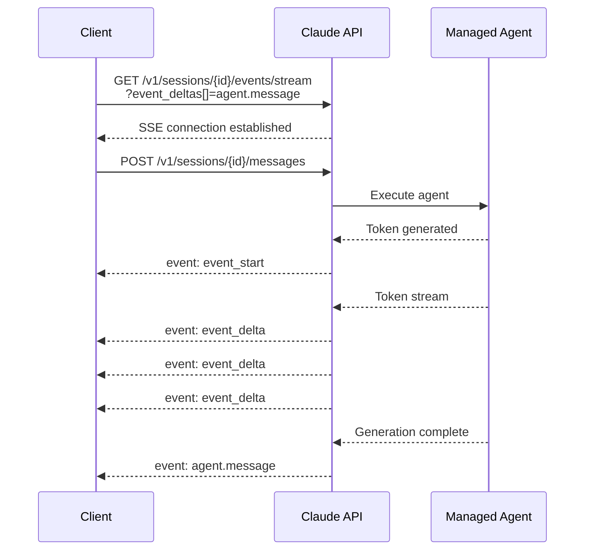

# Claude Managed Agents — イベントデルタ、逆方向ページネーション、セッション設定オーバーライド

## メタデータ

| 項目 | 内容 |
|------|------|
| 発表日 | 2026-06-30 |
| ソース | Claude API Release Notes |
| カテゴリ | API アップデート |
| 公式リンク | https://platform.claude.com/docs/en/release-notes/overview |

## 概要

2026 年 6 月 30 日、Anthropic は Claude Managed Agents プラットフォームに対する 5 つの重要なアップデートを発表した。イベントデルタによるリアルタイムストリーミング、逆方向ページネーション、セッション設定オーバーライド、Vault のインジェクションロケーション設定、そして拡張 Webhook イベントが追加された。これらの機能強化により、エージェントの応答をリアルタイムで表示する UI の構築、セッション一覧のナビゲーション改善、セッションごとのカスタマイズ、セキュリティ制御の強化、そしてイベント駆動型ワークフローの構築が可能になる。

## 詳細

### 背景

Claude Managed Agents は、Anthropic が提供するエージェント実行基盤であり、開発者がエージェントの定義、デプロイ、実行をプラットフォーム上で管理できるサービスである。今回のアップデートは、開発者体験の向上とプラットフォームの柔軟性強化を目的としている。特にイベントデルタの導入により、エージェントの応答がリアルタイムでクライアントに届くようになり、ユーザー体験が大幅に改善される。

### 主な変更点

#### 1. イベントデルタ (Event Deltas) によるリアルタイムストリーミング

セッションイベントストリームがイベントデルタをサポートするようになった。`GET /v1/sessions/{session_id}/events/stream` エンドポイントで `event_deltas[]` クエリパラメータを指定することでオプトインできる。`event_start` および `event_delta` イベントにより、完全な `agent.message` イベントが到着する前に、エージェントメッセージのテキストをリアルタイムでプレビューできる。

#### 2. 逆方向ページネーション (Backward Pagination)

`GET /v1/sessions` エンドポイントが `next_page` に加えて `prev_page` カーソルを返すようになった。`page` パラメータとして渡すことで、前のページに戻ることができる。これにより、セッション一覧の双方向ナビゲーションが可能になる。

#### 3. セッション設定オーバーライド (Session Configuration Overrides)

セッション作成時に、エージェントの設定をオーバーライドできるようになった。`agent` フィールドに `type: "agent_with_overrides"` を指定することで、モデル、システムプロンプト、ツール、MCP サーバー、スキルを単一セッションに対してのみ変更できる。エージェント定義自体は変更されない。A/B テスト、一時的なモデルアップグレード、デバッグに有用である。

#### 4. Vault injection_location 設定

Vault の環境変数クレデンシャルに `injection_location` 設定が追加された。クレデンシャルの値がエージェントのアウトバウンドリクエストヘッダー、リクエストボディ、またはその両方に代入 (egress 時) されるかを制御できる。シークレットインジェクションのきめ細かな制御が可能になる。

#### 5. 拡張 Webhook イベント (Extended Webhook Events)

Webhook がエージェント、デプロイメント、デプロイメント実行のライフサイクルをカバーするようになった。ポーリングなしで、新しいエージェントバージョンの公開、デプロイメントの一時停止、スケジュール実行の失敗に対応できる。

新しいイベントタイプ。

- **Agent イベント**: エージェントバージョンの公開など
- **Deployment イベント**: デプロイメントの一時停止、再開など
- **Deployment run イベント**: スケジュール実行の成功、失敗など

### 技術的な詳細

#### イベントデルタのストリーミングフロー

イベントデルタは Server-Sent Events (SSE) プロトコルを使用して配信される。クライアントは `event_deltas[]` パラメータで対象イベントタイプを指定し、ストリームに接続する。イベントの流れは以下の通りである。

1. `event_start`: イベントの開始を通知
2. `event_delta`: テキストの差分をリアルタイムで配信 (複数回)
3. `agent.message`: 完全なメッセージイベント (最終)

#### セッション設定オーバーライドの構造

オーバーライドは以下のフィールドを受け付ける。

- `model`: 使用するモデルの変更
- `system_prompt`: システムプロンプトの変更
- `tools`: 利用可能なツールの変更
- `mcp_servers`: MCP サーバー設定の変更
- `skills`: スキル設定の変更

#### Vault injection_location のオプション

- `headers`: リクエストヘッダーにのみインジェクション
- `body`: リクエストボディにのみインジェクション
- `both`: ヘッダーとボディの両方にインジェクション

## 開発者への影響

### 対象

- Managed Agents を利用してエージェントアプリケーションを構築している開発者
- リアルタイム UI を実装しているフロントエンド開発者
- エージェントのデプロイメントパイプラインを管理している DevOps エンジニア
- セキュリティ要件の厳しい環境でエージェントを運用しているチーム

### 必要なアクション

1. **イベントデルタの採用**: リアルタイムストリーミング UI を実装している場合、`event_deltas[]` パラメータを追加してユーザー体験を向上させる
2. **ページネーション UI の更新**: セッション一覧を表示している場合、`prev_page` カーソルを利用して前ページへの戻りボタンを実装する
3. **セッションオーバーライドの活用**: A/B テストやデバッグ時にセッション設定オーバーライドを利用し、エージェント定義を変更せずに実験する
4. **Vault 設定の見直し**: セキュリティ要件に応じて `injection_location` を適切に設定する
5. **Webhook の設定**: ポーリングベースの監視を Webhook に置き換えて、イベント駆動型のワークフローを構築する

## コード例

```python
import anthropic

client = anthropic.Anthropic()

# Event deltas でリアルタイムストリーミング
import httpx

session_id = "session_xyz789"
headers = {
    "x-api-key": "your-api-key",
    "anthropic-version": "2024-01-01",
}

stream_url = f"https://api.anthropic.com/v1/sessions/{session_id}/events/stream?event_deltas[]=agent.message"

with httpx.stream("GET", stream_url, headers=headers) as response:
    for line in response.iter_lines():
        if line.startswith("event: event_delta"):
            # テキストがリアルタイムで到着
            print(delta_text, end="", flush=True)
```

```python
# セッション設定オーバーライド
session = client.managed_agents.sessions.create(
    agent_id="agent_abc123",
    agent={
        "type": "agent_with_overrides",
        "model": "claude-sonnet-5",
        "system_prompt": "Custom system prompt for this session only.",
    },
    messages=[{"role": "user", "content": "Hello!"}]
)
```

```python
# 逆方向ページネーション
# 最初のページを取得
first_page = client.managed_agents.sessions.list(limit=10)

# 次のページに移動
next_page = client.managed_agents.sessions.list(
    limit=10,
    page=first_page.next_page
)

# 前のページに戻る
prev_page = client.managed_agents.sessions.list(
    limit=10,
    page=next_page.prev_page
)
```

## アーキテクチャ図



## 関連リンク

- [Claude API Release Notes](https://platform.claude.com/docs/en/release-notes/overview)
- [Managed Agents ドキュメント](https://platform.claude.com/docs/en/agents/overview)
- [Webhook 設定ガイド](https://platform.claude.com/docs/en/webhooks/overview)
- [Vault ドキュメント](https://platform.claude.com/docs/en/agents/vault)

## まとめ

今回の Managed Agents アップデートは、プラットフォームの成熟度を大きく向上させるものである。イベントデルタによるリアルタイムストリーミングは、エージェントベースのアプリケーションにおけるユーザー体験を劇的に改善する。セッション設定オーバーライドにより、本番エージェント定義を変更することなく柔軟な実験が可能になる。拡張 Webhook イベントはポーリングの必要性を排除し、よりリアクティブなシステム設計を促進する。これらの機能を組み合わせることで、開発者はより洗練されたエージェントアプリケーションを構築できるようになる。
