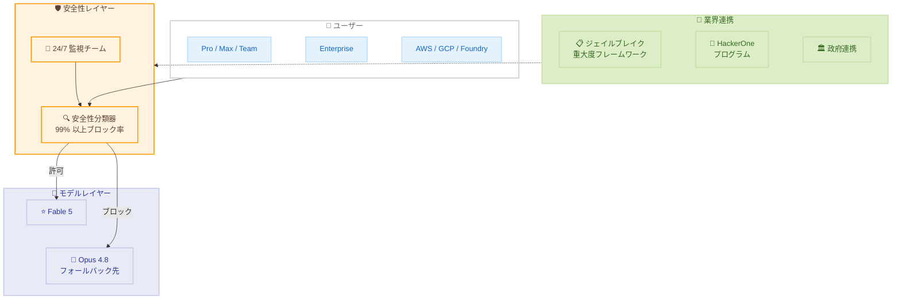

# Claude Fable 5 の再デプロイ — 輸出規制解除とアクセス再開

## メタデータ

| 項目 | 内容 |
|------|------|
| 発表日 | 2026-06-30 |
| ソース | Anthropic News |
| カテゴリ | モデル運用・安全性 |
| 公式リンク | https://www.anthropic.com/news/redeploying-fable-5 |

## 概要

2026 年 6 月 12 日に米国政府の輸出規制により全ユーザーへのアクセスが停止されていた Claude Fable 5 について、Anthropic は規制解除を受けて 7 月 1 日よりグローバルにアクセスを再開することを発表した。調査の結果、報告されたセーフガードバイパス手法は Fable 5 固有の危険な能力を露呈するものではなく、より低性能なモデルでも同等の結果を再現できることが確認された。再デプロイにあたり、報告された手法を 99% 以上のケースでブロックする改良版安全性分類器が導入されている。

## 詳細

### 背景

2026 年 6 月 9 日、Anthropic は Claude Fable 5 および Claude Mythos 5 をリリースした。しかし 6 月 12 日、Amazon の研究者がセーフガードのバイパス手法を発見し、ソフトウェア脆弱性の特定およびエクスプロイトコードの生成が可能であることを報告した。これを受けて米国政府が両モデルに輸出規制を適用した。

Anthropic は「リアルタイムで国籍を確認する信頼性の高い方法がない」として、規制対象国のユーザーだけでなく全ユーザーのアクセスを即座に停止する判断を下した。

**タイムライン:**

| 日付 | イベント |
|------|---------|
| 6 月 9 日 | Fable 5 および Mythos 5 リリース |
| 6 月 12 日 | 輸出規制適用、全ユーザーのアクセス停止 |
| 6 月 26 日 | 米国政府が一部米国組織への Mythos 5 アクセス復旧を承認 |
| 6 月 30 日 | Fable 5 および Mythos 5 への輸出規制解除 (本記事公開) |
| 7 月 1 日 | Fable 5 がグローバルに再利用可能 |

### 主な変更点

**再デプロイの根拠:**

Anthropic の内部テストにより、報告されたバイパス手法は Fable 5 固有の危険な能力を露呈するものではないことが判明した。以下の事実が確認されている。

- Claude Opus 4.8、GPT-5.5、Kimi K2.7 を含む多くの低性能モデルでも同じ脆弱性を特定可能
- テストした全モデルが同じエクスプロイトデモンストレーションコードを生成可能
- Claude Haiku 4.5 でさえ同等のエクスプロイトデモンストレーションコードを生成可能
- 報告された手法は「通常の防御的サイバーセキュリティ作業」の範囲内

**新たな安全対策:**

- 報告されたバイパス手法を 99% 以上のケースでブロックする改良版安全性分類器を導入
- ブロックされたリクエストはユーザーに通知され、Opus 4.8 にリダイレクト
- 多層防御 (defense in depth) アプローチによる複数の安全メカニズムの組み合わせ
- 安全マージンの拡大: おそらく無害だが有害となる可能性がわずかにあるリクエストもブロック

**トレードオフ:**

新しい分類器により、通常のコーディングやデバッグ作業中に無害なリクエストがより頻繁にフラグされるようになった。CAISI (Center for AI Safety and Innovation) の研究者がテストを行い、セーフガードは「極めて強固」であると評価している。

### 技術的な詳細

**安全性分類器のアーキテクチャ:**

改良版安全性分類器は以下の特性を持つ。

- Amazon の研究者が報告した特定のバイパスパターンを検知・ブロック
- 99% 以上の阻止率を達成
- ブロック時にユーザーへ通知し、代替モデル (Opus 4.8) への自動リダイレクトを実施
- 多層防御の一環として複数のセーフティメカニズムと連携

**業界共通ジェイルブレイク重大度フレームワーク:**

Amazon、Microsoft、Google および Glasswing パートナーと共同で、ジェイルブレイクを以下の 4 基準で評価する共通フレームワークを策定。

1. **能力獲得 (Capability gain)**: 既存ツールを超えてどの程度の能力をユーザーに与えるか
2. **能力獲得の幅 (Breadth of capability gain)**: 何種類の攻撃タスクを可能にするか
3. **武器化の容易さ (Ease of weaponization)**: 実際の攻撃に転用するのに必要な人的労力
4. **発見可能性 (Discoverability)**: その手法を入手する容易さ

最も深刻なジェイルブレイクに対しては、重大度確認後「直ちに暫定的な緩和策の展開を開始」し、24 時間 365 日の監視チームを設置する。

## 開発者への影響

### 対象

- Claude Fable 5 を利用する全ての開発者およびユーザー
- Claude Platform、Claude.ai、Claude Code、Claude Cowork の利用者
- AWS、Google Cloud、Microsoft Foundry 経由の利用者
- セキュリティ研究者

### 必要なアクション

**利用再開に関する確認事項:**

1. **利用プランの確認**: 7 月 7 日まで、Pro、Max、Team、一部 Enterprise プランでは週間利用上限の最大 50% まで Fable 5 を利用可能。7 月 7 日以降は利用クレジットのみ
2. **標準 Enterprise**: 含まれる利用枠なし。全利用がクレジット課金
3. **クラウドプロバイダー**: AWS、Google Cloud、Microsoft Foundry でのアクセスは順次再有効化
4. **安全性分類器の影響**: 通常のコーディング/デバッグ作業中に誤検知が増加する可能性があることを認識しておく

**セキュリティ研究者向け:**

- 新設された HackerOne プログラムを通じてサイバージェイルブレイクの報告が可能

### 移行ガイド (該当する場合)

停止期間中に代替モデルを使用していた場合の再移行手順。

1. **API エンドポイント**: モデル指定を Fable 5 のモデル ID に戻す
2. **クレジット管理**: 7 月 7 日以降は利用クレジットが必要となるため、予算計画を更新
3. **エラーハンドリング**: 安全性分類器によるブロック時のリダイレクト (Opus 4.8) を考慮したフォールバック処理を実装
4. **Mythos 5**: 現時点では承認済み米国組織のみ利用可能。Glasswing プログラムを通じて順次拡大予定

## アーキテクチャ図

## 関連リンク

- [Redeploying Fable 5 - Anthropic News](https://www.anthropic.com/news/redeploying-fable-5)
- [Claude Platform](https://claude.ai)
- [Claude Code](https://github.com/anthropics/claude-code)
- [HackerOne - Anthropic](https://hackerone.com/anthropic)

## まとめ

Claude Fable 5 の再デプロイは、AI の安全性と利用可能性のバランスに関する重要な先例となった。当初報告されたセーフガードバイパスは Fable 5 固有の危険性を示すものではなく、調査により安全に再デプロイ可能と判断された。Anthropic は 99% 以上のブロック率を持つ改良版安全性分類器の導入に加え、業界横断のジェイルブレイク評価フレームワーク、政府との連携深化、HackerOne プログラムの新設という 3 つの業界イニシアチブを発表し、フロンティアモデルの安全性確保に向けた包括的なアプローチを示した。ただし、新しい安全性分類器による通常作業中の誤検知増加というトレードオフが存在するため、開発者はエラーハンドリングの実装を検討する必要がある。
