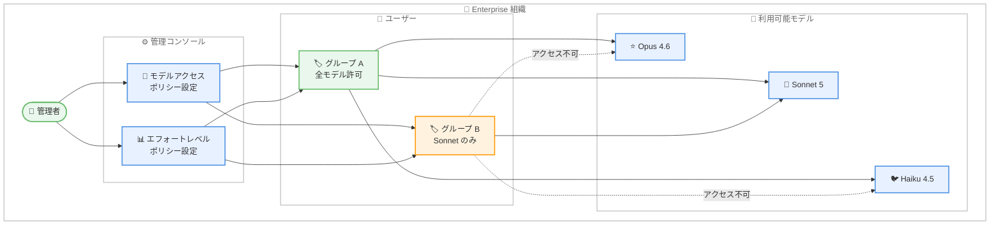

# Claude Apps Enterprise モデルエンタイトルメント (ベータ)

## メタデータ

| 項目 | 内容 |
|------|------|
| 発表日 | 2026-07-01 |
| ソース | Claude Apps Release Notes |
| カテゴリ | エンタープライズ機能 |
| 公式リンク | [Release Notes](https://support.claude.com/en/articles/12138966-release-notes) |

## 概要

Enterprise プランの管理者がユーザーのモデルアクセスとエフォートレベル設定を制御できる「モデルエンタイトルメント」機能がベータとして公開された。組織のコスト管理やセキュリティポリシーに基づき、どのモデルを誰が利用できるか、どのエフォートレベルまで許可するかを管理者が一元的に設定できるようになる。

## 詳細

### 背景

Anthropic は 2026 年に入ってからエンタープライズ向けのガバナンス機能を段階的に強化している。2026 年 4 月にはロールベースアクセス制御 (RBAC) が導入され、組織内のユーザー権限を細かく管理できるようになった。今回のモデルエンタイトルメント機能は、この流れの延長として、AI モデルの利用範囲そのものを管理者が制御するための新たなレイヤーを追加するものである。

Enterprise プランでは複数のモデル (Opus 4.6、Sonnet 5、Haiku 4.5 など) が利用可能であるが、組織によってはコスト管理やコンプライアンスの観点から、特定のユーザーやグループに利用可能なモデルを制限したいニーズがある。また、エフォートレベル (低・中・高) によってトークン消費量と応答品質が異なるため、高コストなエフォートレベルの利用を制限することでコストを予測可能にしたいという要望にも対応する。

### 主な変更点

- **モデルアクセス制御**: 管理者がユーザーに対して利用可能なモデルを指定できる
- **エフォートレベル制御**: 管理者がユーザーに許可するエフォートレベル設定を制限できる
- **Enterprise プラン限定**: この機能は Enterprise プランのみで利用可能
- **ベータステータス**: 現時点ではベータ版として提供されており、今後変更される可能性がある

### 技術的な詳細

#### モデルエンタイトルメントの仕組み

管理者は組織の管理コンソールから以下の設定を行える。

1. **モデルアクセスポリシー**: ユーザーまたはグループ単位で利用可能なモデルを定義
2. **エフォートレベルポリシー**: 各モデルに対して許可するエフォートレベルの上限を設定

#### エフォートレベルとコストの関係

| エフォートレベル | トークン消費 | ユースケース |
|-----------------|-------------|-------------|
| 低 (Low) | 少ない | 簡単な質問、定型的なタスク |
| 中 (Medium) | 標準 | 一般的な業務利用 |
| 高 (High) | 多い | 複雑な分析、詳細な推論 |

管理者がエフォートレベルを「中」までに制限した場合、ユーザーは「高」を選択できなくなり、予期せぬ高コストの発生を防ぐことができる。

## 開発者への影響

### 対象

- **Enterprise プランの組織管理者**: モデルアクセスポリシーの設計と設定を行う
- **Enterprise プランのユーザー**: 管理者の設定に基づき、利用可能なモデルとエフォートレベルが制限される場合がある
- **IT 部門/セキュリティ担当者**: ガバナンスポリシーの一環としてモデル利用ポリシーを策定する

### 必要なアクション

1. **管理者**: 組織のモデル利用ポリシーを検討し、適切なエンタイトルメント設定を行う
2. **管理者**: ベータ版の制限事項を確認し、本番環境への適用を慎重に判断する
3. **ユーザー**: 利用可能なモデルが制限される可能性があることを理解し、必要に応じて管理者に問い合わせる
4. **IT 部門**: 既存の RBAC 設定とモデルエンタイトルメントの組み合わせによるアクセス制御を設計する

## アーキテクチャ図

## 関連リンク

- [Claude Apps Release Notes](https://support.claude.com/en/articles/12138966-release-notes)
- [Manage model access for your organization](https://support.claude.com/en/articles/manage-model-access) (管理者向けガイド)
- [Anthropic Enterprise](https://www.anthropic.com/enterprise)

## まとめ

モデルエンタイトルメント機能のベータ公開は、Anthropic が Enterprise 顧客向けのガバナンス基盤を着実に強化していることを示している。2026 年 4 月の RBAC 導入に続き、今回のモデルアクセス制御により、管理者は「誰が何をできるか」だけでなく「誰がどのモデルをどのレベルで使えるか」まで細かく制御可能になった。ベータ段階であるため今後仕様が変更される可能性はあるが、コスト管理とガバナンスの両面で Enterprise 組織にとって実用性の高い機能である。大規模な組織における AI 利用のガバナンスフレームワーク構築に向けた重要な一歩と位置づけられる。
