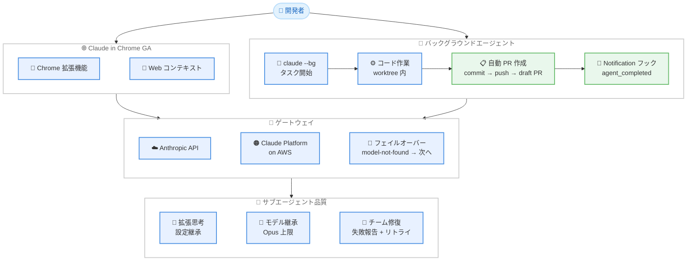

# Claude Code v2.1.198 — Claude in Chrome が一般提供開始、バックグラウンドエージェントの自動 PR 作成

## メタデータ

| 項目 | 内容 |
|------|------|
| 発表日 | 2026-07-02 |
| ソース | Claude Code Changelog |
| カテゴリ | Claude Code アップデート |
| 公式リンク | [Changelog](https://github.com/anthropics/claude-code/blob/main/CHANGELOG.md) |

## 概要

Claude Code v2.1.198 は多数の機能追加とバグ修正を含む大規模リリースである。最大の目玉は **Claude in Chrome** の一般提供 (GA) 開始であり、ブラウザから直接 Claude Code の機能にアクセス可能になった。加えて、バックグラウンドエージェントがコード作業完了時に自動でコミット・プッシュ・ドラフト PR を作成する機能、新しい `/dataviz` スキル、サブエージェントへの拡張思考設定の継承など、開発ワークフローを大幅に効率化する改善が多数含まれている。ネットワーク障害時のリトライ改善や macOS でのバックグラウンドエージェントの再接続問題修正など、信頼性に関する修正も充実している。

## 詳細

### 背景

Claude Code は急速にエージェント型開発ツールとしての機能を拡充しており、前バージョン v2.1.197 では Sonnet 5 がデフォルトモデルとなった。v2.1.198 では、ブラウザ統合 (Chrome 拡張機能) の GA 化によりアクセスポイントが広がるとともに、バックグラウンドエージェントの自律性が向上し、開発者の介入なしに PR 作成まで完了できるようになった。また、サブエージェントの品質向上やゲートウェイの拡張により、エンタープライズ環境での利用がさらに強化されている。

### 主な変更点

#### Claude in Chrome が一般提供開始

- **Chrome 拡張機能の GA 化**: これまでベータ提供されていた Claude in Chrome が正式に一般提供 (GA) となった
- ブラウザ上で直接 Claude Code の機能を活用でき、Web ページのコンテキストを活かした作業が可能

#### バックグラウンドエージェントの進化

- **自動 PR 作成**: `claude agents` から起動したバックグラウンドエージェントが worktree でコード作業を完了すると、自動的にコミット・プッシュし、ドラフト PR を作成する。従来の「完了後に確認を求めて停止」する動作から大幅に自律性が向上
- **通知フック対応**: セッションが入力を必要とする場合や完了した場合に `Notification` フック (`agent_needs_input` / `agent_completed`) が発火する
- **Explore エージェントのモデル改善**: 組み込みの Explore エージェントがメインセッションのモデルを継承する (Opus 上限) ようになり、従来の Haiku 固定から品質が向上

#### 新スキル: `/dataviz`

- チャートやダッシュボードのデザインガイダンスを提供する新しいスキルが追加
- 実行可能なカラーパレットバリデーターを含み、データ可視化の品質を事前検証可能

#### ゲートウェイ拡張

- **Claude Platform on AWS (anthropicAws) 対応**: ゲートウェイのアップストリームプロバイダーとして追加
- **フェイルオーバー改善**: model-not-found レスポンス時にフェイルオーバーチェーンを自動的に次のプロバイダーへ進める

#### サブエージェントの品質向上

- **拡張思考の継承**: サブエージェントとコンテキスト圧縮がセッションの拡張思考設定を継承するようになり、委譲タスクの出力品質が向上
- **エージェントチーム修正**: API エラーで停止したチームメイトが "failed" を報告するようになり、停止中のチームメイトへのメッセージで即座にリトライが開始される
- **メッセージ権限の明確化**: サブエージェントは起動元エージェントからのメッセージを通常のタスク指示として処理するが、ユーザー承認としては扱わない

### 技術的な詳細

#### ネットワーク信頼性の向上

| 修正内容 | 詳細 |
|----------|------|
| ECONNRESET リトライ | レスポンス中の一時的なネットワーク切断でターンが中断されていた問題を修正。バックオフ付きリトライに変更 |
| macOS ローカルネットワーク | Local Network エンタイトルメントの宣言により "no route to host" エラーを解消 |
| 52 秒ごとの再接続表示 | macOS で agents ビューを開いている間の不要な "Reconnecting..." 表示を修正 |
| STS トークン自動更新 | AWS/Mantle セッションで STS トークン期限切れ時に `awsAuthRefresh` が自動実行される |

#### バックグラウンドタスクの安定性

- Web、デスクトップ、VS Code のタスクパネルで、完了後もステータスが "Running" のまま固まる問題を修正
- `claude --bg` と `--print`/`-p` の矛盾するフラグの組み合わせがエラーとして即座に拒否される
- ワークフロープログレスビューでフェーズカウンターは正しいのにエージェントリストから最初のエージェントが消える問題を修正

#### UI/UX の改善

- `/diff` パネルがブランチ切替やセッション外コミット時に自動更新
- マークダウンテーブルのフルスクリーンモードでの右ボーダーはみ出しを修正
- highlight.js 11 へのアップグレードによりコードブロック・差分・ファイルプレビューのシンタックスハイライト精度が向上
- macOS から SSH 接続時にショートカットヒントが `opt`/`cmd` 表示に
- フルスクリーンモードでの Cmd+click による URL オープン (Warp)、ダブルクリックでの URL 全体選択を修正
- フォーカスモードでサブエージェントがアクティビティサマリーに表示され、バックグラウンド通知が単一カウントに集約

#### その他の変更

- `/agents` ウィザードが削除され、エージェントの作成・管理は Claude への指示または `.claude/agents/` の直接編集で行う
- `/login` が `claude agents` ビューからサインインダイアログを開くように改善
- プランモードでセッション開始時に読み取り専用ツール呼び出しが自動許可されるように修正
- `/branch` のデフォルトフォーク名がコンパクション要約ではなく最初の実際のプロンプトから生成されるように修正
- `.claude/rules/` のコンディショナルルールがシンボリックリンク経由のファイルパスでも正しくロードされるように修正

## 開発者への影響

### 対象

- **全 Claude Code ユーザー**: Chrome 拡張機能の GA 化により、ブラウザからの利用が正式にサポートされる
- **バックグラウンドエージェント利用者**: 自動 PR 作成と通知フックにより、非同期ワークフローが大幅に効率化される
- **チーム開発者**: エージェントチームの信頼性向上により、複数エージェントによる協調作業が安定する
- **AWS 環境のユーザー**: Claude Platform on AWS のゲートウェイ対応と STS トークン自動更新により、エンタープライズ環境での運用が改善
- **データ可視化を行う開発者**: `/dataviz` スキルによるチャート設計ガイダンスを活用可能

### 必要なアクション

1. **バージョンアップデート**: v2.1.198 にアップデートして最新機能を利用する
2. **Chrome 拡張機能のインストール**: Chrome ウェブストアから Claude in Chrome 拡張機能をインストール
3. **通知フックの設定**: バックグラウンドエージェントの通知を受け取るために `Notification` フックを設定する
4. **`/agents` ウィザード廃止への対応**: エージェント管理を Claude への指示または `.claude/agents/` ファイルの直接編集に移行する
5. **ゲートウェイ設定の確認** (AWS 利用者): `anthropicAws` プロバイダーの追加を活用するかどうか確認する

## コード例

```bash
# Claude Code を最新バージョンに更新
npm install -g @anthropic-ai/claude-code@latest

# バージョン確認
claude --version
# Claude Code v2.1.198
```

```bash
# バックグラウンドエージェントを起動 (完了時に自動で PR 作成)
claude --bg "auth モジュールのリファクタリングを行い、テストを追加してください"

# エージェントビューで状態を確認
claude agents
```

```bash
# Notification フックの設定例 (.claude/settings.json)
# エージェント完了時にデスクトップ通知を送信
{
  "hooks": {
    "Notification": [
      {
        "matcher": "agent_completed",
        "command": "notify-send 'Claude Agent' 'タスクが完了しました'"
      },
      {
        "matcher": "agent_needs_input",
        "command": "notify-send 'Claude Agent' '入力が必要です'"
      }
    ]
  }
}
```

```bash
# /dataviz スキルの使用例
claude
> /dataviz 売上データのダッシュボードを設計してください
```

## アーキテクチャ図



## 関連リンク

- [Claude Code Changelog](https://github.com/anthropics/claude-code/blob/main/CHANGELOG.md)
- [Claude Code GitHub リポジトリ](https://github.com/anthropics/claude-code)
- [Claude Code ドキュメント](https://docs.anthropic.com/en/docs/claude-code)
- [前バージョン v2.1.197 レポート](./2026-06-30-claude-code-v2-1-197.md)

## まとめ

Claude Code v2.1.198 は、アクセス性・自律性・信頼性の 3 軸で大きな前進を遂げたリリースである。Chrome 拡張機能の一般提供により、IDE やターミナルに限定されていた Claude Code の利用シーンがブラウザへと拡大された。バックグラウンドエージェントの自動 PR 作成機能は、非同期開発ワークフローにおける摩擦を大幅に削減し、エージェントに作業を委譲して後から結果を確認するという使い方がより実用的になった。サブエージェントへの拡張思考設定の継承やモデル継承の改善は、委譲タスクの品質を底上げする。ネットワーク障害時のリトライ、macOS でのローカルネットワーク問題、STS トークンの自動更新など、信頼性に関する修正も多数含まれており、エンタープライズ環境での安定運用が一段と向上している。`/agents` ウィザードの廃止に見られるように、エージェント管理の方針は「Claude に直接指示する」「設定ファイルを編集する」という 2 つのパスに集約されつつあり、Claude Code 全体のインターフェース簡素化が進んでいる。
