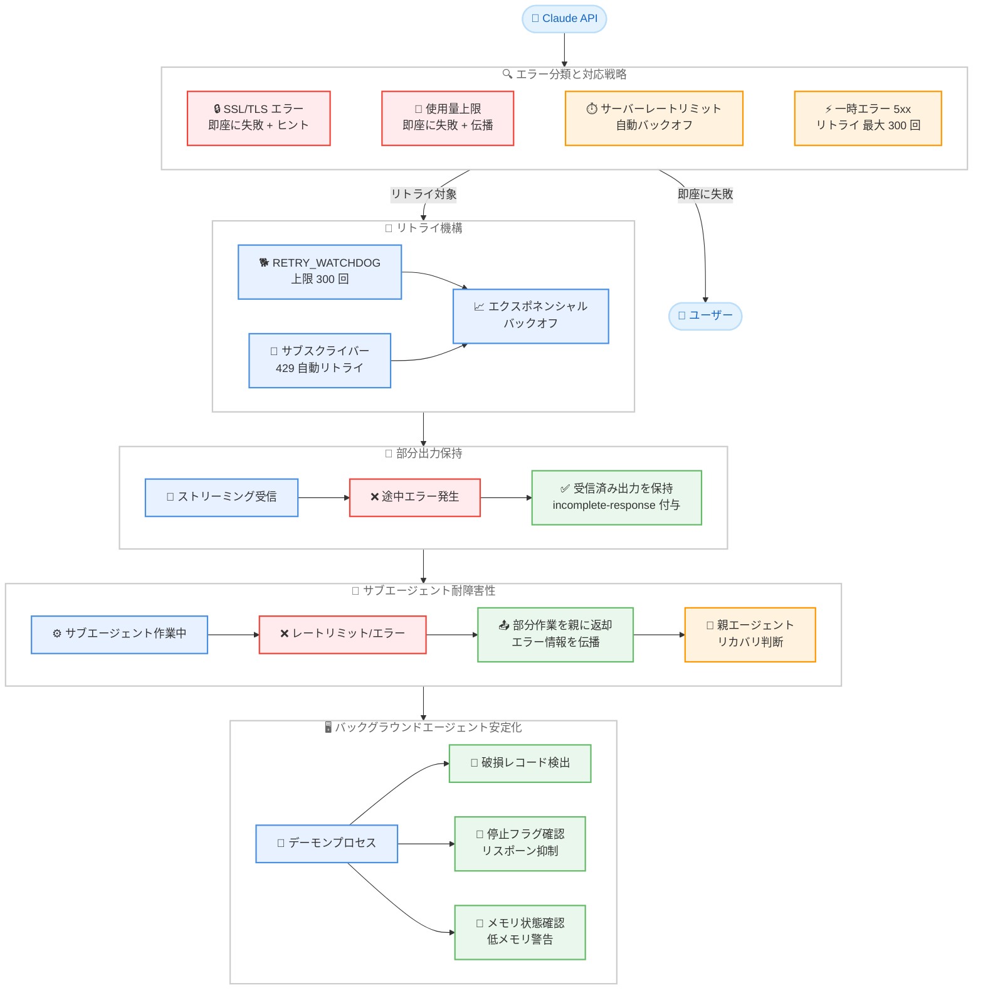

# Claude Code v2.1.199 — 信頼性の大幅強化: エラーハンドリング、部分出力保持、バックグラウンドエージェント安定化

## メタデータ

| 項目 | 内容 |
|------|------|
| 発表日 | 2026-07-03 |
| ソース | Claude Code Changelog |
| カテゴリ | Claude Code アップデート |
| 公式リンク | [Changelog](https://github.com/anthropics/claude-code/blob/main/CHANGELOG.md) |

## 概要

Claude Code v2.1.199 は、信頼性とエラー耐性に焦点を当てたリリースである。前バージョン v2.1.198 が Chrome GA やバックグラウンドエージェント自動 PR 作成といった大規模機能追加であったのに対し、本バージョンはそれらの基盤を安定化させる修正が中心となっている。主な改善は 3 つの軸に集約される。第 1 に、ストリーミングレスポンスやサブエージェントが中断された際に部分的な作業を破棄せず保持する仕組みの導入。第 2 に、429 レートリミットや一時的サーバーエラーに対するリトライ機構の強化。第 3 に、バックグラウンドエージェントの安定性向上 (Linux でのデーモン自己停止、macOS での SSH コールドスタート失敗、`claude stop` レースコンディションなどの修正)。新機能として、スラッシュスキルの複数同時ロードや `CLAUDE_CODE_RETRY_WATCHDOG` 環境変数による積極的リトライ設定も追加されている。

## 詳細

### 背景

v2.1.198 で導入されたバックグラウンドエージェントの自動 PR 作成やサブエージェントチーム機能は、長時間の非同期タスク実行を前提としている。しかし、長時間実行されるセッションではネットワーク障害、レートリミット、サーバーエラーといった一時的な問題に遭遇する確率が高まる。従来のバージョンではこれらのエラーが発生した際に作業が静かに失われる (ストリーミング中の部分出力が破棄される、サブエージェントが無言で失敗する) ケースがあった。v2.1.199 はこれらの問題を体系的に修正し、「グレースフルデグラデーション」の原則を徹底している。

### 主な変更点

#### 新機能

##### スラッシュスキルの複数同時ロード

- `/skill-a /skill-b do XYZ` のように先頭に複数のスキルを並べると、最大 5 つまで同時にロードされるようになった
- 従来は最初のスキルのみがロードされ、2 番目以降は無視されていた
- 複合的なワークフロー (例: `/code-review /security-review 修正して`) を 1 コマンドで実行可能に

##### サーバーレートリミットの自動リトライ

- ユーザーの使用量上限とは無関係な一時的な 429 エラー (サーバー側レートリミット) が自動的にバックオフ付きでリトライされるようになった
- サブスクライバー限定の機能
- 従来はこのエラーでターンが即座に失敗していた

##### CLAUDE_CODE_RETRY_WATCHDOG 環境変数

- 非容量系の一時的エラーに対するデフォルトリトライ回数を 300 に引き上げ
- `CLAUDE_CODE_MAX_RETRIES` の上限 15 を撤廃
- 長時間タスクでの一時的障害に対する粘り強さが大幅に向上

##### エージェントビューの表示改善

- `claude agents` セッション行の PR リンクが冗長な "PR" ラベルなしの `#N` 表示に変更

#### バグ修正: 部分出力の保持

| 問題 | 修正内容 |
|------|----------|
| ストリーミング中断 | API がストリーミング途中でサーバーエラーを返した場合、部分出力が破棄されていた。修正後は部分出力を保持し、incomplete-response ラベルを付与 |
| サブエージェントの切断 | レートリミットやサーバーエラーでサブエージェントが停止した際、部分作業が親に返されず無言で失敗していた。修正後は部分作業を親に返却 |
| サブエージェントのエラー報告 | API エラー (使用量上限到達など) が成功結果として報告されていた。修正後はエラーが正しく親エージェントに伝播 |

#### バグ修正: バックグラウンドエージェントの安定性

| 問題 | 修正内容 |
|------|----------|
| Linux デーモンの自己停止 | 不正シャットダウンで破損したワーカーレコードが残ると、約 50 秒ごとにデーモンが全エージェントを停止していた。破損レコードを検出・復旧するように修正 |
| macOS SSH コールドスタート | v2.1.196 で導入されたリグレッションにより、SSH 経由でのバックグラウンドエージェント起動が "Could not switch to audit session" エラーで失敗していた |
| `claude stop` のレースコンディション | 停止コマンドとバックグラウンドエージェントのリスポーンが競合し、停止が無効化されていた。リスポーン時に停止フラグを確認するように修正 |
| プログレスインジケーターの停止 | 長時間コマンド実行中にバックグラウンドジョブの進捗表示が数分間停止していた |
| メモリ不足時のエラー | メモリが枯渇したマシンで汎用エラーが表示されていた。修正後は低メモリであることを明示し、リソース解放を提案 |
| リモートセッションの状態フラップ | バックグラウンドエージェント完了時にエージェントビューで Working と Idle が短時間交互に表示されていた |

#### バグ修正: サブエージェントとエージェントパネル

| 問題 | 修正内容 |
|------|----------|
| アイドルサブエージェントの消失 | 他のサブエージェントが動作中にアイドル状態のサブエージェントがパネルから消えていた。修正後は余剰アイドルエージェントが折りたたみサマリー行として表示 |
| `/model` のルーティングミス | サブエージェント閲覧中に `/model` や `/fast` を入力するとリードのモデルピッカーが無言で開いていた。修正後はコマンドがリードに適用される旨の通知を表示 |
| `SendMessage` の誤配信 | リスポーンされたエージェントが以前のエージェント名を再利用した際にメッセージが誤配信されていた。修正後はミスマッチを検出しリターゲットを要求 |

#### バグ修正: SSL/TLS とネットワーク

- TLS インスペクションプロキシ、`NODE_EXTRA_CA_CERTS` 未設定、証明書期限切れなどの SSL エラーがリトライを消費してから修正ヒントを表示していた。修正後は即座に失敗し、具体的な修正方法を案内

#### バグ修正: フック・設定・UI

| 問題 | 修正内容 |
|------|----------|
| フックの stderr 隠蔽 | `SessionStart`、`Setup`、`SubagentStart` フックが exit code 2 で終了時に stderr を隠していた。修正後はトランスクリプトにエラーを表示 |
| `--dangerously-skip-permissions daemon` | サブコマンドがチャットプロンプトとして扱われていた。修正後はサブコマンドとして正しく実行 |
| トランスクリプトの不要な肥大化 | 新規メッセージなしにセッションを開く/再開するとトランスクリプトファイルが不必要に成長していた |
| `/color` の消失 | `←` や `/background` でセッションをバックグラウンド化するとエージェントビュー行から色設定が消えていた |
| 破損設定の復旧 | 起動リカバリダイアログからの設定リセットがファイルを回復不能に破壊していた。修正後はバックアップを作成 |
| Chrome の再接続ループ | 異なるビルドや設定ディレクトリから実行されたセッションで再接続ページが繰り返し開かれていた |
| プランモードのブラウザツール | 状態変更を伴うブラウザツール呼び出しでプロンプトが表示されていなかった。読み取り専用の `browser_batch` は正しく自動許可 |

### 技術的な詳細

#### リトライ機構の階層化

v2.1.199 ではエラーの種類に応じたリトライ戦略が明確に階層化された。

| エラー種別 | 動作 | リトライ |
|-----------|------|---------|
| SSL/TLS 証明書エラー | 即座に失敗 + 修正ヒント表示 | なし |
| ユーザー使用量上限 (429) | 即座に失敗 + エラー伝播 | なし |
| サーバーレートリミット (429) | 自動バックオフリトライ | あり (サブスクライバー) |
| 一時的サーバーエラー (5xx) | 部分出力保持 + リトライ | あり (最大 300 回) |
| ネットワーク障害 | バックオフリトライ | あり |

#### 部分出力保持のフロー

ストリーミング中に API エラーが発生した場合の新しい動作。

1. ストリーミング開始: トークンが順次受信される
2. 途中でサーバーエラー (overloaded/5xx) が発生
3. **従来**: 受信済みトークンを全て破棄 → ターン失敗
4. **修正後**: 受信済みトークンを保持 → incomplete-response ラベルを付与 → ユーザーに通知

サブエージェントの場合。

1. サブエージェントがタスクを実行中
2. レートリミットまたはサーバーエラーで停止
3. **従来**: サブエージェントが無言で "成功" を報告 → 親が不正な結果を受理
4. **修正後**: 部分作業 + エラー情報を親に返却 → 親が適切にリカバリ判断

#### CLAUDE_CODE_RETRY_WATCHDOG の仕様

```bash
# 有効化: リトライ回数の上限を 300 に拡大
export CLAUDE_CODE_RETRY_WATCHDOG=1

# CLAUDE_CODE_MAX_RETRIES との関係
# 通常時: MAX_RETRIES の上限は 15
# WATCHDOG 有効時: MAX_RETRIES の上限が撤廃される
export CLAUDE_CODE_MAX_RETRIES=500  # WATCHDOG 有効時のみ 15 超を指定可能
```

## 開発者への影響

### 対象

- **全 Claude Code ユーザー**: SSL エラーの即時フィードバックや部分出力保持により、エラー時の体験が改善
- **バックグラウンドエージェント利用者**: Linux デーモンの安定化、macOS SSH 問題の修正、`claude stop` の確実な動作により、バックグラウンドタスクの信頼性が大幅に向上
- **サブエージェント/マルチエージェント利用者**: 部分作業の保持とエラー伝播の修正により、長時間実行タスクの成功率が向上
- **プロキシ環境の利用者**: TLS インスペクションプロキシ配下での即時エラー報告と修正ガイダンスの改善
- **CI/CD パイプライン利用者**: `CLAUDE_CODE_RETRY_WATCHDOG` による積極的リトライで一時的障害に強い自動化が可能

### 必要なアクション

1. **バージョンアップデート**: v2.1.199 にアップデートして信頼性改善の恩恵を受ける
2. **CLAUDE_CODE_RETRY_WATCHDOG の検討**: 長時間実行タスクや CI 環境で一時的エラーによる失敗を減らしたい場合に環境変数を設定
3. **SSL エラー対応の確認**: プロキシ環境で以前リトライ消費後にしか表示されなかったエラーが即座に表示されるようになるため、`NODE_EXTRA_CA_CERTS` の設定を事前に確認
4. **バックグラウンドエージェントの再確認**: v2.1.196 以降 macOS SSH でバックグラウンドエージェントが起動できなかったユーザーは本バージョンで解消
5. **スラッシュスキル活用**: 複数スキルの同時ロードにより、ワークフローの結合が可能に

### 移行ガイド (該当する場合)

本バージョンには破壊的変更はなく、特別な移行手順は不要。全ての変更は後方互換性を維持している。

`CLAUDE_CODE_RETRY_WATCHDOG` を利用する場合。

```bash
# .bashrc / .zshrc に追加
export CLAUDE_CODE_RETRY_WATCHDOG=1

# または CI 設定で環境変数として指定
# GitHub Actions の例
env:
  CLAUDE_CODE_RETRY_WATCHDOG: "1"
```

## コード例

```bash
# Claude Code を最新バージョンに更新
npm install -g @anthropic-ai/claude-code@latest

# バージョン確認
claude --version
# Claude Code v2.1.199
```

```bash
# 複数スキルの同時ロード (新機能)
claude
> /code-review /security-review このブランチの変更を確認してください

# 最大 5 つまで同時にロード可能
> /skill-a /skill-b /skill-c 複合タスクを実行
```

```bash
# リトライウォッチドッグの有効化 (長時間タスク向け)
export CLAUDE_CODE_RETRY_WATCHDOG=1

# バックグラウンドエージェントで長時間タスクを実行
# 一時的なサーバーエラーに対して最大 300 回リトライ
claude --bg "大規模リファクタリングを実行してください"
```

```bash
# SSL エラーが発生した場合の即時フィードバック (改善後)
# 従来: リトライを消費した後にエラー表示
# 修正後: 即座にアクション可能なガイダンスを表示

# 表示例:
# SSL certificate error detected. Possible fixes:
# 1. Set NODE_EXTRA_CA_CERTS to your CA bundle path
# 2. Check if your TLS-inspecting proxy certificate is valid
# 3. Verify system certificate store is up to date
```

```bash
# claude stop の確実な動作 (修正後)
claude agents        # エージェントビュー表示
claude stop agent-1  # 確実にエージェントが停止する (リスポーンレースなし)
```

## アーキテクチャ図



## 関連リンク

- [Claude Code Changelog](https://github.com/anthropics/claude-code/blob/main/CHANGELOG.md)
- [Claude Code GitHub リポジトリ](https://github.com/anthropics/claude-code)
- [Claude Code ドキュメント](https://docs.anthropic.com/en/docs/claude-code)
- [前バージョン v2.1.198 レポート](./2026-07-02-claude-code-v2-1-198.md)

## まとめ

Claude Code v2.1.199 は、v2.1.198 で導入された大規模機能群の基盤を固める「信頼性リリース」である。3 つの主要な改善軸 ---- 部分出力の保持、リトライ機構の強化、バックグラウンドエージェントの安定化 ---- により、長時間実行タスクやマルチエージェントワークフローの成功率が大幅に向上する。特に、ストリーミング中断時やサブエージェント停止時に作業が失われなくなったことは、エージェント型開発ツールとしての信頼性を根本的に改善するものである。SSL エラーの即時フィードバック、Linux デーモンの自己停止バグ修正、`claude stop` のレースコンディション解消など、個々の修正は地味だが、積み重なることでユーザーが「Claude Code に安心して作業を委譲できる」という信頼感を構築する。`CLAUDE_CODE_RETRY_WATCHDOG` の導入は、CI/CD パイプラインや長時間バッチ処理での利用を見据えたものであり、エンタープライズ環境での採用拡大に貢献するだろう。新機能としてのスラッシュスキル複数同時ロードは小さな改善に見えるが、複合ワークフローの表現力を高める重要な一歩である。
