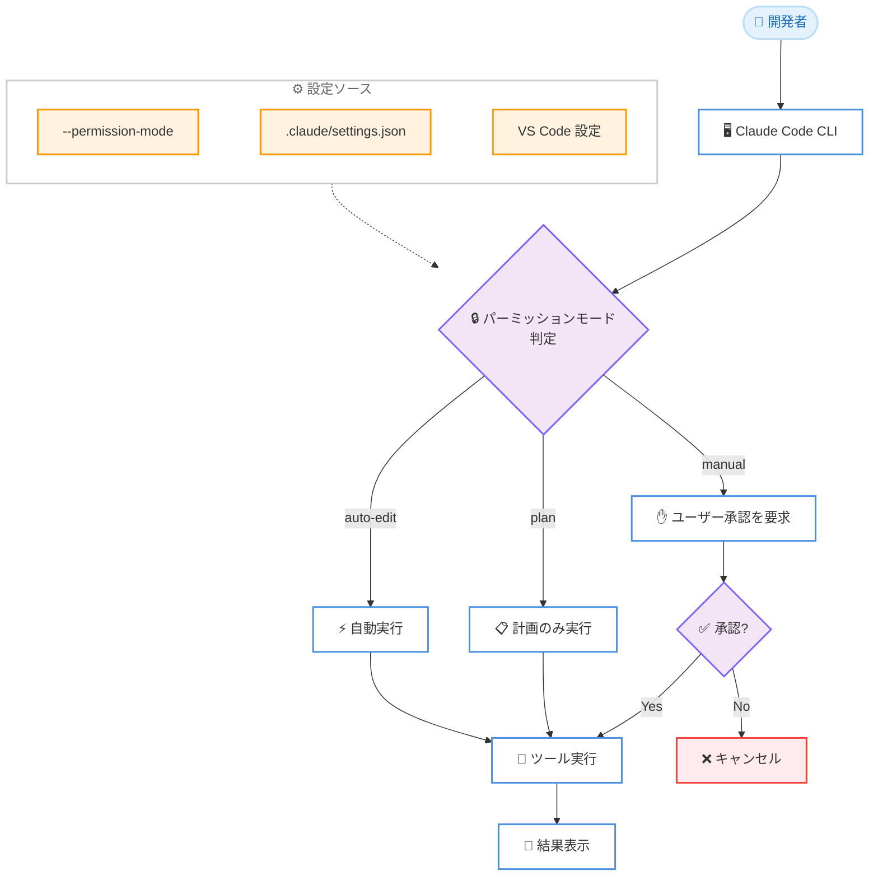

# Claude Code v2.1.200 / v2.1.201 アップデート: パーミッションモード名称変更とバックグラウンドエージェント安定性向上

## メタデータ

| 項目 | 内容 |
|------|------|
| 発表日 | 2026-07-04 |
| ソース | Claude Code Changelog |
| カテゴリ | 開発ツール / CLI |
| 公式リンク | https://github.com/anthropics/claude-code/blob/main/CHANGELOG.md |

## 概要

Claude Code v2.1.200 および v2.1.201 がリリースされた。v2.1.200 では、パーミッションモードの名称が "default" から "Manual" に統一され、バックグラウンドエージェントの安定性が大幅に改善された。また、`AskUserQuestion` ダイアログの自動継続がデフォルトで無効化され、アクセシビリティの向上も図られている。v2.1.201 では、Claude Sonnet 5 セッションにおける会話途中のシステムロールによるハーネスリマインダーが廃止された。

## 詳細

### 背景

Claude Code は CLI ベースの AI 開発アシスタントとして進化を続けている。バックグラウンドエージェント機能は v2.0 系で導入されて以来、継続的に安定性の改善が行われてきた。今回のリリースでは、スリープ/復帰後のセッション停止やデーモンロックの問題など、運用上の課題が包括的に修正されている。

また、パーミッションモードについては、従来 "default" という名称が使われていたが、実際の動作が「手動承認」であることを明確にするため "Manual" に名称変更された。

### 主な変更点

#### 破壊的変更 / 動作変更

1. **パーミッションモード名称変更**: "default" モードが "Manual" に統一された。CLI、`--help`、VS Code、JetBrains のすべてで表記が変更されている。互換性のため `--permission-mode default` および `"defaultMode": "default"` は引き続き受け付けられる。

2. **AskUserQuestion の自動継続無効化**: `AskUserQuestion` ダイアログがデフォルトで自動継続しなくなった。アイドルタイムアウトによる自動継続を利用したい場合は `/config` から明示的にオプトインする必要がある。

3. **Sonnet 5 ハーネスリマインダー方式変更** (v2.1.201): Claude Sonnet 5 セッションでは、会話途中のシステムロールによるハーネスリマインダーが使用されなくなった。これによりコンテキストウィンドウの効率的な利用が期待される。

#### バグ修正: バックグラウンドエージェント

バックグラウンドエージェントに関する複数の重大なバグが修正された。

- スリープ/復帰後やストールしたセッションの再開時にセッションが無言で停止する問題
- Esc でキャンセルしたターンがストール復帰後に再実行される問題
- クラッシュ後に残った古い `daemon.lock` の PID が OS に再利用され、エージェントが再起動不能になる問題
- 再インストールされた古いビルドがデーモンを奪取する問題 (ビルドタイムスタンプによるバージョン判定を導入)
- ロスター (エージェント一覧) の一時的な破損がオーファンクリーンアップを永久に無効化する問題
- 古いバイナリが新しいバージョンのフィールドを保持しない問題
- デーモン再起動時にソケット認証トークンが削除される問題
- バックグラウンドエージェント出力の制御バイトがターミナルに表示される問題

#### バグ修正: その他

- `.claude.json` の `disabledMcpServers` または `enabledMcpServers` が非配列値の場合の起動時クラッシュ
- レートリミットで切断されたサブエージェントが空の結果を返す問題 (適切にエラーとして処理されるようになった)
- `claude agents --plugin-dir <dir>` でフラグが `agents` の後に配置された場合にプラグインが表示されない問題
- 同一リポジトリの git worktree からプロジェクトスコーププラグインが正しく読み込まれない問題
- `/mcp` サーバーリストがスクリーンリーダーおよび拡大鏡のフォーカスを追跡しない問題
- 音声入力で音声が検出されない場合に誤解を招くエラーメッセージが表示される問題
- tmux 3.4 以上でのレンダリングフリッカー

#### 改善

- **アクセシビリティ向上**: 装飾グリフがスクリーンリーダーから隠され、トランスクリプトシンボルが短いラベルとして読み上げられ、ネストされたテーブルが `Header: value.` 形式で読み上げられるようになった
- **インストールスクリプト改善**: システムのメモリ不足でインストールが強制終了された場合に理由が説明されるようになった

### 技術的な詳細

#### パーミッションモードの内部実装

パーミッションモード "Manual" は、ツール実行前にユーザーの明示的な承認を要求する動作を行う。名称変更にあたり、後方互換性が維持されている。

- CLI フラグ: `--permission-mode manual` (推奨) / `--permission-mode default` (互換)
- 設定ファイル: `"defaultMode": "manual"` (推奨) / `"defaultMode": "default"` (互換)

#### バックグラウンドデーモンの改善

デーモンハンドオーバーの判定ロジックが強化された。従来はバイナリパスやバージョン文字列で判定していたが、ビルドに埋め込まれたタイムスタンプを使用することで、再インストール時の古いビルドによるデーモン奪取を防止する。

## 開発者への影響

### 対象

- Claude Code CLI を使用するすべての開発者
- バックグラウンドエージェント機能を利用しているチーム
- CI/CD パイプラインで Claude Code を使用しているプロジェクト
- アクセシビリティ機能を必要とするユーザー

### 必要なアクション

1. **パーミッションモード設定の確認**: `--permission-mode default` を使用している場合、`--permission-mode manual` への移行を推奨。現時点では互換性が維持されているが、将来的に "default" が非推奨になる可能性がある。

2. **AskUserQuestion の動作確認**: 自動継続に依存したワークフローがある場合、`/config` からアイドルタイムアウトを設定する。

3. **`.claude.json` の検証**: `disabledMcpServers` や `enabledMcpServers` が配列であることを確認する。

### 移行ガイド

パーミッションモードの名称変更に対応するための手順を以下に示す。

**CLI 引数の場合:**

```bash
# 変更前
claude --permission-mode default

# 変更後 (推奨)
claude --permission-mode manual
```

**設定ファイルの場合:**

```json
// 変更前
{
  "defaultMode": "default"
}

// 変更後 (推奨)
{
  "defaultMode": "manual"
}
```

**CI/CD スクリプトの場合:**

既存の `default` 指定は引き続き動作するため、即時の変更は不要。ただし、新しいスクリプトでは `manual` を使用すること。

## コード例

```bash
# パーミッションモードを Manual で起動
claude --permission-mode manual

# AskUserQuestion のアイドルタイムアウトを設定
claude /config
# 設定画面で "idle timeout" を有効化

# バックグラウンドエージェントの状態確認
claude agents

# プラグインディレクトリを指定してエージェント一覧を表示
claude agents --plugin-dir ./my-plugins

# .claude.json の正しい MCP サーバー設定
# disabledMcpServers は必ず配列で指定する
```

```json
{
  "defaultMode": "manual",
  "disabledMcpServers": ["server-a", "server-b"],
  "enabledMcpServers": ["server-c"]
}
```

## アーキテクチャ図



## 関連リンク

- [Claude Code Changelog](https://github.com/anthropics/claude-code/blob/main/CHANGELOG.md)
- [Claude Code ドキュメント](https://docs.anthropic.com/en/docs/claude-code)
- [Claude Code GitHub リポジトリ](https://github.com/anthropics/claude-code)

## まとめ

Claude Code v2.1.200 / v2.1.201 は、安定性とユーザビリティの両面で重要な改善を含むリリースである。特に注目すべき点は以下の 3 つ。

1. **パーミッションモードの明確化**: "default" から "Manual" への名称変更により、動作の意味が直感的に理解しやすくなった。後方互換性は維持されているが、早めの移行が推奨される。

2. **バックグラウンドエージェントの安定性向上**: スリープ/復帰、デーモンクラッシュ、バージョン競合など、実運用で遭遇しうる多数のエッジケースが修正された。長時間稼働する開発環境での信頼性が大幅に向上している。

3. **アクセシビリティとプラットフォーム互換性**: スクリーンリーダー対応の改善、tmux 3.4 以上でのフリッカー修正など、多様な開発環境での利用体験が向上した。

v2.1.201 の Sonnet 5 ハーネスリマインダー変更は小さな変更に見えるが、コンテキストウィンドウの効率的な利用に寄与する改善であり、長い会話セッションでのパフォーマンス向上が期待される。
