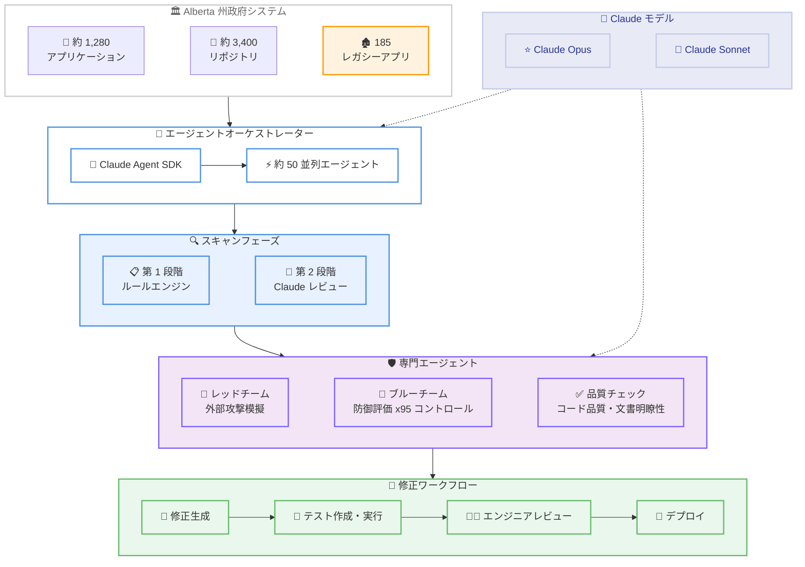

# Alberta 州政府が Claude を活用し政府システム全体のサイバーセキュリティ脆弱性を発見・修正

## メタデータ

| 項目 | 内容 |
|------|------|
| 発表日 | 2026-07-06 |
| ソース | Anthropic News |
| カテゴリ | ケーススタディ / セキュリティ |
| 公式リンク | https://www.anthropic.com/news/alberta-government-claude-cybersecurity |

## 概要

カナダ Alberta 州の技術革新省 (Ministry of Technology and Innovation) が、Claude Code (Opus および Sonnet モデル) を活用して州政府システム全体のサイバーセキュリティ脆弱性を特定・修正した事例が発表された。27 の州省庁にわたる約 1,280 のアプリケーションと 3,400 のコードリポジトリを対象に、約 50 の自律エージェントが並列稼働し、4 億 6,600 万行のコードをわずか 20 時間でスキャンした。従来の手動アプローチでは約 6.5 年を要すると見積もられていた作業である。

## 詳細

### 背景

Alberta 州の技術革新省は、27 の州省庁 (社会福祉、公共安全、山火事対応など) のシステムを維持管理している。これらのシステムには税務記録、政府調達データ、社会福祉のケースファイルが含まれており、数十億ドル規模の技術的負債が蓄積されていた。大部分のコードは、この取り組み以前には体系的なセキュリティレビューを一度も受けたことがなかった。本プロジェクトは 2025 年に開始された。

### 主な変更点

1. **大規模自動スキャン**: 約 50 の自律エージェントが並列で全リポジトリをスキャン
2. **圧倒的な効率化**: 4 億 6,600 万行のコードを 20 時間でスキャン (手動推定: 約 6.5 年)
3. **レガシーアプリケーション再構築**: 約 25 年前に 5 ヶ月かけて構築された Java 製補助金プログラムポータルを 4-5 日で再構築
4. **専門エージェント**: レッドチームエージェントとブルーチームエージェントによる攻防両面からの評価
5. **将来計画**: 185 のレガシーアプリケーションを 16 のモダンな再利用可能アプリケーションに統合

### 技術的な詳細

**スキャン手法 (2 段階アプローチ):**

- **第 1 段階**: ルールエンジンスキャンにより既知の脆弱性パターンをフラグ付け
- **第 2 段階**: Claude が各フラグをレビューし、正確なファイルと行番号を特定して開発者が検証可能にする

**修正プロセス:**

- Claude Code が修正を生成、テスト、ビルド
- 自動テストが不足している箇所では、パッチ適用前にまずテストを作成
- 老朽化した複雑なコードはモダンで保守しやすい言語で再構築
- すべてのパッチは省庁のエンジニアがレビュー・承認後に適用

**専門エージェント構成:**

- **レッドチームエージェント**: 外部から攻撃者を模擬してアプリケーションを探査し、脆弱性がどのように悪用されるかをマッピング
- **ブルーチームエージェント**: 国際セキュリティ基準に対してアプリケーションの防御を評価し、修正すべきファイルを特定した修正計画を作成 (パスあたり約 95 のセキュリティコントロールをチェック)
- **追加エージェント**: コード品質と公開文書の明瞭性をチェック
- **基盤技術**: Claude Agent SDK 上に構築

## 開発者への影響

### 対象

- 政府機関のシステム管理者およびセキュリティ担当者
- レガシーシステムの近代化に取り組む開発チーム
- AI を活用したセキュリティ自動化に関心のある組織
- 公共セクターの IT リーダー

### 必要なアクション

- **公共セクター**: Alberta 州が公開した技術ホワイトペーパー ([thevelocitywhitepapers.com](https://thevelocitywhitepapers.com)) を参照し、同様のアプローチの導入を検討
- **セキュリティチーム**: レッドチーム / ブルーチームエージェントの構成を参考に、自組織のセキュリティ評価ワークフローへの AI 統合を検討
- **レガシーシステム保有組織**: マルチエージェントによるコードスキャンと近代化アプローチの適用可能性を評価

### 移行ガイド (該当する場合)

Alberta 州は技術ホワイトペーパーを公開しており、他の政府機関が同様の技術的負債とセキュリティ課題に対処するためのブループリントとして利用できる。

**主要ステップ:**

1. 対象リポジトリの棚卸しと優先順位付け
2. Claude Agent SDK を用いたスキャンエージェントの構築
3. ルールエンジン + AI レビューの 2 段階スキャン実装
4. レッドチーム / ブルーチーム専門エージェントの配備
5. 修正の自動生成と人間によるレビュープロセスの確立
6. レガシーアプリケーションの統合・近代化計画の策定

## コード例

```python
# Claude Agent SDK を用いたセキュリティスキャンエージェントの概念例
# (Alberta 州の実装を参考にした概念的なコード)

from claude_agent_sdk import Agent, AgentOrchestrator

# レッドチームエージェントの定義
red_team_agent = Agent(
    name="red_team",
    model="claude-opus-4-6",
    system_prompt="""You are a red team security agent.
    Probe the target application externally and map how
    vulnerabilities might be exploited. Report findings with
    exact file paths and line numbers.""",
    tools=["web_scanner", "endpoint_mapper", "vulnerability_db"]
)

# ブルーチームエージェントの定義
blue_team_agent = Agent(
    name="blue_team",
    model="claude-opus-4-6",
    system_prompt="""You are a blue team security agent.
    Assess application defenses against ~95 security controls
    per pass. Write remediation plans pointing to exact files
    to fix.""",
    tools=["code_reader", "security_controls_db", "remediation_planner"]
)

# オーケストレーターで並列実行
orchestrator = AgentOrchestrator(
    agents=[red_team_agent, blue_team_agent],
    parallel_workers=50,
    model="claude-sonnet-4-6"
)

# リポジトリスキャンの実行
results = orchestrator.scan_repositories(
    repos=government_repositories,  # ~3,400 repositories
    security_controls=95
)
```

## アーキテクチャ図



## 関連リンク

- [Anthropic 公式発表](https://www.anthropic.com/news/alberta-government-claude-cybersecurity)
- [技術ホワイトペーパー](https://thevelocitywhitepapers.com)
- [Edmonton Industry Day イベント](https://luma.com/yzd00tir)
- [Claude Agent SDK ドキュメント](https://docs.anthropic.com/en/docs/agents-and-tools/claude-agent-sdk)
- [Claude Code](https://docs.anthropic.com/en/docs/claude-code)

## まとめ

Alberta 州政府による Claude の活用事例は、AI がサイバーセキュリティと政府システムの近代化においてもたらす変革的なインパクトを示している。

**主要な成果:**

- **466 million 行**のコードを **20 時間**でスキャン (従来推定: 6.5 年)
- 約 **50** の自律エージェントが並列稼働
- 25 年前のレガシー Java アプリを **4-5 日**で再構築
- パスあたり **95** のセキュリティコントロールを評価

Nate Glubish 技術革新大臣の言葉:

> "By using AI to find and fix vulnerabilities across our systems, we accomplished in hours what would have taken a traditional approach years to complete."
> (AI を使ってシステム全体の脆弱性を発見・修正することで、従来のアプローチでは数年かかるところを数時間で達成した)

Alberta 州は今後、185 のレガシーアプリケーションを 16 のモダンな再利用可能アプリケーションに統合する計画を進めており、AI Academy を通じて数千人の政府職員と 10,000 人以上の市民にトレーニングを提供している。この取り組みは技術ホワイトペーパーとして公開されており、他の政府機関が同様の課題に対処するためのブループリントとなっている。
