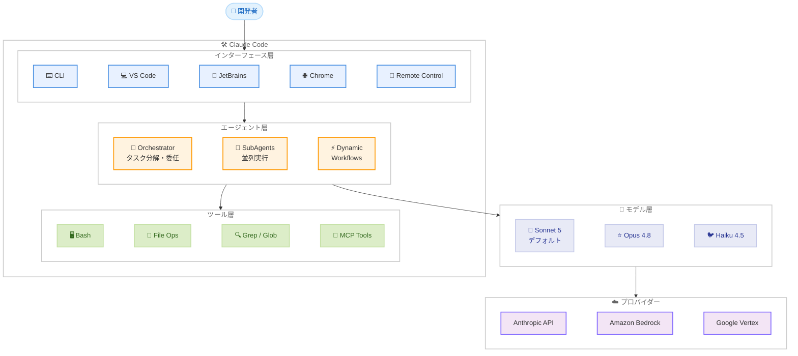

# The Making of Claude Code -- 社内 CLI ツールから Anthropic のフラッグシップコーディングエージェントへの進化の軌跡

## メタデータ

| 項目 | 内容 |
|------|------|
| 発表日 | 2026-07-06 |
| ソース | [Anthropic Features](https://www.anthropic.com/features) |
| カテゴリ | Feature / 開発ストーリー |
| 公式リンク | [The Making of Claude Code](https://www.anthropic.com/features/making-of-claude-code) |

## 概要

2026 年 7 月 6 日、Anthropic は「The Making of Claude Code」と題した記事を公開しました。これは Claude Code が社内で使われていた小さな CLI ツールから、200 以上のバージョンを重ね Anthropic のフラッグシップコーディングエージェント製品へと進化した道のりを、研究者、エンジニア、そして初期ユーザーの視点から描いたインサイドストーリーです。

Claude Code は現在 v2.1.204 に到達しており、バックグラウンドエージェント、サブエージェント、ダイナミックワークフロー、MCP 統合、VS Code 拡張、JetBrains プラグイン、Chrome 統合、Remote Control (モバイル / ウェブ) など、幅広い機能を備えた包括的な開発者プラットフォームとなっています。

## 詳細

### 背景

Claude Code の始まりは、Anthropic 社内のエンジニアが日常のコーディング作業を効率化するために作成したシンプルな CLI ツールでした。当初は社内ツールとして使われていたこのプロジェクトが、外部に公開され、急速に進化を遂げたことで、Anthropic の主力開発者向け製品のひとつとなりました。

この記事は、その変遷に関わった研究者、エンジニア、アーリーユーザーたちが語る「開発の裏側」を伝えるものです。Anthropic が「Building Effective Agents」で提唱した「シンプルで構成可能なパターン」という設計哲学が、Claude Code の成長にどのように反映されたかを示しています。

### Claude Code の進化の軌跡

#### フェーズ 1: 社内ツールとしての誕生

Claude Code は当初、Anthropic のエンジニアが自身のワークフローを加速させるために開発した内部プロジェクトとして始まりました。ターミナルベースのインターフェースは、開発者の自然な作業環境に溶け込む設計思想を反映しています。

#### フェーズ 2: 公開と急速な反復

パブリックリリース後、Claude Code は驚異的なペースで進化を続けました。200 以上のバージョンがリリースされ、コミュニティからのフィードバックを取り入れながら機能を拡充していきました。GitHub リポジトリは 137,000 以上のスターを獲得し、22,000 以上のフォークが作られるなど、開発者コミュニティからの強い支持を受けています。

#### フェーズ 3: マルチエージェントプラットフォームへの進化

単一セッションの CLI ツールから、マルチエージェントオーケストレーションプラットフォームへと進化しました。サブエージェントの導入 (最大 5 階層のネスト)、ダイナミックワークフロー (数十から数百のエージェントを協調動作)、バックグラウンドエージェントのデフォルト化など、エージェントアーキテクチャが大幅に拡張されました。

#### フェーズ 4: マルチプラットフォーム展開

CLI だけでなく、VS Code 拡張、JetBrains プラグイン、Chrome 統合、Remote Control (モバイル / ウェブ) へと展開し、開発者がどこからでも Claude Code にアクセスできる環境を構築しました。

### 主な技術的マイルストーン

Claude Code の進化における重要なマイルストーンは以下のとおりです。

| バージョン | マイルストーン |
|-----------|---------------|
| 初期バージョン | 社内 CLI ツールとしての誕生、基本的なファイル操作とコード生成 |
| MCP 統合 | Model Context Protocol による外部ツール連携の実現 |
| VS Code / JetBrains | IDE 統合による開発者体験の拡張 |
| v2.1.154 | ダイナミックワークフローの導入、Opus 4.8 のデフォルト化 |
| v2.1.170 | Claude Fable 5 対応 |
| v2.1.172 | ネストされたサブエージェント (最大 5 階層) |
| v2.1.197 | Claude Sonnet 5 をデフォルトモデルに採用、ネイティブ 1M トークンコンテキスト |
| v2.1.198 | バックグラウンドサブエージェントのデフォルト化、Claude in Chrome GA |
| v2.1.204 | 現在の最新バージョン |

### 設計哲学

Claude Code の開発は、Anthropic が「Building Effective Agents」で示した以下の原則に基づいています。

1. **シンプルで構成可能なパターン**: 複雑なフレームワークではなく、組み合わせ可能なシンプルなパターンを採用
2. **透明性**: 計画ステップを表示し、モデルの判断過程を可視化
3. **Agent-Computer Interface の洗練**: ツールのドキュメントとテストを徹底し、構造的にミスを防ぐ設計 (Poka-yoke)
4. **段階的な複雑性の追加**: 最もシンプルなソリューションから始め、測定可能な改善がある場合のみ複雑性を追加

### 技術的な詳細

#### アーキテクチャの特徴

Claude Code は「Orchestrator-Workers」パターンを中核に据えたアーキテクチャを採用しています。中央の LLM がタスクを動的に分解し、ワーカー LLM に委任するこの構造は、「複数のファイルにまたがる複雑な変更を毎回行うコーディング製品」に最適なパターンとして Anthropic 自身が推奨しているものです。

主要な技術要素は以下のとおりです。

- **ツール実行環境**: Bash、ファイル読み書き、Glob、Grep など、開発者の自然なワークフローを再現するツール群
- **MCP 統合**: OAuth 対応の MCP サーバー管理、マネージド MCP ポリシーによるエンタープライズ制御
- **マルチエージェントオーケストレーション**: バックグラウンドデーモン、Worktree 分離、クラッシュリカバリ
- **エンタープライズ機能**: マネージド設定、組織レベルのモデル制限、パーミッションモード
- **マルチプロバイダー対応**: Direct API、Amazon Bedrock、Google Vertex、Foundry をサポート

#### 現在の製品構成

| 提供形態 | 説明 |
|----------|------|
| CLI | スタンドアロンのコマンドラインインターフェース |
| VS Code 拡張 | Visual Studio Code 内からの統合利用 |
| JetBrains プラグイン | IntelliJ 系 IDE への統合 |
| Chrome 統合 | ブラウザから直接 Claude Code を操作 |
| Remote Control | モバイル / ウェブからのリモート操作 |

## 開発者への影響

### 対象

- AI コーディングエージェントに関心のあるすべての開発者
- Claude Code を既に利用している開発者
- エージェントアーキテクチャの設計に携わるエンジニア
- 開発者ツールの進化に関心のあるプロダクトマネージャー

### エージェント製品設計への示唆

Claude Code の開発ストーリーは、エージェント型製品の構築に関する以下の実践的な教訓を提供しています。

1. **内部利用から始める**: 自社のエンジニアが日常的に使うツールとして開発し、フィードバックループを短く保つ
2. **シンプルから始めて漸進的に拡張する**: 基本的な CLI から始め、ユーザーのニーズに応じて機能を追加
3. **開発者の既存ワークフローを尊重する**: ターミナル、IDE、ブラウザなど、開発者が既に使っている環境に統合
4. **ACI 設計に投資する**: プロンプトよりもツールの最適化に時間をかける
5. **高速な反復を維持する**: 200 以上のバージョンをリリースする継続的な改善サイクル

### 必要なアクション

この記事は開発ストーリーの紹介であり、既存ユーザーに必要な技術的アクションはありません。ただし、以下の活用が推奨されます。

- Claude Code を未導入の場合は `npm install -g @anthropic-ai/claude-code` でインストールして体験
- 既存ユーザーは `claude update` で最新バージョン (v2.1.204) へアップデート
- エージェント設計に携わるエンジニアは「Building Effective Agents」の原則を参照

## コード例

### Claude Code のインストールと基本利用

```bash
# インストール
npm install -g @anthropic-ai/claude-code

# 基本的な対話開始
claude

# 特定のプロンプトで実行
claude "このプロジェクトの構造を説明してください"

# バックグラウンドエージェントとして実行
claude --background "テストを修正して全て通るようにしてください"
```

### CLAUDE.md によるプロジェクト設定

```markdown
# CLAUDE.md

## プロジェクト概要
このプロジェクトは TypeScript で書かれた Web アプリケーションです。

## コーディング規約
- ESLint と Prettier を使用
- テストは Vitest で記述
- コミットメッセージは Conventional Commits 形式

## ビルドコマンド
- `npm run build` - プロダクションビルド
- `npm run test` - テスト実行
- `npm run lint` - リント実行
```

## アーキテクチャ図

### Claude Code の進化タイムライン

```mermaid
flowchart LR
    subgraph Phase1["フェーズ 1: 誕生"]
        direction LR
        Internal["🏠 社内 CLI ツール<br/>基本的なコード生成"]
    end

    subgraph Phase2["フェーズ 2: 公開"]
        direction LR
        Public["🌍 パブリックリリース<br/>急速な反復"]
        MCP["🔌 MCP 統合<br/>外部ツール連携"]
        Public ~~~ MCP
    end

    subgraph Phase3["フェーズ 3: マルチエージェント"]
        direction LR
        SubAgent["🤖 サブエージェント<br/>5 階層ネスト"]
        Workflow["⚡ ダイナミック<br/>ワークフロー"]
        Background["🔄 バックグラウンド<br/>エージェント"]
        SubAgent ~~~ Workflow ~~~ Background
    end

    subgraph Phase4["フェーズ 4: プラットフォーム"]
        direction LR
        VSCode["💻 VS Code"]
        JetBrains["🧩 JetBrains"]
        Chrome["🌐 Chrome"]
        Remote["📱 Remote Control"]
        VSCode ~~~ JetBrains ~~~ Chrome ~~~ Remote
    end

    Phase1 -->|公開| Phase2
    Phase2 -->|拡張| Phase3
    Phase3 -->|展開| Phase4

    classDef phase fill:none,stroke:#CCCCCC,stroke-width:2px,color:#666666
    classDef early fill:#E8EAF6,stroke:#C5CAE9,stroke-width:2px,color:#283593
    classDef growth fill:#E9F7EC,stroke:#66BB6A,stroke-width:2px,color:#333333
    classDef agent fill:#FFF3E0,stroke:#FF9800,stroke-width:2px,color:#333333
    classDef platform fill:#E8F1FF,stroke:#4A90E2,stroke-width:2px,color:#333333

    class Phase1,Phase2,Phase3,Phase4 phase
    class Internal early
    class Public,MCP growth
    class SubAgent,Workflow,Background agent
    class VSCode,JetBrains,Chrome,Remote platform
```



### Claude Code のアーキテクチャ構成



## 関連リンク

- [The Making of Claude Code](https://www.anthropic.com/features/making-of-claude-code) -- 公式記事
- [Claude Code GitHub リポジトリ](https://github.com/anthropics/claude-code) -- ソースコードと Changelog
- [Claude Code ドキュメント](https://code.claude.com/docs/en/best-practices) -- ベストプラクティス
- [Building Effective Agents](https://www.anthropic.com/research/building-effective-agents) -- Anthropic のエージェント設計ガイド
- [Claude Sonnet 5 発表](https://www.anthropic.com/news/claude-sonnet-5) -- Claude Code のデフォルトモデル

## まとめ

「The Making of Claude Code」は、Anthropic 社内の小さな CLI ツールがいかにして同社のフラッグシップ開発者製品へと成長したかを描く開発ストーリーです。200 以上のバージョンリリースを経て、Claude Code は単なるコード生成ツールから、マルチエージェントオーケストレーション、ダイナミックワークフロー、マルチプラットフォーム統合を備えた包括的なコーディングエージェントプラットフォームへと進化しました。

この記事が示す最も重要な教訓は、「シンプルから始め、ユーザーのフィードバックに基づいて漸進的に拡張する」という設計哲学です。Claude Code は、Anthropic 自身が提唱する「Building Effective Agents」の原則を体現した製品であり、エージェント型開発ツールの可能性を示すケーススタディとなっています。

GitHub で 137,000 以上のスターを獲得し、CLI、VS Code、JetBrains、Chrome、Remote Control と多様な提供形態で展開される Claude Code は、AI 支援開発の新しいスタンダードを定義しつつあります。
