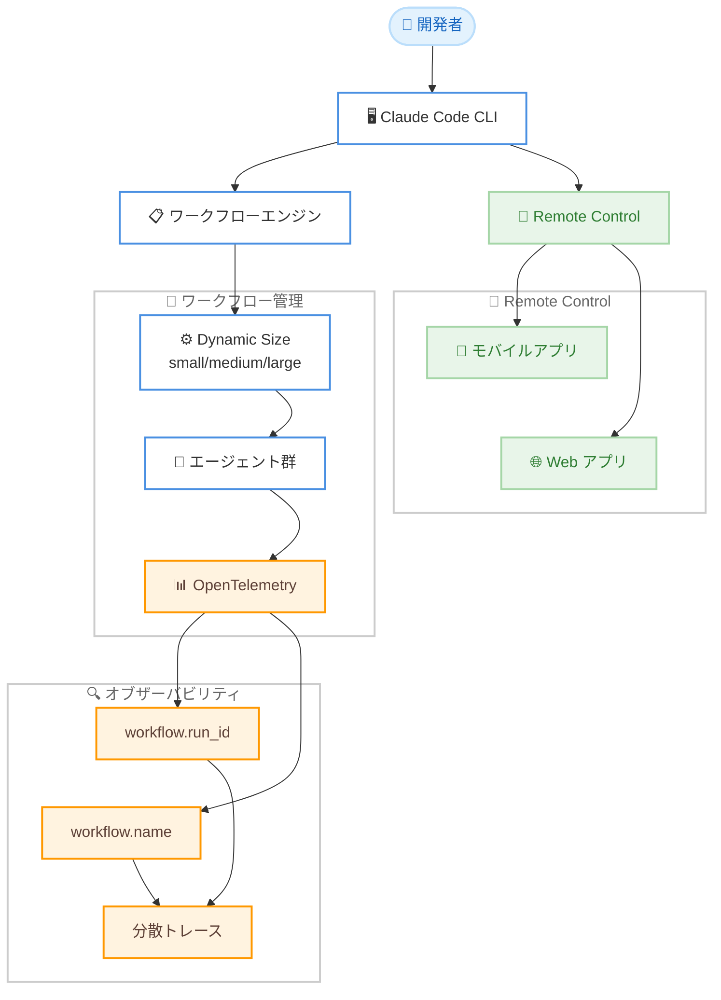

# Claude Code v2.1.202 アップデート: ワークフロー管理強化と Remote Control 安定性向上

## メタデータ

| 項目 | 内容 |
|------|------|
| 発表日 | 2026-07-07 |
| ソース | Claude Code Changelog |
| カテゴリ | Claude Code アップデート |
| 公式リンク | https://github.com/anthropics/claude-code/blob/main/CHANGELOG.md |

## 概要

Claude Code v2.1.202 がリリースされた。本バージョンでは、ワークフロー管理に関する新機能として「Dynamic workflow size」設定と OpenTelemetry 属性の追加が行われたほか、Remote Control (モバイル/Web) 経由の操作に関する複数の不具合が修正された。バックグラウンドエージェントのセッション管理や音声入力の安定性も改善されており、日常的な開発ワークフローの信頼性が向上している。全体として 18 項目の変更 (新機能 2、バグ修正 13、改善 3) を含む安定性重視のリリースである。

## 詳細

### 背景

Claude Code のワークフロー機能は、複数のエージェントを並列に起動して大規模なタスクを分割処理する仕組みである。これまでワークフロー実行時のエージェント数はシステムが自動的に決定していたが、ユーザーがプロジェクトの規模や計算リソースに応じて調整したいというニーズがあった。また、ワークフロー実行のオブザーバビリティについても、個々のエージェントの活動をワークフロー単位で集約する手段が不足していた。

Remote Control 機能 (モバイルや Web からセッションを操作する機能) は近年追加された比較的新しい機能であり、コマンド送信、ファイル/画像送信、パーミッション表示などの基本的な操作に複数の不具合が存在していた。本リリースではこれらが包括的に修正されている。

### 主な変更点

#### 新機能

1. **Dynamic workflow size 設定**: `/config` から「Dynamic workflow size」を設定可能になった。small / medium / large の 3 段階でワークフロー実行時のエージェント数の目安を制御できる。これはあくまでもアドバイザリーなガイドラインであり、厳密なキャップではない。

2. **OpenTelemetry 属性の追加**: ワークフローから生成されたエージェントのテレメトリに `workflow.run_id` および `workflow.name` 属性が追加された。これにより、OTel データからワークフロー実行全体のアクティビティを再構成できるようになった。

#### バグ修正: Remote Control

Remote Control (モバイル/Web アプリ) に関する 3 件の修正が含まれる。

- インタラクティブセッションへのコマンド送信が "Unknown command" エラーで失敗する問題の修正
- キャプションなしで送信された画像やファイルがサイレントにドロップされる問題の修正
- `/remote-control` セッションでモバイル/Web アプリに誤ったパーミッションモードが表示される問題の修正

#### バグ修正: バックグラウンドエージェント / セッション管理

- `/rename` でバックグラウンドセッションの名前を変更しても、ジョブ再起動時に元の名前に戻ってしまう問題の修正
- `claude agents` からチャットを開く際に "currently running as a background agent" エラーとワーカーのクラッシュ/リスポーンループが発生する問題の修正
- セッション名による再開やリジュームピッカーの表示が、多数の git worktree を持つリポジトリで数分かかり大量のメモリを消費する問題の修正

#### バグ修正: その他

- インライン `Ctrl+R` 履歴検索で、スキャン中に確定またはキャンセルするとクラッシュする問題の修正
- 設定の再適用中にインプレースクライアント証明書ローテーションが行われた場合の一時的な mTLS ハンドシェイク失敗の修正
- `claude auth login` / `claude mcp login --no-browser` で表示されるサインイン URL が SSH 上で折り返された場合にクリック不能になる問題の修正 (単一のハイパーリンクとして出力されるようになった)
- ワークフロースクリプト内の Unicode クォートエスケープが解析前に破損する問題の修正。ワークフローの解析エラーが常に TypeScript を原因として表示するのではなく、問題のある行を表示するようになった
- 音声入力でマイクまたはオーディオレコーダーが失敗した場合に無制限にリトライを繰り返す問題の修正。キャプチャ失敗が繰り返された場合は音声入力が一時停止されるようになった
- インストーラー/アップデーターのダウンロードが、プロキシやネットワークが接続を中断した際に即座に "aborted" で失敗する問題の修正。一時的な接続断がリトライされるようになった
- 既に読み込まれたスキルを再呼び出しした際に、指示のコピーがコンテキストに重複追加される問題の修正

#### 改善

- **`/workflows` エージェントリスト表示の改善**: タイトル幅の拡大、専用の時間カラム追加、モデル名の短縮、行ごとのツールコール数の非表示化
- **MCP エラーメッセージの改善**: サーバー設定に `url` があるが `type` がない場合のエラーが明確化され、誤解を招く "command: expected string" の代わりに `"type": "http"` の追加を提案するようになった
- **`/review` コマンドの動作変更**: `/review <pr>` が高速な単一パスレビューに戻された。マルチエージェントレビューを利用する場合は `/code-review <level> <pr#>` を使用する

### 技術的な詳細

#### Dynamic workflow size の仕組み

`/config` で設定する Dynamic workflow size は、ワークフローエンジンがタスクを分割する際の参考値として使用される。

| 設定値 | 説明 |
|--------|------|
| small | 少数のエージェントで実行。リソース消費を抑えたい場合に有用 |
| medium | バランスの取れたエージェント数 (デフォルト) |
| large | 多数のエージェントを起動し、大規模タスクの並列処理を最大化 |

この設定は厳密なキャップではなく、ワークフローエンジンへのヒントとして機能する。タスクの性質によっては指定値と異なるエージェント数が使用される場合がある。

#### OpenTelemetry 属性

ワークフローから生成されたエージェントのスパンに以下の属性が付与される。

| 属性名 | 型 | 説明 |
|--------|------|------|
| `workflow.run_id` | string | ワークフロー実行を一意に識別する ID |
| `workflow.name` | string | ワークフローの名前 |

これにより、分散トレーシングツール (Jaeger、Honeycomb、Datadog など) でワークフロー単位のトレースを可視化・分析できるようになった。

#### mTLS ハンドシェイク失敗の修正

設定が再適用されるタイミングでクライアント証明書のインプレースローテーションが発生した場合、一時的にハンドシェイクが失敗する競合状態が存在していた。本修正により、証明書の切り替え中もコネクションの確立が適切にリトライされるようになった。

## 開発者への影響

### 対象

- Claude Code CLI を使用するすべての開発者
- ワークフロー機能を活用して大規模タスクを処理しているチーム
- Remote Control (モバイル/Web) でリモートからセッションを操作しているユーザー
- OpenTelemetry でオブザーバビリティを実装しているチーム
- mTLS を使用した企業環境で Claude Code を運用しているユーザー

### 必要なアクション

1. **ワークフローのサイズ調整**: ワークフロー実行時のリソース消費が気になる場合は、`/config` から「Dynamic workflow size」を設定する。デフォルトは medium。

2. **OTel の活用**: ワークフローの監視を行っている場合、新しい `workflow.run_id` / `workflow.name` 属性を活用してダッシュボードやアラートを設定する。

3. **`/review` コマンドの利用方法変更**: マルチエージェントによる詳細なレビューを行いたい場合は、`/review` ではなく `/code-review <level> <pr#>` を使用する。

4. **Remote Control の再確認**: 以前 Remote Control でコマンド送信やファイル送信の問題を経験していた場合、本バージョンで解消されているため再度試行する。

### 移行ガイド

#### /review コマンドの変更

```bash
# 変更前: /review が多段階レビューを実行していた
/review 123

# 変更後: /review は高速な単一パスレビュー
/review 123

# マルチエージェントレビューを行いたい場合
/code-review high 123
/code-review medium 123
```

## コード例

```bash
# Dynamic workflow size を設定
claude /config
# 設定画面で "Dynamic workflow size" を選択し、small / medium / large を指定

# ワークフローの実行状況を確認
claude /workflows

# Remote Control セッションを開始
claude /remote-control

# サインイン (SSH 環境でもクリック可能な URL が表示される)
claude auth login

# MCP サーバー設定の正しい例 (url を使う場合は type: "http" が必要)
```

```json
{
  "mcpServers": {
    "my-server": {
      "type": "http",
      "url": "https://my-mcp-server.example.com/mcp"
    }
  }
}
```

## アーキテクチャ図



## 関連リンク

- [Claude Code Changelog](https://github.com/anthropics/claude-code/blob/main/CHANGELOG.md)
- [Claude Code ドキュメント](https://docs.anthropic.com/en/docs/claude-code)
- [Claude Code GitHub リポジトリ](https://github.com/anthropics/claude-code)
- [OpenTelemetry 公式ドキュメント](https://opentelemetry.io/docs/)

## まとめ

Claude Code v2.1.202 は、ワークフロー管理の柔軟性向上と Remote Control の安定性修正を柱とするリリースである。特に注目すべき点は以下の 4 つ。

1. **ワークフロー管理の進化**: Dynamic workflow size 設定により、ユーザーがワークフローの規模感を制御できるようになった。また、OpenTelemetry 属性の追加により、ワークフロー実行の可視化と分析が容易になった。企業環境でのオブザーバビリティ要件に対応する重要な改善である。

2. **Remote Control の信頼性向上**: コマンド送信、ファイル/画像送信、パーミッション表示の 3 つの不具合が修正され、モバイルや Web からのリモート操作が実用的なレベルに到達した。

3. **バックグラウンドエージェントの安定性**: セッション名の永続化、クラッシュループの修正、大規模リポジトリでのパフォーマンス改善により、長時間稼働するバックグラウンドエージェントの信頼性が向上した。

4. **開発者体験の向上**: SSH 環境でのサインイン URL のクリック対応、MCP エラーメッセージの明確化、`/workflows` レイアウトの改善など、日常的な操作のフリクションが低減された。

全体として、前バージョンに続いて安定性と運用性の向上に注力したリリースであり、Claude Code をチーム開発で本格的に活用するための基盤がさらに強化されている。
