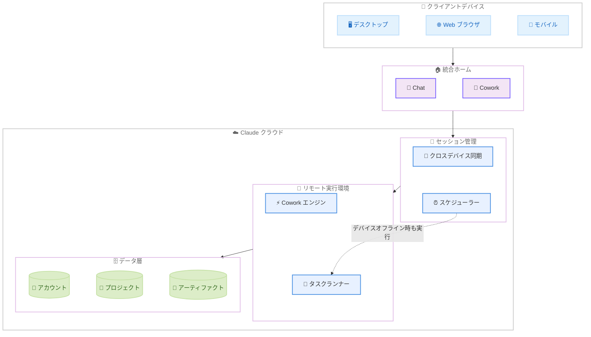
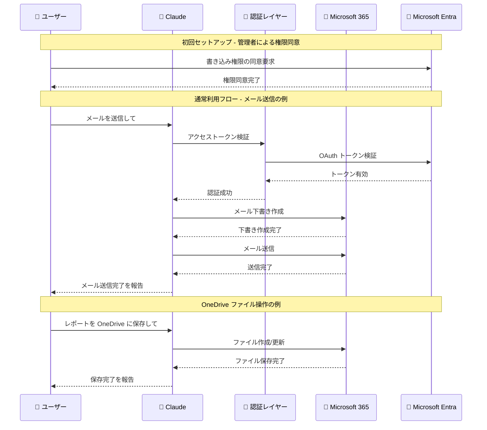

# Claude Cowork の Web/モバイル展開と Microsoft 365 コネクタの書き込みツール追加

## メタデータ

| 項目 | 内容 |
|------|------|
| 発表日 | 2026-07-07 |
| ソース | Claude Apps Release Notes |
| カテゴリ | Claude Apps アップデート |
| 公式リンク | https://support.claude.com/en/articles/12138966-release-notes |

## 概要

2026 年 7 月 7 日、Claude Apps に 2 つの重要なアップデートが発表された。第一に、従来デスクトップ専用だった Claude Cowork が Web およびモバイルに展開され、セッションがリモートで実行されるベータ機能が追加された。第二に、Microsoft 365 コネクタが読み取り専用から書き込み対応に大幅拡張され、メール送信、カレンダー管理、OneDrive/SharePoint へのファイル作成・更新が可能になった。

これらのアップデートにより、Claude はデバイスに依存しないクロスプラットフォームの生産性ツールへと進化し、エンタープライズワークフローとの統合をさらに深めている。

## 詳細

### 背景

Claude Cowork は、Claude がユーザーの作業環境で自律的にタスクを実行する機能である。従来はデスクトップアプリケーションでのみ利用可能であり、ローカルマシンのリソースに依存していたため、ラップトップを閉じるとセッションが中断されるという制約があった。

Microsoft 365 コネクタは、Claude から企業の Microsoft 365 環境にアクセスする機能として提供されてきたが、これまでは検索と読み取りのみに限定されていた。エンタープライズユーザーから、メール送信やファイル作成などの書き込み操作への対応が強く求められていた。

### 主な変更点

#### Claude Cowork on Web & Mobile

1. **マルチデバイス対応**: Cowork が Web ブラウザおよびモバイルアプリで利用可能になった。デスクトップアプリに加え、あらゆるデバイスからアクセスできる
2. **リモートセッション実行 (ベータ)**: セッションがリモートサーバー上で実行されるため、デバイスのリソースに依存しない
3. **クロスデバイス同期**: セッションとファイルが Claude アカウントに保存され、任意のデバイスからアクセス可能
4. **バックグラウンド実行**: ラップトップを閉じても作業が継続し、スケジュールされたタスクはデバイスがオフラインでも実行される
5. **統合ホーム画面**: Chat と Cowork が 1 つのホーム画面を共有し、プロジェクトとアーティファクトを一元管理できる
6. **展開計画**: Max プランから段階的にロールアウトを開始し、順次他のプランにも拡大予定

#### Microsoft 365 コネクタ書き込みツール

1. **メール操作**: メールの下書き、送信、整理が可能
2. **カレンダー管理**: カレンダーイベントの作成・更新・削除
3. **メールボックス設定**: メールボックスの設定変更
4. **ファイル操作**: OneDrive および SharePoint へのファイル作成・更新
5. **既存機能の維持**: 読み取りおよび検索ツールは従来どおり動作
6. **Teams は読み取り専用**: Teams コネクタは引き続き読み取り専用のまま

### 技術的な詳細

#### Cowork リモートセッションのアーキテクチャ

Claude Cowork のリモートセッションは、従来のローカル実行モデルからクラウドベースの実行モデルへの移行を意味する。セッション状態は Claude のサーバーサイドに保持され、ユーザーのデバイスはフロントエンドとしてのみ機能する。これにより以下の技術的利点が実現される。

- **デバイス非依存**: セッションの計算リソースがサーバー側で確保されるため、モバイル端末でもデスクトップと同等の処理が可能
- **永続セッション**: デバイスのネットワーク接続が切断されてもセッションが継続する
- **スケジュール実行**: cron のようにデバイスがオフラインの状態でもタスクを自動実行する

#### Microsoft 365 コネクタの権限モデル

書き込みツールの有効化には 2 段階の承認が必要である。

1. **Microsoft Entra 管理者による権限同意**: 更新されたパーミッションセットに対して、組織の Entra (旧 Azure AD) 管理者が同意する必要がある
2. **組織管理者による有効化**: 組織の Claude 管理者が書き込みツールを明示的に有効化する必要がある

この 2 段階モデルにより、セキュリティとコンプライアンスの要件を満たしつつ、組織全体での統制された導入が可能になる。

## アーキテクチャ図

### Cowork マルチデバイスアーキテクチャ



### Microsoft 365 書き込みツールのインタラクションフロー



## 開発者への影響

### 対象

- **Max プランユーザー**: Cowork の Web/モバイル対応が最初にロールアウトされるため、即座に新機能を利用可能
- **エンタープライズ管理者**: Microsoft 365 書き込みツールの有効化に Entra 管理者の同意と組織管理者の設定が必要
- **モバイルワーカー**: デスクトップを利用できない環境でも Cowork セッションにアクセスし、継続的に作業可能
- **Microsoft 365 利用組織**: メール自動化、カレンダー管理、ファイル操作の効率化を Claude 経由で実現可能
- **IT セキュリティチーム**: 新たな書き込み権限の評価とリスクアセスメントが必要

### 必要なアクション

**Claude Cowork on Web & Mobile:**

- Max プランユーザーは、Web ブラウザまたはモバイルアプリから Cowork 機能を試用可能
- 既存のデスクトップ Cowork セッションはクラウドに同期され、他のデバイスからアクセス可能になる
- ベータ版のため、安定性に関するフィードバックを提供することが推奨される

**Microsoft 365 コネクタ書き込みツール:**

- Microsoft Entra 管理者が更新されたパーミッションセットに同意する必要がある
- 組織の Claude 管理者が書き込みツールを有効化する必要がある
- Teams は引き続き読み取り専用のため、Teams への書き込み操作は対象外

## コード例

### Microsoft 365 コネクタ: 管理者セットアップの流れ

```powershell
# Microsoft Entra での権限同意 (PowerShell)
# Claude の Microsoft 365 コネクタ用サービスプリンシパルに対して
# 書き込み権限を付与する管理者操作の例

# 1. Azure AD モジュールのインポート
Import-Module Microsoft.Graph

# 2. 管理者としてサインイン
Connect-MgGraph -Scopes "Application.ReadWrite.All"

# 3. Claude コネクタのサービスプリンシパルを確認
$sp = Get-MgServicePrincipal -Filter "displayName eq 'Claude for Microsoft 365'"

# 4. 付与される権限の確認
# - Mail.ReadWrite (メール読み書き)
# - Mail.Send (メール送信)
# - Calendars.ReadWrite (カレンダー読み書き)
# - Files.ReadWrite.All (OneDrive/SharePoint ファイル読み書き)
# - MailboxSettings.ReadWrite (メールボックス設定)

# 5. 管理者同意の付与
# Azure Portal > Enterprise Applications > Claude for Microsoft 365
# > Permissions > Grant admin consent
```

### Claude での Microsoft 365 書き込みツール利用例

```text
# メール送信の例
ユーザー: 来週の会議について田中さんにメールを送って。
         日時は 7 月 14 日 14:00、場所は第 3 会議室。

Claude: メールを作成して送信します。

  宛先: tanaka@example.com
  件名: 来週の会議について
  本文: 来週 7 月 14 日 14:00 より第 3 会議室にて会議を実施します。
        ご参加をお願いいたします。

  メールを送信しました。

# カレンダーイベント作成の例
ユーザー: 上記の会議をカレンダーにも登録して。

Claude: カレンダーイベントを作成します。

  タイトル: 会議
  日時: 2026-07-14 14:00-15:00
  場所: 第 3 会議室
  参加者: tanaka@example.com

  カレンダーイベントを作成しました。

# OneDrive ファイル作成の例
ユーザー: 会議のアジェンダを OneDrive に保存して。

Claude: アジェンダファイルを OneDrive に作成します。

  パス: /Documents/Meetings/2026-07-14-agenda.docx
  ステータス: 作成完了
```

### Cowork セッションのクロスデバイス利用例

```text
# デスクトップで Cowork セッションを開始
ユーザー (デスクトップ): このプロジェクトのデータ分析レポートを作成して。
                       完了したら通知して。

Claude: データ分析レポートの作成を開始します。
       セッションはリモートで実行されるため、
       デバイスを閉じても作業は継続します。

# ラップトップを閉じて外出

# モバイルから同じセッションにアクセス
ユーザー (モバイル): レポートの進捗を確認したい。

Claude: データ分析レポートは 80% 完了しています。
       現在、可視化チャートの生成中です。
       推定完了時間: 約 5 分後。
```

## 関連リンク

- [Claude Apps Release Notes](https://support.claude.com/en/articles/12138966-release-notes)
- [Use Claude Cowork on web, desktop, and mobile](https://support.claude.com/)
- [Set up the Microsoft 365 connector](https://support.claude.com/)
- [Connect to Microsoft 365](https://support.claude.com/)

## まとめ

2026 年 7 月 7 日の Claude Apps アップデートは、Claude の利用範囲とエンタープライズ統合を大幅に拡張する 2 つの重要な変更を含んでいる。

第一に、**Claude Cowork のマルチデバイス展開**により、デスクトップに限定されていた自律的作業実行機能が Web とモバイルに開放された。リモートセッション実行 (ベータ) によってデバイスの計算リソースに依存せず、ラップトップを閉じても作業が継続する。スケジュールされたタスクはデバイスがオフラインでも実行されるため、真の意味での「バックグラウンド AI ワーカー」が実現された。Chat と Cowork の統合ホーム画面により、ユーザーインターフェースもシンプルになっている。Max プランからの段階的ロールアウトであるため、全ユーザーへの展開には数週間を要する。

第二に、**Microsoft 365 コネクタの書き込みツール追加**は、Claude のエンタープライズ活用を次のレベルに引き上げる。従来の読み取り・検索のみの機能から、メール送信、カレンダー管理、ファイル作成・更新という能動的な操作が可能になった。Microsoft Entra 管理者の同意と組織管理者の有効化という 2 段階の承認モデルにより、エンタープライズセキュリティの要件を満たしている。Teams が引き続き読み取り専用である点は、今後のアップデートで拡張される可能性がある。

この 2 つのアップデートを総合すると、Claude は「いつでも、どこでも、企業のワークフローと統合して働く AI アシスタント」へと進化している。特にエンタープライズ環境において、デバイスとプラットフォームの制約を超えた生産性向上が期待される。
