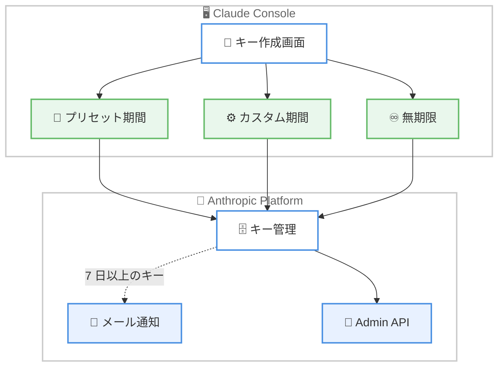

# Claude API キー有効期限設定機能を追加

## メタデータ

| 項目 | 内容 |
|------|------|
| 発表日 | 2026-07-08 |
| ソース | Claude API Release Notes |
| カテゴリ | セキュリティ / API 機能 |
| 公式リンク | https://platform.claude.com/docs/en/release-notes/overview |

## 概要

Claude Console において、API キーおよび Admin API キーの作成時に有効期限を設定できる機能が追加された。プリセット期間、カスタム期間、または「Never」(無期限) から選択可能で、有効期限が 7 日以上のキーについては期限切れ前にメール通知が送信される。既存のキーには影響がなく、破壊的変更は発生しない。

## 詳細

### 背景

API キーの管理はセキュリティにおける重要な課題である。長期間有効なキーが漏洩した場合、不正アクセスのリスクが長期化する。多くの組織ではコンプライアンス要件としてキーのローテーションポリシーを定めているが、これまで Claude API キーには有効期限を設定する仕組みがなかった。本機能の追加により、キーのライフサイクル管理がプラットフォーム側で直接サポートされるようになった。

### 主な変更点

以下の機能が追加されている。

- **有効期限の設定**: API キーまたは Admin API キーの作成時に有効期限を指定可能
- **期間選択オプション**: プリセット期間、カスタム期間、「Never」(無期限) の 3 種類から選択
- **メール通知**: 有効期限が 7 日以上のキーについて、期限切れ前に作成者へメール通知を送信
- **既存キーへの影響なし**: 既存のキーは変更されず、破壊的変更は発生しない
- **Admin API 対応**: Admin API のレスポンスに `expires_at` フィールドが追加

### 技術的な詳細

Admin API のキー一覧エンドポイントにおいて、各キーのレスポンスに `expires_at` フィールドが追加された。このフィールドは ISO 8601 形式の日時文字列で、キーの有効期限を示す。無期限のキーの場合は `null` が返される。

設定は [Claude Console](https://platform.claude.com/settings/keys) のキー作成画面から行う。



## 開発者への影響

### 対象

以下の開発者が影響を受ける。

- Claude API を利用するすべての開発者
- Admin API を使用してキー管理を自動化している組織
- セキュリティコンプライアンス要件を満たす必要のあるエンタープライズユーザー

### 必要なアクション

- **即時対応は不要**: 既存のキーには影響がないため、破壊的変更は発生しない
- **推奨アクション**: 今後作成するキーについては、適切な有効期限の設定を検討する
- **Admin API 利用者**: レスポンスに `expires_at` フィールドが追加されているため、キー管理ツールを更新して期限情報を活用することを推奨

### 移行ガイド

既存のキーに影響はないため、移行作業は不要である。新規キー作成時に以下のベストプラクティスを適用することを推奨する。

1. 本番環境のキーには 90 日程度の有効期限を設定し、定期的なローテーションを行う
2. 開発・テスト用のキーには短い有効期限 (30 日程度) を設定する
3. Admin API の `expires_at` フィールドを監視し、期限切れ前にキーのローテーションを自動化する

## コード例

Admin API のキー一覧レスポンスに `expires_at` フィールドが追加されている。

```json
{
  "id": "apikey_01ABC...",
  "name": "production-key",
  "created_at": "2026-07-08T10:00:00Z",
  "expires_at": "2026-10-08T10:00:00Z",
  "status": "active"
}
```

無期限キーの場合は以下のようになる。

```json
{
  "id": "apikey_01XYZ...",
  "name": "long-lived-key",
  "created_at": "2026-07-08T10:00:00Z",
  "expires_at": null,
  "status": "active"
}
```

## 関連リンク

- [Claude Console - API キー管理](https://platform.claude.com/settings/keys)
- [Admin API - キー一覧](https://platform.claude.com/docs/en/api/admin/api_keys/list)
- [認証ドキュメント - キー有効期限](https://platform.claude.com/docs/en/manage-claude/authentication#key-expiration)
- [Claude API リリースノート](https://platform.claude.com/docs/en/release-notes/overview)

## まとめ

Claude API キーに有効期限設定機能が追加されたことで、セキュリティ管理の強化とコンプライアンス対応が容易になった。既存のキーへの影響はなく、新規キー作成時にプリセット・カスタム・無期限のいずれかを選択できる。有効期限が 7 日以上のキーには事前通知メールが送られるため、意図しないサービス停止を防止できる。Admin API の `expires_at` フィールドを活用することで、組織全体のキーライフサイクル管理を自動化することも可能である。
