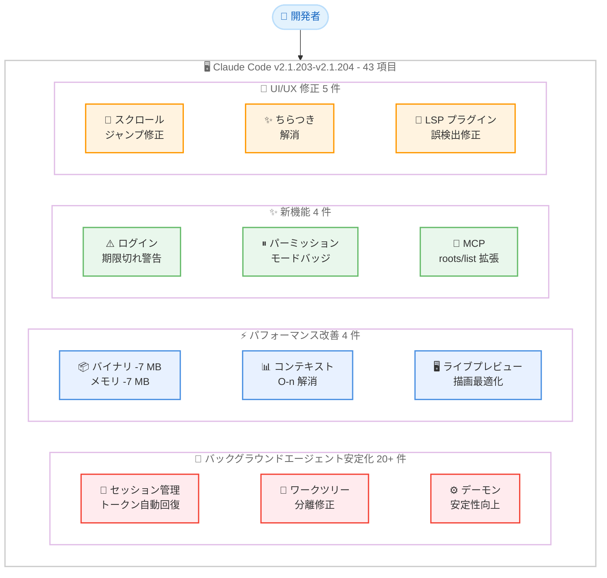
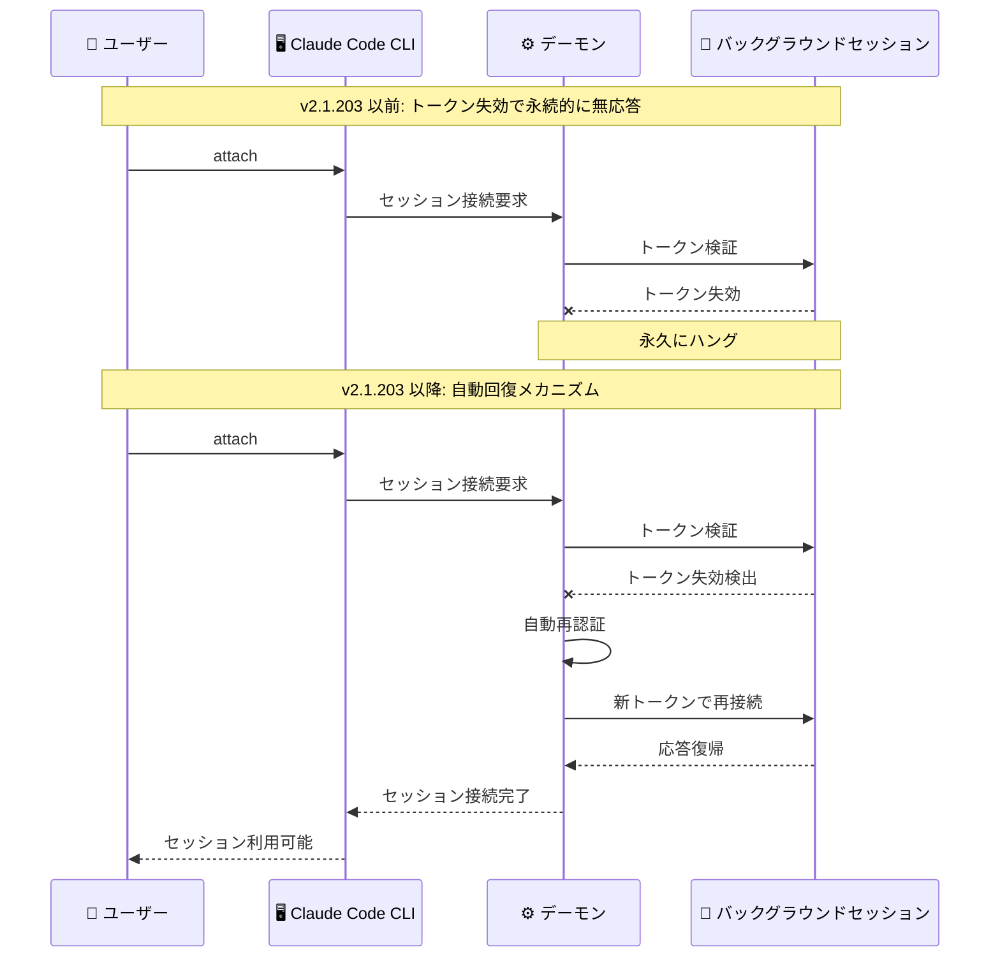

# Claude Code v2.1.203-v2.1.204 アップデート: バックグラウンドエージェントの大規模安定化とパフォーマンス改善

## メタデータ

| 項目 | 内容 |
|------|------|
| 発表日 | 2026-07-07 / 2026-07-08 |
| ソース | Claude Code Changelog |
| カテゴリ | Claude Code アップデート |
| 公式リンク | https://github.com/anthropics/claude-code/blob/main/CHANGELOG.md |

## 概要

Claude Code v2.1.203 (2026 年 7 月 7 日) および v2.1.204 (2026 年 7 月 8 日) がリリースされた。2 バージョン合わせて新機能 4 件、バグ修正 28 件、パフォーマンス改善 4 件、その他の変更 7 件の計 43 項目を含む大規模なリリースである。

本リリースの最大の特徴は、バックグラウンドエージェントに関する 20 件以上の修正が集中的に行われた点である。セッショントークンの失効によるフリーズ、macOS での起動遅延、ワーキングディレクトリ削除時のクラッシュループ、デーモン自動アップグレード失敗時のセッション全滅など、バックグラウンドエージェントの実運用を阻む重大な問題が網羅的に修正された。さらに、バイナリサイズと起動メモリの各約 7 MB 削減、コンテキスト使用量インジケーターの計算最適化、ストリーミング中のライブプレビュー描画改善など、パフォーマンス面でも顕著な改善が含まれている。

## 詳細

### 背景

Claude Code のバックグラウンドエージェント機能は、長時間実行タスクをデーモンプロセスとして稼働させ、ユーザーがセッションから離脱しても作業を継続させる仕組みである。v2.1.196 以降のリリースで複数のリグレッションが蓄積しており、macOS での起動遅延 (15-20 秒)、セッショントークン失効による応答不能、サブエージェントの意図しない再実行など、実運用に支障をきたす問題が多数報告されていた。

v2.1.203 はこれらの問題に対する包括的な修正を提供するリリースであり、バックグラウンドエージェントの信頼性を実用レベルに引き上げることを目的としている。翌日の v2.1.204 は、headless セッションにおける hook イベントストリーミングの問題を修正する hotfix リリースである。

### 主な変更点

#### 新機能

1. **ログイン期限切れ警告**: ログインの有効期限が近づいた際に事前警告が表示されるようになった。バックグラウンドセッションが中断される前に再認証を行うことが可能になる

2. **手動パーミッションモードの視覚インジケーター**: 手動パーミッションモード時にフッターにグレーの ⏸ バッジが表示されるようになり、現在のモードが常に視認可能になった

3. **MCP roots/list への追加ワーキングディレクトリ公開**: セッションの追加ワーキングディレクトリが MCP `roots/list` に含まれるようになった。ディレクトリセットの変更時には `notifications/roots/list_changed` が送信される

4. **[VSCode] 全セッション Remote Control 有効化トグル**: VSCode 拡張に「Enable Remote Control for all sessions」設定トグルが追加された

#### バグ修正: バックグラウンドエージェント (20 件)

**セッション管理・接続修正:**

- macOS でバックグラウンドエージェントセッションの起動または切り替えが 15-20 秒間停止する問題を修正。v2.1.196 でのリグレッションである偽のメモリ低下検出が原因
- バックグラウンドセッションがデーモンのセッショントークン失効により attach、reply、stop に永続的に無応答になる問題を修正。セッションが自動的に回復するようになった
- `claude agents` に戻る際に実行中のサブエージェントがサイレントに停止され、プロンプトが最初から再実行される問題を修正。サブエージェントの作業が引き継がれるようになった
- バックグラウンドエージェントがデーモンからの古い `PATH` を継承し、Windows でツールが見つからなくなる問題を修正。ディスパッチシェルの `PATH` が使用される
- バックグラウンドエージェントおよび agent-view セッションがシェルでエクスポートされた `ANTHROPIC_BASE_URL` をドロップし、API キーがデフォルトエンドポイントに送信されて 401 エラーになる問題を修正
- バックグラウンドエージェントのワーキングディレクトリが削除された場合、ファイルに置き換えられた場合、または無効なパスになった場合にクラッシュループする問題を修正。明確なエラーで 1 回だけ失敗するようになった
- デーモンの自動アップグレード失敗がすべての実行中バックグラウンドセッションをサイレントにキルする問題を修正
- `TaskStop` と `TaskOutput` が別のエージェントから生成されたバックグラウンドエージェントを見つけられない問題を修正。エラーメッセージに実行中エージェントの ID と説明が表示される
- バックグラウンドセッションが設定の `effortLevel` 変更をデーモン経由のフォーク時に無視する問題を修正
- バックグラウンドセッション起動失敗時に実際のエラーではなく "exit_with_message" のみが表示される問題を修正

**UI・表示修正:**

- バックグラウンドセッションが質問に回答済みにもかかわらずエージェントリストで "Needs input" と表示される問題を修正
- 停止済みセッションの会話が別のセッションで開かれている場合にエージェントリストがクラッシュする問題を修正
- `/exit` がすべてのネームドエージェント完了後も実行中バックグラウンドエージェントについて誤って警告する問題を修正
- Windows でバックグラウンドタスク出力が `/clear` 後に空ファイルに永続的に置き換えられる問題を修正
- アタッチされたバックグラウンドセッションが `CLAUDE_CODE_DISABLE_MOUSE` と `CLAUDE_CODE_DISABLE_MOUSE_CLICKS` のオプトアウトを無視する問題を修正
- リアタッチ時にリテラル `^[[I` / `^[[O` エスケープコードが印字される問題を修正

**ワークツリー関連修正:**

- ワークツリー分離されたサブエージェントが親チェックアウトでシェルコマンドを実行してしまうことがある問題を修正
- ワークツリー作成がマルチリポジトリワークスペースでネストされたリポジトリを拒否し、バックグラウンドセッションが分離・編集不能になる問題を修正
- 非 git ディレクトリから起動されたバックグラウンドセッションで `WorktreeCreate` フックが設定されている場合にファイル編集が不可能になる問題を修正
- `claude agents` の `@` ディレクトリピッカーに登録された git ワークツリーが表示されない問題を修正

#### バグ修正: UI/UX (5 件)

- 多数の git ワークツリーを持つリポジトリで "argument list too long" エラーにより Bash が失敗する問題を修正
- 長いトランスクリプト履歴をスクロールアップする際にコンテンツがジャンプする問題を修正
- bash モードでシェル履歴サジェスション表示時にターミナルがちらつきジャンプする問題を修正
- LSP のみのプラグインが言語サーバーによる診断やナビゲーションリクエストに応答しているにもかかわらず、不使用として誤ってフラグ付けされる問題を修正
- `claude agents` のコンポーザーでスラッシュコマンドが利用不可の場合に入力中のメッセージが破棄される問題を修正

#### バグ修正: headless (v2.1.204)

- headless セッションで SessionStart フック実行中に hook イベントがストリーミングされない問題を修正。リモートワーカーがフック実行中にアイドルリーパーによって終了される可能性があった

#### パフォーマンス改善

- **インタラクティブセッションのメモリ・CPU リグレッション修正**: コンテキスト使用量インジケーターが毎ターン後にトランスクリプト全体を再分析しなくなった
- **ストリーミング中のレスポンシブ性向上**: ライブプレビュー更新が画面全体を再描画しなくなった
- **バイナリサイズ約 7 MB 削減**: 大規模バンドル依存関係をインライン化ではなく遅延ロードに変更
- **起動メモリ約 7 MB 削減**: 上記と同じ遅延ロード変更による効果

#### その他の変更

- **サブエージェント動作改善**: エージェントがタスク全体を別のサブエージェントに再委任する可能性が低減
- **左矢印キーの動作変更**: バックグラウンドタスク、diff、ワークフロー詳細ビューを左矢印キーで閉じなくなった。代わりに Esc を使用
- **空の `claude agents` ビュー変更**: 常に整理されたセクション (Needs input / Working / Completed) が説明付きで表示されるようになった
- **起動時警告の移動**: "claude command missing or broken" 警告が起動時ではなく `/doctor` と `/status` に表示されるようになった
- **フッターのナビゲーションヒント削除**: `claude agents` フッターから冗長なナビゲーションヒントが削除された

### 技術的な詳細

#### バックグラウンドセッションの自動回復メカニズム

v2.1.203 以前は、デーモンのセッショントークンが失効するとバックグラウンドセッションは attach、reply、stop のいずれのコマンドにも応答しなくなり、事実上のデッドロック状態に陥っていた。本リリースでは、セッションがトークン失効を検出した際に自動的に再認証を試行し、接続を回復するメカニズムが実装された。

これとあわせて、ログイン期限切れの事前警告機能が追加されたことで、ユーザーは失効前に再認証を行えるようになり、バックグラウンドセッションの中断を予防できる。

#### macOS の偽メモリ低下検出の修正

v2.1.196 で導入されたメモリ監視ロジックが macOS で偽陽性を生成し、バックグラウンドセッションの起動・切り替え時に 15-20 秒の不要な待機が発生していた。本修正ではメモリ圧力の判定ロジックが修正され、macOS 固有のメモリ報告値を適切に解釈するようになった。

#### 遅延ロードによるバイナリ最適化

大規模なバンドル依存関係がインライン化 (起動時に即座にメモリにロード) から遅延ロード (初回使用時にロード) に変更された。これにより、バイナリサイズが約 7 MB、起動時のメモリ使用量が約 7 MB それぞれ削減された。実際にその機能が必要になるまでメモリを消費しないため、特にリソースが限られた環境やコンテナ内での実行に有利となる。

#### コンテキスト使用量インジケーターの最適化

従来のコンテキスト使用量インジケーターは、毎ターン終了後にトランスクリプト全体を再分析してトークン使用量を算出していた。会話が長くなるにつれて O(n) のコストが毎ターン発生し、メモリ消費と CPU 使用率が線形に増加するリグレッションとなっていた。本修正では差分計算方式に変更され、新規追加分のみを分析するようになった。

## アーキテクチャ図

### v2.1.203-v2.1.204 改善領域の全体像



### バックグラウンドエージェントの回復フロー



## 開発者への影響

### 対象

- **バックグラウンドエージェント利用者**: 20 件以上の修正により、長時間実行タスクの信頼性が大幅に向上した。特に macOS ユーザー、マルチリポジトリ環境のユーザー、Windows ユーザーに直接的な恩恵がある
- **macOS ユーザー**: v2.1.196 以降に発生していた 15-20 秒の起動遅延が解消される
- **Windows ユーザー**: `PATH` 継承の修正、タスク出力ファイルの修正により Windows 環境での動作が安定化
- **大規模プロジェクト開発者**: コンテキスト使用量インジケーターの最適化と Bash の "argument list too long" 修正により、大規模リポジトリでのパフォーマンスが改善
- **MCP サーバー開発者**: `roots/list` への追加ワーキングディレクトリ公開により、MCP サーバーがセッションのファイルスコープをより正確に把握できるようになった
- **headless/CI 環境利用者**: v2.1.204 の hook ストリーミング修正により、リモートワーカーがフック実行中にアイドルリーパーで終了されるリスクが解消された
- **VSCode 拡張ユーザー**: 全セッションの Remote Control を一括で有効化可能になった

### 必要なアクション

以下のコマンドで最新バージョンに更新できます。

```bash
# npm でのアップデート
npm update -g @anthropic-ai/claude-code

# Homebrew でのアップデート
brew upgrade claude-code

# 現在のバージョン確認
claude --version
```

**確認が推奨される項目:**

- **macOS ユーザー**: バックグラウンドセッションの起動・切り替えが高速化されていることを確認する
- **バックグラウンドエージェント利用者**: 以前無応答になったセッションが自動回復するようになっているため、再テストを推奨
- **左矢印キーの利用者**: バックグラウンドタスク、diff、ワークフロー詳細ビューを閉じるには Esc キーを使用するよう操作を変更する
- **`ANTHROPIC_BASE_URL` を使用している環境**: バックグラウンドセッションでカスタムエンドポイントが正しく引き継がれるようになったことを確認する

### 移行ガイド

#### 左矢印キーの動作変更

```bash
# v2.1.202 以前
# 左矢印キー: バックグラウンドタスク/diff/ワークフロー詳細ビューを閉じる

# v2.1.203 以降
# Esc キー: これらのビューを閉じる
# 左矢印キー: ビューを閉じなくなった
```

## コード例

```bash
# バージョン更新後のバックグラウンドエージェント起動
claude agents

# ログイン期限切れ前に再認証
# (警告が表示されたら実行)
claude auth login

# MCP サーバーが追加ワーキングディレクトリを取得
# roots/list レスポンスにセッションの追加ディレクトリが含まれる

# VSCode で全セッションの Remote Control を有効化
# Settings > Claude Code > Enable Remote Control for all sessions
```

## 関連リンク

- [Claude Code Changelog](https://github.com/anthropics/claude-code/blob/main/CHANGELOG.md)
- [Claude Code GitHub リポジトリ](https://github.com/anthropics/claude-code)
- [Claude Code ドキュメント](https://docs.anthropic.com/en/docs/claude-code)
- [Claude Code v2.1.202](./2026-07-07-claude-code-v2-1-202.md)
- [Claude Code v2.1.200-v2.1.201](./2026-07-04-claude-code-v2-1-200-v2-1-201.md)

## まとめ

Claude Code v2.1.203 および v2.1.204 は、バックグラウンドエージェントの信頼性を実運用レベルに引き上げることに焦点を当てた大規模リリースである。特に注目すべき点は以下の 4 つ。

第一に、**バックグラウンドエージェントの包括的安定化**が達成された。セッショントークン失効時の自動回復、macOS での 15-20 秒遅延の解消、ワーキングディレクトリ異常時のクラッシュループ防止、デーモンアップグレード失敗時のセッション保護、サブエージェント作業の引き継ぎなど、20 件以上の修正によりバックグラウンドエージェントの運用信頼性が根本的に改善された。

第二に、**パフォーマンスの顕著な改善**が実現した。バイナリサイズと起動メモリの各約 7 MB 削減は、コンテナ環境やリソース制約のある環境で特に有益である。コンテキスト使用量インジケーターの O(n) リグレッション解消により、長い会話でも CPU とメモリの消費が安定する。ストリーミング中のライブプレビュー最適化と合わせ、体感性能が向上している。

第三に、**プロアクティブな問題予防機能**が追加された。ログイン期限切れ警告により認証切れによるセッション中断を事前に回避でき、手動パーミッションモードバッジにより意図しないモードでの操作を防止できる。

第四に、**クロスプラットフォームの互換性**が強化された。macOS の偽メモリ低下検出、Windows の `PATH` 継承とタスク出力問題、大規模リポジトリでの "argument list too long" エラーなど、プラットフォーム固有の問題が解消された。

バックグラウンドエージェントを利用しているすべてのユーザーに対して即座のアップデートを強く推奨する。特に v2.1.196 以降で macOS での遅延やセッション無応答を経験していたユーザーにとって、本リリースは大幅な改善をもたらす。
