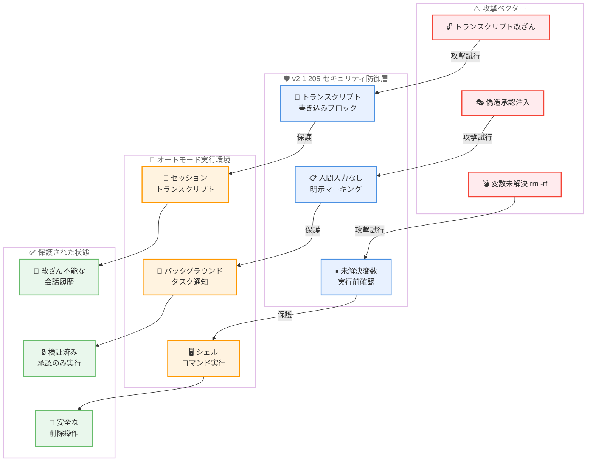
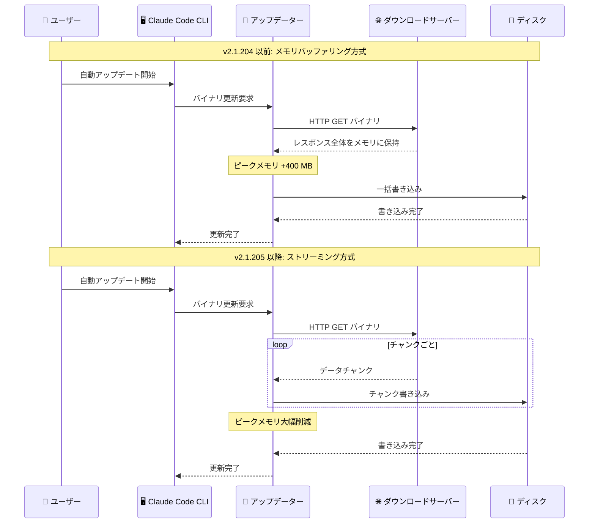

# Claude Code v2.1.205 アップデート: セキュリティ強化、エージェント UI 刷新、自動アップデーター最適化

## メタデータ

| 項目 | 内容 |
|------|------|
| 発表日 | 2026-07-09 |
| ソース | Claude Code Changelog |
| カテゴリ | Claude Code アップデート |
| 公式リンク | https://github.com/anthropics/claude-code/blob/main/CHANGELOG.md |

## 概要

Claude Code v2.1.205 (2026 年 7 月 9 日) がリリースされた。新機能・改善 8 件、バグ修正 15 件の計 23 項目を含むリリースである。

本リリースの最大の特徴は、**セキュリティの多層的な強化**である。セッショントランスクリプトファイルへの改ざん防止ルール、バックグラウンドタスク通知における偽造承認の防止、未解決変数に対する `rm -rf` 実行前の確認機構という 3 つのセキュリティ施策が導入された。これにより、悪意のあるプロンプトインジェクションや意図しない破壊的操作からシステムを保護する防御層が大幅に強化された。

加えて、自動アップデーターのバイナリダウンロードがストリーミング方式に変更され、ピークメモリ使用量が約 400 MB 削減された。エージェントビューは PR リンクの自動表示、状態カラー表示、分類器によるヘッドライン生成など UI が刷新された。`/doctor` コマンドはフルセットアップ診断ツールに昇格し、問題の検出と修正を一括で実行可能になった。

## 詳細

### 背景

Claude Code のバックグラウンドエージェント機能とオートモードは、開発者の生産性を大幅に向上させる一方で、セキュリティ上の攻撃対象面 (attack surface) も拡大してきた。セッショントランスクリプトの改ざんによる偽造コマンドの挿入、バックグラウンドタスク通知を利用した偽造承認の生成、変数展開を悪用した意図しないファイル削除など、自律的な実行環境特有のリスクへの対策が求められていた。

また、自動アップデーターはバイナリ全体をメモリにバッファリングしてからディスクに書き込む方式であったため、大規模なバイナリのダウンロード時にメモリ圧力が増大する問題があった。エージェントビューも、生のツールコール文字列が表示されるなど、多数のバックグラウンドジョブを管理するには情報の粒度が不十分であった。

v2.1.205 はこれらの課題に対する包括的な改善を提供するリリースである。

### 主な変更点

#### 新機能・改善

1. **セッショントランスクリプト改ざん防止**: オートモードにおいて、セッショントランスクリプトファイルへの改ざんをブロックするルールが追加された。悪意のあるプロンプトや外部入力がトランスクリプトを書き換えて偽のコマンド履歴を注入する攻撃を防止する

2. **`rm -rf` 実行前確認**: オートモードが、コンテキストから解決できない変数を含む `rm -rf` コマンドを実行する前にユーザーに確認を求めるようになった。`rm -rf $UNKNOWN_VAR` のような展開結果が予測不能なコマンドによる意図しないファイル削除を防止する

3. **自動アップデーターのストリーミングダウンロード**: バイナリダウンロードがメモリにバッファリングされる代わりにディスクに直接ストリーミングされるようになった。アップデーターのピークメモリ使用量が約 400 MB 削減される

4. **バックグラウンドタスク通知の偽造承認防止**: バックグラウンドタスク通知に「人間の入力は発生していない」ことが明示的に記載されるようになった。トランスクリプト内の偽造承認がエージェントに実行されることを防止する

5. **エージェントビュー: PR リンク表示**: PR の編集、マージ、コメント、プッシュを行ったセッションに対して、`claude agents` 画面で該当 PR へのリンクが表示されるようになった

6. **エージェントビュー: 状態表示の刷新**: 行にカラー付き状態ワードと分類器が生成したヘッドラインが表示されるようになった。生のツールコール文字列の代わりに、人間が読みやすい情報が提供される。ブロック中のセッションでは peek 画面に完全なステータスと要求内容が表示される

7. **`/doctor` コマンドの診断ツール化**: `/doctor` がフルセットアップチェックアップツールに昇格し、問題の診断と修正が可能になった。`/checkup` がエイリアスとして使用できる

8. **MCP サーバー名の予約**: "Claude Browser" MCP サーバー名が "Claude Preview" と並んで予約された (Claude Desktop ペインのリネームに先行)。ユーザー設定の MCP サーバーはこれらの名前で登録できなくなった

#### バグ修正

**スキーマ・入力関連:**

9. **`--json-schema` の無効スキーマ処理修正**: 無効なスキーマが渡された場合にサイレントに非構造化出力を生成していた問題を修正。`format` キーワードを使用するスキーマが不正に拒否されていた問題も修正された

10. **メッセージ消失の修正**: Claude が作業中に送信されたメッセージが `--max-turns` リミットでターンが終了した際にサイレントに消失する問題を修正

**Windows 固有:**

11. **Windows ワークツリー削除の修正**: NTFS ジャンクションまたはディレクトリシンボリックリンクが内部に存在する場合、ワークツリー削除がワークツリー外のファイルを削除してしまう問題を修正

18. **Windows クラッシュの修正**: Claude が起動されたディレクトリがコマンド実行中に削除、ロック、またはアンマウントされた場合のクラッシュを修正

**バックグラウンドエージェント:**

12. **エージェントリスト表示の修正**: `SendMessage` で再開されたバックグラウンドエージェントがエージェントリストで "failed" や "completed" のまま表示され続ける問題を修正

13. **ステータスフリップの修正**: エージェントのターンに読み取り可能なテキストが含まれない場合、バックグラウンドジョブが "needs input" から "working" に戻ってしまう問題を修正

14. **`claude attach` のエラー修正**: バックグラウンドエージェントがアップグレード再起動中の場合、`claude attach` がエラーを返す代わりに復帰を待機するようになった

15. **セッション - PR リンクの修正**: Bash コールの出力が 30K インラインリミットを超えた場合に、そのコール内で作成された PR へのリンクが欠落する問題を修正

22. **Web/モバイル Remote Control パネルの修正**: バックグラウンドタスクが古い "Running" ステータスを表示する問題を修正。メンバーシップ変更ごとに完全なタスク状態が転送されるようになった

23. **Cowork VM モードの修正**: CLI 2.1.203 以降で Cowork VM モードのローカルエージェントセッションが "Not logged in - Please run /login" で起動に失敗する問題を修正

**MCP・プラグイン:**

16. **`claude mcp add-from-claude-desktop` の修正**: サーバー名にサポートされていない文字が含まれる場合にスタックする問題を修正。無効な名前が報告され、残りのサーバーはインポートが続行される

17. **プラグイン LSP サーバーの修正**: 初期化に失敗したプラグイン LSP サーバーが、同じファイル拡張子を扱う別の有効なプラグイン LSP サーバーの動作を妨げる問題を修正

**その他:**

19. **ファイルウォッチャークラッシュの修正**: ディレクトリスキャン実行中にファイルウォッチャーが閉じられた場合のクラッシュを修正

20. **Project verify スキルの修正**: ドキュメント化されたコマンドが変更された場合にのみ書き換えるべき project verify スキルが、毎セッションで書き換えられていた問題を修正

21. **エージェントビュー描画の修正**: ジョブリストが画面をわずかにオーバーフローした場合にエージェントビューが 1 行高く描画され、ヘッダーがクリップされる問題を修正

### 技術的な詳細

#### セキュリティ多層防御アーキテクチャ

v2.1.205 で導入された 3 つのセキュリティ施策は、それぞれ異なる攻撃ベクターに対応している。

**トランスクリプト改ざん防止**: セッショントランスクリプトファイルは、会話履歴とツール実行結果を記録する重要なファイルである。攻撃者がこのファイルを改ざんできれば、エージェントに「ユーザーが既に承認済み」と誤認させるプロンプトインジェクションが成立する。新しいオートモードルールにより、トランスクリプトファイルへの書き込みを試みるツールコールがブロックされる。

**偽造承認防止**: バックグラウンドタスクは人間の監視なしに動作するため、通知メッセージ内に「ユーザーが承認した」という偽のテキストを挿入する攻撃が理論上可能であった。通知に「人間の入力は発生していない」と明示的にマーキングすることで、エージェントが偽造承認に基づいてアクションを実行するリスクを排除する。

**`rm -rf` ガード**: シェル変数がコンテキストから解決できない場合、その変数を含む `rm -rf` の実行結果は予測不能である。最悪の場合、`$UNSET_VAR` が空文字列に展開され、`rm -rf /` 相当の破壊的操作が実行される可能性がある。新しいガードにより、未解決変数を含む削除コマンドは実行前にユーザー確認が要求される。

#### 自動アップデーターのストリーミング最適化

従来の自動アップデーターは以下の流れでバイナリを更新していた。

1. HTTP レスポンス全体をメモリに読み込み (バッファリング)
2. メモリ上のデータをディスクに一括書き込み
3. ファイルの検証と置換

バイナリサイズが数百 MB に達する場合、手順 1 でピークメモリ使用量が同等に増加していた。v2.1.205 ではストリーミング方式に変更され、HTTP レスポンスのチャンクを受信するたびに直接ディスクに書き込むようになった。これにより、メモリ上に保持するデータ量が大幅に削減され、ピークメモリ使用量が約 400 MB 削減された。特にメモリが限られた環境 (CI/CD ランナー、コンテナ、低スペックマシン) での自動アップデートの安定性が向上する。

#### エージェントビューの UI 刷新

エージェントビューの表示が以下のように改善された。

- **PR リンク**: セッションが PR に対する操作 (編集、マージ、コメント、プッシュ) を行った場合、自動的にリンクが表示される。Bash コール出力が 30K を超えた場合のリンク欠落も修正された
- **カラー状態ワード**: 行ごとに色分けされた状態表示 (例: 緑で "Working"、黄色で "Needs input"、赤で "Failed") により、一覧性が向上
- **分類器ヘッドライン**: 生のツールコール文字列の代わりに、分類器が自動生成した人間可読なヘッドラインが表示される
- **peek 画面の強化**: ブロック中のセッションの peek 画面に、完全なステータスと具体的な要求内容が表示される

## アーキテクチャ図

### v2.1.205 セキュリティ多層防御の構造



### 自動アップデーターのメモリ最適化



## 開発者への影響

### 対象

- **全 Claude Code ユーザー**: セキュリティ強化はオートモードを使用するすべてのユーザーに恩恵がある。トランスクリプト改ざん防止、偽造承認防止、`rm -rf` ガードにより、安全性が向上する
- **バックグラウンドエージェント利用者**: エージェントビューの UI 刷新により、多数のジョブの管理が容易になる。PR リンク表示、カラー状態、ヘッドラインにより一覧性が向上
- **CI/CD 環境・コンテナ利用者**: 自動アップデーターのメモリ最適化 (約 400 MB 削減) により、メモリ制約のある環境での安定性が向上
- **Windows ユーザー**: ワークツリー削除時の外部ファイル削除問題とディレクトリ削除時のクラッシュが修正された
- **`--json-schema` 利用者**: 無効スキーマのサイレント失敗と `format` キーワード拒否の問題が解消された
- **MCP サーバー開発者**: "Claude Browser" 名の予約に注意が必要。プラグイン LSP サーバーの初期化失敗が他サーバーに影響しなくなった
- **Cowork VM ユーザー**: CLI 2.1.203 以降で発生していた "Not logged in" エラーが解消された

### 必要なアクション

以下のコマンドで最新バージョンに更新できる。

```bash
# npm でのアップデート
npm update -g @anthropic-ai/claude-code

# Homebrew でのアップデート
brew upgrade claude-code

# 現在のバージョン確認
claude --version
```

**確認が推奨される項目:**

- **MCP サーバー名の確認**: カスタム MCP サーバーに "Claude Browser" または "Claude Preview" という名前を使用している場合、別の名前に変更する必要がある
- **`/doctor` コマンドの実行**: アップデート後に `/doctor` を実行し、環境の健全性を確認することを推奨
- **Windows ワークツリーの確認**: NTFS ジャンクションやシンボリックリンクを含むワークツリーで以前に問題が発生していた場合、本修正で解消されていることを確認する
- **`--json-schema` の再テスト**: 以前 `format` キーワードを含むスキーマが拒否されていた場合、再テストを推奨

### 移行ガイド

#### MCP サーバー名の予約

```bash
# 以下の名前は予約済みとなり、使用不可
# - "Claude Browser"
# - "Claude Preview"

# カスタム MCP サーバーでこれらの名前を使用している場合は変更が必要
claude mcp remove "Claude Browser"
claude mcp add "My Custom Browser" --command "..."
```

#### /doctor コマンドの活用

```bash
# v2.1.205 以降: /doctor はフルセットアップ診断ツール
# セッション内で実行
/doctor

# エイリアスも利用可能
/checkup

# 問題の検出だけでなく修正も実行可能
```

## コード例

```bash
# バージョン更新後の診断チェック
claude
/doctor

# エージェントビューで PR リンク付きの状態確認
claude agents

# json-schema オプションの使用 (format キーワード対応)
claude --json-schema '{"type": "object", "properties": {"email": {"type": "string", "format": "email"}}}'

# MCP サーバー名の確認
claude mcp list
```

## 関連リンク

- [Claude Code Changelog](https://github.com/anthropics/claude-code/blob/main/CHANGELOG.md)
- [Claude Code GitHub リポジトリ](https://github.com/anthropics/claude-code)
- [Claude Code ドキュメント](https://docs.anthropic.com/en/docs/claude-code)
- [Claude Code v2.1.203-v2.1.204](./2026-07-08-claude-code-v2-1-203-v2-1-204.md)
- [Claude Code v2.1.202](./2026-07-07-claude-code-v2-1-202.md)

## まとめ

Claude Code v2.1.205 は、セキュリティ強化を中心軸に据えつつ、パフォーマンス最適化と UI 改善を同時に実現した質の高いリリースである。特に注目すべき点は以下の 4 つ。

第一に、**セキュリティの多層的な強化**が達成された。トランスクリプト改ざん防止、偽造承認の排除、未解決変数に対する `rm -rf` ガードという 3 つの防御層により、オートモードおよびバックグラウンドエージェントの自律的実行環境における攻撃対象面が大幅に縮小された。これらは特にプロンプトインジェクション攻撃に対する耐性を高める重要な施策である。

第二に、**自動アップデーターのメモリ効率が劇的に改善**された。ストリーミングダウンロードへの移行によりピークメモリ使用量が約 400 MB 削減され、CI/CD ランナーやコンテナなどメモリ制約のある環境での自動アップデートの信頼性が向上した。

第三に、**エージェントビューの実用性が向上**した。PR リンクの自動表示、カラー付き状態ワード、分類器によるヘッドライン生成により、多数のバックグラウンドジョブを管理するワークフローが効率化された。生のツールコール文字列ではなく人間可読な情報が提供されることで、状況把握にかかる認知負荷が軽減される。

第四に、**`/doctor` コマンドの診断ツール化**により、環境セットアップの問題を自己解決できるようになった。問題の検出だけでなく修正まで一括で実行可能になったことで、特に初期セットアップや環境移行時のトラブルシューティングが効率化される。

全 Claude Code ユーザーに対してアップデートを推奨する。特にオートモードを活用している開発者にとって、セキュリティ強化は重要な改善である。
