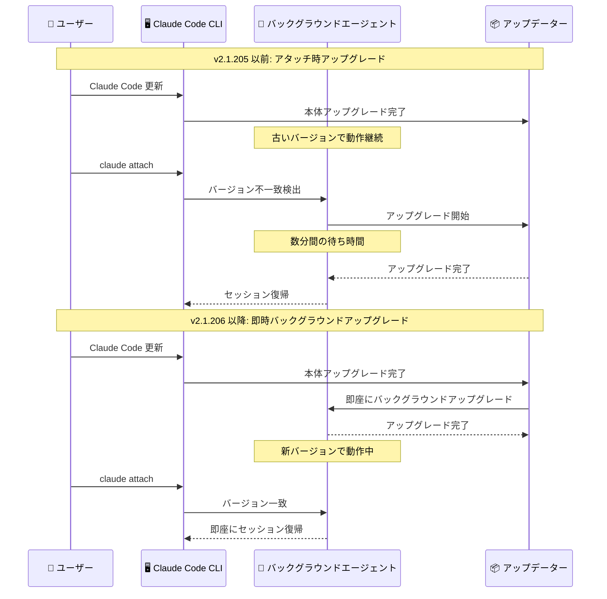
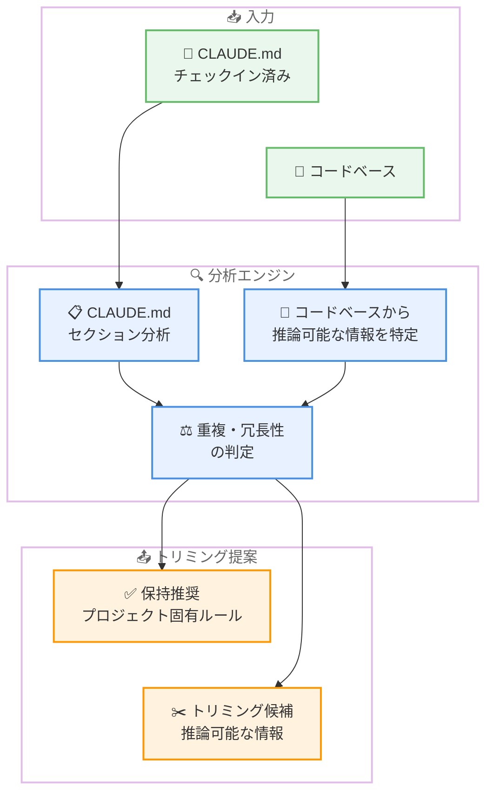

# Claude Code v2.1.206 リリース — /doctor 強化と agents ビュー改善

## メタデータ

| 項目 | 内容 |
|------|------|
| 発表日 | 2026-07-09 |
| ソース | Claude Code Changelog |
| カテゴリ | Claude Code アップデート |
| 公式リンク | https://github.com/anthropics/claude-code/blob/main/CHANGELOG.md |

## 概要

Claude Code v2.1.206 (2026 年 7 月 9 日) がリリースされた。新機能 6 件、バグ修正 18 件、改善 3 件の計 27 項目を含むリリースである。

本リリースの主要テーマは 3 つある。第一に、**`/doctor` コマンドの診断能力向上**。チェックイン済み `CLAUDE.md` ファイルに対して、コードベースから推論可能な内容のトリミングを提案する新しいチェックが追加された。第二に、**agents ビューの表示改善**。ステータス列がターミナル全幅を活用するようになり、Ctrl+X による完了セッションの永続削除が可能になった。第三に、**バックグラウンドエージェントの更新効率化**。Claude Code アップデート直後にバックグラウンドで新バージョンへのアップグレードが実行され、アタッチ時の待ち時間が解消された。

バグ修正では、期限切れログインの誤解を招くエラーメッセージ、MCP サーバーのタイムアウト無視、`CLAUDE_CODE_EXTRA_BODY` がバックグラウンドワーカーで無視される問題など、日常的な開発体験に直接影響する 18 件の問題が修正された。

## 詳細

### 背景

Claude Code の `/doctor` コマンドは v2.1.205 でフルセットアップ診断ツールに昇格したが、診断対象は環境設定やインストール状態が中心であった。一方、プロジェクトの `CLAUDE.md` ファイルはコンテキストウィンドウの重要なリソースを消費する。コードベースから推論可能な情報が冗長に記載されている場合、トークン効率が低下し、モデルのパフォーマンスに悪影響を与える可能性があった。

agents ビューについても、v2.1.205 で PR リンク表示やカラー状態ワードが導入されたが、ステータス列が 64 文字で切り詰められていたため、長いヘッドラインが読みづらいという課題が残っていた。また、完了したセッションの削除操作が `claude rm` コマンドのみに限られており、ビュー内からの即時削除ができなかった。

バックグラウンドエージェントは、Claude Code 本体のアップデート後に古いバージョンで動作し続け、次回アタッチ時に初めてアップグレードが実行されるため、数分間の待ち時間が発生していた。

v2.1.206 はこれらの課題を解決するリリースである。

### 主な変更点

#### 新機能

1. **`/cd` のディレクトリパスサジェスト**: `/cd` コマンドに `/add-dir` と同等のディレクトリパス候補表示が追加された。ディレクトリ移動時の入力効率が向上する

2. **`/doctor` の `CLAUDE.md` トリミング提案**: `/doctor` チェックに、チェックイン済み `CLAUDE.md` ファイルを分析し、Claude がコードベースから自力で推論可能な内容のトリミングを提案する機能が追加された。コンテキストウィンドウの効率的な利用を支援する

3. **`/commit-push-pr` のリモート自動許可**: `/commit-push-pr` が `origin` に加えて、リポジトリに設定された push リモート (`remote.pushDefault`、または唯一のリモート) への `git push` を自動許可するようになった。マルチリモート環境でのワークフローが効率化される

4. **Gateway: `/login` の公式ゲートウェイ対応**: `/login` コマンドが Anthropic 運営の公式ゲートウェイエンドポイントをサポートするようになった

5. **`EnterWorktree` の確認ダイアログ**: プロジェクトの `.claude/worktrees/` ディレクトリ外の git worktree に入る前に確認を求めるようになった。意図しないワークツリーへの移動を防止する

6. **バックグラウンドエージェントの即時アップグレード**: Claude Code アップデート直後に、バックグラウンドエージェントがバックグラウンドで新バージョンにアップグレードされるようになった。従来のアタッチ時の遅延アップグレードが解消される

#### バグ修正

**認証・ログイン関連:**

7. **期限切れログインのエラーメッセージ修正**: ログインが期限切れの場合、全モデルで「選択されたモデルに問題があります」という誤解を招くエラーが表示されていた問題を修正。`/login` の実行を促すメッセージが正しく表示されるようになった

8. **OAuth MCP サーバーの再認証修正**: OAuth MCP サーバーがトークンリフレッシュに 1 回失敗しただけで手動再認証を要求していた問題を修正

9. **`/remote-control` のログアウト時表示修正**: ログアウト状態で `/remote-control` が "Unknown command" と表示されていた問題を修正。サインイン方法の説明が表示されるようになった

**CLI 入力・操作関連:**

10. **`claude --resume` / `--continue` のキーボード入力修正**: 起動時にキーボード入力が受け付けられなかった問題を修正

11. **Windows agents ビューのキーボード入力修正**: セットアッププロンプトが表示された状態で `claude --resume` を実行した場合に、agents ビューでキーボード入力が無視される問題を修正

12. **左矢印キーのナビゲーション修正**: ワークフロー詳細ビューでフェーズやエージェントから戻る際に左矢印キーが機能しなかった問題を修正

**MCP・設定関連:**

13. **MCP サーバーの `request_timeout_ms` 修正**: `--mcp-config` または `.mcp.json` で設定された MCP サーバーのサーバー別 `request_timeout_ms` が無視され、新規セッションで 60 秒のデフォルトタイムアウトが適用されていた問題を修正。長時間実行される MCP ツールコールのタイムアウト問題が解消された

14. **`--permission-prompt-tool` のコールドスタート修正**: MCP サーバーの接続完了前に `--permission-prompt-tool` が MCP ツールを参照するとクラッシュしていた問題を修正

**バックグラウンドエージェント関連:**

15. **`CLAUDE_CODE_EXTRA_BODY` のバックグラウンド対応**: `CLAUDE_CODE_EXTRA_BODY` が `claude agents` / `--bg` バックグラウンドワーカーでサイレントに無視されていた問題を修正。シェルでエクスポートされたオーバーライドがディスパッチセッションに正しく引き継がれるようになった

16. **`claude rm` のデーモンロスター修正**: `claude rm` で削除したジョブがデーモンロスターに残り、`claude agents` で再表示される問題を修正

17. **デスクトップセッションの "running" 固着修正**: ターン中にスラッシュコマンドが送信された後、デスクトップセッションが "running" のまま固着する問題を修正

**`/model` ピッカー関連:**

18. **`/model` の価格表示修正**: `/model` ピッカーの行が、行に表示されたモデルとは異なるモデルの価格を表示していた問題を修正。また、プロバイダーが請求しないファーストパーティ定価の引用を停止した

19. **`/model` のサーバー提供行の位置修正**: エンタイトルメントやアローリスト制限で配置対象の行が削除された場合に、サーバー提供のモデル行が誤った位置に表示される問題を修正

**その他:**

20. **`/status` の重複警告修正**: `/status` が同一のインストール破損警告を 2 回表示する問題を修正

21. **プラグインの誤検出修正**: LSP プラグインに関する誤った "disused plugin" ヒントと、歪んだ不使用テレメトリの問題を修正

22. **`/doctor` の Homebrew チャネル修正**: `/doctor` のアップデートチェックが settings チャネルではなく Homebrew の cask チャネルと比較するように修正された

23. **フルスクリーン jump-to-bottom ピル修正**: macOS で Ctrl+End と表示される問題、リバウンドされたコードが表示されない問題、トランスクリプト上でのラッピング問題を修正

24. **Bedrock: 起動ハング修正**: 制限されたエグレスのネットワークで `awsCredentialExport` ヘルパーを使用した際に数分間の起動ハングが発生する問題を修正

#### 改善

25. **`/code-review` の品質向上**: claude-opus-4-8 における全エフォートレベルでの `/code-review` 検出品質が向上した

26. **agents ビュー: ステータス列の全幅化**: ステータス列が 64 文字の切り詰めではなく、ターミナル全幅を使用するようになった

27. **agents ビュー: Ctrl+X 削除と表示修正**: Ctrl+X で完了セッションを永続的に削除可能になった。セッションの二重レンダリングが解消され、削除したバックグラウンドジョブが再表示されなくなった

### 技術的な詳細

#### `/doctor` の `CLAUDE.md` トリミング分析

`/doctor` の新しいチェックは、チェックイン済みの `CLAUDE.md` ファイルの内容をコードベースのコンテキストと照合し、以下の基準でトリミング対象を判定する。

- **自明なコードベース情報**: ディレクトリ構造、ファイル一覧、使用技術スタックなど、Claude がファイルを読むだけで推論可能な情報
- **冗長な説明**: 関数やクラスの説明がコード内のドキュメントコメントと重複している場合
- **過度に詳細な設定情報**: 設定ファイルを直接参照すれば取得できる値の列挙

この機能により、コンテキストウィンドウのトークン効率が改善され、実際に有用な指示やプロジェクト固有のルールにトークンを集中できるようになる。

#### バックグラウンドエージェントの即時アップグレードメカニズム

従来のアップグレードフロー。

1. ユーザーが Claude Code 本体を更新
2. バックグラウンドエージェントは古いバージョンで動作し続ける
3. ユーザーが `claude attach` でアタッチ
4. バージョン不一致を検出し、アップグレードを開始
5. 数分間の待ち時間が発生

v2.1.206 の新フロー。

1. ユーザーが Claude Code 本体を更新
2. アップデート完了を検出し、バックグラウンドで即座にエージェントをアップグレード
3. ユーザーが `claude attach` でアタッチ
4. 既にアップグレード済みのため待ち時間なし

#### `CLAUDE_CODE_EXTRA_BODY` のセッション伝播

`CLAUDE_CODE_EXTRA_BODY` 環境変数は、API リクエストに追加のボディパラメータを注入するための機能である。従来はフォアグラウンドセッションでのみ機能し、`claude agents` や `--bg` で起動されたバックグラウンドワーカーには伝播されなかった。

v2.1.206 では、ディスパッチセッション (バックグラウンドジョブを起動するセッション) のシェル環境からバックグラウンドワーカーに `CLAUDE_CODE_EXTRA_BODY` が正しく引き継がれるようになった。これにより、カスタムメタデータの付与やプロバイダー固有のパラメータ設定がバックグラウンドジョブでも一貫して動作する。

#### MCP サーバーのタイムアウト修正

MCP サーバーの `request_timeout_ms` 設定が無視される問題は、新規セッション (コールドスタート) でのみ発生していた。原因は、サーバー設定の読み込みタイミングとタイムアウト値の初期化順序にあった。修正により、`.mcp.json` や `--mcp-config` で指定されたサーバー別のタイムアウト値がセッション開始時から正しく適用されるようになった。

```json
{
  "mcpServers": {
    "my-slow-server": {
      "command": "my-mcp-server",
      "request_timeout_ms": 300000
    }
  }
}
```

上記のように 300 秒 (5 分) を設定した場合、v2.1.205 以前では新規セッションで 60 秒のデフォルトが適用されていたが、v2.1.206 では正しく 300 秒が適用される。

## アーキテクチャ図

### バックグラウンドエージェント即時アップグレードの比較



### `/doctor` の `CLAUDE.md` トリミング分析フロー



## 開発者への影響

### 対象

- **全 Claude Code ユーザー**: `/doctor` の新しい `CLAUDE.md` トリミング提案により、コンテキストウィンドウの効率改善が期待できる。期限切れログインのエラーメッセージ改善により、認証問題のトラブルシューティングが容易になる
- **バックグラウンドエージェント利用者**: 即時アップグレードにより `claude attach` 時の待ち時間が解消される。`CLAUDE_CODE_EXTRA_BODY` のバックグラウンド対応により、カスタム設定の一貫性が確保される。agents ビューの全幅化と Ctrl+X 削除で管理効率が向上する
- **MCP サーバー利用者**: `request_timeout_ms` の修正により、長時間実行ツールのタイムアウト問題が解消される。OAuth サーバーの再認証問題も修正された
- **マルチリモート環境のユーザー**: `/commit-push-pr` の自動許可拡張により、`remote.pushDefault` に設定したリモートへの push が追加の確認なく実行される
- **Bedrock ユーザー**: 制限されたネットワークでの起動ハング問題が解消された
- **Windows ユーザー**: `--resume` のキーボード入力問題と agents ビューの入力無視問題が修正された

### 必要なアクション

以下のコマンドで最新バージョンに更新できる。

```bash
# npm でのアップデート
npm update -g @anthropic-ai/claude-code

# Homebrew でのアップデート
brew upgrade claude-code

# 現在のバージョン確認
claude --version
```

**推奨される確認事項:**

- **`/doctor` の実行**: アップデート後に `/doctor` を実行し、`CLAUDE.md` のトリミング提案を確認する。不要な情報を削除することでコンテキスト効率が向上する
- **MCP タイムアウト設定の確認**: カスタム `request_timeout_ms` を設定している MCP サーバーがある場合、v2.1.206 で正しくタイムアウトが適用されていることを確認する
- **`CLAUDE_CODE_EXTRA_BODY` の動作確認**: バックグラウンドジョブで `CLAUDE_CODE_EXTRA_BODY` を使用している場合、本修正で正しく伝播されていることを確認する

### 移行ガイド

#### `/doctor` による `CLAUDE.md` 最適化

```bash
# セッション内で /doctor を実行
/doctor

# トリミング提案が表示された場合、内容を確認して適用
# 例: コードベースから推論可能なディレクトリ構造の記述を削除
# 例: コード内ドキュメントと重複する説明を削除
```

**トリミングの判断基準:**

- コードベースを読めば分かる情報 (ディレクトリ構造、技術スタックなど) は削除候補
- プロジェクト固有のルール、規約、ワークフロー指示は保持すべき
- 外部サービスとの連携情報やデプロイ手順は保持すべき

#### agents ビューの新操作

```bash
# agents ビューを表示
claude agents

# 完了セッションを永続削除 (新機能)
# セッションを選択して Ctrl+X を押す

# ステータス列が全幅で表示される (自動適用)
```

#### `/commit-push-pr` のリモート設定

```bash
# pushDefault が設定されている場合、自動許可される
git config remote.pushDefault upstream

# 唯一のリモートの場合も自動許可
git remote -v
# origin のみ表示 → origin への push が自動許可

# 従来通り origin も自動許可
```

## コード例

```bash
# アップデート後の推奨ワークフロー
claude --version  # v2.1.206 を確認

# /doctor で CLAUDE.md の最適化提案を確認
claude
/doctor

# MCP サーバーのタイムアウト設定例 (.mcp.json)
cat <<'EOF' > .mcp.json
{
  "mcpServers": {
    "long-running-tool": {
      "command": "my-mcp-server",
      "args": ["--mode", "production"],
      "request_timeout_ms": 300000
    }
  }
}
EOF

# CLAUDE_CODE_EXTRA_BODY のバックグラウンドジョブへの伝播
export CLAUDE_CODE_EXTRA_BODY='{"metadata": {"team": "backend"}}'
claude --bg "テストを実行してください"
# バックグラウンドワーカーにも metadata が伝播される

# agents ビューでの操作
claude agents
# ステータス列が全幅表示
# Ctrl+X で完了セッションを永続削除
```

```bash
# /cd のディレクトリサジェスト活用
claude
/cd  # ディレクトリパス候補が表示される (add-dir と同等)

# /commit-push-pr でのマルチリモート対応
git config remote.pushDefault upstream
/commit-push-pr  # upstream への push が自動許可される
```

## 関連リンク

- [Claude Code Changelog](https://github.com/anthropics/claude-code/blob/main/CHANGELOG.md)
- [Claude Code GitHub リポジトリ](https://github.com/anthropics/claude-code)
- [Claude Code ドキュメント](https://docs.anthropic.com/en/docs/claude-code)
- [Claude Code v2.1.205](./2026-07-09-claude-code-v2-1-205.md)
- [Claude Code v2.1.203-v2.1.204](./2026-07-08-claude-code-v2-1-203-v2-1-204.md)

## まとめ

Claude Code v2.1.206 は、開発者体験の最適化と安定性向上に焦点を当てたリリースである。特に注目すべき点は以下の 4 つ。

第一に、**`/doctor` の `CLAUDE.md` トリミング提案**により、コンテキストウィンドウの効率的な利用が支援される。コードベースから推論可能な情報を特定し削除を提案することで、実際に有用なプロジェクト固有の指示にトークンを集中できるようになる。これはモデルのパフォーマンス向上に直接寄与する改善である。

第二に、**バックグラウンドエージェントの即時アップグレード**により、`claude attach` 時の数分間の待ち時間が解消された。Claude Code の更新直後にバックグラウンドでアップグレードが完了するため、ワークフローの中断が最小化される。

第三に、**18 件のバグ修正**が日常的な開発体験を改善する。特に MCP サーバーの `request_timeout_ms` 無視、`CLAUDE_CODE_EXTRA_BODY` のバックグラウンド非伝播、期限切れログインの誤メッセージは、多くのユーザーに影響していた問題である。

第四に、**agents ビューの操作性向上**により、多数のバックグラウンドジョブの管理が効率化された。ステータス列の全幅化で情報の視認性が向上し、Ctrl+X による永続削除でクリーンアップ操作が簡素化された。

全 Claude Code ユーザーに対してアップデートを推奨する。特に MCP サーバーのカスタムタイムアウトを設定しているユーザーや、バックグラウンドエージェントを多用しているユーザーにとって、重要な修正が含まれるリリースである。
