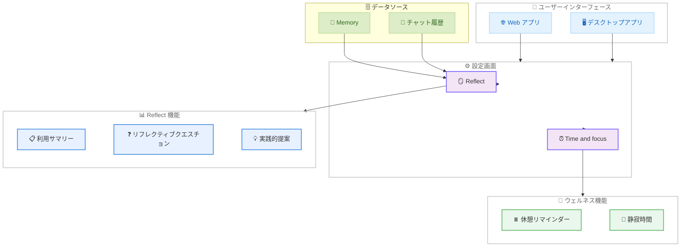

# Claude 利用振り返り機能「Reflect」を発表

## メタデータ

| 項目 | 内容 |
|------|------|
| 発表日 | 2026-07-09 |
| ソース | Anthropic News / Claude Apps Release Notes |
| カテゴリ | 新機能 / ユーザー体験 |
| 公式リンク | https://www.anthropic.com/news/reflect-with-claude |

## 概要

Anthropic は、ユーザーが Claude との利用パターンを追跡・可視化・振り返りできるベータ機能「Reflect」を発表した。この機能は Claude の Web アプリおよびデスクトップアプリの設定画面からアクセスでき、1、3、6、12 か月間の利用状況をサマリーとして提供する。あわせて、ウェルネスコントロール機能 (休憩リマインダーおよび静寂時間) も同日にリリースされた。

## 詳細

### 背景

AI ツールが日常的に利用されるようになるなか、ユーザーがどのように AI を活用しているかを振り返り、意識的に使い方を改善するニーズが高まっている。Anthropic のユーザーインタビューでは、「AI がどのように日常生活に統合されるべきか」「どのタスクに AI が適しているか」「どこは自分で行うべきか」といったテーマが共通の関心事として浮かび上がった。この課題に応える形で Reflect 機能が開発された。

開発にあたり、Anthropic は以下の外部機関と連携している。

- MIT Media Lab の Advancing Humans with AI (AHA) プログラム
- Boston Children's Hospital の Digital Wellness Lab
- Family Online Safety Institute

### 主な変更点

#### Reflect (月次レポート)

設定画面の「Reflect」セクションから利用可能な振り返り機能。以下の情報を提供する。

- **利用サマリー**: 主なトピック、利用パターン、タスクの種類をカバー
- **アクティビティ分析**: 最もアクティブな曜日やピーク時間帯を表示
- **期間選択**: 1、3、6、12 か月の期間で振り返りが可能
- **リフレクティブクエスチョン**: 定期的に内省を促す質問を提示 (例: 「Claude が速くできたとしても、自分でやり続けたいことは何ですか?」)
- **実践的な提案**: コンテキストの再説明を避けるための Project 活用提案など

#### ウェルネスコントロール

設定画面の「Time and focus」セクションから利用可能。以下の機能を含む。

- **休憩リマインダー**: 一定時間の利用後に休憩を促すオプションのナッジ
- **静寂時間 (Quiet hours)**: 通知やアクティビティを一時停止する時間帯の設定

いずれもユーザーの設定に基づくリマインダーであり、表示を解除 (dismiss) できる。

### 技術的な詳細

#### 4D AI フルエンシーフレームワーク

Reflect は Anthropic 独自の「4D AI フルエンシーフレームワーク」に基づいてユーザーのスキルを評価する。

| 次元 | 英語名 | 内容 |
|------|--------|------|
| 委任 | Delegation | 目標を設定し、AI を使うかどうか・どのように使うかを判断する |
| 記述 | Description | Claude に効果的にプロンプトを伝え、有用な出力を引き出す |
| 識別 | Discernment | AI の出力の有用性を正確に評価する |
| 勤勉 | Diligence | AI の利用とその結果に対して責任を持つ |

レポートでは各次元に沿ったアクティビティの要約と具体例が表示される。例えば、メールの下書きを自分の言葉で書き直した場面や、戦略が固まってからタスクを委任した場面などが記録される。

#### プライバシー保護

| 項目 | 取り扱い |
|------|----------|
| シークレットチャット | 除外 (Reflect に含まれない) |
| 接続ツールのファイル | 除外 (要約は表示されるが元ファイルは含まれない) |
| ヘルスインテグレーション | 完全に除外 |
| センシティブな会話 | 高レベルの要約のみ表示 |
| データの利用目的 | Reflect 内のみ。他の目的には使用されない |

#### システム構成

## 開発者への影響

### 対象

- Claude Free、Pro、Max プランの全ユーザー
- Claude Web アプリおよびデスクトップアプリの利用者
- AI リテラシーの向上に関心のある教育関係者

### 必要なアクション

1. **Memory を有効にする**: Reflect を利用するには、設定画面で Memory がオンになっている必要がある
2. **設定画面にアクセス**: Web またはデスクトップアプリの設定から「Reflect」セクションを開く
3. **ウェルネスコントロールの設定** (任意): 「Time and focus」から休憩リマインダーや静寂時間を設定

### 移行ガイド (該当する場合)

既存ユーザーに対する移行作業は不要。Memory が有効であれば、設定画面から直ちに Reflect 機能を利用開始できる。

## 関連リンク

- [Reflect with Claude - 公式発表](https://www.anthropic.com/news/reflect-with-claude)
- [Claude Apps Release Notes](https://support.claude.com/en/articles/12138966-release-notes)
- [MIT Media Lab AHA Program](https://www.media.mit.edu/)
- [Digital Wellness Lab at Boston Children's Hospital](https://digitalwellnesslab.org/)
- [Family Online Safety Institute](https://www.fosi.org/)

## まとめ

Reflect は、AI ツールの利用を「無意識の習慣」から「意識的な活用」へと転換するための機能である。4D AI フルエンシーフレームワークに基づくスキル評価、プライバシーに配慮したデータ取り扱い、外部研究機関との連携開発といった特徴を持ち、単なる利用統計ダッシュボードを超えた「AI との関わり方を振り返る」体験を提供する。ウェルネスコントロール (休憩リマインダー・静寂時間) との組み合わせにより、ユーザーが健全な AI 利用習慣を構築するための包括的なツールセットが整備された。今後は Cowork 会話の振り返り機能も追加予定である。
