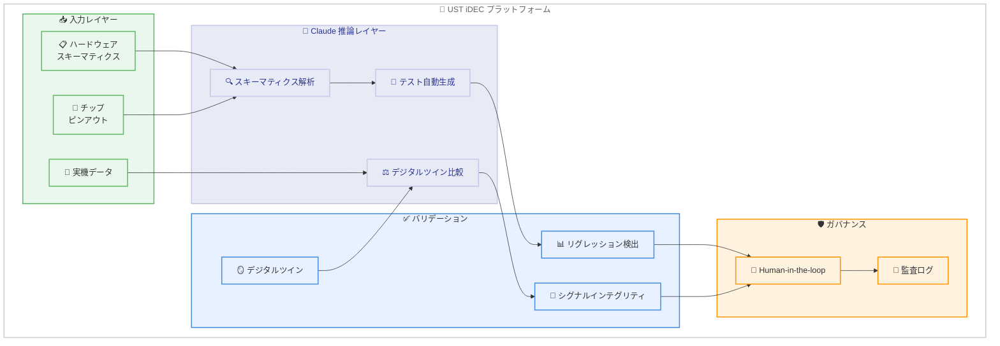

# UST、Claude を物理 AI に導入 — グローバルプレミアパートナーシップ

## メタデータ

| 項目 | 内容 |
|------|------|
| 発表日 | 2026-07-09 |
| ソース | Anthropic News |
| カテゴリ | パートナーシップ / ケーススタディ |
| 公式リンク | https://www.anthropic.com/news/ust-claude |

## 概要

テクノロジー & エンジニアリングサービス企業である UST が、半導体・自動車・コネクテッドデバイスなどの物理エンジニアリング環境に Claude を統合することを発表した。UST は Claude Partner Network の「グローバルプレミアパートナー」に指定され、20,000 名のエンジニア、アーキテクト、コンサルタントに対して Claude のトレーニングを全世界で実施する。

この提携により、UST の iDEC バリデーションプラットフォームに Claude が推論レイヤーとして組み込まれ、ハードウェア検証サイクルを 50-70% 短縮する成果が既に確認されている。

## 詳細

### 背景

UST は銀行、通信、製造業をはじめとするグローバル企業に対し、設計検証、チップバリデーション、工場運営、市場投入後のサービスを提供するテクノロジー企業である。これらの業界は「極めて高リスク」な領域であり、AI 導入には厳格なガバナンスと信頼性が求められる。

Anthropic は UST に対してイネーブルメント、技術ガイダンス、認定プログラムを通じた支援を行い、パイロットから本番環境への移行を加速させる。

### 主な変更点

以下の点が今回の発表の重要なポイントである。

- **グローバルプレミアパートナー指定**: UST が Claude Partner Network の最上位パートナーとして認定
- **20,000 名のトレーニング**: エンジニア、アーキテクト、コンサルタント、業界スペシャリスト、フォワードデプロイドエンジニアを対象にグローバルで Claude トレーニングを実施
- **iDEC プラットフォーム統合**: 半導体検証プラットフォームに Claude を推論レイヤーとして統合
- **複数業界への展開**: ヘルスケア、通信、銀行業務にまたがる Claude 活用ソリューションを展開

### 技術的な詳細

#### iDEC プラットフォーム (半導体バリデーション)

iDEC は UST のハードウェアおよびシリコン検証プラットフォームであり、生産前の設計検証を行うクローズドループパイプラインである。Claude が担う役割は以下の通りである。

1. **スキーマティクス解析**: Claude Code がチップのピンアウトとハードウェアスキーマティクスを直接読み取る
2. **テスト自動生成**: 従来エンジニアが手作業でスクリプト化していたリグレッションテストを自動的に作成・実行
3. **デジタルツイン比較**: 実機データとデジタルツインを比較し、差異を検出
4. **障害検出**: ファームウェアリグレッションやシグナルインテグリティ障害をフラグ付け
5. **長時間コンテキスト保持**: 数時間にわたるマルチステップタスクでコンテキストを維持

**パフォーマンス指標**: バリデーションサイクル時間を 50-70% 削減 (標準 4 日のターンアラウンドを 48 時間に圧縮)

#### ヘルスケア (UST CarePath)

- 保険会社・医療提供者向けのメンバーサービス、ケアマネジメント、請求処理に使用
- Claude が CarePath を基盤となる請求・ケアシステムに接続
- 散在するヘルスデータをケアチーム向けの明確なネクストステップに変換
- すべての推奨アクションは、メンバーに届く前に人間の承認を経由

#### 通信 (UST IntelliOps)

- ネットワークオペレーションを運営
- サービス障害の特定を支援
- 無線アクセスネットワーク (基地局・アンテナ) の障害を予測
- 人間が承認するレスポンスワークフローにより障害時間を短縮

#### 銀行 (UST FinX)

- 中規模銀行がレガシーコアシステムから段階的にモダナイゼーションを実施
- AI エージェントを銀行ワークフローに直接組み込み
- インテリジェントなケースハンドリング、サービス自動化、ナレッジ検索、ワークフロー支援、意思決定サポートを提供

## 開発者への影響

### 対象

- 半導体・ハードウェア検証エンジニア
- 組み込みシステム開発者
- ヘルスケア IT エンジニア
- 通信ネットワークエンジニア
- 金融システムインテグレーター
- UST のパートナーおよびクライアント企業の技術チーム

### 必要なアクション

- **UST クライアント**: UST 担当者を通じて Claude 統合ソリューションの導入計画を策定
- **パートナー企業**: Claude Partner Network への参加を検討し、同様の統合パターンを自社サービスに適用
- **開発者**: Claude Code の長時間コンテキスト保持機能やハードウェアスキーマティクス解析機能の活用を検討

### 移行ガイド (該当する場合)

今回はパートナーシップ発表であるため、直接的な API 移行は発生しない。ただし、iDEC のようなクローズドループパイプラインの構築を検討する場合は、以下のアプローチが参考になる。

1. Claude Code を活用した技術ドキュメント・スキーマティクスの解析
2. リグレッションテストの自動生成ワークフローの設計
3. デジタルツインとの比較ロジックの実装
4. Human-in-the-loop ガバナンスの組み込み

## コード例

iDEC プラットフォームにおける Claude 活用の概念的なワークフロー例を示す。

```python
# iDEC パイプラインの概念的なワークフロー (擬似コード)
# Claude Code がハードウェアスキーマティクスを解析し、
# リグレッションテストを自動生成する流れ

import anthropic

client = anthropic.Anthropic()

# ステップ 1: チップピンアウトの解析
pinout_analysis = client.messages.create(
    model="claude-sonnet-4-6-20260710",
    max_tokens=4096,
    messages=[
        {
            "role": "user",
            "content": f"以下のチップピンアウト定義を解析し、"
                       f"信号グループとインターフェース仕様を特定してください:\n\n"
                       f"{schematic_data}"
        }
    ]
)

# ステップ 2: リグレッションテストの自動生成
test_generation = client.messages.create(
    model="claude-sonnet-4-6-20260710",
    max_tokens=8192,
    messages=[
        {
            "role": "user",
            "content": f"以下のピンアウト解析結果に基づき、"
                       f"シグナルインテグリティ検証用のリグレッションテストを生成してください:\n\n"
                       f"{pinout_analysis.content[0].text}"
        }
    ]
)

# ステップ 3: デジタルツインとの比較
digital_twin_comparison = client.messages.create(
    model="claude-sonnet-4-6-20260710",
    max_tokens=4096,
    messages=[
        {
            "role": "user",
            "content": f"実機データとデジタルツインの出力を比較し、"
                       f"ファームウェアリグレッションまたは"
                       f"シグナルインテグリティ障害を検出してください:\n\n"
                       f"実機データ: {live_equipment_data}\n"
                       f"デジタルツイン: {digital_twin_output}"
        }
    ]
)
```

## アーキテクチャ図



## 関連リンク

- [UST x Claude 公式発表](https://www.anthropic.com/news/ust-claude)
- [Claude Partner Network](https://www.anthropic.com/partners)
- [Anthropic 公式サイト](https://www.anthropic.com)
- [Claude API ドキュメント](https://docs.anthropic.com)

## まとめ

UST と Anthropic のグローバルプレミアパートナーシップは、Claude が「ソフトウェア開発支援」を超えて「物理エンジニアリング」の領域に本格的に進出する重要なマイルストーンである。

**重要なポイント**:

- **規模**: 20,000 名のプロフェッショナルへの Claude トレーニングは、エンタープライズ AI 導入として非常に大規模
- **実証済みの成果**: iDEC プラットフォームでバリデーションサイクル 50-70% 削減を既に達成
- **安全性重視**: すべてのデプロイメントで Human-in-the-loop ガバナンスを維持し、高リスク業界での信頼性を確保
- **多業界展開**: 半導体、ヘルスケア、通信、銀行と複数の規制産業にまたがる展開

> "Our alliance with Anthropic reflects UST's unwavering commitment to helping clients navigate the AI landscape with confidence" — Krishna Sudheendra (CEO, UST)

> "They're proving Claude inside their own engineering first, and training 20,000 of their own people on it" — Paul Smith (CCO, Anthropic)

この事例は、Claude のマルチステップ推論能力と長時間コンテキスト保持が、物理的なハードウェア検証のような複雑で高精度が要求されるタスクにおいても有効であることを実証している。
