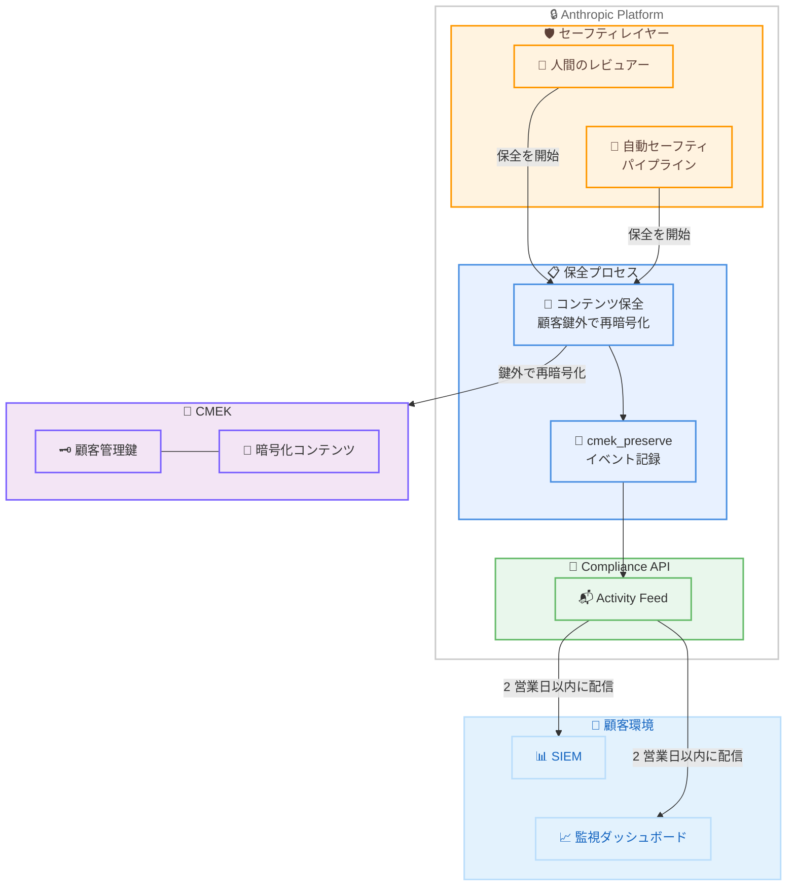
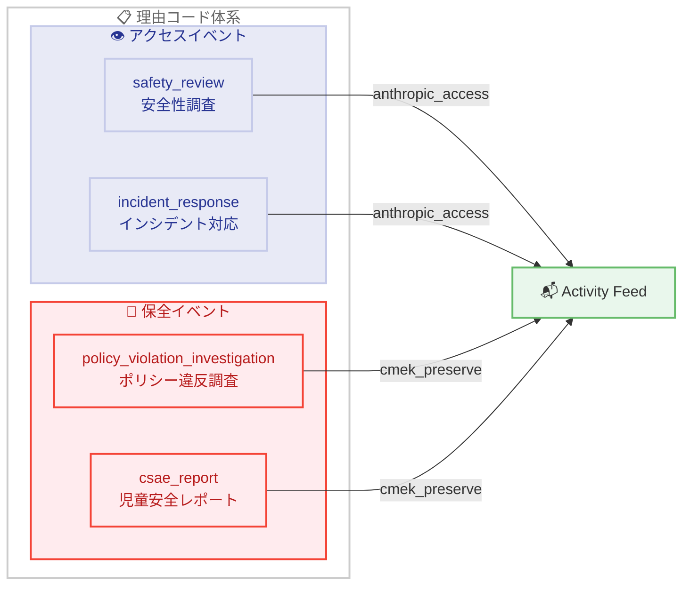

# Access Transparency: CMEK コンテンツ保全ドキュメントの拡充

## メタデータ

| 項目 | 内容 |
|------|------|
| 発表日 | 2026-07-10 |
| ソース | Claude Developer Platform Release Notes |
| カテゴリ | API アップデート |
| 公式リンク | [Access Transparency - CMEK content preservation](https://platform.claude.com/docs/en/manage-claude/access-transparency#cmek-content-preservation) |

## 概要

Anthropic は 2026 年 7 月 10 日、Access Transparency 機能における CMEK (Customer-Managed Encryption Keys) コンテンツ保全に関するドキュメントを大幅に拡充した。今回の更新では、`cmek_preserve` イベントのフィルタ例、イベントペイロードの具体例、および 2 つの新しい保全理由コード (`policy_violation_investigation` と `csae_report`) が追加された。また、保全イベントが人間のレビュアーまたは自動化されたセーフティパイプラインのいずれによって開始された場合でも記録されることが明確化された。

## 詳細

### 背景

Access Transparency は、Anthropic のエンタープライズ顧客向けのセキュリティ機能であり、Anthropic の人員が顧客データにアクセスした際の監査記録を提供する。CMEK (Customer-Managed Encryption Keys) を利用している組織では、顧客が暗号鍵を管理しており、通常すべてのコンテンツはその鍵で暗号化されている。

しかし、安全性やコンプライアンス上の理由から、Anthropic が特定のコンテンツを標準の保持期間を超えて保全する必要がある場合がある。この場合、コンテンツは顧客管理鍵の外部で再暗号化され、調査が顧客の鍵の操作に依存せずに継続できるようになる。この操作が `cmek_preserve` イベントとして記録される。

### 主な変更点

今回のドキュメント拡充では、以下の内容が追加された。

1. **フィルタ例の追加**: Compliance API Activity Feed から `cmek_preserve` イベントのみを取得するための具体的な curl コマンド例
2. **イベントペイロード例の追加**: `cmek_preserve` イベントの完全な JSON 構造を示すサンプル
3. **保全理由コードの追加**: 2 つの新しい理由コードの定義
   - **`policy_violation_investigation`**: Trust and Safety のポリシー違反調査中にコンテンツが保全された場合
   - **`csae_report`**: 児童安全 (CSAE) レポートの証拠としてコンテンツが保全された場合
4. **自動化パイプラインの明確化**: 保全イベントは、人間のレビュアーによって開始された場合だけでなく、自動化されたセーフティパイプラインによって開始された場合にも記録されることを明示

### 技術的な詳細

#### 理由コード一覧

更新後の理由コードの全体像は以下の通り。

| コード | 種別 | 意味 |
|--------|------|------|
| `safety_review` | アクセス | 利用ポリシーまたは安全性調査の一環としてコンテンツが閲覧された |
| `incident_response` | アクセス | 組織に影響を及ぼすインシデント調査中にコンテンツが閲覧された |
| `policy_violation_investigation` | 保全 | Trust and Safety のポリシー違反調査中にコンテンツが保全された |
| `csae_report` | 保全 | 児童安全 (CSAE) レポートの証拠としてコンテンツが保全された |

#### イベント配信タイミング

`cmek_preserve` イベントは、保全が実行されてから 2 営業日以内に Compliance API Activity Feed に配信される。`accessed_at` フィールドはコンテンツが保全された実際の時刻を記録し、`created_at` フィールドはイベントがフィードに表示された時刻を記録する。

## 開発者への影響

### 対象

- CMEK を利用しているエンタープライズ顧客
- Access Transparency が有効化されている組織
- Compliance API を使用してセキュリティ監査を行っているチーム
- SIEM (Security Information and Event Management) 統合を運用しているセキュリティチーム

### 必要なアクション

1. **SIEM アラートルールの更新**: 新しい理由コード (`policy_violation_investigation`, `csae_report`) を含むアラートルールを設定する
2. **監視ダッシュボードの更新**: `cmek_preserve` イベントの監視を追加し、理由コード別にフィルタリングできるようにする
3. **インシデント対応プロセスの確認**: 保全イベントを受信した際の対応フローを確認し、新しい理由コードに対応するエスカレーションパスを定義する
4. **ドキュメントの確認**: 社内のコンプライアンスドキュメントを更新し、自動化パイプラインによる保全も記録される旨を反映する

### 移行ガイド

既存の Compliance API 統合に対する破壊的変更はない。`cmek_preserve` イベントは既存の `anthropic_access` イベントと同じフィールド構造を持つため、既存のパーサーはそのまま動作する。新しい理由コードに対応するフィルタリングロジックを追加することを推奨する。

## コード例

### cmek_preserve イベントのフィルタリング

```bash
curl --fail-with-body -sS -G \
  "https://api.anthropic.com/v1/compliance/activities" \
  --data-urlencode "activity_types[]=cmek_preserve" \
  --data-urlencode "limit=50" \
  --header "x-api-key: $ANTHROPIC_COMPLIANCE_ACCESS_KEY"
```

### cmek_preserve イベントペイロード例

```json
{
  "id": "activity_01AbCdEfGhJkMnPqRsTuVwXy",
  "type": "cmek_preserve",
  "created_at": "2026-07-02T09:41:53.204118Z",
  "accessed_at": "2026-07-02T09:41:50.118764Z",
  "organization_id": "org_0123456789abcdefghijklmn",
  "actor": { "type": "anthropic_actor", "email_address": null },
  "resource_details": { "type": "message", "id": "msg_0ExampleExampleExample" },
  "accessor_department": "Safeguards",
  "reason_code": "policy_violation_investigation",
  "organization_uuid": "00000000-1111-2222-3333-444444444444"
}
```

### 理由コード別のフィルタリング例 (Python)

```python
import requests

COMPLIANCE_API_URL = "https://api.anthropic.com/v1/compliance/activities"
API_KEY = "your_compliance_access_key"

def get_preservation_events(reason_code=None):
    """cmek_preserve イベントを取得する"""
    params = {
        "activity_types[]": "cmek_preserve",
        "limit": 50,
    }

    headers = {
        "x-api-key": API_KEY,
    }

    response = requests.get(COMPLIANCE_API_URL, params=params, headers=headers)
    response.raise_for_status()

    activities = response.json().get("data", [])

    if reason_code:
        activities = [
            a for a in activities
            if a.get("reason_code") == reason_code
        ]

    return activities


# ポリシー違反調査に関連する保全イベントを取得
policy_events = get_preservation_events("policy_violation_investigation")

# CSAE レポートに関連する保全イベントを取得
csae_events = get_preservation_events("csae_report")

for event in policy_events:
    print(f"[{event['accessed_at']}] {event['reason_code']}: {event['resource_details']['id']}")
```

## アーキテクチャ図

### CMEK コンテンツ保全イベントフロー



### 理由コードの分類



## 関連リンク

- [Access Transparency ドキュメント](https://platform.claude.com/docs/en/manage-claude/access-transparency)
- [CMEK ドキュメント](https://platform.claude.com/docs/en/manage-claude/cmek)
- [Compliance API 概要](https://platform.claude.com/docs/en/manage-claude/compliance-api)
- [Activity Feed](https://platform.claude.com/docs/en/manage-claude/compliance-activity-feed)
- [API and Data Retention](https://platform.claude.com/docs/en/manage-claude/api-and-data-retention)
- [Trust Center](https://trust.anthropic.com/resources)

## まとめ

今回の Access Transparency ドキュメント拡充により、CMEK を利用するエンタープライズ顧客は `cmek_preserve` イベントについてより明確に理解し、適切に監視できるようになった。特に重要なのは以下の 3 点である。

1. **具体的な実装例の提供**: フィルタ例とイベントペイロード例により、開発者はすぐに統合を実装できる
2. **理由コードの明確化**: `policy_violation_investigation` と `csae_report` の 2 つの保全専用理由コードにより、なぜコンテンツが保全されたかを正確に把握できる
3. **自動化パイプラインの透明性**: 人間のレビュアーだけでなく、自動化されたセーフティパイプラインによる保全もイベントとして記録されることが明示され、顧客のデータガバナンスにおける可視性が向上した

この更新は既存の API 統合に対する破壊的変更を含まないため、即座のコード修正は不要だが、新しい理由コードに対応した監視ルールやアラートの設定を推奨する。
