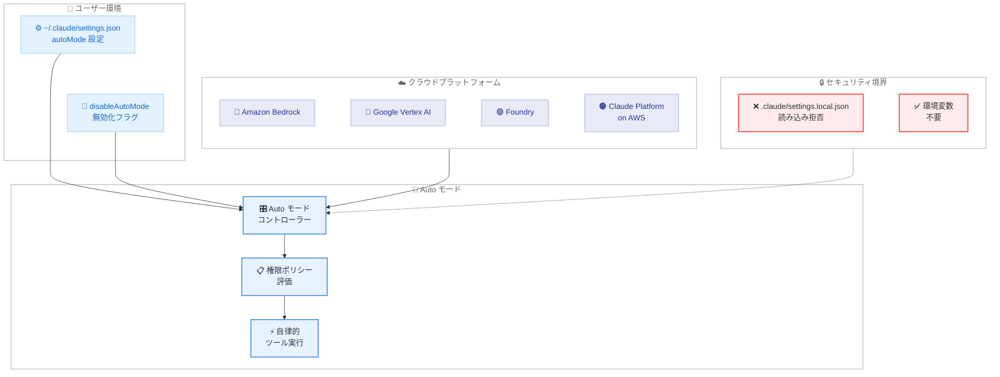
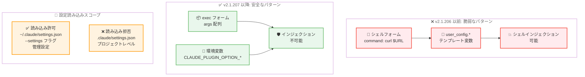

# Claude Code v2.1.207 リリース — Auto モード全プラットフォーム開放とセキュリティ強化

## メタデータ

| 項目 | 内容 |
|------|------|
| 発表日 | 2026-07-10 |
| ソース | Claude Code Changelog |
| カテゴリ | ツール更新 |
| 公式リンク | https://github.com/anthropics/claude-code/blob/main/CHANGELOG.md |

## 概要

Claude Code v2.1.207 (2026 年 7 月 10 日) がリリースされた。新機能・変更 5 件、バグ修正 17 件、改善 2 件の計 24 項目を含むリリースである。

本リリースの主要テーマは 3 つある。第一に、**Auto モードの全プラットフォーム開放**。Bedrock、Vertex AI、Foundry で `CLAUDE_CODE_ENABLE_AUTO_MODE` 環境変数なしに Auto モードが利用可能になった。第二に、**デフォルトモデルの Claude Opus 4.8 への変更**。Bedrock、Vertex、Claude Platform on AWS でデフォルトモデルが Claude Opus 4.8 に更新された。第三に、**プラグインのセキュリティ強化**。シェルインジェクション防止と設定読み込みスコープの制限により、サプライチェーン攻撃のリスクが低減された。

バグ修正では、ストリーミング中のターミナルフリーズ、管理設定の無断同意記録、偽陽性のプロンプトインジェクション警告など、日常利用に直接影響する 17 件の問題が修正された。特に Windows での無期限ハング修正と、エージェントチームのクラッシュループ修正は安定性の大幅な向上に寄与する。

## 詳細

### 背景

Claude Code の Auto モードは v2.1.83 で導入され、ユーザーの承認なしに自律的にタスクを実行する機能を提供する。従来、Bedrock、Vertex AI、Foundry では `CLAUDE_CODE_ENABLE_AUTO_MODE` 環境変数によるオプトインが必要であったが、機能の安定性が十分に確認されたため、全プラットフォームでデフォルト有効化された。

また、Claude Opus 4.8 が 2026 年 5 月 28 日にリリースされて以降、Claude Platform (API 直接利用) ではデフォルトモデルとして設定されていたが、Bedrock、Vertex、Claude Platform on AWS では旧モデルがデフォルトのままであった。本リリースでこれらのプラットフォームも統一された。

プラグインのセキュリティについては、`${user_config.*}` テンプレート変数がシェルフォームのコマンドで展開される際にシェルインジェクションのリスクがあることが確認された。また、プロジェクトレベルの `.claude/settings.json` からプラグインオプション値を読み込む機能は、悪意のあるリポジトリがプラグインの動作を操作するサプライチェーン攻撃ベクターとなり得た。

### 主な変更点

#### 新機能・変更

1. **Auto モードのオプトイン不要化**: Bedrock、Vertex AI、Foundry で `CLAUDE_CODE_ENABLE_AUTO_MODE` 環境変数なしに Auto モードが利用可能になった。無効化する場合は設定で `disableAutoMode` を指定する

2. **デフォルトモデルの Claude Opus 4.8 化**: Bedrock、Vertex、Claude Platform on AWS のデフォルトモデルが Claude Opus 4.8 に変更された

3. **Auto モード設定の読み込み元変更**: Auto モードは `.claude/settings.local.json` (リポジトリ内) から `autoMode` を読み込まなくなった。`~/.claude/settings.json` を使用する必要がある

4. **プラグインのシェルインジェクション修正**: プラグインの hooks/monitors/MCP headersHelper で、シェルフォームのコマンド内の `${user_config.*}` が拒否されるようになった。exec フォーム (`args` 配列) または `$CLAUDE_PLUGIN_OPTION_<KEY>` 環境変数の使用が必要

5. **プラグインオプション値の読み込みスコープ制限**: `pluginConfigs` の値がプロジェクトレベルの `.claude/settings.json` から読み込まれなくなった。ユーザー設定、`--settings` フラグ、管理設定のみが有効

#### バグ修正

**パフォーマンス・UX:**

6. **ストリーミング中のターミナルフリーズ修正**: 非常に長いリスト、テーブル、段落、コードブロックを含むレスポンスのストリーミング中にターミナルがフリーズし、キーストロークが遅延する問題を修正

7. **トランスクリプトのジャンプ修正**: レスポンスのストリーミング完了時にトランスクリプトが回答の先頭より上にジャンプする問題を修正

**セキュリティ・権限:**

8. **管理設定の無断同意記録修正**: 非インタラクティブ実行 (`claude -p`、SDK) からのリモート管理設定が、セキュリティ同意ダイアログを表示せずに永続的に同意済みとして記録される問題を修正

9. **偽陽性プロンプトインジェクション警告修正**: 無害なシステム生成の会話更新によって誤ったプロンプトインジェクション警告がトリガーされる問題を修正

10. **`/usage-credits` の入力検証修正**: 不正なフォーマットの金額値がサイレントに数字のみに変換されていた問題を修正。不正な金額はエラーとして拒否され、$1,000 を超える金額は確認入力が必要になった

**自動更新・ファイルシステム:**

11. **自動更新によるカスタムランチャー上書き修正**: 自動更新が `~/.local/bin/claude` のカスタムランチャースクリプトやシンボリックリンクをリリースごとに上書きしていた問題を修正。`/doctor` が外部管理ランチャーを検出して報告するようになった

12. **`extensions.worktreeConfig` の残留修正**: 最後の `worktree.sparsePaths` ワークツリーが削除された後にリポジトリの `.git/config` に `extensions.worktreeConfig` が残留し、go-git ツール (tea など) が壊れる問題を修正

13. **ブラケットパターンの不正修正**: ルール glob、スキルパス、`.ignore`、`.worktreeinclude` での不正なブラケットパターンがファイル読み込み、ファイルサジェスト、ワークツリー作成を破壊する問題を修正

**エージェント・バックグラウンド:**

14. **エージェントチームのクラッシュループ修正**: 不正なチームメイトメールボックスメッセージにより、メールボックスファイルを手動削除するまで毎秒エラーが繰り返されるクラッシュループを修正

15. **バックグラウンドセッションの名前表示修正**: プラン承認で自動命名されたバックグラウンドセッションが、エージェントビューの行にその名前を表示しない問題を修正

16. **バックグラウンドセッションのブランク復帰修正**: git ワークツリーに入ったバックグラウンドセッションが、エージェントリストからのコールドリオープン後にブランク状態で復帰する問題を修正

**Remote Control:**

17. **Remote Control のステータス更新消失修正**: ネットワーク中断やクレデンシャルリフレッシュからの接続回復時にタスクステータスの更新が消失する問題を修正

18. **デスクトップアプリの Remote Control 表示修正**: デスクトップアプリがホストする Remote Control セッションで、バックグラウンドエージェントとワークフローの進捗がモバイルおよび Web に表示されない問題を修正

**Deep Research:**

19. **Deep Research のソース表示修正**: Deep Research 実行時にすべての Fetch フェーズエージェントが "unknown" とラベル表示される問題を修正。チップにソースのホスト名が表示されるようになった

**プラットフォーム固有:**

20. **Bedrock の SSO クレデンシャル修正**: Bedrock が IAM Identity Center から毎回の API リクエストで新しい AWS SSO クレデンシャルを要求する問題を修正

21. **`cd` 複合コマンドの権限プロンプト修正**: `/dev/null` への出力リダイレクトのみの `cd` 複合コマンドで権限プロンプトが表示される問題を修正

22. **Windows の無期限ハング修正**: AWS クレデンシャル解決が停滞した場合 (stuck な `credential_process` など) に Windows で無期限ハングが発生する問題を修正

#### 改善

23. **エージェントビュー: テキスト貼り付けの折りたたみ改善**: 同じテキストを再度貼り付けた場合、新しい `[Pasted text #N]` プレースホルダーを追加する代わりに、折りたたまれた既存のプレースホルダーを展開するようになった

24. **エージェントビュー: ブロックセッションの表示改善**: ブロックされたセッションのプレビューが質問を先頭に表示し、同じタイムスタンプを 2 回表示する代わりに言葉による経過時間 (`waiting 3m`) を表示するようになった

### 技術的な詳細

#### Auto モードのプラットフォーム展開

Auto モードは、Claude Code が人間の承認を待たずに自律的にツール呼び出しを実行するモードである。従来は安全性の観点から段階的に展開されてきたが、v2.1.207 で全プラットフォームに対するオプトイン要件が撤廃された。

**動作の仕組み:**

- Auto モードでは Claude がツール呼び出しの可否を自律的に判断する
- 設定でモード別の権限ポリシーを定義可能
- `disableAutoMode` 設定により組織レベルで無効化が可能
- `autoMode` 設定は `~/.claude/settings.json` (ユーザーレベル) でのみ読み込まれ、リポジトリ内の `.claude/settings.local.json` からは読み込まれなくなった

この変更により、悪意のあるリポジトリがローカルの settings ファイルを通じて Auto モードの動作を制御するリスクが排除された。

#### プラグインセキュリティの強化

**シェルインジェクション防止:**

従来のシェルフォームでは、`${user_config.api_key}` のようなテンプレート変数がシェル経由で展開されるため、ユーザー入力値に `;rm -rf /` のようなペイロードが含まれる場合にコマンドインジェクションが可能であった。

v2.1.207 では以下の対策が適用された。

- シェルフォーム (`command` フィールド) での `${user_config.*}` の使用が拒否される
- hooks: exec フォーム (`args` 配列) または `$CLAUDE_PLUGIN_OPTION_<KEY>` 環境変数を使用
- monitors/headersHelper: スクリプト内部で値を読み込む

**プロジェクトスコープの制限:**

`pluginConfigs` の値はプロジェクトレベルの `.claude/settings.json` から読み込まれなくなった。これにより、リポジトリの所有者がクローンしたユーザーのプラグイン動作を操作することが不可能になった。

#### ストリーミングパフォーマンスの改善

長大なコンテンツ (数百行のリスト、大きなテーブル、長い段落、大きなコードブロック) のストリーミング中にターミナルがフリーズする問題は、レンダリングパイプラインのボトルネックに起因していた。ストリーミングチャンク到着ごとにターミナル全体を再描画していたことが原因で、高頻度のチャンク到着時に入力処理が遅延していた。修正により、差分レンダリングが導入され、変更された部分のみが更新されるようになった。

## アーキテクチャ図

### Auto モードのプラットフォーム展開構造



### プラグインセキュリティ修正の構造



## 開発者への影響

### 対象

- **Bedrock / Vertex AI / Foundry ユーザー**: Auto モードがオプトインなしで利用可能になった。デフォルトモデルも Claude Opus 4.8 に更新された。既存の `CLAUDE_CODE_ENABLE_AUTO_MODE` 環境変数設定は削除可能
- **プラグイン開発者**: シェルフォームでの `${user_config.*}` が使用不可になったため、exec フォームへの移行が必要。`pluginConfigs` のプロジェクトレベル読み込みも廃止された
- **全ユーザー**: ストリーミング中のターミナルフリーズが解消され、長大な出力でもスムーズな操作が可能になった
- **エージェントチーム利用者**: クラッシュループの修正により、不正なメールボックスメッセージによるシステム停止が防止される
- **Remote Control 利用者**: ネットワーク復帰時のステータス消失とデスクトップアプリからの進捗表示問題が修正された
- **Windows ユーザー**: AWS クレデンシャル解決の停滞による無期限ハングが修正された
- **Deep Research 利用者**: Fetch フェーズのソース識別が改善され、調査の透明性が向上した

### 必要なアクション

以下のコマンドで最新バージョンに更新できる。

```bash
# npm でのアップデート
npm update -g @anthropic-ai/claude-code

# Homebrew でのアップデート
brew upgrade claude-code

# 現在のバージョン確認
claude --version
```

**推奨される確認事項:**

- **プラグインの移行**: シェルフォームで `${user_config.*}` を使用しているプラグインは、exec フォームまたは環境変数に移行する
- **Auto モード設定の確認**: `.claude/settings.local.json` で `autoMode` を設定している場合、`~/.claude/settings.json` に移動する
- **不要な環境変数の削除**: `CLAUDE_CODE_ENABLE_AUTO_MODE` を設定している場合は削除可能
- **Auto モードの無効化**: 組織ポリシーとして Auto モードを無効化する場合は `disableAutoMode` を設定する

### 移行ガイド

#### プラグインのシェルインジェクション対策移行

**変更前 (v2.1.206 以前) - 脆弱なシェルフォーム:**

```json
{
  "hooks": {
    "on_save": {
      "command": "curl -H 'Authorization: ${user_config.api_key}' https://api.example.com"
    }
  }
}
```

**変更後 (v2.1.207) - 安全な exec フォーム:**

```json
{
  "hooks": {
    "on_save": {
      "command": "curl",
      "args": ["-H", "Authorization: $CLAUDE_PLUGIN_OPTION_API_KEY", "https://api.example.com"]
    }
  }
}
```

**変更後 - monitors/headersHelper でのスクリプト内読み込み:**

```bash
#!/bin/bash
# スクリプト内で環境変数を読み込む
API_KEY="$CLAUDE_PLUGIN_OPTION_API_KEY"
curl -H "Authorization: $API_KEY" https://api.example.com
```

#### Auto モード設定の移行

**変更前 - リポジトリ内設定 (読み込まれなくなった):**

```json
// .claude/settings.local.json (リポジトリ内 - 無視される)
{
  "autoMode": {
    "enabled": true,
    "permissions": ["read", "write"]
  }
}
```

**変更後 - ユーザーレベル設定:**

```json
// ~/.claude/settings.json (ユーザーレベル - 有効)
{
  "autoMode": {
    "enabled": true,
    "permissions": ["read", "write"]
  }
}
```

#### Auto モードの無効化

```json
// ~/.claude/settings.json
{
  "disableAutoMode": true
}
```

#### pluginConfigs の移行

**変更前 - プロジェクトレベル (読み込まれなくなった):**

```json
// .claude/settings.json (プロジェクト内 - 無視される)
{
  "pluginConfigs": {
    "my-plugin": {
      "api_key": "sk-xxx",
      "endpoint": "https://api.example.com"
    }
  }
}
```

**変更後 - ユーザーレベル設定:**

```json
// ~/.claude/settings.json (ユーザーレベル - 有効)
{
  "pluginConfigs": {
    "my-plugin": {
      "api_key": "sk-xxx",
      "endpoint": "https://api.example.com"
    }
  }
}
```

## コード例

```bash
# アップデート後の推奨ワークフロー
claude --version  # v2.1.207 を確認

# Auto モード環境変数の削除 (不要になった)
# .bashrc / .zshrc から以下を削除
# export CLAUDE_CODE_ENABLE_AUTO_MODE=1

# Auto モードの無効化 (必要な場合)
cat <<'EOF' > ~/.claude/settings.json
{
  "disableAutoMode": true
}
EOF

# Auto モード設定の移行
# .claude/settings.local.json から ~/.claude/settings.json へ移動
cat ~/.claude/settings.json | jq '.autoMode = {"enabled": true}'

# プラグイン設定の確認
# プロジェクトレベルの pluginConfigs が無視されることを確認
cat .claude/settings.json | jq '.pluginConfigs // empty'
# 上記に値がある場合は ~/.claude/settings.json に移動
```

```json
// ~/.claude/settings.json - Auto モード設定の完全な例
{
  "autoMode": {
    "enabled": true,
    "permissions": ["read", "write", "execute"]
  },
  "pluginConfigs": {
    "my-linter": {
      "endpoint": "https://lint.example.com",
      "api_key": "sk-xxx"
    }
  }
}
```

```json
// プラグインの hooks 定義 - exec フォームへの移行例
{
  "hooks": {
    "pre_commit": {
      "command": "node",
      "args": ["scripts/validate.js", "--key", "$CLAUDE_PLUGIN_OPTION_API_KEY"]
    },
    "post_save": {
      "command": "python",
      "args": ["-c", "import os; print(os.environ['CLAUDE_PLUGIN_OPTION_WEBHOOK_URL'])"]
    }
  }
}
```

## 関連リンク

- [Claude Code Changelog](https://github.com/anthropics/claude-code/blob/main/CHANGELOG.md)
- [Claude Code GitHub リポジトリ](https://github.com/anthropics/claude-code)
- [Claude Code ドキュメント](https://docs.anthropic.com/en/docs/claude-code)
- [Claude Code v2.1.206](./2026-07-09-claude-code-v2-1-206.md)
- [Claude Code v2.1.205](./2026-07-09-claude-code-v2-1-205.md)
- [Claude Opus 4.8 リリース](./2026-05-28-claude-opus-4-8.md)

## まとめ

Claude Code v2.1.207 は、プラットフォーム統一、セキュリティ強化、安定性向上の 3 軸に焦点を当てたリリースである。特に注目すべき点は以下の 4 つ。

第一に、**Auto モードの全プラットフォーム開放**により、Bedrock、Vertex AI、Foundry のユーザーも環境変数設定なしに Auto モードを利用できるようになった。同時に `autoMode` 設定のリポジトリ内読み込みが廃止され、悪意のあるリポジトリによる Auto モード操作のリスクが排除された。

第二に、**プラグインのセキュリティ強化**により、シェルインジェクション攻撃とサプライチェーン攻撃の 2 つのリスクが排除された。`${user_config.*}` のシェルフォームでの使用拒否と `pluginConfigs` のプロジェクトスコープ廃止は、破壊的変更であるがセキュリティ上不可欠な対策である。プラグイン開発者は速やかに exec フォームへの移行が必要である。

第三に、**ストリーミング中のターミナルフリーズ修正**により、長大な出力時の操作性が劇的に改善された。コードレビューや大規模ファイル生成時にフリーズしていた問題が解消され、ストリーミング中もスムーズにキーボード入力が可能になった。

第四に、**17 件のバグ修正**が日常的な安定性を改善する。特にエージェントチームのクラッシュループ、管理設定の無断同意記録、Windows の無期限ハングは深刻な問題であり、これらの修正はエンタープライズ環境での信頼性向上に直結する。

全 Claude Code ユーザーに対してアップデートを推奨する。特にプラグインを開発・使用しているユーザーは、シェルフォームから exec フォームへの移行と `pluginConfigs` の設定場所変更を速やかに実施すべきである。
