# Admin API User Management for Claude Enterprise

## メタデータ

| 項目 | 内容 |
|------|------|
| 発表日 | 2026-07-14 |
| ソース | Claude API Release Notes |
| カテゴリ | API アップデート |
| 公式リンク | https://platform.claude.com/docs/en/release-notes/overview |

## 概要

Anthropic は Claude Enterprise (claude.ai) 組織向けに、Admin API のユーザー管理機能をベータとして公開した。この新機能により、組織の管理者はプログラムからメンバーの一覧取得、ロール変更、招待の送信と取り消し、グループの管理、カスタムロールの読み取りなどを行えるようになる。すべての Claude Enterprise 組織でベータが有効化されている。

## 詳細

### 背景

これまで Claude Enterprise 組織のユーザー管理は、claude.ai の管理画面から手動で行う必要があった。大規模な組織では、メンバーのオンボーディングやオフボーディング、グループベースのアクセス制御を手作業で管理することが運用上の課題となっていた。

今回の Admin API ユーザー管理機能により、これらの操作をプログラムから自動化できるようになった。SCIM プロビジョニングや SSO と組み合わせることで、ID プロバイダーとの統合も可能である。

### 主な変更点

以下の 5 つのリソースに対する API エンドポイントが提供される。

1. **Members (メンバー)**: 組織のメンバー一覧取得、メールアドレスでの検索、ロール変更、メンバー削除
2. **Invites (招待)**: 招待の作成・一覧取得・取り消し、招待状態の追跡
3. **Groups (グループ)**: グループの作成・一覧取得・名前変更・削除
4. **Group Members (グループメンバー)**: グループへのメンバー追加・削除・一覧取得
5. **Custom Roles (カスタムロール)**: カスタムロールと権限の読み取り (読み取り専用)

### 技術的な詳細

**ベータヘッダー要件:**

- グループおよびカスタムロールのリクエストには `anthropic-beta: ce-user-management-2026-07-13` ヘッダーが必須 (ヘッダーなしでは 404 が返る)
- メンバーおよび招待のリクエストにはベータヘッダー不要

**認証と権限スコープ:**

| スコープ | 用途 |
|---------|------|
| `read:members` | メンバー・招待の GET エンドポイント、カスタムロール全般 |
| `write:members` | メンバー・招待の POST / DELETE エンドポイント |
| `read:rbac_groups` | グループの GET エンドポイント |
| `write:rbac_groups` | グループの POST / DELETE エンドポイント |
| `read:org_audit` | 上記すべての GET エンドポイント (セキュリティ監査向け) |

**組織ロール:**

| ロール | 説明 |
|--------|------|
| `user` | 標準メンバー |
| `managed` | グループに紐づくカスタムロールで権限が付与されるメンバー |
| `owner` | 組織オーナー |
| `membership_admin` | メンバーシップ管理者 |
| `primary_owner` | プライマリオーナー (1 名のみ) |

API から割り当て可能なロールは `user` と `managed` のみ。管理者ロール (`owner`、`membership_admin`、`primary_owner`) は claude.ai の設定画面から管理する。

**レート制限:**

- Admin API エンドポイント全体: 組織あたり 100 リクエスト/分
- 招待作成: 1,200 リクエスト/時間

**ページネーション:**

- メンバー・招待: ID ベースのページネーション (`before_id` / `after_id`、`limit` 最大 1000)
- グループ・カスタムロール: 不透明カーソルベース (`next_page` パラメータ)

## 開発者への影響

### 対象

- Claude Enterprise 組織の管理者
- IT 部門やセキュリティチームの自動化エンジニア
- ID プロバイダー (IdP) との統合を構築するチーム
- コンプライアンスおよび監査ワークフローを自動化するチーム

### 必要なアクション

1. **Admin API キーの作成**: プライマリオーナーが適切なスコープを持つ Admin API キーを作成する
2. **ベータヘッダーの追加**: グループおよびカスタムロール関連のリクエストに `anthropic-beta: ce-user-management-2026-07-13` ヘッダーを含める
3. **既存ワークフローの統合**: オンボーディング・オフボーディングの自動化スクリプトに新しいエンドポイントを組み込む

### 移行ガイド (該当する場合)

既存の Claude Enterprise 組織では、追加設定なしでベータが有効化されている。以下の点に注意する。

- メンバー・招待のエンドポイントは Claude Console 組織と共通だが、Claude Enterprise 固有のロール (`managed`) やグループ割り当て (`rbac_group_ids`) が利用可能
- SCIM プロビジョニングを使用している場合、SCIM 管理のグループは API から変更不可 (読み取りのみ)
- SSO で自動プロビジョニング (JIT / SCIM) が有効な場合、招待の作成は 400 エラーとなる

## コード例

### メンバー一覧の取得

```bash
curl "https://api.anthropic.com/v1/organizations/users?limit=20" \
  -H "x-api-key: $ANTHROPIC_ADMIN_KEY" \
  -H "anthropic-version: 2023-06-01"
```

レスポンス例:

```json
{
  "data": [
    {
      "type": "user",
      "id": "user_01AbCdEfGhIjKlMnOpQrSt",
      "email": "jane@example.com",
      "name": "Jane Smith",
      "role": "user",
      "added_at": "2026-06-12T09:14:03Z"
    }
  ],
  "has_more": false,
  "first_id": "user_01AbCdEfGhIjKlMnOpQrSt",
  "last_id": "user_01AbCdEfGhIjKlMnOpQrSt"
}
```

### メールアドレスでメンバーを検索

```bash
curl "https://api.anthropic.com/v1/organizations/users?email=jane@example.com" \
  -H "x-api-key: $ANTHROPIC_ADMIN_KEY" \
  -H "anthropic-version: 2023-06-01"
```

### メンバーのロールを変更

```bash
curl -X POST "https://api.anthropic.com/v1/organizations/users/user_01AbCdEfGhIjKlMnOpQrSt" \
  -H "content-type: application/json" \
  -H "x-api-key: $ANTHROPIC_ADMIN_KEY" \
  -H "anthropic-version: 2023-06-01" \
  -d '{"role": "managed"}'
```

### メンバーの削除

```bash
curl -X DELETE "https://api.anthropic.com/v1/organizations/users/user_01AbCdEfGhIjKlMnOpQrSt" \
  -H "x-api-key: $ANTHROPIC_ADMIN_KEY" \
  -H "anthropic-version: 2023-06-01"
```

### 招待の作成 (グループ割り当てあり)

```bash
curl -X POST "https://api.anthropic.com/v1/organizations/invites" \
  -H "content-type: application/json" \
  -H "x-api-key: $ANTHROPIC_ADMIN_KEY" \
  -H "anthropic-version: 2023-06-01" \
  -d '{
    "email": "newhire@example.com",
    "role": "managed",
    "rbac_group_ids": ["rbac_group_01UvWxYzAbCdEfGhIjKlMn"]
  }'
```

### 招待の取り消し

```bash
curl -X DELETE "https://api.anthropic.com/v1/organizations/invites/invite_01QrStUvWxYzAbCdEfGhIj" \
  -H "x-api-key: $ANTHROPIC_ADMIN_KEY" \
  -H "anthropic-version: 2023-06-01"
```

### グループ一覧の取得

```bash
curl "https://api.anthropic.com/v1/organizations/rbac_groups?limit=20" \
  -H "x-api-key: $ANTHROPIC_ADMIN_KEY" \
  -H "anthropic-beta: ce-user-management-2026-07-13"
```

レスポンス例:

```json
{
  "data": [
    {
      "type": "rbac_group",
      "id": "rbac_group_01UvWxYzAbCdEfGhIjKlMn",
      "name": "Engineering",
      "source_type": "direct",
      "roles": ["rbac_role_01CdEfGhIjKlMnOpQrStUv"],
      "created_at": "2026-03-18T10:01:42Z",
      "updated_at": "2026-05-02T08:55:09Z"
    }
  ],
  "has_more": false,
  "next_page": null
}
```

### グループの作成

```bash
curl -X POST "https://api.anthropic.com/v1/organizations/rbac_groups" \
  -H "content-type: application/json" \
  -H "x-api-key: $ANTHROPIC_ADMIN_KEY" \
  -H "anthropic-beta: ce-user-management-2026-07-13" \
  -d '{"name": "Engineering"}'
```

### グループへのメンバー追加

```bash
curl -X POST "https://api.anthropic.com/v1/organizations/rbac_groups/rbac_group_01UvWxYzAbCdEfGhIjKlMn/members" \
  -H "content-type: application/json" \
  -H "x-api-key: $ANTHROPIC_ADMIN_KEY" \
  -H "anthropic-beta: ce-user-management-2026-07-13" \
  -d '{"user_id": "user_01AbCdEfGhIjKlMnOpQrSt"}'
```

### グループからのメンバー削除

```bash
curl -X DELETE "https://api.anthropic.com/v1/organizations/rbac_groups/rbac_group_01UvWxYzAbCdEfGhIjKlMn/members/user_01AbCdEfGhIjKlMnOpQrSt" \
  -H "x-api-key: $ANTHROPIC_ADMIN_KEY" \
  -H "anthropic-beta: ce-user-management-2026-07-13"
```

### カスタムロール一覧の取得

```bash
curl "https://api.anthropic.com/v1/organizations/rbac_roles?limit=20" \
  -H "x-api-key: $ANTHROPIC_ADMIN_KEY" \
  -H "anthropic-beta: ce-user-management-2026-07-13"
```

### ロールの権限一覧の取得

```bash
curl "https://api.anthropic.com/v1/organizations/rbac_roles/rbac_role_01CdEfGhIjKlMnOpQrStUv/permissions?limit=20" \
  -H "x-api-key: $ANTHROPIC_ADMIN_KEY" \
  -H "anthropic-beta: ce-user-management-2026-07-13"
```

## アーキテクチャ図

```mermaid
flowchart TD
    subgraph Admin["🏢 Admin API User Management"]
        subgraph MemberOps["👥 Members / Invites"]
            direction LR
            ListMembers["📋 メンバー一覧"]
            ChangeRole["🔄 ロール変更"]
            RemoveMember["🗑️ メンバー削除"]
            SendInvite["📨 招待送信"]
            ListMembers ~~~ ChangeRole ~~~ RemoveMember ~~~ SendInvite
        end
        subgraph GroupOps["🏷️ Groups"]
            direction LR
            ListGroups["📋 グループ一覧"]
            CreateGroup["➕ グループ作成"]
            ManageMembers["👤 メンバー管理"]
            DeleteGroup["🗑️ グループ削除"]
            ListGroups ~~~ CreateGroup ~~~ ManageMembers ~~~ DeleteGroup
        end
        subgraph RoleOps["🔐 Custom Roles"]
            direction LR
            ListRoles["📋 ロール一覧"]
            GetPermissions["🔑 権限取得"]
            ListRoles ~~~ GetPermissions
        end
    end

    AdminUser(["👤 Admin"]) --> |"x-api-key"| MemberOps
    AdminUser --> |"x-api-key + beta header"| GroupOps
    AdminUser --> |"x-api-key + beta header"| RoleOps

    MemberOps --> |"anthropic-version: 2023-06-01"| API[("🔌 api.anthropic.com")]
    GroupOps --> |"anthropic-beta: ce-user-management-2026-07-13"| API
    RoleOps --> |"anthropic-beta: ce-user-management-2026-07-13"| API

    classDef platform fill:none,stroke:#CCCCCC,stroke-width:2px,color:#666666
    classDef layer fill:none,stroke:#E1BEE7,stroke-width:2px,color:#666666
    classDef process fill:#FFFFFF,stroke:#4A90E2,stroke-width:2px,color:#333333
    classDef user fill:#E3F2FD,stroke:#BBDEFB,stroke-width:2px,color:#1565C0
    classDef storage fill:#DCEDC8,stroke:#C5E1A5,stroke-width:2px,color:#33691E

    class Admin platform
    class MemberOps,GroupOps,RoleOps layer
    class ListMembers,ChangeRole,RemoveMember,SendInvite,ListGroups,CreateGroup,ManageMembers,DeleteGroup,ListRoles,GetPermissions process
    class AdminUser user
    class API storage
```



## 関連リンク

- [Admin API User Management ドキュメント](https://platform.claude.com/docs/en/manage-claude/user-management)
- [Admin API キーの作成](https://platform.claude.com/docs/en/manage-claude/admin-api-keys)
- [Admin API ガイド (Claude Console)](https://platform.claude.com/docs/en/manage-claude/admin-api)
- [Compliance API](https://platform.claude.com/docs/en/manage-claude/compliance-org-data)
- [Spend Limits API](https://platform.claude.com/docs/en/manage-claude/spend-limits-api)
- [Analytics APIs](https://platform.claude.com/docs/en/manage-claude/analytics-api)
- [Beta Headers](https://platform.claude.com/docs/en/api/beta-headers)

## まとめ

Admin API User Management は、Claude Enterprise 組織の管理者がプログラムからユーザーライフサイクル全体を管理できるようにする重要な機能追加である。メンバー管理、招待、グループベースのロール割り当て (RBAC)、カスタムロールの読み取りを API から操作できるようになり、大規模組織での運用自動化が可能となった。

特に注目すべきポイントは以下の通りである。

- すべての Claude Enterprise 組織でベータが即座に有効化されている
- グループとカスタムロールのリクエストにはベータヘッダー `anthropic-beta: ce-user-management-2026-07-13` が必須
- `read:org_audit` スコープを持つキーですべての GET エンドポイントにアクセス可能 (セキュリティ監査向け)
- SCIM / SSO との共存が考慮されており、ID プロバイダーが管理するリソースは API から変更不可

組織の IT チームは、既存のオンボーディング・オフボーディングワークフローにこれらのエンドポイントを統合することで、ユーザー管理の効率化とセキュリティ強化を実現できる。
