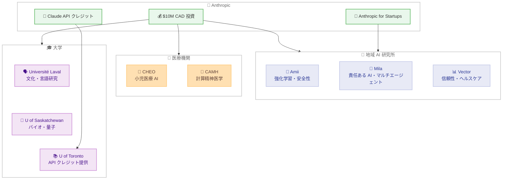

# Anthropic がカナダの AI 研究に 1,000 万カナダドルを投資

## メタデータ

| 項目 | 内容 |
|------|------|
| 発表日 | 2026-07-14 |
| ソース | Anthropic News |
| カテゴリ | パートナーシップ・投資 |
| 公式リンク | https://www.anthropic.com/news/canadian-ai-research |

## 概要

Anthropic はカナダの研究機関に対して 1,000 万カナダドル (約 $10M CAD) の資金提供を発表した。この投資は、有益で責任ある AI の応用研究を推進することを目的としており、カナダ全土の 8 つの主要機関と提携する。さらに、Anthropic for Startups プログラムにカナダの 3 大 AI 研究所を追加し、数百のスタートアップ企業に API クレジットを提供する。

カナダは世界で 8 番目に Claude.ai の利用が多い国であり、人口比では予測の 4 倍以上の利用率を誇る。2017 年に世界初の国家 AI 戦略を発表した AI 先進国への本格的な投資として注目される。

## 詳細

### 背景

カナダは現代 AI の基盤を築いた国として知られている。トロント、モントリオール、エドモントンの各都市から、AI の安全性に取り組む研究者が数多く輩出されてきた。Anthropic の共同創設者 Chris Olah 氏はこの文化に自身が形成されたと語り、「Anthropic がその次の章を支援できることを誇りに思う」と述べている。

カナダは 2017 年に世界初の国家 AI 戦略を発表し、2026 年 6 月には「AI for All」戦略を公開した。この戦略では以下を掲げている。

- カナダの AI 安全機関の強化
- AI リテラシーの拡大
- 3 つの国立 AI 研究所の基盤強化

Anthropic Economic Index (2026 年 3 月) によると、カナダは世界の Claude.ai 消費者利用の 2.6% を占め、人口比では予測の 4 倍以上の利用率を示している。

### 主な変更点

#### 提携機関と研究分野

**地域 AI 研究所 (3 機関)**

1. **Alberta Machine Intelligence Institute (Amii)**: 強化学習、AI の信頼性と安全性、カナダの主要経済セクターにおける AI 導入促進
2. **Mila (ケベック AI 研究所)**: 責任ある AI、ヘルスケア、サステナビリティ、マルチエージェントシステム、ロボティクス。科学的ブレークスルーの発見と評価を支援する AI アシスタントの開発
3. **Vector Institute (トロント)**: 信頼性と安全性、ヘルスケアと科学

**医療機関 (2 機関)**

4. **CHEO および CHEO Research Institute**: 子供、青少年、家族の健康アウトカム改善のための AI アプローチ
5. **Centre for Addiction and Mental Health (CAMH)**: Krembil Centre for Neuroinformatics を通じた計算精神医学研究、治療の予測モデル、精神科 AI システムの公平性評価、多言語 AI 対応メンタルヘルス教育

**大学 (3 機関)**

6. **Universit&eacute; Laval (知能データ研究所)**: 多様な文化的コンテキストにおける LLM の振る舞い、低リソース言語 (ケベックフランス語、先住民族言語) の研究
7. **University of Saskatchewan**: バイオメディカル、食料・水の安全保障、公衆衛生、量子コンピューティング
8. **University of Toronto Data Sciences Institute**: 科学的レビュープロセスに基づく Claude API クレジットの研究支援

#### Anthropic for Startups プログラム

- 2026 年夏に Amii、Mila、Vector を追加
- 提携スタートアップ各社に最低 $5,000 USD の API クレジットを提供
- Claude を基盤に構築するファウンダーにコミュニティとリソースを提供

### 技術的な詳細

#### アルバータ州政府の事例

アルバータ州テクノロジーイノベーション省は Claude Code を使用して、州のシステム全体にわたる 4 億 6,600 万行のコードを約 20 時間でレビューした。この手法は thevelocitywhitepapers.com を通じて他の政府機関に公開されている。

#### カナダにおける Claude 利用パターン

Anthropic Economic Index (2026 年 2 月の 100 万件の会話サンプル) による分析結果。

- ブリティッシュコロンビア州が一人当たりの利用率で首位
- オンタリオ州が会話総数で最大シェア
- 専門的・科学的・技術的業務が集中する州で利用率が高い
- 翻訳リクエストはバイリンガル要件のある政府職員が多い州で頻出
- ニューブランズウィック州、ノバスコシア州、ケベック州が翻訳関連会話で上位

## 開発者への影響

### 対象

- カナダの研究機関に所属する研究者
- Amii、Mila、Vector 提携のスタートアップ企業
- カナダの大学でAI 研究を行う学術関係者
- Claude API を利用したい研究プロジェクト

### 必要なアクション

1. **研究者**: 各提携機関を通じて研究資金や Claude API クレジットへの応募が可能。University of Toronto Data Sciences Institute では科学的レビュープロセスを経て API クレジットが提供される
2. **スタートアップ**: Amii、Mila、Vector に提携するスタートアップは Anthropic for Startups プログラムを通じて最低 $5,000 USD の API クレジットを受け取れる
3. **政府機関**: アルバータ州の事例を参考に、Claude Code を活用した大規模コードレビューの検討が可能

### 移行ガイド (該当する場合)

本発表は新規投資プログラムであるため、移行作業は不要。提携機関を通じたアクセス申請が主な手順となる。

## コード例

アルバータ州政府の事例のように、Claude Code を使用した大規模コードレビューの基本的なアプローチ。

```bash
# Claude Code を使用したリポジトリのコードレビュー例
claude "このリポジトリのセキュリティ脆弱性、コード品質の問題、
デッドコードを分析してレポートを作成してください"

# 複数リポジトリの一括レビュー (スクリプト例)
for repo in /path/to/repos/*/; do
  echo "=== Reviewing: $repo ==="
  cd "$repo"
  claude "このコードベースの主要な問題点を特定し、
  優先度順にリストアップしてください" --output-file "review-$(basename $repo).md"
done
```

## アーキテクチャ図



## 関連リンク

- [Anthropic 公式発表](https://www.anthropic.com/news/canadian-ai-research)
- [Anthropic Economic Index](https://www.anthropic.com/research/anthropic-economic-index)
- [Anthropic for Startups](https://www.anthropic.com/startups)
- [Alberta Machine Intelligence Institute (Amii)](https://www.amii.ca/)
- [Mila - Quebec AI Institute](https://mila.quebec/)
- [Vector Institute](https://vectorinstitute.ai/)
- [CHEO Research Institute](https://www.cheoresearch.ca/)
- [Centre for Addiction and Mental Health (CAMH)](https://www.camh.ca/)
- [カナダ「AI for All」戦略](https://ised-isde.canada.ca/site/ai-strategy/)

## まとめ

Anthropic のカナダ AI 研究への 1,000 万カナダドル投資は、同社の国際展開における重要なマイルストーンである。カナダは現代 AI の発祥地として深い学術基盤を持ち、世界初の国家 AI 戦略を策定した先進国でもある。

本投資の特徴は以下の通り。

- 基礎研究から応用まで幅広い分野をカバー (強化学習、マルチエージェントシステム、精神医学、量子コンピューティング、低リソース言語など)
- 医療分野への重点的な投資 (小児医療、メンタルヘルス)
- 文化的多様性への配慮 (ケベックフランス語、先住民族言語の研究)
- Anthropic for Startups プログラムを通じたエコシステム構築

アルバータ州政府が Claude Code で 4 億 6,600 万行のコードを 20 時間でレビューした事例は、政府機関における AI 活用の具体的な成功例として注目に値する。今後もカナダとの提携拡大が予定されており、民主主義国家が AI ガバナンスのルール形成をリードすべきという Anthropic のビジョンを体現する取り組みといえる。
