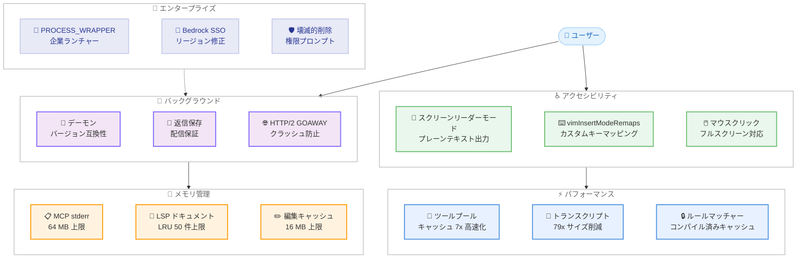

# Claude Code v2.1.208 リリース — スクリーンリーダーモード、メモリリーク修正、パフォーマンス大幅改善

## メタデータ

| 項目 | 内容 |
|------|------|
| 発表日 | 2026-07-14 |
| ソース | Claude Code Changelog |
| カテゴリ | Claude Code アップデート |
| 公式リンク | https://github.com/anthropics/claude-code/blob/main/CHANGELOG.md |

## 概要

Claude Code v2.1.208 (2026 年 7 月 14 日) がリリースされた。新機能 4 件、バグ修正 30 件、パフォーマンス改善 5 件、その他変更 7 件の計 46 項目を含む大規模リリースである。

本リリースの主要テーマは 3 つある。第一に、**アクセシビリティの強化**。スクリーンリーダーモードが新たに追加され、視覚支援技術を利用するユーザーがプレーンテキストレンダリングで Claude Code を操作できるようになった。第二に、**メモリリークの包括的修正**。MCP stdio サーバーの stderr 蓄積 (最大 64 MB)、LSP ドキュメントの無制限オープン、非同期フック出力の保持など、長時間セッションでのメモリ消費を引き起こす複数の問題が修正された。第三に、**パフォーマンスの大幅改善**。ツール呼び出しの CPU オーバーヘッド削減 (最大 7 倍高速化)、セッショントランスクリプトサイズの削減 (最大 79 倍)、ファイル編集キャッシュの 16 MB 制限など、リソース使用効率が飛躍的に向上した。

## 詳細

### 背景

Claude Code は開発者向けの AI コーディングアシスタントとして急速に普及しており、長時間セッション、バックグラウンドエージェント、MCP サーバー統合など、より高度なワークフローで利用されるケースが増えている。v2.1.208 は、こうした実運用で顕在化した安定性・パフォーマンス問題に包括的に対処するリリースである。

特にアクセシビリティ対応は、スクリーンリーダーユーザーからのフィードバックに基づく重要な改善であり、Ink ベースのリッチ UI レンダリングがスクリーンリーダーと互換性を持たない問題を根本的に解決する。

### 主な変更点

#### 新機能

1. **スクリーンリーダーモード**: スクリーンリーダーユーザー向けのプレーンテキストレンダリングモードを追加。`claude --ax-screen-reader` フラグ、`CLAUDE_AX_SCREEN_READER=1` 環境変数、または設定ファイルの `"axScreenReader": true` で有効化可能

2. **`vimInsertModeRemaps` 設定**: vim モードで `jj` のような 2 キーのインサートモードシーケンスを Escape にマッピングする機能を追加

3. **`CLAUDE_CODE_PROCESS_WRAPPER` 環境変数**: エージェントビューとバックグラウンドサービスが、すべての Claude Code 自己起動プロセスを企業ランチャー経由で実行できるようになった

4. **フルスクリーンモードでのマウスクリックサポート**: マルチセレクトメニューと "Other" 入力行でマウスクリックによる操作が可能になった

#### バグ修正

**モード・設定関連:**

5. **Fast モードの自動復元修正**: Fast モードをサポートするモデルに切り替えた後、Fast モードがオフのまま復帰しない問題を修正。設定で有効化されている場合は自動的に復元される

**バックグラウンドエージェント関連:**

6. **バックグラウンドエージェントへの返信消失修正**: バックグラウンドエージェントへの返信が配信失敗時に消失する問題を修正。テキストは保存され、セッション再起動時に配信される

7. **バックグラウンドセッションのアタッチ失敗修正**: アップデートにより実行中の `claude agents` プロセスのバイナリが置き換えられた後、バックグラウンドセッションのアタッチが永続的に失敗する問題 ("Couldn't start the background daemon") を修正

8. **コンテキストウィンドウの誤表示修正**: CLI の自動更新後にコンテキストウィンドウと auto-compact インジケーターが一時的に 200k にリセットされ、長いコンテキストセッション再開時に誤った "100% context used" が表示される問題を修正

9. **HTTP/2 GOAWAY クラッシュ修正**: リクエスト処理中にサーバーが HTTP/2 接続を GOAWAY で閉じた際に、supervised セッションおよびバックグラウンドセッションがクラッシュする問題を修正

**出力・ストリーミング関連:**

10. **パイプ出力の切り詰め修正**: `claude -p` から大きなレスポンスをパイプする際に stream-json/JSON 出力が切り詰められ、結果メッセージが欠落する問題を修正

11. **科学的記数法の環境変数修正**: `CLAUDE_CODE_MAX_OUTPUT_TOKENS` などの環境変数が科学的記数法の値 (`1e6`) を使用した際に仮数部のみ (`1`) が使用される問題を修正

12. **大規模 Markdown テーブルの描画修正**: 200 行を超える非常に大きな Markdown テーブルがレンダリングをストールさせるかメモリを過剰に消費する問題を修正。200 行を超えるテーブルは先頭 200 行と "... N more rows" 表示になる

**ツール関連:**

13. **Edit ツールのファイル変更対応修正**: 読み取り後に変更されたファイルで、ターゲットテキストが依然として一意にマッチする場合に Edit ツールが失敗する問題を修正

14. **Read/Grep/Glob ツールの複数修正**: Read がオフセットを超えた空ファイルを "shorter than offset" と報告する問題、Grep が無効な正規表現パターンで "No files found" を返す問題、Grep count モードのページネーション時の合計値過少報告、Glob がパターン・パス・作業ディレクトリに null バイトを含む場合にクラッシュする問題を修正

**認証・接続関連:**

15. **`apiKeyHelper` スクリプトエラーの表示修正**: `apiKeyHelper` スクリプトの失敗が約 10 回のサイレントリトライ後に汎用 401 エラーの裏に隠される問題を修正。3 回以内にスクリプト自体のエラーが表示される

16. **Bedrock ストリーミングエラーの改善**: ゲートウェイがレスポンスを変換する際に誤解を招く "Truncated event message received" エラーが表示される問題を修正。content-type を明示し、プロキシを指摘するエラーメッセージに改善

17. **Bedrock SSO 認証の修正**: AWS SSO プロファイルの `sso_region` が Bedrock リージョンと異なる場合に "Session token not found or invalid" で認証が失敗する問題を修正 (2.1.207 リグレッション)

**UI・表示関連:**

18. **`/upgrade` コマンドの修正**: ブラウザが開けない場合に、アップグレード URL の代わりにログインフローが表示される問題を修正

19. **stream-json 入力のセッションクラッシュ修正**: Windows 形式の SDK ホストからの空白 CRLF または空白のみの行でセッションが終了する問題を修正

20. **headless stream-json セッションのハング修正**: `control_request` が非文字列型の `set_model` ペイロードを含む場合にセッションが永続的にハングする問題を修正。エラーレスポンスが返されるようになった

21. **セッション再開時の重複通知修正**: "No completion record was found" 通知が繰り返し表示される問題を修正。孤立したバックグラウンドタスクは単一のサマリーに集約される

22. **Remote Control クライアントの表示修正**: ターミナルホストセッションに接続した Remote Control クライアントが、タスク開始・停止まではバックグラウンドエージェントとワークフロー進捗を表示できない問題を修正

23. **Agent ツールのツールなし起動修正**: サブエージェントの `tools` リストが空に解決される場合に Agent ツールがツールなしで起動する問題を修正。認識されないエントリを明示するエラーが返される

24. **`/usage` と `/mcp` の表示修正**: `/usage` が古いキャッシュバーを新しいデータの上に表示する問題、`/mcp` が設定編集後にプレースホルダーサーバーを再分類しない問題を修正

25. **SDK ホストでのディレクトリ変更修正**: バックグラウンドタスクが実行中のアイドルセッションで "A turn is in progress" エラーが発生する問題を修正

26. **ワークフロー保存ダイアログの修正**: ユーザースコープ保存時に `CLAUDE_CONFIG_DIR` の場所ではなく `~/.claude/workflows/` が表示される問題を修正

27. **`/release-notes` のコンテキスト汚染修正**: "Show all" が閲覧したノート全体をモデルのコンテキストに注入し、後続のリクエストすべてに影響する問題を修正

28. **エージェントビューのメモリリーク修正**: 送信済みピークリプライの貼り付け画像がスクリーンのライフタイム全体にわたって保持される問題を修正

29. **SDK セッションのエージェント消失修正**: プラグインリフレッシュがクライアント接続前に実行された場合に、initialize リクエストで定義されたエージェントが消失する問題を修正

**メモリリーク関連:**

30. **長時間セッションの複数メモリリーク修正**: MCP stdio サーバーの stderr がサーバーあたり最大 64 MB 蓄積する問題、LSP ドキュメントが無制限にオープンされ続ける問題 (50 ドキュメント上限の LRU に変更)、バックグラウンド化後の非同期フック出力の保持、headless/SDK セッションでの大きなツール結果ペイロードによる無制限成長を修正

31. **超長行ファイルのメモリ爆発修正**: 極端に長い単一行を含むファイルを offset/limit で読み取る際にメモリが爆発する問題を修正。行全体をロードする代わりにクリーンなエラーを返す

**パフォーマンス関連:**

32. **権限ルール評価の低速化修正**: 多数の permission deny/ask ルールがあるセッションでターンごとに数秒の遅延が発生する問題を修正。ルールマッチャーが一度コンパイルされキャッシュされるようになった

#### パフォーマンス改善

33. **入力レスポンシブネスの改善**: エージェントタスクリストの更新中の入力応答性を改善。タスク更新が UI 全体を再レンダリングしなくなった

34. **ツール呼び出し CPU オーバーヘッドの削減**: 多数の MCP ツールを持つ print/SDK セッションでのツール呼び出しごとの CPU オーバーヘッドを削減。ツールプール組み立てのキャッシュにより、高ツール数環境で最大 7 倍高速化

35. **ファイル編集キャッシュのメモリ制限**: ファイル編集読み取りキャッシュを最大 1,000 ファイルのピン留めから 16 MB に制限し、メモリ使用量を削減

36. **セッショントランスクリプトサイズの削減**: 編集を多用するセッションでセッショントランスクリプトサイズを最大 79 倍削減。置き換えられたファイル履歴バックアップの剪定によりチェックポイントディスク使用量も制限

37. **セッション再開時のメモリ使用量削減**: バックグラウンドエージェントまたは大規模会話から派生したフォークを持つセッションの再開時のメモリ使用量を削減

#### その他の変更

38. **完了済みバックグラウンドエージェントの表示維持**: 完了したバックグラウンドエージェントが即座に消えるのではなく、クリーンアップまで `/tasks` にリスト表示される

39. **停止済みバックグラウンドエージェントの即時表示**: 停止したバックグラウンドエージェントにアタッチすると、"Session is starting" の空白画面ではなく、セッションウォームアップ中にトランスクリプトが即座に表示される

40. **デーモンバージョン互換性改善**: 古いデーモンが新しいバージョンによって起動されたワーカーを古いバイナリで再起動しなくなった

41. **エージェントビュー Ctrl+X 改善**: リネームされたブランチのワークツリー削除、未プッシュコミットの保護、ワークツリー保持時のセッション行維持、再利用されたワークツリー名の現在のベースへのリセットに対応

42. **壊滅的削除コマンドの権限プロンプト**: `$(...)` / バッククォート / `<(...)` を含むコマンド内の壊滅的削除 (例: `rm -rf ~`) が `--dangerously-skip-permissions` および auto モードでもプロンプト表示される

43. **バックグラウンドセッションでの UI 制限**: `/install-github-app` と `/mcp` 設定メニューがバックグラウンドセッションで開かれなくなった

44. **空 URL の MCP サーバー表示改善**: 空の URL で設定された MCP サーバーが設定エラーではなく "not configured" と表示される

45. **`/usage` のレート制限時表示改善**: 使用量エンドポイントがレート制限されている場合、エラー画面ではなく "as of" ノート付きで最後の既知の使用量バーが表示される

### 技術的な詳細

#### スクリーンリーダーモードのアーキテクチャ

Claude Code のターミナル UI は Ink (React for CLI) をベースとしており、リッチなレンダリング (色、レイアウト、アニメーション) を提供する。しかし、この出力はスクリーンリーダーが解釈するテキストバッファと互換性がなく、読み上げ内容が断片化・重複する問題があった。

スクリーンリーダーモードでは、Ink のレンダリングパイプラインをバイパスし、プレーンテキストのみを出力する。ANSI エスケープシーケンス、カーソル制御、画面クリアなどが除外され、スクリーンリーダーが正確にコンテンツを読み上げられるようになる。

#### メモリリーク修正の詳細

長時間実行セッションで以下のメモリリークが確認・修正された。

- **MCP stdio サーバーの stderr 蓄積**: 各 MCP サーバーの stderr 出力がバッファリングされ、サーバーあたり最大 64 MB まで無制限に蓄積されていた。定期的なフラッシュにより制限
- **LSP ドキュメントキャッシュ**: Language Server Protocol のドキュメントハンドルが閉じられずに蓄積されていた。50 ドキュメント上限の LRU キャッシュに変更
- **非同期フック出力**: バックグラウンド化されたフックの出力が参照を保持し続けていた。バックグラウンド化後に解放
- **headless/SDK セッションのツール結果**: 大きなツール結果ペイロードが無制限に蓄積されていた。古い結果の参照を解放

#### パフォーマンス改善の技術的背景

**ツールプール組み立てキャッシュ (最大 7 倍高速化):**

MCP ツールが多い環境 (数十〜数百のツール定義) では、各ツール呼び出しの前にツールプールの組み立て処理が実行されていた。この処理にはツール定義のマージ、バリデーション、スキーマ解決が含まれ、ツール数に比例して CPU コストが増大していた。キャッシュ機構の導入により、ツール定義が変更されない限り再組み立てが不要になった。

**セッショントランスクリプト削減 (最大 79 倍):**

ファイル編集操作ごとにファイル全体の履歴バックアップがトランスクリプトに保存されていたため、編集を多用するセッションではトランスクリプトサイズが急激に膨張していた。置き換えられた (superseded) バックアップを剪定する機構の導入により、最新のバックアップのみが保持される。

**権限ルールマッチャーのキャッシュ:**

多数の permission deny/ask ルールが登録されている環境では、ターンごとに全ルールのパターンマッチングが実行されていた。各ルールのマッチャー (glob パターンや正規表現) をコンパイル済みの状態でキャッシュすることで、評価コストが大幅に削減された。

## アーキテクチャ図



## 開発者への影響

### 対象

- **アクセシビリティを必要とするユーザー**: スクリーンリーダーモードにより、視覚支援技術との完全な互換性が実現。プレーンテキスト出力でスクリーンリーダーが正確にコンテンツを読み上げ可能
- **Vim ユーザー**: `vimInsertModeRemaps` により、`jj` → Escape などのカスタムキーマッピングが設定可能
- **長時間セッション利用者**: メモリリーク修正とキャッシュ制限により、数時間以上のセッションでもメモリ消費が安定
- **MCP ツールを多用するユーザー**: ツールプールキャッシュにより、多数のツールを登録した環境でのツール呼び出しが最大 7 倍高速化
- **エンタープライズユーザー**: `CLAUDE_CODE_PROCESS_WRAPPER` により、企業のセキュリティランチャーを経由したプロセス起動が可能
- **Bedrock ユーザー**: SSO リージョン不一致による認証失敗 (v2.1.207 リグレッション) が修正
- **バックグラウンドエージェント利用者**: 返信消失、アタッチ失敗、HTTP/2 クラッシュなど複数の安定性問題が修正

### 必要なアクション

以下のコマンドで最新バージョンに更新できる。

```bash
# npm でのアップデート
npm update -g @anthropic-ai/claude-code

# Homebrew でのアップデート
brew upgrade claude-code

# 現在のバージョン確認
claude --version
```

**推奨される確認事項:**

- **スクリーンリーダー利用者**: スクリーンリーダーモードを有効化し、出力が正しく読み上げられることを確認
- **Vim ユーザー**: `vimInsertModeRemaps` を設定して希望のキーマッピングが動作することを確認
- **Bedrock SSO ユーザー**: v2.1.207 で発生した認証失敗が解消されたことを確認
- **長時間セッション利用者**: メモリ消費が安定していることを確認

### 移行ガイド (該当する場合)

本リリースには破壊的変更はない。v2.1.207 からのリグレッション修正 (Bedrock SSO 認証) が含まれるため、v2.1.207 で問題が発生していたユーザーはアップデートが強く推奨される。

## コード例

### スクリーンリーダーモードの有効化

```bash
# 方法 1: コマンドラインフラグ
claude --ax-screen-reader

# 方法 2: 環境変数
export CLAUDE_AX_SCREEN_READER=1
claude

# 方法 3: .bashrc / .zshrc に永続設定
echo 'export CLAUDE_AX_SCREEN_READER=1' >> ~/.bashrc
source ~/.bashrc
claude
```

```json
// 方法 4: settings.json に設定
// ~/.claude/settings.json
{
  "axScreenReader": true
}
```

### vimInsertModeRemaps の設定

```json
// ~/.claude/settings.json
{
  "vimInsertModeRemaps": {
    "jj": "Escape",
    "jk": "Escape"
  }
}
```

```json
// より高度な例: 複数のリマップを設定
// ~/.claude/settings.json
{
  "vimMode": true,
  "vimInsertModeRemaps": {
    "jj": "Escape",
    "kk": "Escape",
    "jk": "Escape"
  }
}
```

### CLAUDE_CODE_PROCESS_WRAPPER の使用

```bash
# 企業ランチャーを経由してすべての子プロセスを起動
export CLAUDE_CODE_PROCESS_WRAPPER="/usr/local/bin/corporate-launcher"
claude

# エージェントビューやバックグラウンドサービスの自己起動が
# corporate-launcher 経由で実行される
```

## 関連リンク

- [Claude Code Changelog](https://github.com/anthropics/claude-code/blob/main/CHANGELOG.md)
- [Claude Code GitHub リポジトリ](https://github.com/anthropics/claude-code)
- [Claude Code ドキュメント](https://docs.anthropic.com/en/docs/claude-code)
- [Claude Code v2.1.207](./2026-07-10-claude-code-v2-1-207.md)

## まとめ

Claude Code v2.1.208 は、アクセシビリティ、メモリ管理、パフォーマンスの 3 軸に焦点を当てた大規模リリースである。46 項目の変更を含み、特に以下の 4 点が注目に値する。

第一に、**スクリーンリーダーモードの追加**により、視覚支援技術を利用するユーザーが Claude Code を快適に操作できるようになった。コマンドラインフラグ、環境変数、設定ファイルの 3 つの方法で有効化でき、プレーンテキストレンダリングによりスクリーンリーダーとの互換性が確保される。

第二に、**メモリリークの包括的修正**により、長時間セッションの安定性が劇的に向上した。MCP stderr の 64 MB 蓄積、LSP ドキュメントの無制限オープン、非同期フック出力の保持、headless セッションでのツール結果ペイロード蓄積など、複数のメモリリークパターンが同時に修正された。

第三に、**パフォーマンスの大幅改善**により、日常的な操作の快適性が向上した。ツールプールキャッシュによる最大 7 倍のツール呼び出し高速化、セッショントランスクリプトサイズの最大 79 倍削減、ファイル編集キャッシュの 16 MB 制限など、具体的な数値改善が多数含まれる。

第四に、**30 件のバグ修正**がバックグラウンドエージェント、認証、UI 表示など広範な領域の問題を解消する。特に Bedrock SSO 認証の v2.1.207 リグレッション修正は、影響を受けているユーザーにとって緊急のアップデート理由となる。

全 Claude Code ユーザーに対してアップデートを推奨する。特にスクリーンリーダーを使用するユーザー、長時間セッションを実行するユーザー、多数の MCP ツールを活用するユーザーは、本リリースの恩恵を大きく受けるだろう。
