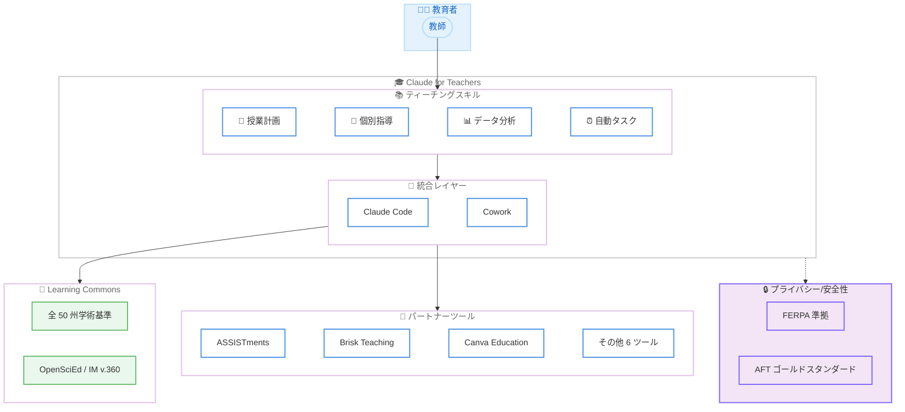

# Claude for Teachers: 米国 K-12 教育者向け無料プレミアムアクセスの提供開始

## メタデータ

| 項目 | 内容 |
|------|------|
| 発表日 | 2026-07-14 |
| ソース | Anthropic News |
| カテゴリ | プロダクト発表 |
| 公式リンク | https://www.anthropic.com/news/claude-for-teachers |

## 概要

Anthropic は 2026 年 7 月 14 日、米国の認証済み K-12 教育者に対して Claude のプレミアム機能を無料で提供する「Claude for Teachers」を発表した。学習科学に基づいたティーチングスキルのライブラリを搭載し、全 50 州の学術基準に対応した Learning Commons と接続することで、教師の授業準備や個別指導を支援する。9 つのパートナーツールとの連携、FERPA 準拠のプライバシー保護、米国教員連盟 (AFT) との安全基準策定など、教育現場に特化した包括的なソリューションとなっている。

## 詳細

### 背景

数十年にわたる教育研究により、個別指導 (differentiation)、習熟度ベースの学習、少人数グループ指導が学習成果を向上させることが示されている。しかし、教師はこれらの実践に必要な時間とリソースが慢性的に不足しており、特にリソースの乏しい学校ではその負担が深刻である。Stanford 大学の研究によると、教師向け AI ツールは「教育実践を強化し、生徒の学習成果を改善する」可能性がある。

Claude for Teachers は、この課題に対して AI を活用したソリューションを提供することで、教師が本来の教育活動に集中できる環境を整備することを目的としている。

### 主な変更点

Claude for Teachers は以下の主要機能を提供する。

**ティーチングスキルライブラリ**

Learning Commons と共同開発されたスキルセットが含まれる。

- **Lesson Planning from High-Quality Materials**: 州の学術基準にマッピングされたカリキュラムを参照し、学習要素と進度を考慮した授業計画と生徒向け教材を作成
- **Differentiation**: 各習熟度レベルに合わせた個別化計画を作成し、足場かけ (scaffolding) や発展課題を含む教材を生成
- **Class Data Analysis**: 出席記録、診断テスト、メモなどのデータをアップロードし、各生徒の学習状況を包括的に分析
- **Scheduled Repeated Tasks**: 毎日の振り返りチケットの確認と翌日の授業計画の調整など、繰り返しタスクの自動化 (例: 毎日午後 4 時に自動実行)

**パートナーツール (9 ツール)**

教育エコシステムとの連携を実現する以下のツールが初期段階で統合されている。

1. **ASSISTments**: 自動採点機能付きの基準準拠数学問題
2. **Brisk Teaching**: インタラクティブな生徒向けアクティビティと基準準拠レッスン
3. **Canva Education**: 教室対応のデザインとインタラクティブな学習体験
4. **Coteach**: K-12 カリキュラムに基づいた高品質な数学図表
5. **Diffit**: あらゆる生徒に対応した教材の作成と適応
6. **Eedi**: 生徒の思考を明らかにする診断質問 (英語/スペイン語対応)
7. **MagicSchool**: 教材を教室で使える形式に変換
8. **Snorkl**: クラス、課題、生徒の進捗に関するインサイト
9. **TeachFX**: 実際の教室での会話からパーソナライズされた指導フィードバック

**Learning Commons 接続**

全 50 州の学術基準に加え、各基準の下位にある学習コンピテンシーと典型的な学習順序にアクセス可能。OpenSciEd や Illustrative Mathematics の IM v.360 とも統合されており、レッスンは体系的にスキャフォールドされ、基準に整合している。

### 技術的な詳細

**Claude Code と Cowork の統合**

- **Class Data Analysis**: 教師がデータフォルダ (出席簿、診断テスト結果、メモなど) をアップロードすると、Claude Code を活用して各生徒の学習状況を分析。教師が共有するデータを完全にコントロール可能
- **Scheduled Repeated Tasks**: Cowork 機能を利用し、定期的なタスクを自動実行。例えば毎日午後 4 時に exit ticket を分析し、翌日の授業計画を自動調整

**プライバシーとセキュリティ**

- 教育者専用 (Claude の 18 歳以上ポリシーに準拠)
- 教育者データはモデルのトレーニングに使用されない
- FERPA 準拠の K-12 Data Processing Addendum による生徒情報保護
- 教育者向け専用利用規約の策定
- 米国教員連盟 (AFT) と共同で K-12 教育における安全性とプライバシーのゴールドスタンダードを策定中

**オープンソース**

ティーチングスキルはオープンソースリポジトリとして公開されている。

- リポジトリ: `anthropics/k12-teacher-skills`
- スキル評価方法論に関するテクニカルライトアップも公開

## 開発者への影響

### 対象

- 米国の K-12 認証済み教育者
- 教育テクノロジー開発者 (パートナーツール連携)
- 学区および学校管理者
- 教育研究者

### 必要なアクション

**教育者向け**

1. claude.com/solutions/teachers にアクセスして認証プロセスを完了
2. 2027 年 6 月 30 日までにサインアップすると 1 年間のフルアクセスを無料で利用可能
3. ティーチングスキルの活用を開始

**教育テクノロジー開発者向け**

1. Anthropic のコネクタディレクトリで新しい教育向けコネクタを確認
2. オープンソースリポジトリ (`anthropics/k12-teacher-skills`) を参照してスキルの構造を理解
3. パートナーツールとの連携インターフェースを検討

**学区/学校管理者向け**

1. 学校/学区向け提供は近日公開予定
2. 現時点では Claude for Nonprofits を通じてアクセス可能

### 移行ガイド (該当する場合)

現時点では既存サービスからの移行は不要。新規サービスとしての提供のため、教育者は新規登録のみで利用を開始できる。

## コード例

Claude for Teachers のティーチングスキルはオープンソースとして公開されている。以下はスキルリポジトリの活用例を示す。

```bash
# オープンソースティーチングスキルリポジトリのクローン
git clone https://github.com/anthropics/k12-teacher-skills.git

# スキル構造の確認
ls k12-teacher-skills/
```

## アーキテクチャ図



## 関連リンク

- [Claude for Teachers 公式ページ](https://www.anthropic.com/news/claude-for-teachers)
- [Claude for Teachers サインアップ](https://claude.com/solutions/teachers)
- [教育者向け利用規約](https://support.claude.com/en/articles/15926041)
- [オープンソースティーチングスキルリポジトリ](https://github.com/anthropics/k12-teacher-skills)
- [AI Fluency for K-12 Teachers コース](https://www.anthropic.com/news/claude-for-teachers)
- [Claude for Nonprofits](https://www.anthropic.com/solutions/nonprofits)

## まとめ

Claude for Teachers は、Anthropic が教育分野に本格参入する重要なマイルストーンである。認証済み K-12 教育者に対してプレミアム機能を無料提供するという大胆な戦略により、教育現場での AI 活用を加速させることを目指している。

主要なポイントは以下の通りである。

- **無料アクセス**: 認証済み教育者は 2027 年 6 月 30 日までのサインアップで 1 年間無料
- **学習科学に基づく設計**: Learning Commons との連携により、全 50 州の学術基準に準拠したスキルを提供
- **エコシステムの構築**: 9 つのパートナーツールとオープンソースリポジトリにより、教育テクノロジーコミュニティとの協力体制を確立
- **プライバシー最優先**: FERPA 準拠、データ非学習利用、AFT との安全基準策定により、教育現場に適したプライバシー保護を実現
- **パイロットプログラム**: Detroit Public Schools Community District での実証実験や Gates Foundation とのパートナーシップにより、実際の教育成果への影響を検証

教育者は個人で今すぐサインアップ可能であり、学校/学区レベルでの提供も近日開始予定。AI を活用した教育支援の新しいスタンダードとなる可能性を持つサービスである。
