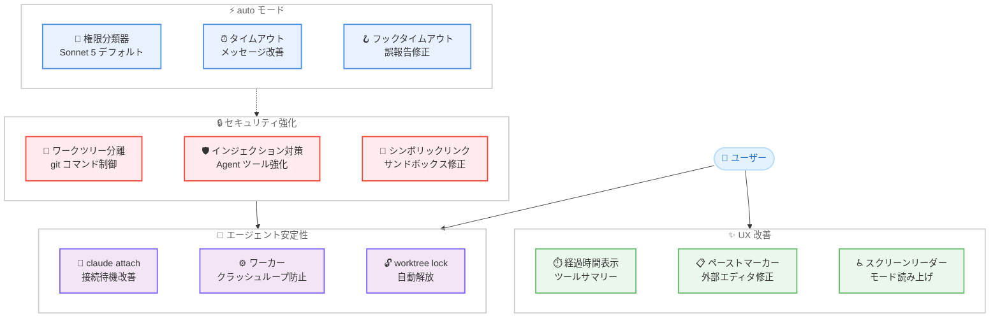

# Claude Code v2.1.209 & v2.1.210 リリース — セキュリティ強化、エージェント安定性改善、UX 多数修正

## メタデータ

| 項目 | 内容 |
|------|------|
| 発表日 | 2026-07-15 |
| ソース | Claude Code Changelog |
| カテゴリ | Claude Code アップデート |
| 公式リンク | https://github.com/anthropics/claude-code/blob/main/CHANGELOG.md |

## 概要

Claude Code v2.1.209 および v2.1.210 (2026 年 7 月 15 日) が同日リリースされた。v2.1.209 はバックグラウンドセッションでのダイアログブロック問題を修正する小規模パッチである。v2.1.210 は新機能 2 件、セキュリティ修正 4 件、安定性修正 20 件、改善 8 件の計 34 項目を含む大規模リリースとなる。

本リリースの主要テーマは 3 つある。第一に、**セキュリティの強化**。ワークツリー分離の不備修正、間接プロンプトインジェクション対策、`ultracode` キーワードの誤発火防止、シンボリックリンクによるサンドボックス回避の修正など、複数のセキュリティ上の懸念が解消された。第二に、**エージェントシステムの安定性向上**。`claude attach` の接続失敗、バックグラウンドワーカーのクラッシュループ、セッション削除後のゴーストフレーム残留など、エージェント関連の多数の問題が修正された。第三に、**UX の改善**。ツール実行時間の可視化、ペーストマーカーの外部エディタへの漏出修正、スクリーンリーダーモードの権限モード読み上げ対応など、日常的な操作体験が向上している。

## 詳細

### 背景

v2.1.208 の翌日にリリースされた本バージョンは、エージェントシステム (`claude agents`) の急速な普及に伴い顕在化したセキュリティおよび安定性の問題に集中的に対処している。特にワークツリー分離の不備は、サブエージェントが意図せずメインリポジトリに対して git 操作を実行できる問題であり、セキュリティ上の重要な修正である。

また、v2.1.209 は v2.1.208 で導入されたバックグラウンドセッションでの UI 制限 (ダイアログブロック) が過度に広範であった問題のリバートであり、`/model` コマンドなど正当なダイアログまで遮断していた問題を即座に解消するホットフィックスである。

### 主な変更点

#### 新機能

1. **ツール実行時間カウンターの追加**: 折りたたまれたツールサマリー行にライブ経過時間カウンターが表示されるようになった。長時間実行中のツール呼び出しが視覚的にカウントアップし、処理がフリーズしているように見える問題を解消

2. **権限ルールの起動時警告**: `Write(path)`、`NotebookEdit(path)`、`Glob(path)` の権限ルールに対して起動時に警告が表示されるようになった。代わりに `Edit(path)` または `Read(path)` を使用するよう案内される

#### セキュリティ修正

3. **ワークツリー分離の不備修正**: `isolation: 'worktree'` で起動されたサブエージェントが、自身の分離されたワークツリーではなくメインリポジトリのチェックアウトに対して git 変更コマンドを実行できる問題を修正

4. **`ultracode` キーワードの誤発火修正**: `ultracode` キーワードオプトインが、Webhook ペイロードやリレーされた PR コメントなど人間以外の入力に対しても発火する問題を修正

5. **間接プロンプトインジェクション対策**: サブエージェントが読み取ったコンテンツ経由での間接プロンプトインジェクションに対して Agent ツールを強化

6. **シンボリックリンクによるサンドボックス回避修正**: セッション開始後に出現する `.claude/*` シンボリックリンクがサンドボックスの書き込み拒否リストに反映されない問題を修正

#### 安定性修正

7. **`claude attach` の接続失敗修正**: セッション遷移中に `claude attach` が "job not found" や "agent is still starting" エラーで失敗する問題を修正。デーモンが安定するまで待機するようになった

8. **ツール結果レンダラーのクラッシュ修正**: ツールの結果レンダラーが bigint 値やプレーンテキストを UI 要素の代わりに返した場合にセッションがクラッシュする問題を修正

9. **フックタイムアウトの誤報告修正**: フックコールバックのタイムアウトがモデルに対して「ユーザーによる拒否」として報告され、無人セッションが停止して待機する問題を修正

10. **`cd` コマンドのバックグラウンド化問題修正**: コマンドがバックグラウンドに移動された後も Claude が `cd` が有効になったと誤認する問題を修正。ツール結果で作業ディレクトリが変更されていないことが明示されるようになった

11. **プラグイン提供 MCP サーバーの切断修正**: セッション中に MCP サーバーが再同期された際に、プラグイン提供の MCP サーバーが切断される問題を修正

12. **プラン承認の誤表示修正**: 編集なしのプラン承認が "(edited by user)" とラベル付けされ、古いスナップショットでプランファイルが上書きされる問題を修正

13. **`/doctor` の Bedrock/Vertex/Foundry 対応修正**: `/doctor` が Bedrock、Vertex、Foundry で auto モードデフォルト提案をスキップする問題を修正。これらのプラットフォームでは auto モードにオプトインが不要になった

14. **Grep ページネーション修正**: Grep のコンテンツモードで結果の末尾を超えてページネーションした際に "No matches found" と表示される問題を修正

15. **スキル/コマンドの位置プレースホルダー修正**: スキルとコマンドで未マッチの `$1`/`$2` 位置プレースホルダーがサイレントに削除される問題を修正。プレースホルダーがそのまま保持されるようになった

16. **プラグインキャッシュの書き込み修正**: プラグインキャッシュ書き込みが失敗時に一時ファイルを残す問題と、Windows およびネットワークファイルシステムでのロックファイルリネーム失敗を修正

17. **バックグラウンドワーカーのクラッシュループ修正**: クライアントがバックグラウンドサービスへの接続をリセットした際にバックグラウンドワーカーがクラッシュループに陥る問題を修正

18. **`claude agents --effort ultracode` の修正**: `claude agents --effort ultracode` の値がディスパッチされたセッションに到達せず、サイレントに破棄される問題を修正

19. **エージェントビュー遷移の問題修正**: 左矢印キーでエージェントビューを開いた際にタスクトラッカーが消失する問題を修正

20. **エージェントダッシュボードの画像残留修正**: 削除されたセッションの放棄された返信ドラフトから貼り付けられた画像がエージェントダッシュボードに保持される問題を修正

21. **git worktree ロックの残留修正**: 強制終了されたバックグラウンドセッションが永続的な `git worktree lock` を残す問題を修正。定期スイープで所有プロセスが存在しないロックが解放されるようになった

22. **SDK MCP サーバーの接続遅延修正**: `initialize` 制御リクエスト経由で登録された SDK MCP サーバーが次のターンまで接続開始を待機する問題を修正

23. **ゴーストフレームの残留修正**: `CLAUDE_CODE_DISABLE_ALTERNATE_SCREEN=1` 設定時に、セッションからエージェントビューに戻る際に重なったゴーストフレームが残る問題を修正

#### UX 修正

24. **ペーストマーカーの外部エディタ漏出修正**: Claude Code から開いた外部エディタにペーストマーカーが漏出し、貼り付けたテキストの周囲に不正な文字 (E/E) が表示される問題を修正

25. **クラッシュテレメトリへのテキスト漏出修正**: UI コンポーネントがスタイル付きテキスト要素の外にコンテンツを返した場合に、レンダリングされたテキスト断片がクラッシュテレメトリに漏出する問題を修正

26. **バックグラウンドセッションのダイアログブロック修正** (v2.1.209): `claude agents` バックグラウンドセッションで `/model` やその他のダイアログがブロックされる問題を修正。v2.1.208 で導入された過度に広範なガードをリバート

#### 改善

27. **Bash/PowerShell タイムアウトメッセージの改善**: コマンドがタイムアウトして自動バックグラウンド化された際のメッセージを改善。モデルがハングと明示的なバックグラウンドリクエストを区別できるようになった

28. **auto モードの権限分類器改善**: 外部セッションの権限分類器がデフォルトで Sonnet 5 を使用するようになった。セッションの最初のリクエストで検証され、セッション全体で固定される

29. **dataviz スキルの色検証改善**: バンドルされた dataviz スキルのチャートカラー検証が知覚的 OKLab 色差と再校正された色覚異常閾値で改善

30. **MEMORY.md の書き込み制限**: メモリ書き込みにより MEMORY.md インデックスが読み取り制限を超えた場合、サイレントな切り詰めではなく明示的なエラーが生成されるようになった

31. **スクリーンリーダーの権限モード読み上げ**: スクリーンリーダーモードで Shift+Tab による権限モードの切り替え時にモード変更が音声で通知されるようになった

32. **エージェントフッターの入力待ち表示**: エージェントフッターのヒントに、ユーザーの入力待ちのバックグラウンドエージェント数が表示されるようになった。カウント変更時に短い色強調が表示される

33. **エージェントビューの選択状態維持**: 左矢印キーで戻ったセッションが、マウスホバーや矢印キーで選択が移動した後もマーク状態が維持されるようになった

34. **Fable アドバイザーの一時無効化**: サーバー側の問題により Fable アドバイザーが失敗する間、アドバイザーピッカーで一時的に利用不可と表示されるようになった

### 技術的な詳細

#### ワークツリー分離の修正

`isolation: 'worktree'` オプションは、サブエージェントが独立した git ワークツリーで作業することでメインリポジトリへの意図しない変更を防止する機能である。修正前の実装では、git 変更コマンド (`git commit`、`git push` など) がワークツリーのパスではなくメインリポジトリのパスを参照していた。修正により、サブエージェント内のすべての git 操作が確実に分離されたワークツリーに対して実行されるようになった。

#### 間接プロンプトインジェクション対策

Agent ツールで起動されたサブエージェントが外部コンテンツ (ファイル、Web ページなど) を読み取った場合、そのコンテンツに埋め込まれた悪意ある指示が親エージェントに伝播する可能性があった。本修正では、サブエージェントからの返却結果に対してサニタイズ処理を追加し、コンテンツ内の制御指示が親エージェントのコンテキストに影響を与えることを防止している。

#### auto モードの権限分類器改善

auto モードでは、ツール呼び出しの安全性を判定する権限分類器がモデルベースで動作する。本改善により、外部セッション (API 経由、SDK ホストなど) では Sonnet 5 がデフォルトの分類器モデルとして使用される。セッション開始時の最初のリクエストで分類器の利用可能性が検証され、セッション全体で同一モデルが固定されることで、セッション中のモデル切り替えによる分類一貫性の問題が解消された。

#### git worktree ロックの自動解放

バックグラウンドセッションが強制終了 (SIGKILL など) された場合、`git worktree lock` が残留し、後続のワークツリー操作を妨害していた。修正により、定期的なスイープ処理でロックの所有プロセスの存在を確認し、プロセスが存在しない場合はロックを自動的に解放する機構が追加された。

## アーキテクチャ図



## 開発者への影響

### 対象

- **エージェントシステム利用者**: ワークツリー分離の修正、`claude attach` の安定性改善、バックグラウンドワーカーのクラッシュループ防止により、`claude agents` の信頼性が大幅に向上
- **セキュリティに敏感な環境のユーザー**: 間接プロンプトインジェクション対策、シンボリックリンクによるサンドボックス回避修正により、セキュリティ境界が強化
- **auto モード利用者**: 権限分類器のデフォルトモデルが Sonnet 5 に変更され、外部セッションでの分類精度が向上
- **スキル/コマンド作成者**: 位置プレースホルダー (`$1`/`$2`) が保持されるようになり、テンプレート内の変数がサイレントに消去されなくなった
- **Windows/ネットワークファイルシステムユーザー**: プラグインキャッシュのロックファイルリネーム問題が修正
- **スクリーンリーダー利用者**: 権限モードの切り替えが音声で通知されるようになり、操作のフィードバックが向上

### 必要なアクション

以下のコマンドで最新バージョンに更新できる。

```bash
# npm でのアップデート
npm update -g @anthropic-ai/claude-code

# Homebrew でのアップデート
brew upgrade claude-code

# 現在のバージョン確認
claude --version
```

**推奨される確認事項:**

- **権限ルールの確認**: `Write(path)`、`NotebookEdit(path)`、`Glob(path)` を使用している場合、起動時の警告を確認し `Edit(path)` または `Read(path)` への移行を検討
- **エージェント利用者**: `claude agents --effort ultracode` を使用していた場合、値が正しくセッションに伝達されることを確認
- **ワークツリー分離の確認**: `isolation: 'worktree'` を使用するサブエージェントが意図通りに分離されていることを確認

### 移行ガイド (該当する場合)

本リリースには破壊的変更はないが、以下の動作変更に留意が必要である。

**権限ルールの非推奨化警告:**

`Write(path)`、`NotebookEdit(path)`、`Glob(path)` の権限ルールは引き続き機能するが、起動時に警告が表示される。推奨される代替ルールは以下の通り。

| 非推奨ルール | 推奨代替 |
|-------------|---------|
| `Write(path)` | `Edit(path)` |
| `NotebookEdit(path)` | `Edit(path)` |
| `Glob(path)` | `Read(path)` |

**auto モード権限分類器の変更:**

外部セッションの権限分類器がデフォルトで Sonnet 5 を使用するようになった。既存の設定で明示的に分類器モデルを指定している場合はその設定が優先される。

## コード例

### 権限ルールの更新

```json
// .claude/settings.json (修正前)
{
  "permissions": {
    "allow": [
      "Write(/path/to/project/**)",
      "Glob(/path/to/project/**)"
    ]
  }
}
```

```json
// .claude/settings.json (修正後 - 推奨)
{
  "permissions": {
    "allow": [
      "Edit(/path/to/project/**)",
      "Read(/path/to/project/**)"
    ]
  }
}
```

### エージェントの effort 設定

```bash
# v2.1.210 で修正: 値がセッションに正しく伝達される
claude agents --effort ultracode

# エージェントにアタッチ (接続待機の改善)
claude attach <session-id>
```

## 関連リンク

- [Claude Code Changelog](https://github.com/anthropics/claude-code/blob/main/CHANGELOG.md)
- [Claude Code GitHub リポジトリ](https://github.com/anthropics/claude-code)
- [Claude Code ドキュメント](https://docs.anthropic.com/en/docs/claude-code)
- [Claude Code v2.1.208](./2026-07-14-claude-code-v2-1-208.md)

## まとめ

Claude Code v2.1.209 & v2.1.210 は、セキュリティ、エージェント安定性、UX の 3 軸に焦点を当てたリリースである。計 34 項目の変更を含み、特に以下の 4 点が注目に値する。

第一に、**セキュリティの多層的強化**。ワークツリー分離の不備によりサブエージェントがメインリポジトリに git 操作を実行できた問題、間接プロンプトインジェクションによる Agent ツールの悪用リスク、シンボリックリンクを利用したサンドボックス回避、非人間入力に対する `ultracode` キーワードの誤発火という 4 つのセキュリティ問題が同時に解消された。

第二に、**エージェントシステムの安定性向上**。`claude attach` の接続遅延対応、バックグラウンドワーカーのクラッシュループ防止、git worktree ロックの自動解放、ゴーストフレームの残留修正など、`claude agents` の実運用で発生していた多数の問題が修正された。

第三に、**auto モードの改善**。権限分類器のデフォルトモデルが Sonnet 5 に変更され、フックタイムアウトの誤報告修正やバックグラウンド化コマンドの正確な状態報告により、無人セッションの信頼性が向上した。

第四に、**日常的な UX の向上**。ツール実行時間の可視化、ペーストマーカーの外部エディタへの漏出修正、スクリーンリーダーの権限モード読み上げ対応など、すべてのユーザーの操作体験が改善されている。

特にセキュリティ修正を含むため、すべての Claude Code ユーザーに対して速やかなアップデートを推奨する。エージェントシステムを活用しているユーザーにとっては、安定性の大幅な改善が期待できるリリースである。
