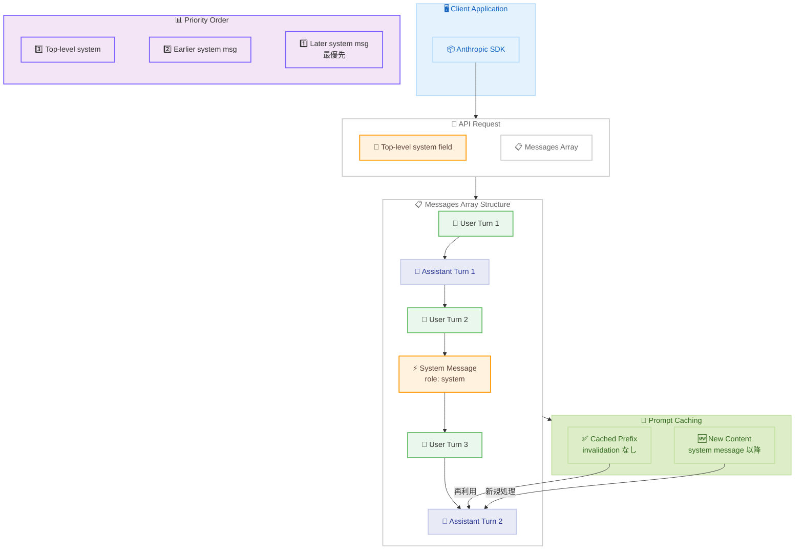

# Mid-conversation system messages が GA (正式版)

## メタデータ

| 項目 | 内容 |
|------|------|
| 発表日 | 2026-07-15 |
| ソース | Claude API Release Notes |
| カテゴリ | API アップデート |
| 公式リンク | https://platform.claude.com/docs/en/build-with-claude/mid-conversation-system-messages |

## 概要

Mid-conversation system messages が正式版 (GA) としてリリースされた。これまでベータ機能として提供されていた本機能が、ベータヘッダー不要で利用可能になった。Claude Fable 5、Claude Mythos 5、Claude Opus 4.8 で対応しており、Claude API、Claude in Amazon Bedrock、Google Cloud (Vertex AI) の全プラットフォームで使用できる。

この機能により、会話の途中でシステムレベルの指示を追加・更新でき、既存のプロンプトキャッシュを無効化することなく動的な制御が可能になる。

## 詳細

### 背景

従来の Claude API では、システムプロンプトは会話の冒頭 (トップレベルの `system` フィールド) でのみ設定可能だった。会話の途中でシステム指示を変更したい場合、新しい会話を開始するか、ユーザーメッセージとして指示を埋め込む必要があった。これにはいくつかの問題があった。

- プロンプトキャッシュが無効化され、レイテンシとコストが増加する
- ユーザーメッセージとして埋め込んだ指示は、モデルにとってオペレーターレベルの権限を持たない
- 会話の文脈に応じた動的なポリシー変更が困難だった

Mid-conversation system messages はこれらの課題を解決し、会話の任意の時点でオペレーターレベルのシステム指示を挿入できるようにする。

### 主な変更点

1. **GA リリース**: ベータヘッダー (`anthropic-beta`) が不要になった
2. **対応モデル**: Claude Fable 5、Claude Mythos 5、Claude Opus 4.8
3. **対応プラットフォーム**: Claude API、Amazon Bedrock、Google Cloud (Vertex AI)
4. **プロンプトキャッシュとの統合**: キャッシュされたプレフィックスを保持したまま、途中にシステムメッセージを挿入可能
5. **ZDR 対応**: Zero Data Retention ポリシーの対象

### 技術的な詳細

**メッセージ配列での使用方法:**

`messages` 配列内に `{"role": "system"}` のメッセージを挿入する。以下の制約がある。

- 会話の最初のエントリにはできない (必ず先行するメッセージが必要)
- ユーザーターンの直後、またはサーバーツール結果で終わるアシスタントターンの直後に配置する必要がある
- 後のシステムメッセージが先のシステムメッセージより優先される
- Mid-conversation system messages はトップレベルの `system` フィールドより優先される

**優先順位:**

```
後の mid-conversation system message > 先の mid-conversation system message > トップレベル system フィールド
```

**制約事項:**

- Claude Sonnet 5 では利用不可 (トップレベルの `system` フィールドを使用)
- 信頼できないコンテンツには使用しない (システムコンテンツはオペレーターレベルの権限を持つ)
- 配置位置に制約がある

**主なユースケース:**

1. **セッション中のポリシー/ペルソナ変更**: 会話の途中でアシスタントの振る舞いを切り替える
2. **ターンごとの権威ある文脈**: 各ターンで最新の状態を反映する指示を追加
3. **アプリケーションが観測した状態変更**: 外部システムの状態変化をシステムレベルで通知
4. **エージェントループを中断しないユーザー入力**: エージェントの動作を制御しつつ、ループを継続
5. **永続的な権限を付与するモード切り替え**: 特定のモードを有効化する指示

## 開発者への影響

### 対象

- Claude API を使用してチャットアプリケーションを構築している開発者
- マルチターン会話で動的なポリシー制御が必要なアプリケーション
- プロンプトキャッシュを活用してコスト最適化を行っているチーム
- エージェント型アプリケーションを開発しているチーム

### 必要なアクション

1. **ベータヘッダーの削除**: 既にベータ版を使用している場合、`anthropic-beta` ヘッダーからこの機能のフラグを削除可能
2. **モデルバージョンの確認**: 対応モデル (Claude Fable 5、Mythos 5、Opus 4.8) を使用しているか確認
3. **既存実装の見直し**: ユーザーメッセージとして埋め込んでいたシステム指示を、正式な `system` ロールに移行することを検討

### 移行ガイド

**ベータ版から GA 版への移行:**

```python
# Before (ベータ版)
response = client.messages.create(
    model="claude-opus-4-8",
    extra_headers={"anthropic-beta": "mid-conversation-system-messages-2026-05-01"},
    # ...
)

# After (GA 版) - ベータヘッダー不要
response = client.messages.create(
    model="claude-opus-4-8",
    # ...
)
```

**ユーザーメッセージからの移行:**

```python
# Before (ユーザーメッセージとして指示を埋め込み)
messages=[
    {"role": "user", "content": "コードをレビューしてください"},
    {"role": "assistant", "content": "..."},
    {"role": "user", "content": "[システム指示] 今後は型アノテーションを必ず含めてください。\n\n呼び出し元のコードもレビューしてください。"},
]

# After (mid-conversation system message を使用)
messages=[
    {"role": "user", "content": "コードをレビューしてください"},
    {"role": "assistant", "content": "..."},
    {"role": "user", "content": "呼び出し元のコードもレビューしてください。"},
    {"role": "system", "content": "今後は型アノテーションを必ず含めてください。"},
]
```

## コード例

```python
import anthropic

client = anthropic.Anthropic()

response = client.messages.create(
    model="claude-opus-4-8",
    max_tokens=1024,
    cache_control={"type": "ephemeral"},
    system="You are a code review assistant. Be concise.",
    messages=[
        {
            "role": "user",
            "content": "Review process() in utils.py for performance issues.",
        },
        {
            "role": "assistant",
            "content": "The list comprehension is fine for small inputs...",
        },
        {
            "role": "user",
            "content": "Now review the calling code that invokes process().",
        },
        {
            "role": "system",
            "content": "From now on, every suggestion must include explicit type annotations.",
        },
    ],
)

print(response.content[0].text)
```

## アーキテクチャ図



## 関連リンク

- [Mid-conversation system messages ドキュメント](https://platform.claude.com/docs/en/build-with-claude/mid-conversation-system-messages)
- [Claude API Release Notes](https://platform.claude.com/docs/en/release-notes/overview)
- [Prompt Caching ガイド](https://platform.claude.com/docs/en/build-with-claude/prompt-caching)
- [Messages API リファレンス](https://platform.claude.com/docs/en/api/messages)

## まとめ

Mid-conversation system messages の GA リリースにより、開発者は会話の途中でオペレーターレベルのシステム指示を安全かつ効率的に挿入できるようになった。プロンプトキャッシュとの統合により、パフォーマンスやコストへの影響を最小限に抑えながら、動的なポリシー制御やペルソナ変更が可能になる。

特にエージェント型アプリケーションや、会話の文脈に応じて振る舞いを変える必要があるチャットボットにとって、重要な機能改善である。ベータヘッダーが不要になったため、既存のベータユーザーはコードの簡素化が可能であり、新規ユーザーは追加の設定なしにすぐに利用を開始できる。
