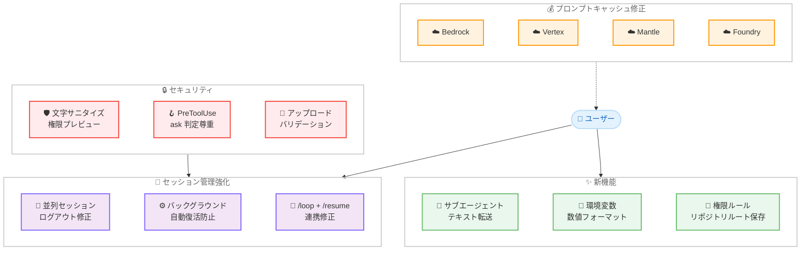

# Claude Code v2.1.211 リリース — プロンプトキャッシュ課金修正、セッション管理強化、サブエージェント出力転送

## メタデータ

| 項目 | 内容 |
|------|------|
| 発表日 | 2026-07-16 |
| ソース | Claude Code Changelog |
| カテゴリ | Claude Code アップデート |
| 公式リンク | https://github.com/anthropics/claude-code/blob/main/CHANGELOG.md |

## 概要

Claude Code v2.1.211 (2026 年 7 月 16 日) がリリースされた。新機能 1 件、セキュリティ修正 3 件、バグ修正 27 件、改善 6 件、動作変更 3 件の計 40 項目を含む大規模リリースである。

本リリースの最も重要な修正は、**Bedrock、Vertex、Mantle、Foundry でのプロンプトキャッシュの課金リグレッション**である。末尾のシステムコンテキストブロックが毎リクエスト新規入力トークンとして課金されていた問題が修正され、影響を受けていたユーザーのコスト削減が期待される。加えて、**セッション管理の安定性向上** (並列セッションの同時ログアウト修正、バックグラウンドエージェントの自動復活防止、`/loop` と `/resume` の連携修正)、**サブエージェントテキスト転送機能の追加** (`--forward-subagent-text` フラグ) が主要なテーマとなっている。

## 詳細

### 背景

v2.1.210 の翌日にリリースされた本バージョンは、エンタープライズ環境で深刻な影響を及ぼすプロンプトキャッシュの課金リグレッションを緊急修正するとともに、バックグラウンドエージェントやセッション管理に関する多数の安定性問題に対処している。特に Bedrock/Vertex を利用する企業ユーザーにとって、キャッシュ対象であるべきシステムコンテキストが毎回新規トークンとして課金されていた問題は、コストに直接影響する重大なリグレッションであった。

また、並列セッション利用時のスリープ復帰後の一斉ログアウトや、ユーザーが明示的に停止したバックグラウンドエージェントが自動復活する問題など、マルチセッション環境での信頼性に関わる修正が多数含まれている。

### 主な変更点

#### 新機能

1. **サブエージェントテキスト転送フラグの追加**: `--forward-subagent-text` フラグおよび `CLAUDE_CODE_FORWARD_SUBAGENT_TEXT` 環境変数が追加された。stream-json 出力にサブエージェントのテキストおよび思考内容を含めることが可能になり、エージェントオーケストレーションの可観測性が向上

#### セキュリティ修正

2. **権限プレビューの文字サニタイズ**: チャットチャネルにリレーされる権限プレビューで、双方向オーバーライド文字、ゼロ幅文字、類似引用符文字が無害化されるようになった。これにより、ツール入力が承認メッセージの表示を視覚的に改ざんすることを防止

3. **auto モードの PreToolUse フック `ask` 判定の尊重**: auto モードがサンドボックス外 Bash に対する PreToolUse フックの `ask` 判定を上書きしていた問題を修正。フックが `ask` を返した場合、判定がプロンプト表示まで引き下げられるようになった

4. **ファイルアップロードバリデーションの修正**: DOS デバイスサフィックス (`.prn`) や末尾ドットで終わるファイル名が受け入れられるようになり、複数のハードリンクを持つファイルは拒否されるようになった

#### セッション管理・エージェント修正

5. **並列セッションの同時ログアウト修正**: スリープ復帰後、1 つの認証ストアを共有する複数の並列 Claude Code セッションが同時にログアウトする問題を修正

6. **バックグラウンドエージェントの自動復活防止**: ユーザーが停止したバックグラウンドエージェントが自動復活し、古いセッションの古いプロンプトを再実行する問題を修正

7. **`/loop` と `/resume` の連携修正**: `/loop` の 1 回使用後にセッションが `/resume` から非表示になる問題を修正

8. **停止セッションの再オープン修正**: エージェントビューから停止直後のバックグラウンドセッションを再オープンした際、同一セッション ID で空の会話が開始される問題を修正

9. **エージェントジョブの削除不能修正**: git がワークツリーを認識しなくなった場合に `claude agents` ジョブが永続的に削除不能になる問題を修正。削除が拒否された理由が行に表示されるようになった

10. **バックグラウンドジョブの認証修正**: LLM ゲートウェイ認証 (`ANTHROPIC_AUTH_TOKEN` + `ANTHROPIC_BASE_URL`) を使用するバックグラウンドジョブが、デーモン再起動後に "Not logged in" となる問題を修正

11. **バックグラウンドセッションタイトルの修正**: プロンプトにリンクが含まれる場合、エージェントビューのバックグラウンドセッションタイトルにネーミングモデルの拒否テキストが表示される問題を修正

12. **ルーティンの次回実行時刻修正**: スケジュールが設定されていないルーティンが次回実行時刻を「西暦 1 年」と報告する問題を修正

#### モデル・プラットフォーム修正

13. **Vertex/Bedrock の起動時モデルフォールバック修正**: モデルが明示的に設定されている場合でも、起動時にデフォルトの Opus モデルを試行し不要なフォールバック通知を表示する問題を修正

14. **サブエージェントのモデルオーバーライド修正**: 明示的なモデルオーバーライドで起動されたサブエージェントが、再開時やフォローアップメッセージ送信時に親のモデルに戻る問題を修正

15. **プロンプトキャッシュの課金リグレッション修正**: Bedrock、Vertex、Mantle、Foundry で末尾のシステムコンテキストブロックが毎リクエスト新規入力トークンとして課金されていたリグレッションを修正

#### MCP・プラグイン修正

16. **プラグイン MCP サーバーの再接続修正**: アイドル状態の Web セッションが復帰した後、プラグイン MCP サーバーが再接続せず、次のメッセージまで MCP 呼び出しが失敗し続ける問題を修正

#### 設定・ルール修正

17. **ネストされた `.claude/rules/*.md` のロード修正**: 設定ソースがプロジェクト設定を除外している場合でも、ネストされた `.claude/rules/*.md` ファイルがロードされる問題を修正

#### UX 修正

18. **"?" 入力の処理修正**: 編集後の入力が "?" のみとなった場合にサイレントに入力が消去されショートカットパネルがトグルされる問題を修正

19. **非同期コンテンツの表示遅延修正**: 設定タブ、統計、diff ビュー、その他のローディング状態で 300ms の表示遅延が発生していた問題を修正

20. **スクリーンリーダーのターミナルベル修正**: `/terminal-setup` またはオンボーディングのターミナルセットアップ後にスクリーンリーダーユーザーの音声ターミナルベルが失われる問題を修正

21. **`/clear` のコストカウンターリセット修正**: `/clear` がセッションコストカウンターをリセットしない問題を修正。ステータスラインのコストが `/clear` 後に $0 から開始されるようになった

#### Windows・Chrome 修正

22. **Claude in Chrome セットアップページ修正**: Windows で Claude in Chrome のセットアップページがブラウザで開けない問題を修正

23. **ヘッドレスプリントモードセッション修正**: Windows でヘッドレスプリントモードセッションが stdin を読み取れない場合にクラッシュまたはサイレント終了する問題を修正

24. **Chrome 拡張機能の起動ハング修正**: Claude in Chrome 拡張機能が有効だが Chrome が起動していない場合にスタートアップがハングする問題を修正

25. **Chrome からのファイルアップロード修正**: リモートおよび CLI セッションからの Claude in Chrome へのファイルアップロードを修正

26. **Claude in Chrome の `save_to_disk` 修正**: スクリーンショットアクションの `save_to_disk` が実際にイメージをディスクに書き込みパスを返すようになった (以前は何もしなかった)

#### 改善

27. **ターミナルレイアウトとレンダリングパフォーマンスの改善**: ターミナルのレイアウト処理とレンダリングのパフォーマンスが向上

28. **バックグラウンドエージェント結果報告の改善**: まだ実行中のエージェントのステータスを報告し、結果を捏造する代わりに実際の完了を待機するようになった

29. **メモリインデックスの制限超過警告の改善**: ロードされたコンテンツのみを計測し、フロントマターと HTML コメントを除外するようになった

30. **環境変数の数値フォーマット対応**: タイムアウト、トークンバジェット、リトライ回数などの整数環境変数が `1e6` や `64_000` のような科学的記数法および桁区切り記法を受け入れるようになった

31. **ドキュメントリンクの更新**: ドキュメントリンクが現在のドキュメントサイトに更新

32. **Windows でのスキル/プラグインディレクトリ命名の堅牢化**: 同期されたスキル/プラグインディレクトリの命名が Windows で堅牢化され、`/clear` 後も CCR Web フェッチ/検索プロキシが動作し続けるようになった

#### 動作変更

33. **"always allow" 権限ルールの保存場所変更**: "always allow" 権限ルールがリポジトリルートに保存されるようになり、git worktree で付与された承認がセッションおよびワークツリー間で永続化

34. **`/usage-credits` の確認ダイアログ追加**: 組織管理者へのリクエスト送信前に確認が求められるようになった

35. **Vim モードの `s`/`S` 修正**: Vim モードで `s` (文字置換) および `S` (行置換) が NORMAL モードで動作するように変更され、vim の動作に一致

#### VSCode・Chrome

36. **[VSCode] Remote Control バナーの更新**: Remote Control バナーが機能の説明を含むように更新

37. **Claude in Chrome ファイルアップロードパスバリデーション強化**: ファイルアップロードのパスバリデーションが強化

### 技術的な詳細

#### プロンプトキャッシュの課金リグレッション

Anthropic のプロンプトキャッシュ機能は、リクエスト間で共通するシステムプロンプトやコンテキストブロックをキャッシュし、以降のリクエストでキャッシュ済みトークンとして低コストで処理する仕組みである。本リグレッションでは、Bedrock、Vertex、Mantle、Foundry の各プラットフォームにおいて、末尾のシステムコンテキストブロックがキャッシュ対象から外れ、毎回新規入力トークンとして課金されていた。これは直接的なコスト増加を意味し、特に長いシステムプロンプトを使用する大規模デプロイメントでは影響が顕著であった。

#### サブエージェントテキスト転送

`--forward-subagent-text` フラグにより、stream-json 出力モードでサブエージェントの生テキストと思考プロセスが親ストリームに含まれるようになった。従来はサブエージェントの出力は最終結果のみが返されていたが、本機能によりデバッグやモニタリングのためにサブエージェントの中間出力をリアルタイムで観測可能になった。環境変数 `CLAUDE_CODE_FORWARD_SUBAGENT_TEXT` を設定することでもフラグと同等の動作が得られる。

#### 権限プレビューの文字サニタイズ

チャットチャネル (Slack 等) にリレーされる権限プレビューメッセージにおいて、Unicode の双方向オーバーライド文字 (U+202E 等)、ゼロ幅文字 (U+200B 等)、類似引用符文字を利用して承認メッセージの表示を視覚的に操作する攻撃ベクターが存在した。修正により、これらの制御文字がプレビュー生成時に無害化され、ツール入力がどのような文字を含んでいても承認メッセージが正確に表示されるようになった。

#### PreToolUse フックの `ask` 判定尊重

PreToolUse フックが `ask` を返した場合、auto モードの自動承認ロジックがこの判定を上書きして自動実行することが可能であった。修正により、フックの `ask` 判定はプロンプト表示の「下限」として機能し、auto モードであってもユーザーへの確認が強制されるようになった。これにより、セキュリティフックによる制御がより確実に機能する。

#### 並列セッションのログアウト問題

複数の Claude Code セッションが 1 つの認証情報ストアを共有している場合、macOS のスリープ復帰時にすべてのセッションが同時にトークンリフレッシュを試行し、競合状態により全セッションがログアウトする問題が発生していた。修正により、トークンリフレッシュのシリアライズまたはジッター導入が行われ、同時ログアウトが防止された。

## アーキテクチャ図



## 開発者への影響

### 対象

- **Bedrock/Vertex/Mantle/Foundry ユーザー**: プロンプトキャッシュの課金リグレッション修正により、不要なコスト増加が解消される。特に長いシステムプロンプトを使用するデプロイメントでは顕著なコスト削減が期待できる
- **エージェントオーケストレーション開発者**: `--forward-subagent-text` フラグにより、サブエージェントの中間出力をリアルタイムで監視可能になり、デバッグやモニタリングが容易に
- **マルチセッション利用者**: 並列セッションの同時ログアウト修正、バックグラウンドエージェントの自動復活防止により、複数セッションを並行利用する際の安定性が向上
- **セキュリティフック実装者**: PreToolUse フックの `ask` 判定が auto モードで確実に尊重されるようになり、カスタムセキュリティポリシーの信頼性が向上
- **git worktree 利用者**: "always allow" 権限ルールがリポジトリルートに保存されるようになり、ワークツリー間で承認が永続化
- **Windows ユーザー**: Chrome セットアップ、ヘッドレスモード、スキル/プラグインディレクトリ命名の各問題が修正
- **Vim モード利用者**: `s`/`S` キーバインドが NORMAL モードで正しく動作するようになった

### 必要なアクション

以下のコマンドで最新バージョンに更新できる。

```bash
# npm でのアップデート
npm update -g @anthropic-ai/claude-code

# Homebrew でのアップデート
brew upgrade claude-code

# 現在のバージョン確認
claude --version
```

**推奨される確認事項:**

- **Bedrock/Vertex/Mantle/Foundry 利用者**: アップデート後のコスト推移を確認し、プロンプトキャッシュが正常に動作していることを検証
- **バックグラウンドエージェント利用者**: 停止したエージェントが自動復活しないことを確認
- **PreToolUse フック利用者**: auto モードでフックの `ask` 判定がプロンプト表示として機能していることを確認
- **環境変数での数値設定利用者**: `1e6` や `64_000` 形式での設定が正しく解釈されることを確認

### 移行ガイド (該当する場合)

本リリースには破壊的変更はないが、以下の動作変更に留意が必要である。

**"always allow" 権限ルールの保存場所変更:**

従来は権限承認がワークツリーローカルに保存されていたが、v2.1.211 以降はリポジトリルートに保存される。これにより、ある worktree で付与した承認が他の worktree やセッションでも有効になる。この動作はセキュリティポリシーに影響するため、意図しない権限の伝播が発生しないか確認が必要である。

**`/usage-credits` の確認ダイアログ:**

組織管理者へのクレジットリクエスト送信前に確認ダイアログが表示されるようになった。自動化スクリプトで `/usage-credits` を使用している場合は、対話的な確認が必要になる点に留意。

**Vim モード `s`/`S` の動作変更:**

Vim モードの `s` (文字置換) と `S` (行置換) が NORMAL モードで動作するようになった。従来これらのキーを別の用途にマッピングしていたユーザーは、キーバインディングの見直しが必要になる場合がある。

## コード例

### サブエージェントテキスト転送の利用

```bash
# フラグでサブエージェントのテキスト・思考を転送
claude --output-format stream-json --forward-subagent-text "タスクを実行してください"

# 環境変数で設定
export CLAUDE_CODE_FORWARD_SUBAGENT_TEXT=1
claude --output-format stream-json "タスクを実行してください"
```

### 環境変数の新しい数値フォーマット

```bash
# 科学的記数法
export CLAUDE_CODE_MAX_TOKENS=1e6

# 桁区切り記法
export CLAUDE_CODE_TIMEOUT=64_000

# 従来の記法も引き続き有効
export CLAUDE_CODE_MAX_TOKENS=1000000
```

### PreToolUse フックでの ask 判定

```json
// .claude/settings.json
{
  "hooks": {
    "PreToolUse": [
      {
        "matcher": "Bash",
        "command": "python validate_command.py",
        "timeout": 5000
      }
    ]
  }
}
```

```python
# validate_command.py - フックスクリプト例
# "ask" を返すと auto モードでもユーザーに確認を強制
import json
import sys

input_data = json.loads(sys.stdin.read())
command = input_data.get("tool_input", {}).get("command", "")

# 危険なコマンドの場合はユーザーに確認を求める
if any(dangerous in command for dangerous in ["rm -rf", "DROP TABLE"]):
    print(json.dumps({"decision": "ask", "message": "危険なコマンドを検出しました"}))
else:
    print(json.dumps({"decision": "allow"}))
```

## 関連リンク

- [Claude Code Changelog](https://github.com/anthropics/claude-code/blob/main/CHANGELOG.md)
- [Claude Code GitHub リポジトリ](https://github.com/anthropics/claude-code)
- [Claude Code ドキュメント](https://docs.anthropic.com/en/docs/claude-code)
- [Claude Code v2.1.209 & v2.1.210](./2026-07-15-claude-code-v2-1-209-v2-1-210.md)

## まとめ

Claude Code v2.1.211 は、コスト、安定性、セキュリティの 3 軸に焦点を当てた計 40 項目の修正・改善を含むリリースである。特に以下の 4 点が注目に値する。

第一に、**プロンプトキャッシュの課金リグレッション修正**。Bedrock、Vertex、Mantle、Foundry で末尾のシステムコンテキストブロックが毎回新規トークンとして課金されていた問題が修正された。キャッシュ対象であるべきコンテキストが毎回課金されることは直接的なコスト増加を意味し、影響を受けていたエンタープライズユーザーにとって最も重要な修正である。

第二に、**セッション管理の安定性向上**。並列セッションのスリープ復帰後の同時ログアウト、ユーザーが停止したバックグラウンドエージェントの自動復活、`/loop` 使用後のセッション非表示、停止セッションの再オープン時の空会話開始など、マルチセッション環境での信頼性を損なう多数の問題が解消された。

第三に、**セキュリティの強化**。権限プレビューメッセージに対する Unicode 制御文字を利用した視覚的改ざん攻撃への対策、auto モードにおける PreToolUse フックの `ask` 判定の確実な尊重、ファイルアップロードバリデーションの堅牢化により、セキュリティ境界が強化されている。

第四に、**サブエージェントの可観測性向上**。`--forward-subagent-text` フラグにより、stream-json 出力でサブエージェントの中間テキストと思考プロセスをリアルタイムで取得可能になった。これはエージェントオーケストレーションのデバッグやモニタリングにおいて重要な機能である。

特にプロンプトキャッシュの課金リグレッションは Bedrock/Vertex/Mantle/Foundry ユーザーに直接的なコスト影響があるため、該当するすべてのユーザーに対して速やかなアップデートを強く推奨する。
