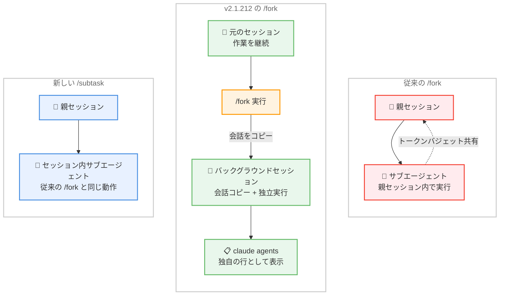
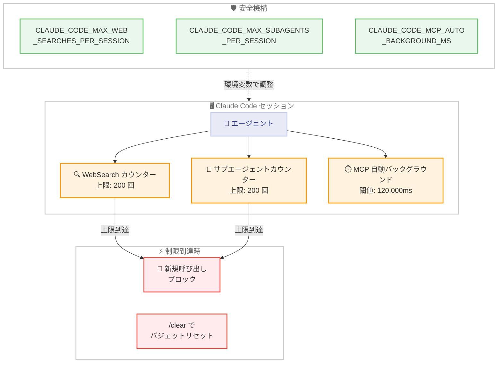

# Claude Code v2.1.212 リリース — /fork アーキテクチャ刷新、暴走ループ防止キャップ、MCP 自動バックグラウンド化

## メタデータ

| 項目 | 内容 |
|------|------|
| 発表日 | 2026-07-17 |
| ソース | Claude Code Changelog |
| カテゴリ | Claude Code アップデート |
| 公式リンク | https://github.com/anthropics/claude-code/blob/main/CHANGELOG.md |

## 概要

Claude Code v2.1.212 (2026 年 7 月 17 日) がリリースされた。新機能 6 件、バグ修正 22 件、改善 4 件、動作変更 8 件の計 40 項目を含む大規模リリースである。

本リリースの最大の変更は **`/fork` コマンドのアーキテクチャ刷新**である。従来はセッション内でサブエージェントを起動する動作であったが、v2.1.212 以降は会話を新しいバックグラウンドセッションにコピーする方式に変更された。従来の動作は `/subtask` として提供される。加えて、**暴走ループ防止のためのセッションワイドキャップ** (WebSearch 200 回、サブエージェント 200 回)、**MCP ツールの自動バックグラウンド化** (2 分超の呼び出しを自動的にバックグラウンドへ移行)、**plan モードのセキュリティ修正** (ファイル変更 Bash コマンドの無許可実行防止) が主要な変更点である。

## 詳細

### 背景

v2.1.211 の翌日にリリースされた本バージョンは、エージェント並行処理の使い勝手を根本的に改善すると同時に、自律エージェントが無制限にリソースを消費する「暴走ループ」問題への安全機構を導入している。特に `/fork` の刷新は、ユーザーが作業を中断せずに会話を分岐させるワークフローを実現するものであり、Claude Code のマルチセッション戦略における重要なマイルストーンとなる。

セキュリティ面では、plan モードにおけるファイル変更コマンドの無許可実行、ワークツリー作成時のシンボリックリンクを利用したリポジトリ外書き込みという 2 つの深刻な問題が修正されている。

### 主な変更点

#### 新機能

1. **`/fork` のバックグラウンドセッション化**: `/fork` は会話を新しいバックグラウンドセッション (`claude agents` に独自の行として表示) にコピーし、元のセッションでは作業を継続可能。従来のセッション内サブエージェント起動は `/subtask` に移行

2. **`claude auto-mode reset` コマンド**: デフォルトの auto-mode 設定に復元するコマンドが追加された。確認プロンプト付きで、`--yes` でスキップ可能

3. **WebSearch セッションワイドキャップ**: セッション全体での WebSearch ツール呼び出し数に上限を設定 (デフォルト 200 回)。`CLAUDE_CODE_MAX_WEB_SEARCHES_PER_SESSION` 環境変数で調整可能

4. **サブエージェントスポーンキャップ**: セッション全体でのサブエージェント生成数に上限を設定 (デフォルト 200 回)。`CLAUDE_CODE_MAX_SUBAGENTS_PER_SESSION` 環境変数でオーバーライド可能。`/clear` でバジェットがリセットされる

5. **MCP ツールの自動バックグラウンド化**: 2 分以上実行中の MCP ツール呼び出しが自動的にバックグラウンドに移行し、セッションの操作性を維持する。`CLAUDE_CODE_MCP_AUTO_BACKGROUND_MS` 環境変数で閾値変更または無効化が可能

6. **`/resume` のセッションピッカー**: エージェントビューで `/resume` を入力すると、リストから削除された過去セッションを含むピッカーが表示され、選択したセッションをバックグラウンドセッションとして再開可能

#### セキュリティ修正

7. **plan モードのファイル変更コマンド実行修正**: plan モードが `touch`、`rm` などのファイル変更 Bash コマンドを権限プロンプトや SDK `canUseTool` コールバックなしに自動実行していた問題を修正

8. **ワークツリーシンボリックリンク経由のリポジトリ外書き込み修正**: `.claude/worktrees` にコミットされたシンボリックリンクを辿ってワークツリーを作成した場合、リポジトリ外のファイルが作成される可能性があった問題を修正

#### バグ修正

9. **`continue:false` フックの停止処理修正**: ツールが途中で失敗または完了した場合に `continue:false` フックの停止指示が無視される問題を修正

10. **Bash ツール実行中の SIGTERM 処理修正**: print/SDK モードで Bash ツール実行中に SIGTERM を受信した場合、コマンドのプロセスツリーが孤立する問題を修正

11. **Windows での `/background` および `claude --bg` の修正**: Group Policy が PowerShell 5.1 をブロックしている環境で "EUNKNOWN: unknown error, uv_spawn" エラーが発生する問題を修正

12. **シェルモードのパス自動補完との干渉修正**: パス自動補完ポップアップが開いている状態でファイルパスを含むコマンドが実行されない問題を修正

13. **auto モード拒否通知の文字化け修正**: 長い拒否理由が絵文字の途中で切り詰められた場合に壊れた文字が表示される問題を修正

14. **Ctrl+J の改行挿入修正**: 拡張キーレポーティングが有効なターミナルでエージェントビューのディスパッチ入力に改行を挿入できない問題を修正

15. **`/ultrareview` の PR 参照修正**: `#123`、`PR 123`、PR URL のペーストが拒否される問題を修正

16. **`/ultrareview <branch>` のリモートフェッチ修正**: リモートにのみ存在するブランチが origin からフェッチされない問題を修正

17. **`/ultrareview` の課金確認スキップ修正**: `/clear` 後の新しい会話で課金確認がスキップされる問題を修正

18. **ホスト管理セッションの起動修正**: リポジトリ設定で mTLS 証明書、追加 CA バンドル、OAuth スコープが設定されている場合に起動失敗する問題を修正

19. **オフセット読み取り後のファイル編集エラー修正**: offset/limit 付きで読み取ったファイルをセッション再開後に編集した場合の "File has not been read yet" エラーを修正

20. **`ExitWorktree` のセッション再開後エラー修正**: `--continue`/`--resume` で再開した print/SDK モードセッションで "no active EnterWorktree session" エラーが発生する問題を修正

21. **Remote Control クライアントのワークフローグリッド修正**: 実行中のセッションに途中参加した Remote Control クライアントにワークフローエージェントグリッドが表示されない問題を修正

22. **`/fork` のライブ保護消失修正**: 状態書き込み失敗後に `/fork` で作成されたバックグラウンドセッションのライブ親保護が失われる問題を修正

23. **停止バックグラウンドセッションの再オープン修正**: エージェントビューから停止バックグラウンドセッションを再オープンした場合にサイレントに失敗する問題を修正

24. **エージェントチーム重複通知修正**: 停止中のチームメイトがリーダーに重複アイドル通知を送信する問題を修正

25. **狭いレイアウトでの diff プレビュー修正**: 行番号と +/- マーカーが消失する問題を修正

26. **@メンションのファイル添付修正**: 部分読み取り後の @メンションで何も添付されない問題を修正

27. **OpenTelemetry HTTP エクスポート修正**: Azure Monitor で 411/400 エラーで拒否される問題を修正

28. **OTLP イベントログの trace_id/span_id 修正**: SDK/ヘッドレスモードで `TRACEPARENT` 設定時にイベントログレコードから trace_id/span_id が欠落する問題を修正

29. **大量画像の "Request too large" 誤判定修正**: 多数の画像を含む会話で誤って "Request too large" エラーが発生する問題を修正

30. **Web Search/Fetch の API エラー表示修正**: API が過負荷の場合に "API Error" テキストが返される問題を修正

#### 改善

31. **Web Search/Fetch のリトライ強化**: 529 エラーおよびレートリミットリクエストに対して指数バックオフでリトライする機能が追加され、信頼性が向上

32. **プロンプトキャッシュの互換性拡大**: 会話中のシステムブロックが LLM ゲートウェイおよびカスタムベース URL (Bedrock、Vertex、1P) の背後でも動作するようになった

33. **バックグラウンドエージェントアタッチの改善**: コールドアタッチ時にセッション起動中でもフォーマット済みトランスクリプトが即座に表示されるようになった

34. **エージェント間メッセージのトークン使用量削減**: `SendMessage` ボディがリプレイ履歴とツール結果に重複コピーされなくなり、トークン消費が削減

#### 動作変更

35. **`/fork` のセッション命名**: セッションにタイトルがない場合、プロンプトの内容に基づいてコピーに名前が付けられるようになった

36. **`/btw` の動作変更**: 引数なしの `/btw` が直近のやり取りに対するサイドクエスチョンパネルを再度開くように変更

37. **バックグラウンドエージェント完了通知**: フッターの `←` ヒントがバックグラウンドエージェント完了時に一時的に `N done` とパルス表示

38. **Task ツールの `mode` パラメータ非推奨化**: `mode` パラメータは無視されるようになり、サブエージェントは親セッションの権限モードを継承

39. **Enterprise `forceLoginMethod` の適用範囲拡大**: VS Code 拡張機能、SDK、`setup-token`、`install-github-app` ログインにも強制適用

40. **セッショントランスクリプトに推論努力レベル記録**: アシスタントメッセージに推論努力レベルが記録されるようになった

41. **ヘッドレス/SDK セッションの `set_model` 適用**: ターン途中でも `set_model` コントロールリクエストが適用されるようになった

42. **エージェントビューの状態表示改善**: サンドボックス、MCP 入力、マネージド設定プロンプト待ちのセッションが "Working" ではなく "Needs input" と表示

### 技術的な詳細

#### /fork アーキテクチャの刷新

従来の `/fork` はセッション内でサブエージェントを起動し、親セッションのコンテキスト内で並列タスクを実行する仕組みであった。この方式にはいくつかの制約があった。

- 親セッションのトークンバジェットを消費する
- 親セッションが終了するとサブエージェントも終了する
- `claude agents` に表示されず管理が困難

v2.1.212 では `/fork` が会話全体を独立したバックグラウンドセッションにコピーする方式に刷新された。これにより以下が実現する。

- **独立したライフサイクル**: コピー先セッションは `claude agents` に独自の行として表示され、親セッションとは独立して動作
- **親セッションの継続性**: ユーザーは元のセッションで中断なく作業を継続可能
- **リソースの分離**: 各セッションが独自のトークンバジェットとリソースを持つ
- **管理性の向上**: `claude agents` でのステータス確認、停止、再開が可能

従来のセッション内サブエージェント起動のユースケースは `/subtask` コマンドで引き続きサポートされる。

#### 暴走ループ防止キャップ

自律エージェントが無限ループに陥った場合にリソースを大量消費する問題に対応するため、2 つのセッションワイドキャップが導入された。

- **WebSearch キャップ**: デフォルト 200 回/セッション。検索ループによるコスト暴走を防止
- **サブエージェントキャップ**: デフォルト 200 回/セッション。委譲ループによるリソース枯渇を防止

いずれも `/clear` でリセットされ、環境変数でカスタマイズ可能。キャップに達した場合、エージェントは新たな検索やサブエージェント生成を行えなくなり、別のアプローチを取る必要がある。

#### MCP 自動バックグラウンド化

MCP (Model Context Protocol) ツールの呼び出しが 2 分を超えた場合、自動的にバックグラウンド実行に移行する。これにより長時間の外部ツール呼び出し (データベースクエリ、ビルドプロセス、テスト実行など) がセッションをブロックしなくなる。閾値はミリ秒単位で `CLAUDE_CODE_MCP_AUTO_BACKGROUND_MS` 環境変数で調整可能。`0` を設定すると無効化される。

#### plan モードのセキュリティ修正

plan モードは本来、計画の提示のみを行い実際のファイル操作を実行しない設計であるが、`touch`、`rm` などのファイル変更 Bash コマンドが権限プロンプトなしに実行されるバグが存在した。これは plan モードの安全性モデルに対する重大な違反であり、ユーザーが意図しないファイル変更が行われる可能性があった。修正により、plan モードではファイル変更を伴う全てのコマンドに対して適切な権限確認が行われるようになった。

#### ワークツリーシンボリックリンクの修正

`.claude/worktrees` ディレクトリにシンボリックリンクがコミットされている場合、ワークツリー作成処理がそのシンボリックリンクを辿り、リポジトリ外のパスにファイルを作成する可能性があった。これはリポジトリのサンドボックス境界を越えるセキュリティ上の問題である。修正により、シンボリックリンクの解決先がリポジトリ内であることが検証されるようになった。

## アーキテクチャ図

### /fork コマンドの新旧アーキテクチャ比較



### 暴走ループ防止アーキテクチャ



## 開発者への影響

### 対象

- **全 Claude Code ユーザー**: `/fork` の動作変更により、並列作業のワークフローが根本的に改善される。従来の `/fork` を使用していたユーザーは `/subtask` への移行が必要
- **自律エージェント運用者**: WebSearch とサブエージェントのセッションキャップにより、暴走ループによるコスト暴走リスクが軽減。キャップ値のチューニングが必要な場合がある
- **MCP プラグイン利用者**: 長時間実行 MCP ツールが自動バックグラウンド化されるため、UX が向上。閾値のカスタマイズが必要な場合は環境変数で設定
- **plan モード利用者**: セキュリティ修正により、plan モードでのファイル変更コマンドに権限確認が必要になった。これは正しい動作への修正
- **Enterprise 管理者**: `forceLoginMethod` が VS Code 拡張機能、SDK、各種セットアップコマンドにも適用されるようになり、認証統制が強化
- **SDK/ヘッドレスモード利用者**: `set_model` がターン途中で適用可能になり、動的なモデル切り替えの柔軟性が向上
- **OpenTelemetry 利用者**: Azure Monitor への HTTP エクスポートおよび trace_id/span_id の問題が修正され、可観測性が改善

### 必要なアクション

以下のコマンドで最新バージョンに更新できる。

```bash
# npm でのアップデート
npm update -g @anthropic-ai/claude-code

# Homebrew でのアップデート
brew upgrade claude-code

# 現在のバージョン確認
claude --version
```

**推奨される確認事項:**

- `/fork` を使用していたスクリプトやワークフローの更新 (セッション内サブエージェントが必要な場合は `/subtask` に変更)
- 暴走ループキャップのデフォルト値 (200) が運用環境に適切か確認。大規模リサーチタスクなどでは上限引き上げが必要な場合がある
- MCP ツールの自動バックグラウンド化閾値 (2 分) が利用中のツールに適切か確認
- plan モードでファイル変更を含むワークフローを実行していた場合、権限プロンプトが表示されるようになったことを認識

### 移行ガイド (該当する場合)

#### /fork から /subtask への移行

本リリースで最も大きな破壊的変更は `/fork` の動作変更である。

| 項目 | 従来の /fork | 新しい /fork | /subtask |
|------|-------------|-------------|----------|
| 実行場所 | セッション内 | バックグラウンドセッション | セッション内 |
| ライフサイクル | 親に依存 | 独立 | 親に依存 |
| `claude agents` 表示 | なし | あり | なし |
| トークンバジェット | 親と共有 | 独立 | 親と共有 |

**移行パターン:**

- 「会話を分岐して別方向を探索したい」 → 新しい `/fork` を使用 (推奨)
- 「セッション内で並列にサブタスクを実行したい」 → `/subtask` に変更

#### Task ツールの mode パラメータ非推奨化

SDK で Task ツールの `mode` パラメータを使用していた場合、このパラメータは無視されるようになった。サブエージェントは親セッションの権限モードを自動的に継承する。明示的なモード指定が必要な場合は、別のアプローチを検討する必要がある。

## コード例

### 暴走ループキャップの設定

```bash
# WebSearch の上限を 500 に引き上げ (大規模リサーチ向け)
export CLAUDE_CODE_MAX_WEB_SEARCHES_PER_SESSION=500

# サブエージェントの上限を 50 に引き下げ (コスト制御重視)
export CLAUDE_CODE_MAX_SUBAGENTS_PER_SESSION=50

# MCP 自動バックグラウンドの閾値を 5 分に変更
export CLAUDE_CODE_MCP_AUTO_BACKGROUND_MS=300000

# MCP 自動バックグラウンドを無効化
export CLAUDE_CODE_MCP_AUTO_BACKGROUND_MS=0
```

### /fork と /subtask の使い分け

```bash
# 新しい /fork: 会話をバックグラウンドセッションにコピー
# → claude agents に新しい行として表示される
/fork このバグの別のアプローチを試してみて

# /subtask: セッション内でサブエージェントを起動 (従来の /fork 相当)
/subtask テストファイルを追加して

# /resume: 過去セッションのピッカーを表示して再開
/resume
```

### auto-mode のリセット

```bash
# 確認プロンプト付きでリセット
claude auto-mode reset

# 確認をスキップ (CI/CD 向け)
claude auto-mode reset --yes
```

## 関連リンク

- [Claude Code Changelog](https://github.com/anthropics/claude-code/blob/main/CHANGELOG.md)
- [Claude Code GitHub リポジトリ](https://github.com/anthropics/claude-code)
- [Claude Code ドキュメント](https://docs.anthropic.com/en/docs/claude-code)
- [Claude Code v2.1.211](./2026-07-16-claude-code-v2-1-211.md)

## まとめ

Claude Code v2.1.212 は、マルチセッションワークフロー、安全機構、セキュリティの 3 軸に焦点を当てた計 40 項目の変更を含むリリースである。特に以下の 4 点が注目に値する。

第一に、**`/fork` のアーキテクチャ刷新**。会話を独立したバックグラウンドセッションにコピーする方式への変更により、ユーザーは作業を中断せずに会話を分岐させ、`claude agents` で管理できるようになった。従来のセッション内サブエージェント起動は `/subtask` として引き続き利用可能であり、用途に応じた使い分けが可能になった。

第二に、**暴走ループ防止のセッションワイドキャップ**。WebSearch (200 回) とサブエージェント生成 (200 回) にデフォルト上限が設定され、自律エージェントが無限ループに陥った場合のコスト暴走リスクが大幅に軽減された。環境変数でのカスタマイズにより、運用環境に応じた柔軟な調整も可能である。

第三に、**MCP ツールの自動バックグラウンド化**。2 分以上実行中の MCP ツール呼び出しが自動的にバックグラウンドに移行し、長時間の外部ツール呼び出しがセッションをブロックしなくなった。これにより、データベースクエリやビルドプロセスなどの長時間処理中もセッションの操作性が維持される。

第四に、**セキュリティ修正**。plan モードにおけるファイル変更コマンドの無許可実行と、ワークツリーシンボリックリンクを利用したリポジトリ外書き込みの 2 つの深刻な問題が修正された。特に plan モードの修正は、ユーザーが plan モードを「安全な計画立案モード」として信頼して使用する前提を回復する重要な修正である。

全てのユーザーに対して速やかなアップデートを推奨する。特に `/fork` を利用していたワークフローでは `/subtask` への移行確認が必要であり、自律エージェントを運用している環境ではキャップ値のチューニングを検討されたい。
