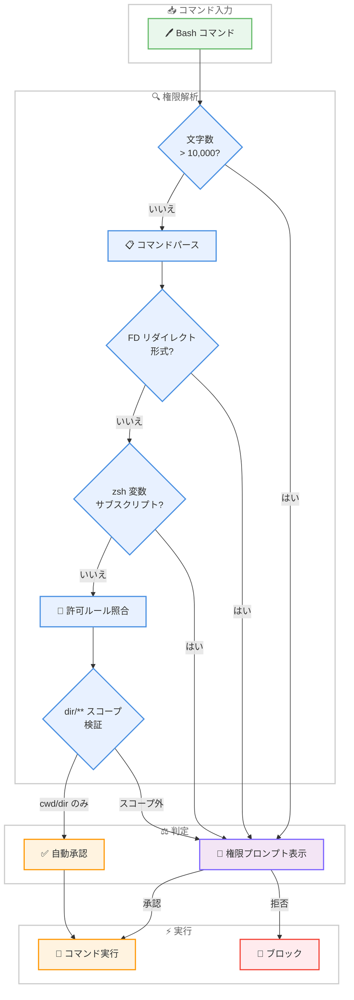
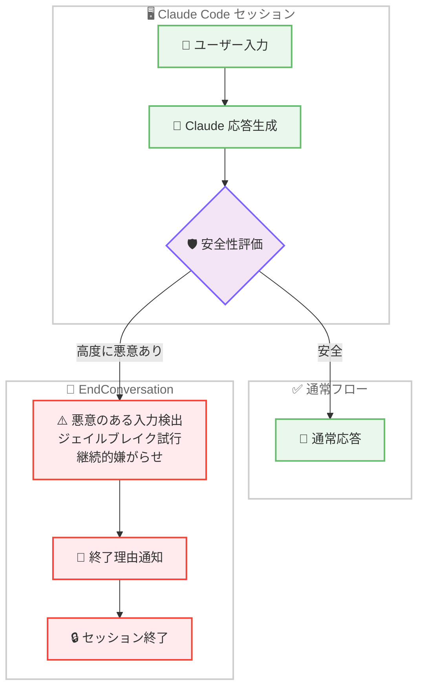

# Claude Code v2.1.214 リリース — セキュリティ大幅強化、EndConversation ツール追加、Windows/PowerShell 安定性改善

## メタデータ

| 項目 | 内容 |
|------|------|
| 発表日 | 2026-07-18 |
| ソース | Claude Code Changelog |
| カテゴリ | ツールアップデート |
| 公式リンク | https://github.com/anthropics/claude-code/blob/main/CHANGELOG.md |

## 概要

Claude Code v2.1.214 (2026 年 7 月 18 日) がリリースされた。新機能 7 件、セキュリティ修正 7 件以上、バグ修正 30 件以上、動作変更 4 件を含む大規模セキュリティ重視リリースである。

本リリースの最大のテーマは**権限チェック機構の包括的な強化**である。Bash コマンドの権限解析バイパス (長大コマンド、zsh 変数サブスクリプト、ファイルディスクリプタリダイレクト)、Windows PowerShell 5.1 でのバイパス、`dir/**` 許可ルールの意図しない拡張など、複数の権限チェック脆弱性が修正された。加えて、**EndConversation ツール**の導入により、悪意のあるユーザーやジェイルブレイク試行に対してセッションを終了する安全機構が追加された。Windows/PowerShell 環境では 6 件以上の修正が行われ、エンコーディング問題やプロセスハング問題が解消されている。

## 詳細

### 背景

本リリースはセキュリティ監査の結果を反映した大規模な防御強化リリースである。Claude Code の権限モデルは「ユーザーが明示的に許可した操作のみを自動実行する」という原則に基づいているが、Bash シェルの複雑な構文解析と権限アナライザの差異を突いた複数のバイパスベクトルが発見された。v2.1.214 ではこれらを体系的に修正し、「疑わしい場合はプロンプトを表示する」(fail closed) アプローチを徹底している。

また、Anthropic が 2025 年から claude.ai で運用してきた EndConversation ツール (悪意のあるユーザーとのセッション終了機能) が Claude Code にも導入され、CLI 環境における安全性の統一が図られた。

### 主な変更点

#### セキュリティ強化

1. **`dir/**` 許可ルールのスコープ修正**: `Edit(src/**)`のような単一セグメントの許可ルールが、`<cwd>/src` 配下だけでなくツリー内の任意の `src/` ディレクトリへの書き込みを自動承認していた問題を修正。修正後は `<cwd>/dir` のみに限定される

2. **Windows PowerShell 5.1 権限バイパスの修正**: Windows PowerShell 5.1 セッションで実行されるコマンドに対する権限チェックをバイパスできる問題を修正

3. **ファイルディスクリプタリダイレクト形式の修正**: Bash が権限アナライザとは異なる方法でパースするファイルディスクリプタリダイレクト形式に対して、fail closed (権限確認を要求) するよう修正

4. **長大コマンドの権限チェック修正**: 10,000 文字を超える Bash コマンドの権限チェックが不正確になる問題を修正。修正後は常にプロンプトを表示する

5. **zsh 変数サブスクリプト/修飾子の修正**: `[[ ]]` 比較内の zsh 変数サブスクリプトおよび修飾子が無害なテキストとして扱われていた問題を修正。これらのコマンドは承認を要求するようになった

6. **`help`/`man` コマンドの自動承認修正**: 安全でないオプション、コマンド置換、バックスラッシュパスを実行可能な特定の `help` および `man` コマンドが自動承認されていた問題を修正

7. **リモートセッション権限プロンプトの修正**: リモートセッションでの権限プロンプトが、ローカルの確認ダイアログより先に進行してしまう問題を修正

8. **`docker` コマンドの権限プロンプト追加**: `--url`、`--connection`、`--identity`、および Podman のリモートモードなどデーモンリダイレクトフラグを含む `docker` コマンド (Podman の `docker` シムを含む) に権限プロンプトを追加

#### 新機能

1. **EndConversation ツール**: 高度に悪意のあるユーザーやジェイルブレイク試行に対してセッションを終了する機能が追加された。2025 年から claude.ai で運用されている機能の Claude Code 版。詳細は https://www.anthropic.com/research/end-subset-conversations を参照

2. **長時間ツール呼び出しの進捗ハートビート**: 以前は無応答になっていた長時間実行ツール呼び出しに対して、定期的な進捗ハートビートが送信されるようになった

3. **メモリファイルの ISO タイムスタンプ**: メモリファイルのフロントマターに ISO 形式の `modified` タイムスタンプが追加された

4. **OpenTelemetry ログイベントの属性追加**: `message.uuid`、`client_request_id`、`tool_source` 属性が OpenTelemetry ログイベントに追加され、メッセージレベルの相関とツール出所追跡が可能になった

5. **`CLAUDE_CODE_OTEL_CONTENT_MAX_LENGTH` 環境変数**: OpenTelemetry コンテンツ属性の 60 KB 切り捨て制限を設定可能になった

6. **`subagentStatusLine` への推論努力レベル追加**: カスタムエージェント行がモデルと推論努力を表示できるようになった

#### Windows/PowerShell 修正

1. **PowerShell ツールの子プロセスハング修正**: 子プロセスが標準入力待ちの場合にタイムアウトまでハングする問題を修正

2. **Python スクリプトの UnicodeDecodeError 修正**: PowerShell ツール配下で非 UTF-8 データを標準入力から読み取る際のクラッシュを修正

3. **Python スクリプトの UnicodeEncodeError 修正**: 非 ASCII 出力でのクラッシュ、および PowerShell 7 エラーメッセージに生の ANSI エスケープシーケンスが含まれる問題を修正

4. **`where.exe`/`fc.exe`/`diff.exe` のエラー誤判定修正**: 有効な否定回答を返した場合にエラーとして報告される問題を修正

5. **`>`/`>>` の UTF-16LE 書き込み修正**: Windows PowerShell 5.1 で `>` および `>>` が UTF-16LE ファイルを書き込み、他ツールが UTF-8 として読み取れない問題を修正

6. **企業プロキシ環境でのストリーミング修正**: Windows の企業プロキシ環境で "Socket is closed" エラーでストリーミングターンが失敗する問題を修正

#### バックグラウンドセッション修正

1. **後続デーモンの制御ソケット削除修正**: 退去したバックグラウンドデーモンがシャットダウン時に後続の制御ソケットを削除し、次のクライアントが正常な置換デーモンを kill してしまう問題を修正

2. **アイドルセッションのリソースリーク修正**: `←` または `/background` で待機させ放置したセッションがバックグラウンドデーモンとワーカープロセスを無期限に維持する問題を修正

3. **完了セッションの削除不能修正**: バックグラウンドサービスがアイドル状態になった後、`claude rm` やエージェントビューから完了セッションを削除できない問題を修正

4. **非 git フォルダからのセッション削除修正**: 非 git フォルダからディスパッチされたバックグラウンドセッションがエージェントビューから削除できない問題を修正

5. **停止セッションの再オープン修正**: セッションストア内に読み取り不能なフォルダが存在する場合、停止バックグラウンドセッションの再オープンが保存済み会話の復元に失敗する問題を修正

#### その他の修正

1. **GrowthBook null 評価クラッシュ修正**: GrowthBook フィーチャーが null を返した場合のクラッシュ、および不正なフラグペイロードがキャッシュ済みフィーチャーフラグを消去するバグを修正

2. **`pkill -f` によるセッション kill 修正**: Linux で `pkill -f` パターンが CLI 自身のプロセスに誤ってマッチし、Claude セッションが終了する問題を修正

3. **`--settings` メモリリーク修正**: `--settings` がデバイスファイルまたは数 GB のファイルを指している場合のメモリ無制限成長を修正。2 MiB 超のファイルは起動時にエラーとなる

4. **ストリーム JSON 出力切り捨て修正**: 低速読み取り SDK/パイプラインコンシューマ向けに、終了時のドレインがフラット 2 秒キャップではなくキュー済みバイト数に応じてスケールするよう修正

5. **スケジュールタスクのプロンプト拒否修正**: スケジュールタスクが自身の設定済みプロンプトを信頼できない入力として拒否する問題を修正

6. **Remote Control セッション通知修正**: Remote Control が明示的に有効化されていないセッションで "session ready" プッシュ通知が発火する問題を修正

7. **`/install-github-app` と `/mcp` のブロック修正**: エージェントビューセッションでブロックされていた問題を修正。バックグラウンドセッション (ターミナル未接続) でのみ拒否されるようになった

8. **`--settings` フラグのプラグイン読み込み修正**: v2.1.181 以降のリグレッションで `--settings` CLI フラグ経由で有効化されたプラグインが読み込まれない問題を修正

9. **長時間セッションのフィーチャーフラグ更新修正**: OAuth トークンのローテーション後にフィーチャーフラグが古くなる問題を修正

10. **`/ultrareview` のマージベースなしリポジトリ修正**: マージベースがないリポジトリで実行を拒否する問題を修正。全追跡ファイルのレビューを提案するようになった

11. **`claude update`/`claude doctor` ハング修正**: シェル設定パスがディレクトリの場合にサイレントにハングする問題、および `/status` のシステム診断セクションが空白になる問題を修正

12. **メモリフロントマター `#` 切り捨て修正**: メモリファイル保存時にインライン `#` でフロントマター値がサイレントに切り捨てられる問題を修正

13. **セッションコスト/トークンテレメトリの二重カウント修正**: 複数の累積 `message_delta` フレームを送出するストリームでの二重計上を修正

14. **アドバイザー思考中の偽警告修正**: アドバイザーが思考中に "check your network" 警告が表示される問題を修正

15. **フック exit code 2 のブロック修正**: フックの stdout JSON がスキーマ検証に失敗した場合に exit code 2 がドキュメント通りにブロックしない問題を修正

16. **OTel ログイベントのトレースコンテキスト修正**: ターンの非同期コンテキスト外で送出された OTel ログイベントにインタラクションスパンのトレースコンテキストが欠落する問題を修正

17. **MCP 一時エラー時のスラッシュコマンド消失修正**: プロンプト/リソースリフレッシュ中の MCP 一時エラーがサーバーのスラッシュコマンドとリソースをクリアする問題を修正

#### 改善

1. **`claude rc` ホームディレクトリエラー改善**: ホームディレクトリでのワークスペース信頼エラーメッセージが、信頼が保存されないことを説明し、プロジェクトディレクトリからの実行を提案するよう改善

#### 動作変更

1. **`dir/**` フック条件のスコープ変更**: 単一セグメントの `dir/**` フック `if:` 条件が `<cwd>/dir` のみにマッチするよう変更。任意の深さでのマッチには `**/dir/**` と記述する必要がある。`deny`/`ask` 権限ルールは従来通りの任意深さマッチを維持

2. **`file` コマンドの権限変更**: `-m`/`--magic-file` または `-f`/`--files-from` を使用する `file` コマンドが読み取り専用として自動許可されなくなり、権限確認を要求するよう変更

3. **キープアライブ接続プーリング変更**: 古い接続エラー後にプーリングを無効化し、リトライが新しいソケットを開くよう変更

4. **SessionStart フック source 変更**: フォークとして開始されたセッションの SessionStart フックが `"resume"` ではなく `"fork"` をレポートするよう変更

### 技術的な詳細

#### EndConversation ツール

EndConversation ツールは、Anthropic が 2025 年から claude.ai で運用してきた安全機構である。高度に悪意のあるユーザー (ジェイルブレイク試行、継続的な嫌がらせ) に対して、Claude がセッションを自発的に終了する能力を提供する。

研究論文 (https://www.anthropic.com/research/end-subset-conversations) によると、このツールは以下の設計原則に基づいている。

- **選択性**: 全ユーザーの極めて小さなサブセット (高度に悪意のあるインタラクションのみ) に対して発動
- **透明性**: セッション終了の理由がユーザーに通知される
- **安全性の向上**: 有害なコンテンツの生成を防止する最終防衛ライン

Claude Code への統合により、CLI 環境でも同様の安全保障が提供される。

#### 権限モデルの変更

本リリースの権限チェック修正は「fail closed」原則の徹底を意味する。

**修正前の問題パターン:**

```
# 10,000 文字超のコマンド → 権限チェックが不正確に → 自動実行
# zsh 変数サブスクリプト → 無害テキストと誤判定 → 自動実行
# ファイルディスクリプタリダイレクト → パーサー差異 → 自動実行
```

**修正後の動作:**

```
# 10,000 文字超 → 常にプロンプト表示
# zsh 構文 → 承認を要求
# FD リダイレクト → fail closed (承認を要求)
```

#### `dir/**` 許可ルールのスコープ変更

この変更は権限ルールとフック条件の両方に影響するが、異なるセマンティクスを持つ。

**権限ルール (`allow`/`deny`/`ask`):**

- `dir/**` (allow): `<cwd>/dir` のみにマッチするよう修正 (セキュリティ修正)
- `dir/**` (deny/ask): 任意の深さにマッチ (従来通り、安全側に倒すため)

**フック条件 (`if:`):**

- `dir/**`: `<cwd>/dir` のみにマッチ (変更)
- `**/dir/**`: 任意の深さにマッチ (明示的記述が必要)

## 開発者への影響

### 対象

- **Enterprise セキュリティ管理者**: 7 件以上の権限バイパス修正により、管理下の環境でのセキュリティポスチャが大幅に改善される。特に `dir/**` ルールのスコープ変更は既存の許可設定を監査する必要がある
- **Windows ユーザー**: PowerShell 5.1 の権限バイパス修正、エンコーディング問題、プロセスハング問題が解消され、Windows 環境での信頼性が大幅に向上
- **プラグイン開発者**: `--settings` フラグ経由のプラグイン読み込みリグレッション (v2.1.181 以降) が修正された。フック `if:` 条件の `dir/**` スコープ変更がカスタムフックに影響する可能性がある
- **バックグラウンドセッション利用者**: 5 件のデーモン/セッション管理修正により、長時間運用の安定性が改善
- **OpenTelemetry/可観測性利用者**: メッセージレベルの相関属性追加、コンテンツ切り捨て制限のカスタマイズ機能により、分散トレーシングの精度が向上
- **スケジュールタスク利用者**: 自身のプロンプトを信頼できない入力として拒否する問題が修正され、スケジュール実行の信頼性が回復

### 必要なアクション

以下のコマンドで最新バージョンに更新できる。

```bash
# npm でのアップデート
npm update -g @anthropic-ai/claude-code

# Homebrew でのアップデート
brew upgrade claude-code

# 現在のバージョン確認
claude --version
```

**推奨される確認事項:**

- `dir/**` 形式の許可ルールを使用している場合、意図通りのスコープになっているか確認。任意の深さにマッチさせたい場合は `**/dir/**` に変更
- フック `if:` 条件で `dir/**` パターンを使用している場合、`<cwd>/dir` のみにマッチするよう変更されたことを認識し、必要に応じて `**/dir/**` に更新
- Windows 環境で PowerShell 5.1 を使用している場合、権限バイパスの修正により一部のコマンドでプロンプトが表示されるようになる可能性がある
- `file -m` や `file -f` コマンドを自動実行していた場合、権限プロンプトが表示されるようになる

### 移行ガイド (該当する場合)

#### dir/** パターンの移行

| パターン | 修正前の動作 | 修正後の動作 | 対応方法 |
|---------|------------|------------|---------|
| `Edit(src/**) allow` | ツリー内の全ての `src/` にマッチ | `<cwd>/src` のみ | 意図通りであれば変更不要 |
| フック `if: src/**` | ツリー内の全ての `src/` にマッチ | `<cwd>/src` のみ | 任意深さなら `**/src/**` に変更 |
| `deny src/**` | 任意の深さにマッチ | 任意の深さにマッチ | 変更不要 (安全側を維持) |

## コード例

### settings.json 権限ルールの修正例

```json
{
  "permissions": {
    "allow": [
      "Edit(src/**)",
      "Edit(tests/**)",
      "Bash(npm test)",
      "Bash(npm run build)"
    ],
    "deny": [
      "Bash(rm -rf /)",
      "Edit(.env)"
    ]
  }
}
```

上記の `Edit(src/**)` は v2.1.214 以降、`<cwd>/src` 配下のみに限定される。ネストされたサブプロジェクトの `src/` ディレクトリにもマッチさせたい場合は以下のように変更する。

```json
{
  "permissions": {
    "allow": [
      "Edit(**/src/**)",
      "Edit(**/tests/**)",
      "Bash(npm test)",
      "Bash(npm run build)"
    ]
  }
}
```

### フック条件の移行例

```json
{
  "hooks": {
    "PreToolUse": [
      {
        "if": "src/**",
        "command": "echo 'src ディレクトリへの変更を検出'"
      }
    ]
  }
}
```

任意の深さの `src/` にマッチさせる場合は以下に変更する。

```json
{
  "hooks": {
    "PreToolUse": [
      {
        "if": "**/src/**",
        "command": "echo 'src ディレクトリへの変更を検出'"
      }
    ]
  }
}
```

### OpenTelemetry コンテンツ長の設定

```bash
# デフォルト (60 KB) を 120 KB に拡張
export CLAUDE_CODE_OTEL_CONTENT_MAX_LENGTH=122880

# docker コマンドの権限プロンプト例
# 以下のコマンドは v2.1.214 以降、権限確認が必要
docker --url tcp://remote-host:2375 run ubuntu
podman --connection my-remote run alpine
```

## アーキテクチャ図

### 権限チェックフロー



### EndConversation ツールのフロー



## 関連リンク

- [Claude Code Changelog](https://github.com/anthropics/claude-code/blob/main/CHANGELOG.md)
- [Claude Code GitHub リポジトリ](https://github.com/anthropics/claude-code)
- [EndConversation 研究論文](https://www.anthropic.com/research/end-subset-conversations)
- [Claude Code ドキュメント](https://docs.anthropic.com/en/docs/claude-code)
- [Claude Code v2.1.212](./2026-07-17-claude-code-v2-1-212.md)

## まとめ

Claude Code v2.1.214 は、権限チェック機構の包括的な強化を中心とした大規模セキュリティリリースである。以下の 5 点が特に注目に値する。

第一に、**権限チェックの体系的強化**。Bash コマンドの権限解析において、長大コマンド (10,000 文字超)、zsh 変数サブスクリプト、ファイルディスクリプタリダイレクト形式、特定の `help`/`man` コマンドなど、複数のバイパスベクトルが修正された。修正方針は一貫して「fail closed」(疑わしい場合はプロンプト表示) であり、セキュリティポスチャが大幅に向上している。

第二に、**EndConversation ツールの導入**。Anthropic が 2025 年から claude.ai で運用してきた安全機構が Claude Code にも導入され、悪意のあるユーザーやジェイルブレイク試行に対する最終防衛ラインが CLI 環境にも確立された。これは Anthropic の安全性への取り組みが全プラットフォームで統一されつつあることを示す重要なマイルストーンである。

第三に、**Windows/PowerShell 環境の大幅改善**。PowerShell 5.1 の権限バイパス修正に加え、エンコーディング問題 (UTF-16LE/UTF-8、UnicodeDecodeError、UnicodeEncodeError)、プロセスハング問題、企業プロキシ環境でのストリーミング問題など、Windows 環境固有の 6 件以上の問題が解消された。Enterprise 環境での Windows 利用者にとって大きな品質向上となる。

第四に、**バックグラウンドセッション管理の安定化**。デーモンの制御ソケット管理、アイドルセッションのリソースリーク、完了/停止セッションの管理など、5 件の修正によりバックグラウンドセッションの長時間運用信頼性が向上した。

第五に、**OpenTelemetry/可観測性の強化**。メッセージレベルの相関属性 (`message.uuid`、`client_request_id`、`tool_source`)、コンテンツ切り捨て制限のカスタマイズ (`CLAUDE_CODE_OTEL_CONTENT_MAX_LENGTH`)、トレースコンテキストの修正により、分散トレーシング環境での診断能力が向上した。

全てのユーザーに対して速やかなアップデートを推奨する。特にセキュリティ上の理由から、Enterprise 環境および Windows 環境での利用者は早急なアップデートが重要である。`dir/**` パターンの許可ルールを使用している場合は、スコープ変更の影響を確認されたい。
