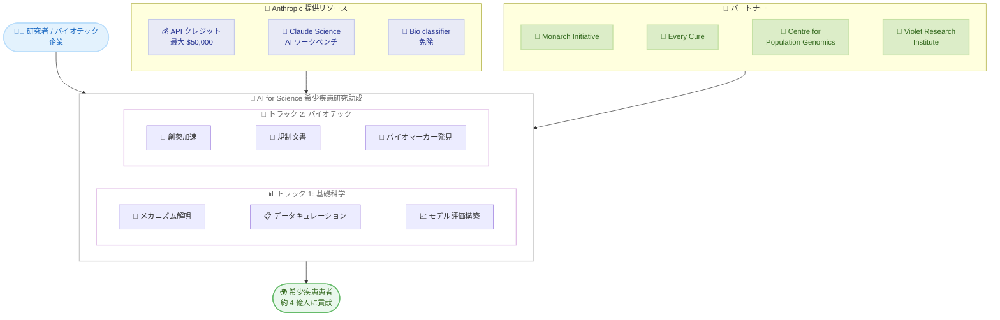

# Anthropic AI for Science: 希少疾患研究助成プログラムの応募開始

## メタデータ

| 項目 | 内容 |
|------|------|
| 発表日 | 2026-07-20 |
| ソース | Anthropic News |
| カテゴリ | AI for Science / 研究助成 |
| 公式リンク | https://www.anthropic.com/news/rare-disease-research-grants |

## 概要

Anthropic は AI for Science プログラムの一環として、希少遺伝性疾患に特化した研究助成の公募を開始した。本プログラムは「基礎科学パートナーシップ」と「バイオテックパートナーシップ」の 2 トラック構成で、採択者には最大 50,000 ドル相当の Claude API クレジット (6 か月間) と Claude Science AI ワークベンチへのアクセスが提供される。応募締切は 2026 年 8 月 2 日 (PST 23:59) となっている。

希少疾患は世界で約 4 億人に影響を与え、7,000 以上の疾患が存在するにもかかわらず、小規模な患者集団や限られたデータにより研究が進みにくい分野である。Anthropic はこのプログラムを通じて、市場原理だけでは実現しにくい領域に AI の恩恵を届けることを目指している。

## 詳細

### 背景

希少疾患の研究は以下の構造的課題に直面している。

- 患者集団が小さく、臨床試験のデザインが困難
- 疾患レジストリが限られており、自然歴データが不足
- 個別疾患が孤立して研究される傾向があり、共通メカニズムの発見が遅れる
- 遺伝子診断確定から治療法開発まで 1 - 2 年を要する
- 製造プロセスや安全性試験にかかるコスト制約

AI を活用することで、疾患間の共通メカニズム発見、薬剤再利用候補の特定、規制文書作成の効率化など、これらの課題に対するブレークスルーが期待されている。

### 主な内容

#### トラック 1: 基礎科学パートナーシップ

臨床研究者、患者団体、データサイエンティスト間の連携を促進し、希少疾患の基礎科学と疾患メカニズムの解明を加速するトラック。

**プロジェクト例。**

- 遺伝子やパスウェイを共有する希少疾患間のメカニズム的関連の提案とランキング (Monarch Initiative の DisMech で専門家が検証可能)
- 患者団体データのキュレーションによる自然歴研究の推進
- 希少疾患タスク (バリアント分類、表現型-疾患マッチング、メカニズム予測) におけるモデル性能評価の構築 (失敗事例の文書化を含む)

**主要パートナー**: Monarch Initiative (Mondo Disease Ontology、Monarch Knowledge Graph、DisMech を開発する国際コンソーシアム)

本トラックの成果は Monarchinitiative.org で公開される。

#### トラック 2: バイオテックパートナーシップ

バイオテクノロジー研究者やアーリーステージのバイオテック企業の創薬開発を支援するトラック。

**プロジェクト例。**

- PK/PD モデリング、アロメトリックスケーリング、関連モダリティの先例を用いた初期投与量の正当化
- 自然歴データのマイニングによるバイオマーカーおよび機能的エンドポイントの特定 (N-of-1 や超希少疾患プログラム向け)
- 規制文書 (IND セクション、治験責任者概要書、CMC モジュール) の作成、クロスチェック、先例調査
- 遺伝子治療間の共通メカニズム発見による「バスケット試験」の実現

**既存パートナー。**

- **Every Cure**: 数百万の候補から薬剤再利用機会を特定するために Claude を活用
- **Centre for Population Genomics** (Garvan Institute / Murdoch Children's Research Institute): 専門家レビュー用のバリアント分類ドラフトを作成する Claude ベースシステムを構築
- **Violet Research Institute**: 超希少遺伝性疾患 (5 万人に 1 人未満) を研究する非営利団体。FDA ガイドライン、バイオインフォマティクス、データ分析、規制申請に Claude を活用

### 助成内容

| 項目 | 内容 |
|------|------|
| API クレジット | 最大 $50,000 相当 |
| 期間 | 6 か月間 |
| 利用可能モデル | Claude Opus その他の生物学利用承認済みモデル |
| 追加アクセス | Claude Science AI ワークベンチ |
| 特別措置 | Bio classifier 免除の可能性あり |

### 応募締切

**2026 年 8 月 2 日 23:59 PST**

## 対象者への影響

### 対象

- 希少遺伝性疾患を研究する臨床研究者
- 患者団体およびデータサイエンティスト
- アーリーステージのバイオテック企業
- 希少疾患向け創薬に取り組むバイオテクノロジー研究者
- 疾患オントロジーやナレッジグラフの研究者

### 必要なアクション

1. 自身の研究がトラック 1 (基礎科学) またはトラック 2 (バイオテック) のいずれに該当するか確認
2. プロジェクト提案を準備 (具体的な Claude 活用方法を含む)
3. 2026 年 8 月 2 日までに公式ページのリンクから応募

### 注意事項

Anthropic は Claude の限界も認識しており、以下の点を明示している。

- データが極端に少ない、または整理されていない場合は効果が限定的
- 保険承認や診断インフラへのアクセスなど、非技術的側面には対応が難しい
- 本プログラムは技術的な研究加速に焦点を当てている

## アーキテクチャ図

## 関連リンク

- [公式発表ページ](https://www.anthropic.com/news/rare-disease-research-grants)
- [Monarch Initiative](https://monarchinitiative.org/)
- [Claude Science AI ワークベンチ発表](https://www.anthropic.com/news/claude-science-ai-workbench)
- [Anthropic AI for Science プログラム](https://www.anthropic.com/news/ai-for-science)

## まとめ

Anthropic の AI for Science 希少疾患研究助成プログラムは、AI 技術を市場原理だけでは十分な投資が集まりにくい希少疾患研究に活用する取り組みである。基礎科学とバイオテックの 2 トラック構成により、疾患メカニズムの解明から創薬加速まで幅広い研究を支援する。最大 $50,000 の API クレジットと Claude Science ワークベンチへのアクセスという実質的な支援に加え、Monarch Initiative や Every Cure など既存パートナーとのエコシステムも活用可能な点が特徴的である。希少疾患研究に携わる研究者やバイオテック企業にとって、AI を活用した研究加速の具体的な機会となる。応募締切は 2026 年 8 月 2 日。
