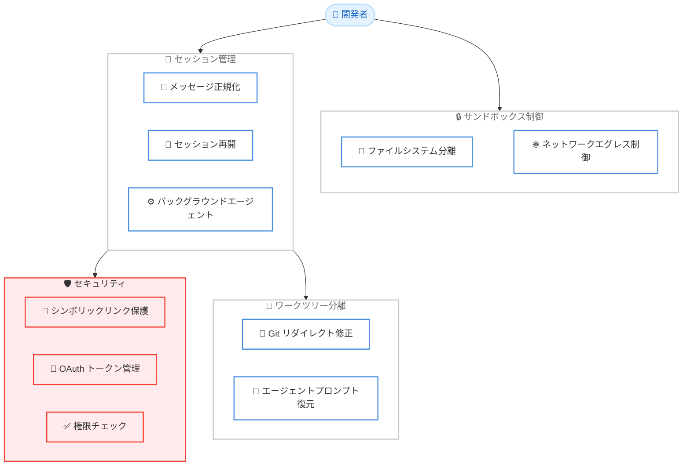

# Claude Code v2.1.216 - サンドボックス設定の柔軟化と長時間セッションのパフォーマンス改善

## メタデータ

| 項目 | 内容 |
|------|------|
| 発表日 | 2026-07-21 |
| ソース | Claude Code Changelog |
| カテゴリ | Claude Code / ツール更新 |
| 公式リンク | https://github.com/anthropics/claude-code/blob/main/CHANGELOG.md |

## 概要

Claude Code v2.1.216 がリリースされた。本リリースでは、新しいサンドボックス設定オプション `sandbox.filesystem.disabled` の追加、長時間セッションにおけるメッセージ正規化の二次的コスト増大を修正するパフォーマンス改善、シンボリックリンクを悪用したセキュリティ問題の修正など、多岐にわたる改善が含まれている。特にワークツリー分離やバックグラウンドエージェントの安定性に関する修正が多数行われ、エンタープライズ利用における信頼性が大幅に向上した。

## 詳細

### 背景

Claude Code は対話型 AI コーディングアシスタントとして、長時間セッション、バックグラウンドエージェント、ワークツリー分離など高度な機能を提供している。これらの機能は複雑な開発ワークフローを支援する一方、セッション管理やセキュリティに関する課題も浮上していた。v2.1.216 では、これらの課題に対する包括的な修正が行われた。

### 主な変更点

#### 新機能

- **`sandbox.filesystem.disabled` 設定の追加**: ファイルシステム分離をスキップしつつ、ネットワークエグレス制御を維持する新しい設定オプション。サンドボックスの柔軟なカスタマイズが可能になった。

#### パフォーマンス改善

- **メッセージ正規化の二次的コスト増大を修正**: 長時間セッションにおいてターン数に応じてメッセージ正規化コストが二次関数的に増大し、数秒のストールやレジューム遅延を引き起こしていた問題を修正。

#### セキュリティ修正

- **シンボリックリンク経由の書き込みリダイレクト防止**: `.claude` がシンボリックリンクの場合、ワークフロー保存やスケジュールタスク書き込みがプロジェクト外にリダイレクトされる問題を修正。
- **`/rewind` のシンボリックリンク/ハードリンク保護**: 追跡パスにあるシンボリックリンクやハードリンクを通じたファイル復元や削除を防止。スキップされたパス数を報告する機能も追加。
- **Windows ネットワークパスのアクセス制御**: 読み取り専用コマンドが権限プロンプトなしにネットワークパスにアクセスできる問題を修正。
- **PowerShell の不可視 Unicode 文字対応**: 不可視 Unicode 文字を含むコマンドの権限検証を修正。

#### OAuth/認証関連の修正

- **auto モードの OAuth トークン期限切れ対応**: OAuth トークンの期限切れやローテーション後に "HTTP 401" 分類エラーでコマンドが拒否される問題を修正。
- **Claude-in-Chrome の 403 ループ修正**: セッションの OAuth トークンに必要なスコープが欠けている場合の再接続時 403 ループを修正。
- **MCP 再認証の改善**: 新しいサインインが成功する前に動作中の資格情報を無効化してしまう問題を修正。

#### ワークツリー/バックグラウンドエージェント修正

- **ワークツリー分離されたサブエージェントの git リダイレクト修正**: `git -C`、`--git-dir`、`GIT_DIR`/`GIT_WORK_TREE` 経由で共有チェックアウトに git がリダイレクトされる問題を修正。
- **バックグラウンドエージェントセッションのプロンプト復元**: 再開されたバックグラウンドエージェントセッションがデフォルトエージェントに戻る問題を修正。エージェントのプロンプトとツール制限が復元されるようになった。
- **ワークツリーなしのバックグラウンドセッション削除**: git リポジトリを持たないワークツリーのバックグラウンドセッションが削除不能になる問題を修正。
- **バックグラウンドサブエージェントのキャンセル防止**: 起動ウィンドウ中に高優先度メッセージが到着した際にキャンセルされる問題を修正。

#### UX 改善

- **`AskUserQuestion` の中立的な表現**: ユーザーが待機や説明を求めた場合でも「続行してください」と促していた問題を修正。フリーテキスト回答に中立的な表現を使用するようになった。
- **Web 版の質問再送問題修正**: アイドル状態が数分続いた後に同じ質問を再送し、回答がドロップされる問題を修正。
- **`/fork` 確認メッセージの改善**: 新セッション名、`claude attach` ID、チェックアウト共有に関する注記を 1 行で表示。
- **`/context` のコンテキストウィンドウ超過警告**: 会話がコンテキストウィンドウを超えた際に明示的な警告を表示。`/compact` 失敗時にはエラーとして表示。

#### その他の修正

- **`claude daemon stop --any` の安全性向上**: 古いレガシーデーモンロックファイル経由で無関係なプロセスを終了する可能性がある問題を修正。
- **Bash コマンド権限チェックの改善**: `&&` リストや否定内のリダイレクトを含む複合文の権限チェックを修正。
- **非 ASCII 文字のパース修正**: 実際のシェルのワード境界に一致するよう修正。
- **Prometheus メトリクスエンドポイント修正**: 無効な `# UNIT` 行の出力を修正。
- **スキル/コマンドの動的反映**: セッション中に変更されたスキルやコマンドが再起動なしにスラッシュメニューに表示されるよう修正。
- **VSCode の右から左テキスト表示修正**: アラビア語、ヘブライ語、ペルシャ語が英語やコードと混在した場合の表示順序を修正。
- **クラウドセッションのコンテナ再起動対応**: コンテナがターン中に再起動した場合、中断されたターンがレジューム時に再実行されるようになった。

### 技術的な詳細

#### サンドボックス設定の新オプション

`sandbox.filesystem.disabled` 設定により、ファイルシステム分離を無効化しながらネットワークエグレス制御を維持できる。これは、ファイルシステムへの完全なアクセスが必要だが、ネットワーク通信は制限したい環境 (例: CI/CD パイプライン) で有用である。

#### メッセージ正規化のパフォーマンス修正

以前の実装では、メッセージ正規化処理がターン数の増加に伴い O(n^2) のコストで増大していた。これにより、長時間セッション (数百ターン以上) では数秒のストールが発生し、セッション再開にも時間がかかっていた。修正により、正規化処理が効率化され、長時間セッションでも安定したレスポンスが維持される。

## 開発者への影響

### 対象

- Claude Code を日常的に使用するすべての開発者
- 長時間セッションを頻繁に利用する開発者
- ワークツリー分離やバックグラウンドエージェントを活用するチーム
- Windows/PowerShell 環境で Claude Code を使用する開発者
- サンドボックス設定をカスタマイズしたいインフラ/DevOps エンジニア

### 必要なアクション

1. **Claude Code のアップデート**: v2.1.216 以上にアップデートすることを推奨。
2. **サンドボックス設定の確認**: 新しい `sandbox.filesystem.disabled` オプションが必要な場合は設定を追加。
3. **長時間セッションの再評価**: パフォーマンス修正により、以前ストールが発生していた長時間セッションが改善されているか確認。
4. **セキュリティ確認**: `.claude` ディレクトリや追跡パスにシンボリックリンクが存在しないか確認。

### 移行ガイド (該当する場合)

特別な移行手順は不要。通常のアップデートプロセスで v2.1.216 に更新可能。新しい `sandbox.filesystem.disabled` 設定を使用する場合は、設定ファイルに以下を追加する。

## コード例

```json
{
  "sandbox": {
    "filesystem": {
      "disabled": true
    }
  }
}
```

## アーキテクチャ図 (該当する場合)



## 関連リンク

- [Claude Code Changelog](https://github.com/anthropics/claude-code/blob/main/CHANGELOG.md)
- [Claude Code GitHub リポジトリ](https://github.com/anthropics/claude-code)
- [Claude Code ドキュメント](https://docs.anthropic.com/en/docs/claude-code)

## まとめ

Claude Code v2.1.216 は、パフォーマンス、セキュリティ、安定性の 3 つの柱で大幅な改善を実現したリリースである。特に、長時間セッションにおける二次的コスト増大の修正は、日常的に Claude Code を使用する開発者にとって体感的な改善をもたらす。サンドボックス設定の柔軟化により、より多様な開発環境での活用が可能になり、シンボリックリンクや権限チェックに関するセキュリティ修正により、エンタープライズ環境での安全性も向上した。ワークツリー分離とバックグラウンドエージェントの安定性向上は、複雑なマルチリポジトリワークフローを持つチームにとって重要な改善である。
