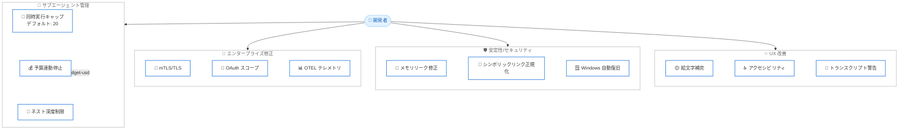

# Claude Code v2.1.217 - サブエージェント管理の強化とエンタープライズ環境向け安定性改善

## メタデータ

| 項目 | 内容 |
|------|------|
| 発表日 | 2026-07-22 |
| ソース | Claude Code Changelog |
| カテゴリ | Claude Code / ツール更新 |
| 公式リンク | https://github.com/anthropics/claude-code/blob/main/CHANGELOG.md |

## 概要

Claude Code v2.1.217 がリリースされた。本リリースでは、サブエージェントの同時実行数制限やネスト防止によるリソース管理の強化、企業環境における mTLS/OAuth/OTEL 設定の修正、MCP ツール出力によるメモリリークの修正、Windows 環境でのオートアップデート失敗時の自動復旧など、20 項目にわたる改善が含まれている。特にサブエージェント管理の改善により、1 つのメッセージから無制限にバックグラウンドエージェントが展開される問題が根本的に解決された。

## 詳細

### 背景

Claude Code のサブエージェント機能は、複雑なタスクを並列に処理する強力な機能である。しかし、従来の実装ではサブエージェントの同時実行数に上限がなく、1 つのメッセージから無制限にエージェントがファンアウトする可能性があった。また、`--max-budget-usd` オプションがバックグラウンドサブエージェントを停止できない問題も存在していた。v2.1.217 では、これらのリソース管理の課題を包括的に解決するとともに、エンタープライズ環境での接続性やテレメトリ設定に関する複数の問題を修正している。

### 主な変更点

#### 新機能

- **絵文字ショートコード補完**: プロンプト入力で `:heart:` と入力すると心臓の絵文字が挿入される。`:hea` のように途中まで入力するとサジェストが表示される。`emojiCompletionEnabled` 設定で無効化可能。
- **トランスクリプト書き込みエラーの警告**: ディスク容量不足などでトランスクリプト書き込みが失敗している場合や、環境変数の継承によりセッション保存が無効になっている場合に警告を表示。従来はトランスクリプトが無言で失われていた。
- **サブエージェント同時実行数の上限設定**: デフォルトで最大 20 のサブエージェントが同時実行可能。`CLAUDE_CODE_MAX_CONCURRENT_SUBAGENTS` 環境変数でカスタマイズ可能。

#### サブエージェント管理の改善

- **予算上限でのバックグラウンドエージェント停止**: `--max-budget-usd` で設定した上限に達した際、新しいサブエージェントの起動を拒否し、実行中のバックグラウンドエージェントも停止するよう修正。
- **ネストされたサブエージェントの禁止**: サブエージェントがさらにサブエージェントを生成するネスト動作をデフォルトで禁止。`CLAUDE_CODE_MAX_SUBAGENT_SPAWN_DEPTH` 環境変数でより深いネストを許可可能。

#### セキュリティ修正

- **ワークスペース分離のシンボリックリンク正規化**: バックグラウンドセッション分離において、シンボリックリンクされた作業ディレクトリの正規化が行われていなかった問題を修正。セッションがワークスペースフォルダ外にエスケープする可能性があった。

#### エンタープライズ/企業環境の修正

- **mTLS/TLS-verify/OAuth スコープ/プロキシ設定の修正**: Claude Desktop セッションでこれらの企業ネットワーク設定が無視されていた問題を修正。
- **OTEL テレメトリエンドポイントの統合管理**: マネージド設定で `OTEL_EXPORTER_OTLP_ENDPOINT` を設定した際、下位スコープのシグナル固有オーバーライドがテレメトリをマネージドエンドポイントからリダイレクトしてしまう問題を修正。

#### メモリ/パフォーマンス修正

- **MCP ツール出力のメモリリーク修正**: 切り詰められた MCP ツール出力が、セッションの残り期間中に完全な未切り詰めの結果をメモリに保持し続けるメモリリークを修正。

#### Windows 固有の修正

- **オートアップデート失敗時の自動復旧**: Windows でオートアップデートが失敗した際に `claude.exe` が消失する問題を修正。失敗したアップデートは保存された実行ファイルを自動的に復元するようになった。
- **バックグラウンドシェルの停止不能問題**: セッションをバックグラウンドに送信した後 (`/background` または `←`)、またはセッション終了時にバックグラウンドシェルが停止不能になる問題を修正。高負荷マシンで特に顕著だった。

#### UX/アクセシビリティ改善

- **スクリーンリーダーモードの改善**: 起動時のアナウンスが最初のプロンプトレンダリングによって途切れる問題と、思考ステータス行が経過時間やトークン数の更新のために数秒ごとに再レンダリングされる問題を修正。
- **Remote Control セッションの権限プロンプト表示**: 権限プロンプトやダイアログが表示された後に接続したビューアーにこれらが表示されない問題を修正。
- **バックグラウンドセッション接続時のレイアウト修正**: 起動中のバックグラウンドセッションにアタッチした際、トランスクリプトプレビューが入力エリアに密着して表示される問題を修正。ライブレイアウトと同じ 1 行分のギャップが確保されるようになった。

#### その他の修正

- **Bedrock 上の Claude Opus 4.8 でのオートコンパクト修正**: オートコンパクトがトリガーされず、`/compact` が上限超過後に失敗する問題を修正。
- **`--resume`/`--continue` および `/resume` の TypeError 修正**: トランスクリプトに不正な添付エントリがある場合に発生する TypeError を修正。
- **`CLAUDE.md`/`SKILL.md` のブレース展開の予算制限**: パスフロントマターの値に多数のブレースグループが含まれる場合、CLI がスタートアップ時に OOM キルまたはストールする問題を修正。ブレース展開に予算制限が設けられた。

#### 表示/UI の改善

- **PR バッジリンクのクリック対応**: フッターの PR バッジリンクがターミナルサポートを検出できない環境 (SSH/tmux 経由など) でもクリック可能なハイパーリンクとして表示されるよう改善。`FORCE_HYPERLINK=0` でオプトアウト可能。
- **ログイン期限警告のタイミング変更**: 期限切れの 5 日前ではなく 3 日前に警告を表示するよう変更。
- **フロントエンドデザインプラグインの提案制限**: プラグイン提案チップの表示を無制限から生涯 3 回に制限。

### 技術的な詳細

#### サブエージェント同時実行制御のアーキテクチャ

新しいサブエージェント管理では、以下の 3 つのメカニズムが連携して動作する。

1. **同時実行キャップ**: デフォルト 20 の同時実行上限。新しいサブエージェントの起動要求はキューイングされ、上限に達している場合は拒否される。
2. **予算連動停止**: `--max-budget-usd` に達した時点で、新規起動の拒否に加え、実行中のバックグラウンドエージェントにも停止シグナルが送信される。
3. **ネスト深度制限**: デフォルトではサブエージェントからのサブエージェント起動を禁止。`CLAUDE_CODE_MAX_SUBAGENT_SPAWN_DEPTH` で許容深度を設定可能。

#### MCP メモリリークの原因

MCP ツールの出力が内部バッファサイズを超えた場合、表示用に切り詰められたバージョンが作成されるが、元の完全なデータへの参照がセッション内のオブジェクトに保持され続けていた。大容量の出力を返す MCP ツールを頻繁に使用するセッションでは、数 GB のメモリ消費に至る可能性があった。修正により、切り詰め処理後に元データへの参照が適切に解放される。

#### ブレース展開の予算制限

`CLAUDE.md` や `SKILL.md` の paths フロントマターにおいて、シェルスタイルのブレース展開 (`{a,b,c}`) が使用される。悪意あるまたは意図せず大量のブレースグループが含まれるパターン (例: `{a,b}{c,d}{e,f}...`) は展開結果が指数関数的に増大し、メモリ枯渇を引き起こす。修正により、展開候補数に上限が設けられ、上限を超えた場合は展開を中止してエラーを報告する。

## 開発者への影響

### 対象

- Claude Code を日常的に使用するすべての開発者
- サブエージェント機能を活用してタスクを並列処理する開発者
- 企業ネットワーク環境 (mTLS、プロキシ) で Claude Code を使用するチーム
- MCP ツールを多用する長時間セッションを実行する開発者
- Windows 環境で Claude Code を使用する開発者
- アクセシビリティ支援技術を使用する開発者

### 必要なアクション

1. **Claude Code のアップデート**: v2.1.217 以上にアップデートすることを推奨。特にメモリリーク修正とセキュリティ修正の恩恵を受けるため。
2. **サブエージェント設定の確認**: デフォルトの同時実行上限 (20) やネスト禁止が既存ワークフローに影響しないか確認。必要に応じて環境変数で調整。
3. **企業ネットワーク設定の確認**: Claude Desktop セッションで mTLS やプロキシ設定が正しく動作するようになったため、以前ワークアラウンドを適用していた場合は再評価。
4. **OTEL 設定の確認**: マネージド設定でテレメトリエンドポイントを管理している場合、シグナル固有のオーバーライドが正しく統制されているか確認。

### 移行ガイド (該当する場合)

サブエージェントのネスト動作に依存していたワークフローがある場合は、環境変数で明示的に許可する必要がある。

```bash
# サブエージェントのネストを 2 階層まで許可
export CLAUDE_CODE_MAX_SUBAGENT_SPAWN_DEPTH=2

# 同時実行上限を 30 に変更
export CLAUDE_CODE_MAX_CONCURRENT_SUBAGENTS=30
```

## コード例

```json
// settings.json でのサブエージェント設定例
{
  "env": {
    "CLAUDE_CODE_MAX_CONCURRENT_SUBAGENTS": "30",
    "CLAUDE_CODE_MAX_SUBAGENT_SPAWN_DEPTH": "2"
  }
}
```

```json
// 絵文字補完を無効にする設定
{
  "emojiCompletionEnabled": false
}
```

```bash
# 予算上限付きで Claude Code を起動
# 上限到達時にバックグラウンドエージェントも停止される
claude --max-budget-usd 5.00

# ハイパーリンク表示を無効にする
export FORCE_HYPERLINK=0
```

## アーキテクチャ図 (該当する場合)



## 関連リンク

- [Claude Code Changelog](https://github.com/anthropics/claude-code/blob/main/CHANGELOG.md)
- [Claude Code GitHub リポジトリ](https://github.com/anthropics/claude-code)
- [Claude Code ドキュメント](https://docs.anthropic.com/en/docs/claude-code)

## まとめ

Claude Code v2.1.217 は、サブエージェント管理、エンタープライズ環境対応、メモリ安定性、UX の 4 つの領域で重要な改善を実現したリリースである。最大の変更点はサブエージェントの同時実行制御であり、デフォルト 20 の上限設定、予算上限との連動、ネスト禁止の 3 つのメカニズムにより、リソースの暴走を防止する堅牢な制御が実現された。MCP ツール出力のメモリリーク修正は、長時間セッションの安定性を大幅に向上させる。企業環境では mTLS、OAuth スコープ、OTEL テレメトリの設定が正しく反映されるようになり、セキュリティポリシーに準拠した運用が可能になった。Windows ユーザーにとっては、オートアップデート失敗時の自動復旧とバックグラウンドシェルの停止不能問題の修正が重要な改善である。
