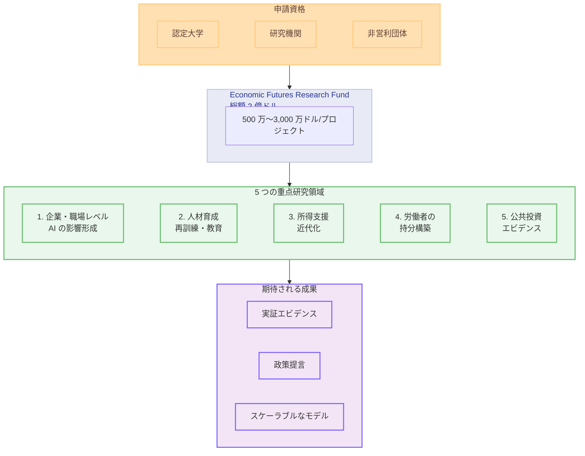

# Economic Futures Research Fund の研究アジェンダ

## メタデータ

| 項目 | 内容 |
|------|------|
| 発表日 | 2026-07-22 |
| ソース | Anthropic News |
| カテゴリ | 研究・経済 |
| 公式リンク | https://www.anthropic.com/news/economic-futures-research-fund-agenda |

## 概要

Anthropic は、AI が経済に与える影響に備えるための外部研究を支援する **Economic Futures Research Fund** の研究アジェンダを公開した。総額 2 億ドル (約 300 億円) の基金を通じて、5 つの重点研究領域における大規模な実証実験やパイロットプログラムを資金提供する。プロジェクトあたりの主要な助成額は 500 万〜3,000 万ドルで、最低 100 万ドルからの申請を受け付ける。

本基金は 2026 年 6 月に公開された Anthropic の Economic Policy Framework (EPF) に基づいており、「歴史的前例のない時代において、誰も試したことのない解決策が最も有望である可能性がある」という認識のもと、従来の小規模助成から大規模で野心的なプロジェクトへと方針を転換したものである。

## 詳細

### 背景

Anthropic は 1 年前に Economic Futures プログラムを立ち上げたが、多数の小規模助成を同時に管理するスケーリングの難しさに直面した。今回の研究基金は、その経験を踏まえて「最も高いインパクトを生み出せる」大規模プロジェクトに焦点を絞る形に進化している。

AI による経済変革は、従来の技術革新とは異なる規模とスピードで進行する可能性があり、既存の労働市場政策や社会保障制度では対応しきれない課題が生じ得る。本基金は、こうした課題に対する実証的なエビデンスを早期に生成し、政策立案者が行動可能なタイミングで情報を提供することを目指している。

### 主な変更点

本研究アジェンダでは、以下の 5 つの重点領域を定義している。

#### 1. 企業・職場レベルでの AI の労働者への影響形成

AI の労働市場への影響は、技術そのものよりも、それを取り巻くシステム、職場環境、研修プロトコル、制度的選択に依存する。

**助成対象となる研究方向。**

- 企業・チームレベルでの AI システムと統合設計をランダム化する現場実験 (労働者との共同設計 vs トップダウン方式の比較を含む)
- AI 職場統合に関する組織的選択が生産性向上の帰属にどう影響するかの推定
- 雇用維持税額控除や雇用主共同投資要件の評価

#### 2. AI による変革を乗り越えるための人材育成

再訓練やジョブプレースメントに関する既存エビデンスは結果がまちまちであり、AI が引き起こす急速な構造変革には一般化できない可能性がある。

**助成対象となる研究方向。**

- 革新的なスキル再訓練、就職斡旋、免許制度改革、セクター移行パッケージの評価 (AI 対応のマッチング、資格認定、学習モデル、所得支援とのバンドルを含む)
- 初期キャリア・専門職パイプラインに関する現場実験 (徒弟制度、メンタリング、ローテーションモデルなど)
- K-12 および高等教育のカリキュラム・提供モデルの評価 (教育介入と労働市場成果を結ぶ縦断的パイロットを含む)
- 野心的なモビリティ手段のテスト (再訓練に連動した有給休暇、雇用主間のポータブルベネフィットなど)

#### 3. AI による失業に対応する所得支援の近代化

米国 (および類似のグローバルプログラム) の失業者支援制度は、失業が一時的であることを前提としている。AI はより広範かつ持続的な失業を生み出す可能性がある。

**助成対象となる研究方向。**

- AI による失業に適した失業保険 (UI) 改革: 代替的な適格基準、産業・職種に連動した自動延長トリガー、賃金保険や再訓練との統合
- UI を使い果たした、資格がなかった、または持続的に過小雇用されている労働者への基本的ニーズ救済
- 所得と労働が持続的に切り離されるシナリオを想定した、生活可能水準での長期間無条件所得パイロット (労働供給、消費、幸福度、家庭安定性、子どもの発達、市民参加、時間構造化などを測定)

#### 4. AI による成長における労働者の持分構築

AI が大きな総体的利益をもたらすシナリオでも、それがデフォルトで広く共有されるとは限らない。

**助成対象となる研究方向。**

- 大規模な事前分配型資本口座設計の RCT (ランダム化比較試験)
- 株式共有やディビデンド型メカニズムのパイロット (AI インフラ・企業が地域住民に直接的かつ継続的なリターンを生み出すコミュニティレベルのパイロットを含む)
- 異なる歳入確保・分配メカニズムの比較評価 (法人税、キャピタルゲイン税、トークン税、コンピュート税、自動化税など)

#### 5. 公共投資に関する新たなエビデンスの生成

政策立案者は、各種手段を直接的な移転と一貫して比較する方法を必要としている。

**助成対象となる研究方向。**

- 人間・コミュニティ向けサービス職 (教育、放課後プログラム、図書館、コミュニティヘルス、公園、インフラ、芸術) に直接資金提供する大規模パイロット
- AI 対応の公共サービス (法律相談、医療ガイダンス、金融アドバイス) へのアクセスを拡大するパイロット
- 公共財分野における失業者・長期失業者向けの雇用保証パイロット (市民保全部隊に着想を得つつ、より広い役割に拡張)
- AI による失業に最も影響を受けるコミュニティや AI インフラの主要拠点における地域密着型介入

### 技術的な詳細

#### 助成金額と規模

| 項目 | 内容 |
|------|------|
| 基金総額 | 2 億ドル |
| 主要助成額 | 500 万〜3,000 万ドル/プロジェクト |
| 最低額 | 100 万ドル |
| 上限 | 明確な上限なし (十分にスコープされた高インパクトプロジェクトは柔軟に対応) |

#### 対象地域

グローバルファンドだが、Anthropic のサンフランシスコ本拠地と Claude の米国ユーザーベースを考慮し、やや米国中心的な傾向がある。

#### 申請資格

| 対象 | 詳細 |
|------|------|
| 認定大学 | 学位授与機関 |
| 独立研究機関 | 政策研究組織を含む |
| 非営利団体 | 大規模な現場実験の実績を持つ組織 |

**対象外**: 個人研究者としての申請 (ただし機関提案の主任研究者は可能)

## 開発者への影響

### 対象

本研究アジェンダは直接的なソフトウェア開発者向けのものではなく、以下の関係者を主な対象としている。

- **研究機関・大学**: 大規模な現場実験を実施できる組織
- **政策研究者**: 労働経済学、社会保障、公共政策の専門家
- **非営利団体**: 社会プログラムの実施と評価に実績を持つ組織
- **政策立案者**: AI の経済影響に備える政策設計を必要とする行政機関
- **AI 企業・開発者**: AI の社会的影響を理解し、責任ある開発に取り組む技術者

### 必要なアクション

- **研究者・研究機関**: 5 つの重点領域に合致する研究提案を Google フォーム経由で提出
- **AI 開発者**: AI が労働市場に与える影響を認識し、ツール設計において労働者との協働を考慮
- **企業**: AI 統合における組織設計の選択が労働者に与える影響を意識し、実証研究への参加を検討

### 移行ガイド (該当する場合)

該当なし。本発表は研究助成プログラムの告知であり、技術的な移行は不要である。

## アーキテクチャ図

## 関連リンク

- [Economic Futures Research Fund 研究アジェンダ (公式)](https://www.anthropic.com/news/economic-futures-research-fund-agenda)
- [Anthropic Economic Policy Framework](https://www.anthropic.com/news) - 2026 年 6 月公開の経済政策フレームワーク
- [Anthropic News](https://www.anthropic.com/news) - 公式ニュースページ

## まとめ

Anthropic の Economic Futures Research Fund は、AI の経済的影響に対する社会の備えを実証的に構築するための 2 億ドル規模の研究基金である。5 つの重点領域 (職場レベルの影響形成、人材育成、所得支援の近代化、労働者の持分構築、公共投資のエビデンス生成) を通じて、AI 時代の経済政策に必要なエビデンスベースを構築することを目指している。

従来の小規模助成から大規模プロジェクト (500 万〜3,000 万ドル) への転換は、「早期に行動可能なシグナルは、遅すぎる回答よりも価値がある」という Anthropic の信念を反映している。AI 企業として自社技術の社会的影響に正面から向き合い、学術機関や非営利団体と連携して実証研究を推進する姿勢は、責任ある AI 開発のモデルケースとなり得る。
