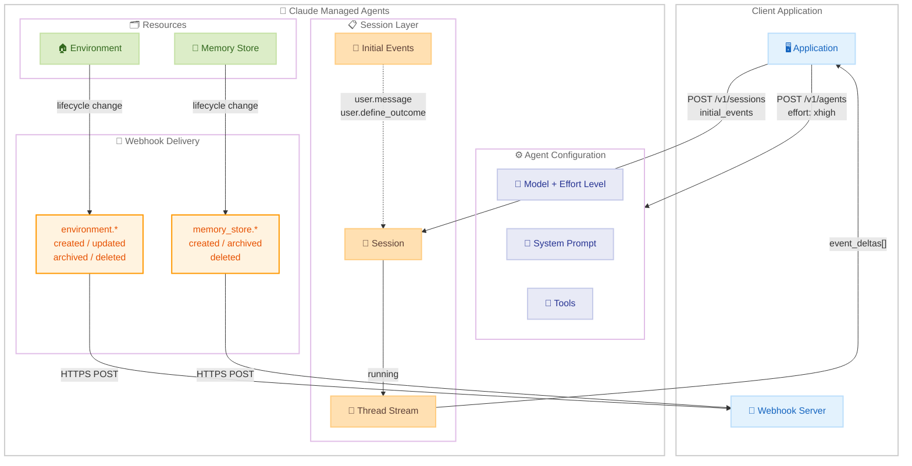

# Claude Managed Agents: エフォートレベル、Webhook 拡張、セッションシーディング

## メタデータ

| 項目 | 内容 |
|------|------|
| 発表日 | 2026-07-22 |
| ソース | Claude API Release Notes |
| カテゴリ | API・プラットフォーム |
| 公式リンク | https://platform.claude.com/docs/en/release-notes/overview |

## 概要

2026 年 7 月 22 日、Claude Managed Agents プラットフォームに 5 つの機能拡張がリリースされた。エージェントのモデル設定にエフォートレベルを指定可能になり、Webhook がEnvironment およびメモリストアのライフサイクルイベントをカバーし、セッション作成時に初期イベントをシーディングできるようになった。また、エージェント更新時の `version` フィールドがオプション化され、スレッドレベルのイベントストリームでイベントデルタがサポートされた。

## 詳細

### 背景

Claude Managed Agents は、Anthropic が提供するエージェントホスティングプラットフォームである。開発者はエージェント設定 (モデル、システムプロンプト、ツール、MCP サーバー) をバージョン管理されたリソースとして定義し、セッションを通じてタスクを実行する。今回のアップデートは、エージェントのパフォーマンス制御、イベント駆動アーキテクチャ、セッション起動フローの効率化、バージョン管理の柔軟性、リアルタイムストリーミングの 5 つの領域を強化するものである。

### 主な変更点

1. **エージェントへのエフォートレベル設定**: エージェント作成時に `model` オブジェクト内で `effort` レベルを指定可能になった。`low`、`medium`、`high`、`xhigh`、`max` の 5 段階から選択でき、トークン消費量と推論の深さをトレードオフとして制御できる。

2. **Webhook の拡張 (Environment・メモリストア)**: Webhook が新たに 4 つの `environment.*` イベントタイプと 3 つの `memory_store.*` イベントタイプをサポートした。ポーリングなしで環境およびメモリストアのライフサイクル変更を検知できる。

3. **セッションシーディング (初期イベント)**: セッション作成時に `initial_events` を指定して、最大 50 個の `user.message` および `user.define_outcome` イベントをシーディングできるようになった。非空のリストを渡すと、同一コール内でエージェントループが開始される。

4. **version フィールドのオプション化**: エージェント更新時の `version` フィールドがオプションになった。楽観的並行性制御が必要な場合は `version` を指定 (不一致時は 409 エラー)、不要な場合は省略して無条件に適用できる。

5. **スレッドレベルのイベントデルタ**: セッションのスレッドイベントストリーム (`GET /v1/sessions/{session_id}/threads/{thread_id}/stream`) がイベントデルタをサポートした。セッションレベルのストリームと同じ `event_deltas[]` クエリパラメータを受け付け、サブエージェントのテキスト生成をリアルタイムにプレビューできる。

### 技術的な詳細

#### エフォートレベルの詳細

エフォートレベルはモデルが応答に使用するトークン量を制御するパラメータである。テキスト応答、ツール呼び出し、拡張思考のすべてに影響する。

| レベル | 説明 | 典型的なユースケース |
|--------|------|---------------------|
| `max` | トークン消費の制約なしで最大能力 | 最も深い推論と徹底的な分析 |
| `xhigh` | 長期的作業向けの拡張能力 | 30 分超のコーディング・エージェントタスク |
| `high` | 高い能力 (デフォルト) | 複雑な推論、難易度の高いコーディング |
| `medium` | バランスの取れたアプローチ | 速度・コスト・パフォーマンスのバランス |
| `low` | 最も効率的 | 単純なタスク、サブエージェント向け |

**注意**: セッションごとのモデルオーバーライドで設定した `effort` は適用されない。エフォートレベルはエージェントリソース自体に設定する必要がある。

#### Webhook イベントタイプ

**Environment イベント (4 種類)**:

| イベント | トリガー |
|----------|---------|
| `environment.created` | 環境が作成された |
| `environment.updated` | 環境が更新された (少なくとも 1 フィールド変更) |
| `environment.archived` | 環境がアーカイブされた |
| `environment.deleted` | 環境が削除された |

**Memory Store イベント (3 種類)**:

| イベント | トリガー |
|----------|---------|
| `memory_store.created` | メモリストアが作成された |
| `memory_store.archived` | メモリストアがアーカイブされた |
| `memory_store.deleted` | メモリストアが削除された |

#### セッションシーディングの制約

| 条件 | ステータス |
|------|-----------|
| `user.define_outcome` が 2 個以上 | 400 |
| `rubric` のない `user.define_outcome` | 400 |
| ドキュメントコンテンツブロックが合計 100 超 | 400 |
| リクエストボディが 32 MB 超 | 413 |

バリデーションは全件一括で行われる。いずれかのイベントが検証に失敗した場合、リクエスト全体が拒否されセッションは作成されない。

## 開発者への影響

### 対象

- Claude Managed Agents を使用してエージェントシステムを構築している開発者
- Webhook ベースのイベント駆動アーキテクチャを採用しているチーム
- エージェントのパフォーマンスチューニングを行う ML エンジニア
- CI/CD パイプラインでエージェント設定を管理しているチーム

### 必要なアクション

1. **エフォートレベルの設定**: エージェントのユースケースに応じて適切なエフォートレベルを設定する。コーディングエージェントには `xhigh`、サブエージェントには `low` を推奨。
2. **Webhook の登録**: Environment やメモリストアの変更を監視する必要がある場合、Console の Manage > Webhooks から対応するイベントタイプを登録する。
3. **セッション起動フローの簡素化**: 2 ステップ (セッション作成 + イベント送信) のワークフローを `initial_events` を使った 1 ステップに統合することを検討する。
4. **バージョン管理戦略の見直し**: CI/CD の宣言的適用ループでは `version` を省略し、インタラクティブなクライアントでは `version` を指定する戦略を検討する。

### 移行ガイド

エフォートレベルとセッションシーディングはいずれも追加的な機能であり、既存の API 呼び出しに破壊的変更はない。`version` フィールドのオプション化も後方互換であり、従来通り `version` を指定するコードはそのまま動作する。

## コード例

### エフォートレベル付きエージェントの作成

```python
import anthropic

client = anthropic.Anthropic()

# エフォートレベルを設定してエージェントを作成
agent = client.beta.agents.create(
    name="Research Agent",
    model={"id": "claude-opus-4-8", "effort": "xhigh"},
    system="You are a thorough research agent that investigates topics deeply.",
    tools=[{"type": "agent_toolset_20260401"}],
)

print(f"Agent ID: {agent.id}")
print(f"Model: {agent.model.id}, Effort: {agent.model.effort}")
```

```typescript
import Anthropic from "@anthropic-ai/sdk";

const client = new Anthropic();

// エフォートレベルを設定してエージェントを作成
const agent = await client.beta.agents.create({
  name: "Research Agent",
  model: { id: "claude-opus-4-8", effort: "xhigh" },
  system: "You are a thorough research agent that investigates topics deeply.",
  tools: [{ type: "agent_toolset_20260401" }],
});

console.log(`Agent ID: ${agent.id}`);
console.log(`Model: ${agent.model.id}, Effort: ${JSON.stringify(agent.model.effort)}`);
```

### セッションシーディングによる 1 コール起動

```python
import anthropic

client = anthropic.Anthropic()

# initial_events を使ってセッション作成と同時にエージェントを起動
session = client.beta.sessions.create(
    agent=agent.id,
    environment_id=environment.id,
    initial_events=[
        {
            "type": "user.message",
            "content": [
                {"type": "text", "text": "Analyze the Q2 2026 revenue report and summarize key trends."}
            ],
        },
        {
            "type": "user.define_outcome",
            "rubric": "The analysis should include revenue growth rate, top contributing segments, and year-over-year comparisons.",
        },
    ],
)

# セッションは running 状態で返される - 別途イベント送信不要
print(f"Session ID: {session.id}, Status: {session.status}")

# SSE ストリームでエージェントの出力をリアルタイム監視
with client.beta.sessions.stream(session.id) as stream:
    for event in stream:
        if hasattr(event, "content"):
            print(event.content, end="", flush=True)
```

```typescript
import Anthropic from "@anthropic-ai/sdk";

const client = new Anthropic();

// initial_events を使ってセッション作成と同時にエージェントを起動
const session = await client.beta.sessions.create({
  agent: agent.id,
  environment_id: environment.id,
  initial_events: [
    {
      type: "user.message",
      content: [
        { type: "text", text: "Analyze the Q2 2026 revenue report and summarize key trends." }
      ],
    },
    {
      type: "user.define_outcome",
      rubric: "The analysis should include revenue growth rate, top contributing segments, and year-over-year comparisons.",
    },
  ],
});

console.log(`Session ID: ${session.id}, Status: ${session.status}`);
```

### Webhook で Environment・メモリストアイベントを処理

```python
from flask import Flask, request
import anthropic

client = anthropic.Anthropic()
app = Flask(__name__)


@app.route("/webhook", methods=["POST"])
def webhook():
    try:
        event = client.beta.webhooks.unwrap(
            request.get_data(as_text=True),
            headers=dict(request.headers),
        )
    except Exception:
        return "invalid signature", 400

    match event.data.type:
        case "environment.created":
            print(f"Environment created: {event.data.id}")
        case "environment.updated":
            env = client.beta.environments.retrieve(event.data.id)
            print(f"Environment updated: {env.name}")
        case "environment.archived":
            print(f"Environment archived: {event.data.id}")
        case "environment.deleted":
            print(f"Environment deleted: {event.data.id}")
        case "memory_store.created":
            print(f"Memory store created: {event.data.id}")
        case "memory_store.archived":
            print(f"Memory store archived: {event.data.id}")
        case "memory_store.deleted":
            print(f"Memory store deleted: {event.data.id}")

    return "", 204
```

### version 省略によるエージェント無条件更新

```python
import anthropic

client = anthropic.Anthropic()

# version を省略 - 無条件で更新 (CI/CD の宣言的適用に適している)
updated_agent = client.beta.agents.update(
    agent.id,
    model={"id": "claude-opus-4-8", "effort": "high"},
    system="You are a helpful coding agent. Always write tests.",
)

print(f"New version: {updated_agent.version}")
```

### スレッドレベルのイベントデルタ取得

```bash
# サブエージェントのテキスト生成をリアルタイムにプレビュー
curl -N "https://api.anthropic.com/v1/sessions/$SESSION_ID/threads/$THREAD_ID/stream?event_deltas[]=agent.message.delta" \
  -H "x-api-key: $ANTHROPIC_API_KEY" \
  -H "anthropic-version: 2023-06-01" \
  -H "anthropic-beta: managed-agents-2026-04-01"
```

## アーキテクチャ図



## 関連リンク

- [Claude Managed Agents - Agent Setup](https://platform.claude.com/docs/en/managed-agents/agent-setup)
- [Effort Levels](https://platform.claude.com/docs/en/build-with-claude/effort#effort-levels)
- [Subscribe to Webhooks](https://platform.claude.com/docs/en/managed-agents/webhooks#supported-event-types)
- [Seed the Session with Initial Events](https://platform.claude.com/docs/en/managed-agents/sessions#seed-the-session-with-initial-events)
- [Events and Streaming](https://platform.claude.com/docs/en/managed-agents/events-and-streaming)
- [Update Semantics](https://platform.claude.com/docs/en/managed-agents/agent-setup#update-semantics)

## まとめ

今回のアップデートにより、Claude Managed Agents の制御性と効率性が大幅に向上した。エフォートレベルの導入はコストとパフォーマンスのきめ細かなトレードオフを可能にし、Webhook の拡張はイベント駆動アーキテクチャの完全性を高めた。セッションシーディングは起動フローを 1 コールに簡素化し、レイテンシの削減に寄与する。`version` フィールドのオプション化は CI/CD パイプラインでの宣言的管理を容易にし、スレッドレベルのイベントデルタはマルチエージェント構成でのリアルタイム可視性を向上させた。いずれも後方互換な追加機能であり、既存のワークフローを変更することなく段階的に採用できる。
