# Claude Code v2.1.219: Opus 5 統合とワークフロー改善

## メタデータ

| 項目 | 内容 |
|------|------|
| 発表日 | 2026-07-24 |
| ソース | Claude Code Changelog |
| カテゴリ | ツールアップデート |
| 公式リンク | https://github.com/anthropics/claude-code/blob/main/CHANGELOG.md |

## 概要

Claude Code v2.1.219 がリリースされた。本リリースの最大の目玉は Claude Opus 5 (`claude-opus-5`) のデフォルトモデルとしての統合である。1M コンテキストウィンドウを持つ Opus 5 がファストモードで利用可能になり、入力 $10/出力 $50 per Mtok の価格設定で提供される。また、サンドボックスのネットワーク制御強化、ディレクトリ追加時のフック機能、サブエージェントのネスト深度拡張 (最大 3 階層)、Dynamic Workflow のサイズガイドライン設定など、エンタープライズ向けのセキュリティ機能と大規模ワークフロー管理機能が大幅に強化されている。

## 詳細

### 背景

Claude Code のモデル選択は、開発者の生産性に直結する重要な要素である。Opus 4.8 から Opus 5 への世代交代に伴い、Claude Code はデフォルトの Opus モデルを Opus 5 に切り替えた。同時に、v2.1.217 で導入されたサブエージェント管理基盤を発展させ、ネストされたサブエージェントの深度を 3 階層まで拡張。これにより、複雑なマルチエージェントワークフローがより自然に構築できるようになった。また、エンタープライズ環境でのセキュリティ要件に対応するため、サンドボックスのネットワークアクセス制御がより厳密に設定できるようになっている。

### 主な変更点

#### 新機能

- **Claude Opus 5 のデフォルト統合**: `claude-opus-5` が新しいデフォルト Opus モデルとして追加された。1M コンテキストウィンドウを持ち、ファストモードで入力 $10/出力 $50 per Mtok で利用可能
- **`sandbox.network.strictAllowlist` 設定**: サンドボックスコマンドにおいて、許可リストに含まれないホストへのネットワークアクセスをプロンプトなしで拒否する設定が追加された
- **`DirectoryAdded` フック**: `/add-dir` コマンドまたは SDK の `register_repo_root` コントロールリクエストでセッション中に新しい作業ディレクトリが登録された際に発火するフックが追加された
- **`mcp_server_errors` のヘッドレスストリーム公開**: headless の stream-json init イベントに `mcp_server_errors` フィールドが追加され、`--mcp-config` で指定されたエントリのうち設定バリデーションでスキップされたものがリストされる。ターミナル実行時には起動警告が表示される
- **`workflowSizeGuideline` 設定キー**: Dynamic Workflow のサイズガイドラインを任意の設定ファイルから指定できるようになった
- **ネストされたサブエージェントの stream-json 転送**: depth-2 以上で生成されたサブエージェントが `--forward-subagent-text` 設定時に stream-json に表示されるようになった
- **サブエージェントのネスト深度拡張**: サブエージェントがデフォルトで最大 3 階層までネストしたサブエージェントを生成可能になった (従来は 1 階層)

#### 動作変更

- **Opus 4.7 のファストモードからの削除**: `/fast` は Opus 5 と Opus 4.8 に適用されるようになり、Opus 4.7 は対象外となった
- **claude-api スキルのデフォルトモデル更新**: claude-api スキルが Claude Opus 5 をデフォルトとするよう更新され、Opus 4.8 からの移行パスが提供されている
- **Dynamic Workflow のデフォルトサイズガイドライン**: Dynamic Workflow のデフォルトが medium サイズガイドライン (エージェント数 15 未満を目標) に変更された
- **MCP 許可/拒否リストの `${VAR}` 解決方式変更**: マネージド MCP の allowlist/denylist で `${VAR}` エントリの解決方式が変更された
- **`/model` ピッカーの表示変更**: `/model` ピッカーで最新モデルの名前のみがハイライトされるようになった

#### バグ修正

- **`claude -p` のテキスト出力消失修正**: ミッドストリーム API エラーでターンが終了した際に、既に生成された回答がテキスト出力から失われる問題を修正
- **Fable モデル行の表示修正**: プランに含まれているにもかかわらず "Requires usage credits" と表示される問題を修正
- **`/model` ピッカーの Opus 表示修正**: マージされた Opus 行が "Opus" とだけ表示され、"Opus (1M context)" と表示されない問題を修正
- **GNU screen 内の copy-on-select 修正**: GNU screen 内で copy-on-select がコピーではなく base64 を出力する問題を修正
- **Remote Control のファストモードステータス修正**: Remote Control クライアントがファストモードの古いステータスを保持し続ける問題を修正
- **Windows の `CLAUDE_CODE_GIT_BASH_PATH` 修正**: Windows 環境での Git Bash パス設定の問題を修正
- **Vim モード: 空プロンプトでの左矢印キー修正**: Vim モードで空のプロンプト上で左矢印キーを押した際の問題を修正
- **スクリーンリーダーモードの入力行書き換え修正**: スクリーンリーダーモードでキーストロークごとに入力行全体が書き換えられる問題を修正

#### その他の改善

- Remote Control のエラーメッセージが改善された
- `claude --teleport` でどのリポジトリが一致しないかが表示されるようになった

### 技術的な詳細

#### Opus 5 の統合とモデル戦略

Opus 5 は 1M コンテキストウィンドウを持つ最新世代のフラッグシップモデルである。ファストモード (入力 $10/出力 $50 per Mtok) での利用が可能で、Opus 4.8 と比較してコンテキスト活用能力とコード理解力が向上している。Claude Code のファストモードから Opus 4.7 が削除され、`/fast` コマンドは Opus 5 と Opus 4.8 のみに適用される。

#### `sandbox.network.strictAllowlist` の動作

従来のサンドボックスネットワーク制御では、許可リストに含まれないホストへのアクセス時にユーザーにプロンプトが表示されていた。`strictAllowlist` を有効にすると、許可リスト外のホストへのアクセスは即座に拒否され、プロンプトは表示されない。これにより、エンタープライズ環境でのネットワークセキュリティポリシーをより厳密に適用できる。

#### サブエージェントのネスト深度拡張

デフォルトのサブエージェント最大ネスト深度が 1 から 3 に拡張された。これにより、トップレベルエージェントが子エージェントを生成し、その子エージェントがさらに孫エージェントを生成するような、3 階層の委任構造が構築可能になった。複雑なタスクを分割して並列処理する際に、より細粒度なタスク分解が可能になる。従来の動作に戻すには環境変数 `CLAUDE_CODE_MAX_SUBAGENT_SPAWN_DEPTH=1` を設定する。

#### Dynamic Workflow のサイズガイドライン

Dynamic Workflow のデフォルトサイズガイドラインが medium (エージェント数 15 未満) に設定された。これは推奨値であり、`workflowSizeGuideline` 設定キーを使って任意の設定ファイルからカスタマイズ可能である。大規模プロジェクトでは上限を引き上げ、小規模タスクでは制限を厳しくすることで、リソース消費を最適化できる。

## 開発者への影響

### 対象

- Claude Code を使用するすべての開発者 (Opus 5 デフォルト切替)
- エンタープライズ環境でセキュリティポリシーを管理する管理者 (strictAllowlist)
- マルチエージェントワークフローを構築する開発者 (ネスト深度拡張)
- SDK や headless モードで Claude Code を統合する開発者 (DirectoryAdded フック、mcp_server_errors)
- Dynamic Workflow を活用する開発者 (サイズガイドライン)
- Windows 環境で Claude Code を使用する開発者 (Git Bash パス修正)

### 必要なアクション

1. **モデル切替の確認**: Opus 5 がデフォルトになったため、既存のワークフローで期待通りに動作するか確認する。特にコスト面での影響を評価する
2. **ファストモードの確認**: Opus 4.7 がファストモードから除外されたため、`/fast` の挙動が変わる。Opus 4.7 を明示的に指定していた場合は設定の更新が必要
3. **サブエージェント深度の確認**: デフォルトのネスト深度が 3 に拡張されたため、リソース消費に注意する。制限したい場合は `CLAUDE_CODE_MAX_SUBAGENT_SPAWN_DEPTH=1` を設定する
4. **セキュリティ設定の検討**: エンタープライズ環境では `sandbox.network.strictAllowlist` の導入を検討する

### 移行ガイド

#### Opus 4.8 から Opus 5 への移行

Opus 5 はデフォルトモデルとして自動的に適用される。明示的に Opus 4.8 を使用し続ける場合は `/model` ピッカーで選択するか、設定ファイルでモデルを指定する。

```bash
# 明示的に Opus 4.8 を指定する場合
/config model=claude-opus-4-8
```

#### サブエージェント深度の制御

```bash
# 従来の動作 (深度 1) に戻す
export CLAUDE_CODE_MAX_SUBAGENT_SPAWN_DEPTH=1
```

## コード例

### `sandbox.network.strictAllowlist` の設定

```json
// .claude/settings.json
{
  "sandbox": {
    "network": {
      "strictAllowlist": true,
      "allowlist": [
        "registry.npmjs.org",
        "github.com",
        "api.anthropic.com"
      ]
    }
  }
}
```

この設定により、`registry.npmjs.org`、`github.com`、`api.anthropic.com` 以外のホストへのネットワークアクセスはプロンプトなしで即座に拒否される。

### `DirectoryAdded` フックの設定

```json
// .claude/settings.json
{
  "hooks": {
    "DirectoryAdded": [
      {
        "command": "echo 'New directory registered: $DIRECTORY' >> /tmp/claude-dirs.log",
        "description": "新しい作業ディレクトリの登録をログに記録"
      },
      {
        "command": "cd $DIRECTORY && git status --short",
        "description": "追加されたディレクトリの Git 状態を確認"
      }
    ]
  }
}
```

`DirectoryAdded` フックは `/add-dir` コマンドまたは SDK の `register_repo_root` コントロールリクエストでセッション中に新しい作業ディレクトリが登録された際に発火する。

### `workflowSizeGuideline` の設定

```json
// .claude/settings.json
{
  "workflowSizeGuideline": "large"
}
```

指定可能な値。

| 値 | エージェント数目安 |
|------|------|
| `small` | 5 未満 |
| `medium` (デフォルト) | 15 未満 |
| `large` | 制限なし |

### サブエージェントネスト深度の制御

```bash
# デフォルト: 最大 3 階層のネスト
claude "複雑なリファクタリングタスクを実行"

# 深度を制限する場合
CLAUDE_CODE_MAX_SUBAGENT_SPAWN_DEPTH=1 claude "シンプルなタスクを実行"
```

### headless stream-json での mcp_server_errors 確認

```bash
# headless モードで MCP 設定エラーを確認
claude --headless --mcp-config ./mcp-config.json -p "hello" 2>&1 | \
  jq 'select(.type == "init") | .mcp_server_errors'

# 出力例:
# [
#   {"server": "custom-server", "error": "invalid URL format"},
#   {"server": "test-server", "error": "missing required field: command"}
# ]
```

## アーキテクチャ図

```mermaid
flowchart TD
    subgraph ModelLayer["🤖 モデル選択の変更"]
        direction LR
        Opus5["⭐ Opus 5<br/>デフォルト, 1M ctx"]
        Opus48["🎵 Opus 4.8<br/>ファストモード対応"]
        Opus47["⚠️ Opus 4.7<br/>ファストモード除外"]
        Opus5 ~~~ Opus48 ~~~ Opus47
    end

    subgraph Security["🔒 セキュリティ強化"]
        direction LR
        Strict["🛡️ strictAllowlist<br/>ホスト制限"]
        MCPErr["📋 mcp_server_errors<br/>設定検証"]
        Strict ~~~ MCPErr
    end

    subgraph Workflow["⚙️ ワークフロー管理"]
        direction LR
        DirHook["📂 DirectoryAdded<br/>フック"]
        Nested["🔄 サブエージェント<br/>深度 3"]
        Size["📏 workflowSize<br/>ガイドライン"]
        DirHook ~~~ Nested ~~~ Size
    end

    subgraph Stream["📡 ストリーミング改善"]
        direction LR
        Forward["🔀 ネストサブエージェント<br/>転送"]
        Forward
    end

    User(["👤 開発者"]) --> ModelLayer
    User --> Security
    User --> Workflow
    User --> Stream

    classDef platform fill:none,stroke:#CCCCCC,stroke-width:2px,color:#666666
    classDef process fill:#FFFFFF,stroke:#4A90E2,stroke-width:2px,color:#333333
    classDef user fill:#E3F2FD,stroke:#BBDEFB,stroke-width:2px,color:#1565C0
    classDef warning fill:#FFF3E0,stroke:#FF9800,stroke-width:2px,color:#E65100

    class ModelLayer,Security,Workflow,Stream platform
    class Opus5,Opus48,Strict,MCPErr,DirHook,Nested,Size,Forward process
    class User user
    class Opus47 warning
```



## 関連リンク

- [Claude Code Changelog](https://github.com/anthropics/claude-code/blob/main/CHANGELOG.md)
- [Claude Code GitHub リポジトリ](https://github.com/anthropics/claude-code)
- [Claude Code ドキュメント](https://docs.anthropic.com/en/docs/claude-code)
- [Claude Opus 5 モデル情報](https://docs.anthropic.com/en/docs/about-claude/models)
- [Claude Code v2.1.218 レポート](./2026-07-22-claude-code-v2-1-218.md)

## まとめ

Claude Code v2.1.219 は、モデル世代交代、セキュリティ強化、ワークフロー管理の 3 つの軸で大きな進歩を遂げたリリースである。最も影響の大きい変更は Claude Opus 5 のデフォルトモデル統合であり、1M コンテキストウィンドウとファストモード対応により、大規模コードベースの理解力と応答速度が向上する。セキュリティ面では `sandbox.network.strictAllowlist` の追加により、エンタープライズ環境でのネットワークアクセス制御がプロンプトなしで厳密に適用可能になった。ワークフロー管理では、サブエージェントのネスト深度が 3 階層に拡張され、`DirectoryAdded` フックと `workflowSizeGuideline` 設定により、大規模マルチエージェントワークフローのカスタマイズ性が向上している。バグ修正では、`claude -p` のテキスト出力消失や GNU screen 内の copy-on-select など、日常的な開発フローに影響する問題が解消されている。
