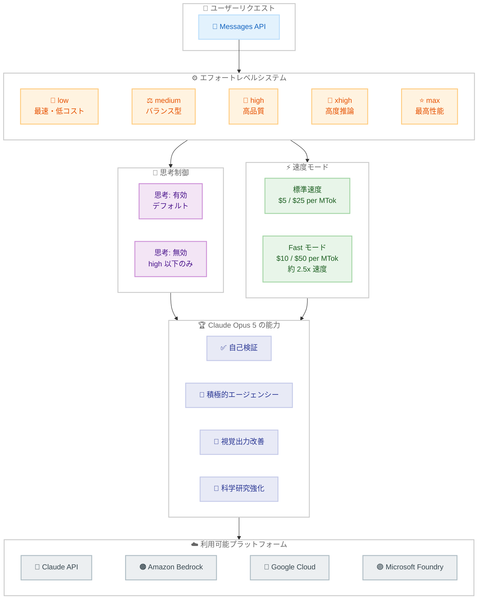

# Claude Opus 5: エージェント性能を飛躍させる次世代モデル

## メタデータ

| 項目 | 内容 |
|------|------|
| 発表日 | 2026-07-24 |
| ソース | Anthropic News / Claude API Release Notes |
| カテゴリ | モデルリリース |
| 公式リンク | https://www.anthropic.com/news/claude-opus-5 |

## 概要

Anthropic は 2026 年 7 月 24 日、Claude Opus 5 (`claude-opus-5`) を発表した。Claude Opus 4.8 からの大幅な性能向上を実現し、Claude Fable 5 に迫るフロンティア知性を半額の価格で提供する次世代モデルである。Frontier-Bench v0.1 では Opus 4.8 の 2 倍以上のスコアを低コストで達成し、ARC-AGI 3 では次善モデルの 3 倍のスコアを記録するなど、複数のベンチマークで圧倒的な性能を示している。

価格は Opus 4.8 と同じ $5 / $25 per MTok を維持しつつ、1M トークンのコンテキストウィンドウ、128k の最大出力トークン、デフォルトで有効な思考機能を備える。Claude API、Amazon Bedrock、Google Cloud Vertex AI、Microsoft Foundry で即日利用可能となっている。

## 詳細

### 背景

Claude Opus ファミリーは Anthropic のフラッグシップモデルラインとして、最高レベルの知性と推論能力を提供してきた。Claude Opus 4.8 は高い性能を誇っていたが、最上位モデルである Claude Fable 5 との間には依然として性能差が存在していた。Claude Opus 5 はこのギャップを大幅に縮小し、Fable 5 の知性に半額で迫るモデルとして位置づけられている。

特に、エージェント的なタスクにおける自律的な問題解決能力、科学研究分野での推論精度、そして自身の出力を検証し反復的に改善する能力が強化されている。

### 主な変更点

**性能向上 (ベンチマーク結果)**:

| ベンチマーク | 結果 |
|-------------|------|
| Frontier-Bench v0.1 | Opus 4.8 の 2 倍以上の性能を低コストで達成 |
| ARC-AGI 3 | 次善モデルの 3 倍のスコア |
| Zapier AutomationBench | 同コストで約 1.5 倍のパス率 |
| OSWorld 2.0 | Fable 5 を約 1/3 のコストで超過 |
| CursorBench 3.2 | max エフォートで Fable 5 の 0.5% 以内、半額 |
| 有機化学 (内部) | Opus 4.8 比 +10.2 ポイント |
| タンパク質タスク (内部) | Opus 4.8 比 +7.7 ポイント |

**主要な特性**:

- **強力な検証能力**: 自身の作業を検証し、成功するまで反復的に改善
- **積極的なエージェンシー**: 複雑なタスクを自律的に分解し実行
- **視覚出力の改善**: 風洞シミュレーション、細胞イラストなどの描画品質向上
- **科学研究の強化**: ライフサイエンス、構造生物学、有機化学、バイオインフォマティクス分野で顕著な改善

**同時発表された機能**:

- **会話中のツール変更** (ベータ): Fable 5、Mythos 5、Opus 4.8、Opus 5 で利用可能。プロンプトキャッシュを維持したままツールの追加・削除が可能
- **サーバーサイドフォールバック** (ベータ): `fallbacks` パラメータに `"default"` モードを追加。拒否されたリクエストを自動的に別モデルにルーティング
- **Opus 4.7 の Fast モード廃止**: `claude-opus-4-7` で `speed: "fast"` を指定するとエラーを返すように変更

### 技術的な詳細

**モデルスペック**:

| 項目 | 仕様 |
|------|------|
| モデル ID | `claude-opus-5` |
| コンテキストウィンドウ | 1M トークン (デフォルト/最大) |
| 最大出力トークン | 128k |
| 思考機能 | デフォルトで有効 |
| 入力価格 | $5 / MTok |
| 出力価格 | $25 / MTok |
| Fast モード | 基本料金の 2 倍 (約 2.5 倍の速度) |
| エフォートレベル | low, medium, high, xhigh, max |

**エフォートレベルの制御**:

エフォートはモデルの動作を制御する主要なパラメータである。以下の 5 段階が利用可能。

- **low**: 最速・最低コスト。シンプルなタスク向け
- **medium**: バランス型。一般的な利用に適する
- **high**: 高品質な出力。思考の無効化が許可される最高レベル
- **xhigh**: 高度な推論が必要なタスク向け。思考の無効化は不可
- **max**: 最高性能。能力が重要な作業に推奨

**破壊的変更**:

- `thinking: {"type": "disabled"}` を `xhigh` または `max` エフォートで指定すると 400 エラーを返す
- Opus 4.8 からの破壊的変更であり、移行時に注意が必要

**安全性**:

- 総合的な不整合行動スコア: 2.3 (最近のモデルで最低)
- 最高の憲法遵守率 (Opus 4.8、Sonnet 5、Fable 5 を上回る)
- 最低の欺瞞的行動率
- サイバータスクでの訓練を意図的に実施せず (Mythos 5 よりエクスプロイテーション能力は低い)
- サイバー分類器は Fable 5 比で約 85% 制限が緩和

## 開発者への影響

### 対象

- Claude API を利用する全ての開発者
- エージェントアプリケーションを構築する開発者
- 科学研究に Claude を活用する研究者
- Claude Opus 4.8 を利用中のプロジェクト
- Claude Max サブスクリプションのユーザー

### 必要なアクション

1. **エフォートレベルの確認**: `thinking: {"type": "disabled"}` を `xhigh` / `max` エフォートで使用している場合、`high` 以下に変更するか思考を有効にする必要がある
2. **Fast モード移行**: Opus 4.7 の Fast モードを使用している場合、Opus 5 または Opus 4.8 に移行が必要
3. **ベータヘッダーの追加**: 新機能を利用する場合、適切なベータヘッダーを設定
   - 会話中ツール変更: `mid-conversation-tool-changes-2026-07-01`
   - サーバーサイドフォールバック: `server-side-fallback-2026-07-01`

### 移行ガイド

**Opus 4.8 からの移行**:

1. モデル ID を `claude-opus-4-8` から `claude-opus-5` に変更
2. 思考の無効化設定を確認 (xhigh/max エフォートでは使用不可)
3. エフォートレベルの戦略を見直し (主要な制御パラメータとして活用)
4. 価格は同一のため、コスト面での変更は不要

**Opus 4.7 からの移行**:

1. モデル ID を `claude-opus-4-7` から `claude-opus-5` に変更
2. Fast モードが必要な場合は引き続き利用可能
3. 思考機能がデフォルトで有効になる点に注意

## コード例

```python
import anthropic

client = anthropic.Anthropic()

# 基本的な使用例 (思考はデフォルトで有効)
response = client.messages.create(
    model="claude-opus-5",
    max_tokens=16384,
    messages=[
        {"role": "user", "content": "この有機化学反応の機構を説明してください。"}
    ]
)

# エフォートレベルを指定した使用例
response = client.messages.create(
    model="claude-opus-5",
    max_tokens=16384,
    thinking={
        "type": "enabled",
        "budget_tokens": 10000
    },
    effort="max",  # 最高性能
    messages=[
        {"role": "user", "content": "複雑なマルチステップの推論問題を解いてください。"}
    ]
)

# Fast モードの使用例
response = client.messages.create(
    model="claude-opus-5",
    max_tokens=16384,
    speed="fast",  # 2x 料金、約 2.5x 速度
    messages=[
        {"role": "user", "content": "このコードをレビューしてください。"}
    ]
)

# 思考を無効化する例 (high 以下のエフォートのみ)
response = client.messages.create(
    model="claude-opus-5",
    max_tokens=16384,
    thinking={"type": "disabled"},
    effort="high",  # xhigh/max では 400 エラー
    messages=[
        {"role": "user", "content": "簡潔に回答してください。"}
    ]
)

# 会話中のツール変更 (ベータ)
response = client.messages.create(
    model="claude-opus-5",
    max_tokens=16384,
    extra_headers={
        "anthropic-beta": "mid-conversation-tool-changes-2026-07-01"
    },
    tools=[{"name": "new_tool", "description": "新しいツール", "input_schema": {"type": "object"}}],
    messages=[
        {"role": "user", "content": "新しいツールを使ってください。"}
    ]
)
```

## アーキテクチャ図



## 関連リンク

- [Claude Opus 5 公式発表](https://www.anthropic.com/news/claude-opus-5)
- [What's new in Claude Opus 5](https://platform.claude.com/docs/en/about-claude/models/whats-new-opus-5)
- [モデル概要](https://platform.claude.com/docs/en/about-claude/models/overview)
- [エフォートレベル](https://platform.claude.com/docs/en/build-with-claude/effort)
- [Fast モード](https://platform.claude.com/docs/en/build-with-claude/fast-mode)
- [思考機能](https://platform.claude.com/docs/en/build-with-claude/thinking)
- [移行ガイド](https://platform.claude.com/docs/en/about-claude/models/migration-guide)
- [Claude API Release Notes](https://platform.claude.com/docs/en/release-notes/overview)

## まとめ

Claude Opus 5 は Anthropic の Opus ファミリーにおける大幅な進化を代表するモデルである。Fable 5 に迫る知性を半額で提供しつつ、エージェント的なタスク実行能力、科学研究での推論精度、自己検証能力を大幅に強化している。

開発者にとっての主なポイントは以下の通りである。

- **コストパフォーマンスの大幅向上**: Opus 4.8 と同価格で 2 倍以上の性能
- **エフォートレベルによる柔軟な制御**: タスクの複雑さに応じて 5 段階で調整可能
- **破壊的変更への対応**: 思考の無効化は `high` エフォート以下でのみ許可
- **最高水準の安全性**: 不整合行動スコア 2.3 で最も安全なモデル
- **即時利用可能**: Claude API、Amazon Bedrock、Google Cloud、Microsoft Foundry で提供開始

Opus 4.8 からの移行はモデル ID の変更とエフォート設定の確認のみで完了し、価格据え置きのためコスト面での懸念はない。エージェントアプリケーションや科学研究ワークフローを構築する開発者にとって、強力な選択肢となるモデルである。
