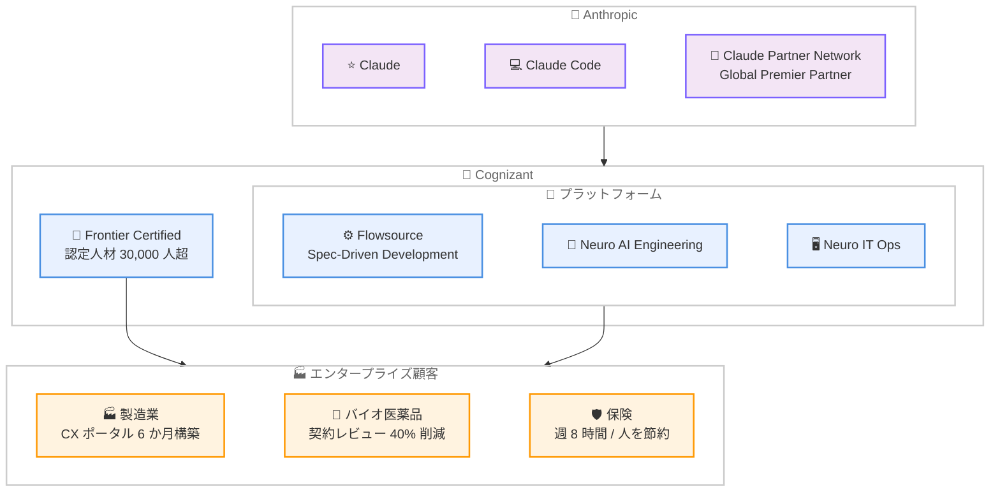

# Cognizant と Anthropic のパートナーシップ拡大: Claude 認定人材 30,000 人超でエンタープライズ展開を加速

## メタデータ

| 項目 | 内容 |
|------|------|
| 発表日 | 2026-07-27 |
| ソース | Anthropic News |
| カテゴリ | パートナーシップ / エンタープライズ |
| 公式リンク | [Cognizant and Anthropic Partnership](https://www.anthropic.com/news/cognizant-anthropic) |

## 概要

Cognizant と Anthropic は既存のパートナーシップを拡大し、世界中のエンタープライズ顧客へ Claude を提供することを発表した。本提携の柱は 3 つある。Cognizant が自社のビジネス・エンジニアリングプラットフォーム全体に Claude を組み込むこと、新しい「Frontier Certified」ワークフォースモデルの一環として Claude 認定人材を拡大すること、そして Cognizant が Claude Partner Network の「Global Premier Partner」に就任することである。

既に 30,000 人以上の Cognizant 社員が Claude トレーニングを修了しており、製造業、ライフサイエンス、保険などの業界で顧客向けの導入実績が生まれている。

## 詳細

### 背景

AI の能力は企業が吸収できる速度を上回って向上しており、そのギャップを埋める「橋渡し」が求められている。大企業への AI 統合を成功させるには、業界知識、既存システムへの理解、規制対応の専門性が不可欠であり、Cognizant はそのドメイン知識と提供規模をもたらす役割を担う。Cognizant は社内での学びを顧客展開の方法論に反映しており、後述の顧客事例は既に進行中の成果である。

### 主な内容

1. **プラットフォームへの Claude 組み込み**: Cognizant のビジネス・エンジニアリングプラットフォームである Flowsource、Neuro AI Engineering、Neuro IT Ops に Claude を統合する
2. **Frontier Certified ワークフォース**: 新しいワークフォースモデルの一環として Claude 認定人材を拡大する。既に 30,000 人以上の社員が Claude トレーニングを修了済み
3. **Global Premier Partner 就任**: Cognizant が Claude Partner Network の「Global Premier Partner」となり、グローバルなエンタープライズ展開を推進する

### 技術的な詳細

フルスタックエンジニアリング基盤である Flowsource の「Spec-Driven Development」モジュールでは、プロジェクトが定義した仕様、コーディング標準、アーキテクチャ設計図に基づいて Claude Code を動作させ、本番投入前に出力を評価する仕組みを提供する。これにより、エンタープライズの品質基準を満たしたコード生成ワークフローを実現している。

### 顧客導入事例

以下の導入事例が既に進行中である (数値は各導入事例における実績)。

- **製造業**: グローバル製造企業向けのカスタマーエクスペリエンスポータルを、キックオフから 6 か月以内に構築
- **バイオ医薬品**: エージェント型の契約インテリジェンスシステムにより、契約レビュー時間を最大 40% 削減し、抽出精度 88% 超を達成
- **保険**: 引受担当者向けリスクナビゲーションツールにより、従来数時間かかった案件評価を数分に短縮し、一人あたり週約 8 時間を節約

## ビジネスインパクト

### 対象

- 製造業、ライフサイエンス、保険をはじめとする世界中のエンタープライズ顧客
- Cognizant のプラットフォーム (Flowsource、Neuro AI Engineering、Neuro IT Ops) を利用する企業
- 実験段階ではなく、信頼できる AI の本番導入を求める組織

### スケールと市場影響

- **認定人材**: 30,000 人以上の Cognizant 社員が Claude トレーニングを修了し、顧客プロジェクトに展開可能
- **プラットフォーム統合**: Cognizant の主要エンジニアリングプラットフォーム全体に Claude が組み込まれ、顧客は既存のサービス経由で Claude を活用できる
- **Global Premier Partner**: Claude Partner Network における最上位級の位置づけにより、グローバル規模でのエンタープライズ導入が加速

## エグゼクティブコメント

**Ravi Kumar S (CEO, Cognizant)**:

> AI capability is rising faster than enterprises can absorb it, and that gap is the defining problem of this moment

AI の能力は企業が吸収できる速度を上回って向上しており、そのギャップこそが現時点の決定的な課題であると述べた。Cognizant は業界知識、エンジニアリング規模、信頼フレームワークを提供し、実験ではなく信頼できる AI を求める顧客に応えるとしている。

**Daniela Amodei (Co-founder & President, Anthropic)**:

> the kinds of contexts where AI can demonstrate its greatest value for humanity

提携の深化により、より多くの企業が AI の能力を実践的に活用できるようになると述べ、AI が人類に最大の価値を示せる文脈に Claude が導入されると語った。

## アーキテクチャ図

## 関連リンク

- [Cognizant and Anthropic Partnership 公式発表](https://www.anthropic.com/news/cognizant-anthropic)
- [Claude Partner Network](https://www.anthropic.com/partners)
- [TCS and Anthropic Partnership](https://www.anthropic.com/news/tcs-anthropic-partnership) - 類似のエンタープライズパートナーシップ

## まとめ

Cognizant と Anthropic のパートナーシップ拡大は、Claude のエンタープライズ展開における重要な一歩である。30,000 人以上の認定人材と、Flowsource をはじめとする主要プラットフォームへの Claude 統合により、製造業、ライフサイエンス、保険などの業界で AI の本番導入が加速する。

特に注目すべきは、Flowsource の「Spec-Driven Development」モジュールが仕様やコーディング標準に基づいて Claude Code を動作させ、本番前に出力を評価する仕組みを備えている点である。これは、エンタープライズ品質を担保した AI コーディングの実践的なモデルとなる。TCS や DXC との提携に続く本発表により、Anthropic がグローバル SIer とのパートナーエコシステムを通じてエンタープライズ市場への浸透を着実に進めていることが示された。
