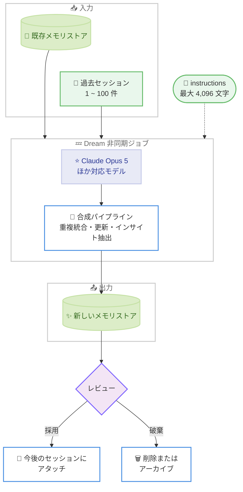

# Dreams (research preview) が Claude Opus 5 をサポート

## メタデータ

| 項目 | 内容 |
|------|------|
| 発表日 | 2026-08-01 |
| ソース | Claude Platform Release Notes |
| カテゴリ | Claude API / Managed Agents |
| 公式リンク | [Dreams - Claude Docs](https://platform.claude.com/docs/en/managed-agents/dreams) |

## 概要

2026 年 8 月 1 日、リサーチプレビュー中の **Dreams** 機能が **Claude Opus 5** をサポートしました。Dreams は、エージェントのメモリストアと過去のセッショントランスクリプトを Claude に読み込ませ、重複の統合、古い情報の更新、新しいインサイトの抽出を行い、再編成された新しいメモリストアを生成する非同期ジョブです。

今回の更新により、Dreams のパイプラインを実行するモデルとして最上位モデルである Claude Opus 5 を選択できるようになり、より高品質なメモリのキュレーションが可能になります。

## 詳細

### 背景

Managed Agents のエージェントは、動作中に[メモリストア](https://platform.claude.com/docs/en/managed-agents/memory)へ書き込みを行います。ただし、これらの書き込みはローカルかつ増分的であるため、多数のセッションを重ねるうちにメモリストアには重複、矛盾、古くなったエントリが蓄積されていきます。

Dreams はこの問題を解決する機能です。既存のメモリストアと過去のセッショントランスクリプトを読み込み、以下の処理を行った新しいメモリストアを生成します。

- 重複したエントリの統合
- 古い情報や矛盾するエントリを最新の値で置き換え
- セッショントランスクリプトから新しいインサイトを抽出

入力ストアは一切変更されないため、出力結果をレビューし、不要であれば破棄できます。

### 主な変更点

今回のリリースノートで発表された変更点は、Dreams のサポートモデルに Claude Opus 5 が追加されたことです。公式ドキュメントによると、リサーチプレビュー期間中にサポートされるモデルは以下のとおりです。

| モデル ID | 備考 |
|-----------|------|
| `claude-opus-5` | **今回追加** |
| `claude-fable-5` | サポート済み |
| `claude-opus-4-8` | サポート済み |
| `claude-opus-4-7` | サポート済み |
| `claude-sonnet-5` | サポート済み |
| `claude-sonnet-4-6` | サポート済み |

### 技術的な詳細

**Dream の仕組み**: Dream は非同期ジョブとして動作し、以下を入力として受け取ります。

- 既存の**メモリストア** 1 つ: Claude が検証、重複排除、再編成を行う対象
- **セッション** 1 ~ 100 件: パターンとインサイトを抽出する過去のトランスクリプト

出力は入力とは別の新しいメモリストアです。出力ストアの ID は、ワークフローが入力ストアのクローンを完了した後、Dream が `running` 状態になって間もなく `outputs[]` に現れます。

**ライフサイクル**: Dream のステータスは以下のように遷移します。

| ステータス | 意味 |
|-----------|------|
| `pending` | Dream が作成され、キューに登録された状態 |
| `running` | パイプラインが処理中。`usage` は進行に応じて更新される |
| `completed` | 正常終了。`outputs[]` に新しいメモリストアが含まれる |
| `failed` | エラーで終了。出力ストアは失敗前までの内容で残る |
| `canceled` | キャンセルされた状態。出力ストアはそのまま残る |

**ベータヘッダー**: Dream のエンドポイントは `dreaming-2026-04-21` ベータヘッダーでゲートされています。`managed-agents-2026-04-01` ヘッダーのみでは Dreams にアクセスできず、両方のヘッダーを送信する必要があります (SDK は自動的に設定します)。

**instructions によるステアリング**: オプションの `instructions` フィールド (最大 4,096 文字) で、注目すべき領域、保持すべき内容、出力ストアの構成規則など、合成処理の方針を指示できます。ただし、パイプラインは入力に対する合成処理であり、テキストエディタではないため、特定の行を対象とした命令的な編集指示は一般に効果がありません。個別のメモリを編集するには、出力ストアに対して [Memory Stores API](https://platform.claude.com/docs/en/managed-agents/memory#view-and-edit-memories) を直接使用します。

**実行時間と監視**: Dream は非同期で実行され、入力トランスクリプトの数に応じて数分から数時間かかります。`running` 状態になると `session_id` フィールドが設定され、パイプラインを実行している[セッション](https://platform.claude.com/docs/en/managed-agents/sessions)のイベントをストリーミングして、リアルタイムで処理内容を観察できます。

**制限事項**: リサーチプレビュー期間中の制限は以下のとおりです。

| 制限 | 値 |
|------|-----|
| Dream あたりのセッション数 | 100 |
| `instructions` の長さ | 4,096 文字 |
| サポートモデル | `claude-opus-5`、`claude-fable-5`、`claude-opus-4-8`、`claude-opus-4-7`、`claude-sonnet-5`、`claude-sonnet-4-6` |

Dream の作成にはデフォルトのレート制限が適用されます。より高い制限が必要な場合は[サポートへの問い合わせ](https://support.claude.com)が必要です。

**料金**: Dreams は選択したモデルの標準 API トークンレートで課金されます。リソースの `usage` フィールドで正確な合計を確認できます。コストは入力セッションの数と長さにほぼ比例するため、まず少数のセッションで試し、キュレーション品質に満足してから規模を拡大することが推奨されています。

## 開発者への影響

### 対象

- Managed Agents (リサーチプレビュー) を利用してエージェントを構築している開発者
- エージェントのメモリストアの品質維持に課題を抱えているチーム
- Dreams のリサーチプレビューへのアクセス権を持つ、または[アクセスをリクエスト](https://claude.com/form/claude-managed-agents)する開発者

### 必要なアクション

- 既存の Dreams 利用者は、`model` パラメータに `claude-opus-5` を指定することで、最上位モデルによるメモリキュレーションを利用可能
- Opus 5 は標準 API トークンレートで課金されるため、コストとキュレーション品質のバランスを検討すること
- まだ Dreams を利用していない場合は、リサーチプレビューへのアクセスリクエストが必要

### 移行ガイド (該当する場合)

既存のコードの `model` パラメータを変更するだけで移行できます。API の呼び出し方法やその他のパラメータに変更はありません。

## コード例

Claude Opus 5 を指定して Dream を作成する例 (Python) です。

```python
dream = client.beta.dreams.create(
    inputs=[
        {"type": "memory_store", "memory_store_id": store_id},
        {"type": "sessions", "session_ids": [session_a, session_b]},
    ],
    model="claude-opus-5",
    instructions="Focus on coding-style preferences; ignore one-off debugging notes.",
)
print(dream.id)  # drm_01...

# ステータスをポーリング
while dream.status in ("pending", "running"):
    time.sleep(10)
    dream = client.beta.dreams.retrieve(dream.id)
    print(f"status={dream.status} input_tokens={dream.usage.input_tokens}")

# 完了後、出力ストアを新しいセッションで利用
output_store_id = next(
    output.memory_store_id for output in dream.outputs if output.type == "memory_store"
)
session = client.beta.sessions.create(
    agent=agent_id,
    environment_id=environment_id,
    resources=[
        {"type": "memory_store", "memory_store_id": output_store_id},
    ],
)
```

## アーキテクチャ図



## 関連リンク

- [Dreams - Claude Docs](https://platform.claude.com/docs/en/managed-agents/dreams)
- [Dreams の制限事項 - Supported models](https://platform.claude.com/docs/en/managed-agents/dreams#limits)
- [Memory Stores - Claude Docs](https://platform.claude.com/docs/en/managed-agents/memory)
- [Sessions - Claude Docs](https://platform.claude.com/docs/en/managed-agents/sessions)
- [Claude Platform Release Notes](https://platform.claude.com/docs/en/release-notes/overview)
- [リサーチプレビューへのアクセスリクエスト](https://claude.com/form/claude-managed-agents)

## まとめ

Dreams のサポートモデルに Claude Opus 5 が追加され、エージェントのメモリキュレーションに最上位モデルを利用できるようになりました。Dreams は入力を変更せずに再編成された新しいメモリストアを生成するため、安全に試すことができます。長期運用するエージェントのメモリ品質が課題となっているチームは、少数のセッションから Opus 5 によるキュレーションを試し、品質を確認しながら規模を拡大することが推奨されます。
