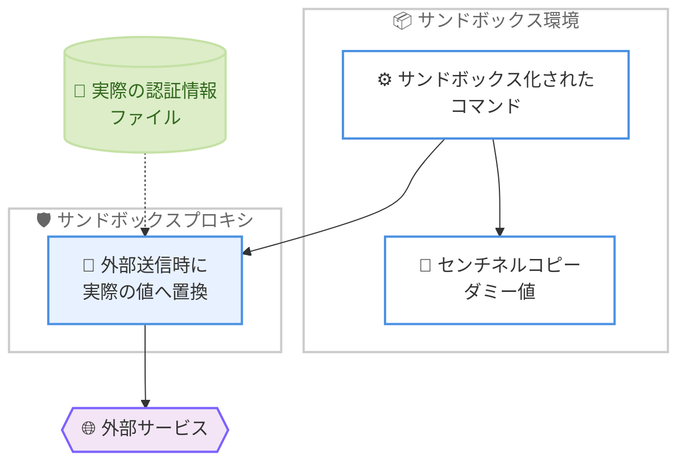

# Claude Code v2.1.221: VSCode Focus view とサンドボックス認証情報マスキング

## メタデータ

| 項目 | 内容 |
|------|------|
| 発表日 | 2026-08-03 |
| ソース | Claude Code Changelog |
| カテゴリ | ツールアップデート |
| 公式リンク | https://github.com/anthropics/claude-code/blob/main/CHANGELOG.md |

## 概要

Claude Code v2.1.221 がリリースされた。本リリースでは、VSCode 拡張機能にツールアクティビティを折りたたんで表示する「Focus view」が追加され、チャットの可読性が大きく向上した。セキュリティ面では、サンドボックス認証情報ファイル向けの `mode: "mask"` (Linux/WSL) の追加に加え、zsh の `[[ ]]` 正規表現条件式を悪用した Bash ツールの権限チェックバイパスが修正された。また、バックグラウンドセッションの Git 動作が変更され、常にドラフト PR を開くのではなく、コミットとプッシュで作業を保全し、タスクが必要とする場合のみドラフト PR を作成するようになった。そのほか、プロンプトキャッシュコストの削減、Vim モードの修正、MCP や Bedrock 認証に関する多数の修正が含まれる。

## 詳細

### 背景

Claude Code は自律的にツールを実行するエージェントであり、チャット画面にはツール実行のログが大量に流れることがある。VSCode 拡張機能では、コードに集中したいユーザーからツールアクティビティの表示を簡潔にしたいという要望があった。また、サンドボックス機能の強化が続く中で、サンドボックス内のコマンドに認証情報をそのまま見せずに外部通信だけを成立させる仕組みが求められていた。v2.1.221 はこれらの UI とセキュリティの両面に応えるリリースであり、権限チェックのバイパスというセキュリティ上重要な修正も含まれている。

### 主な変更点

#### 新機能

- **[VSCode] Focus view の追加**: ツールアクティビティを展開可能なターンごとのサマリーの背後に隠すチャットメニューのトグルが追加された。実行中のツールはライブインジケーターで表示される。`Ctrl+Alt+F` または「Claude Code: Toggle Focus view」コマンドで切り替え可能
- **サンドボックス認証情報の `mode: "mask"`**: Linux と WSL で、サンドボックス化されたコマンドはセンチネル (ダミー値) のコピーを読み取り、サンドボックスプロキシが外部送信時に実際の値へ置換する。macOS ではファイルマスキングは `deny` にフォールバックする
- **`claude plugin validate` の警告追加**: マーケットプレイスまたはプラグイン名が Claude Desktop のマネージドマーケットプレイス同期で拒否される場合に警告が表示されるようになった
- **claude-api スキルの `prompt-audit` サブコマンド**: 旧世代モデル向けに書かれたパターンがないか、プロンプトとツール説明を監査するサブコマンドが追加された

#### バグ修正

- **[セキュリティ] Bash ツールの権限チェックバイパス修正**: zsh が `[[ ]]` 正規表現条件式の中で隠されたコマンドを実行できる問題を修正。影響を受けるコマンドは権限プロンプトを表示するようになった
- **PowerShell の権限チェック修正**: Windows で引用符を含むパスの権限チェックが誤って処理される問題を修正
- **思考トグルの修正**: 思考オフで開始したセッションで、セッションの残りの間トグルが効かない問題を修正
- **print モードの MCP 接続修正**: `--mcp-config` で指定した MCP サーバーが print モード (`-p`) の最初のターンの前に接続されない問題を修正
- **@ メンションファイルの修正**: Esc でプロンプトを取り消して再送信した際に、@ メンションされたファイルが暗黙的に破棄される問題を修正
- **SDK MCP ツールのクラッシュ修正**: `constructor` などの組み込みオブジェクトプロパティと同名の SDK MCP ツールで API リクエスト準備時にクラッシュする問題を修正
- **WebSearch の 400 エラー修正**: 思考無効時に effort `xhigh`/`max` で WebSearch が 400 エラーで失敗する問題を修正
- **サンドボックスの大容量アップロード修正**: サンドボックスプロキシ経由の大容量アップロードが TLS エラーで失敗する問題を修正
- **利用上限メッセージの修正**: Team および Enterprise の利用上限メッセージが、誤って組織の月次上限を原因として表示する問題を修正
- **Bedrock 認証の修正**: Windows のデスクトップ管理セッションで、AWS SSO の名前付きプロファイルを使った Bedrock 認証が失敗する問題を修正
- **中断ターン自動再開の無効化修正**: `CLAUDE_CODE_RESUME_INTERRUPTED_TURN=0` が中断ターンの自動再開を無効化しない問題を修正
- **スリープ復帰時の競合修正**: 2 つのプロセスが同じ MCP コネクタや WIF OAuth トークンを同時に更新し得るまれな競合を修正
- **セッション名同期の修正**: Claude Code Desktop や claude.ai からセッション名を変更しても CLI のセッション名が更新されない問題を修正
- **スキル呼び出しの修正**: ターミナル専用の組み込み機能と同名のプラグイン/組織配布スキルが、非対話セッションで呼び出せない問題を修正
- **プラグイン通知の修正**: プラグインのリロード後も「Plugins changed」通知が残り続ける問題を修正
- **Vim モードの修正 (2 件)**: ヤンクレジスタがダイアログ、履歴検索、トランスクリプトビューをまたいで保持されるようになった。また、空のプロンプトまで undo した際に「もう一度 ← を押す」確認が有効になるようになった

#### 改善

- **Google Vertex AI のツール検索**: Claude 4.5 世代以降のモデルでツール検索が再有効化された
- **auto モードの権限チェック効率化**: 並列ツール呼び出しの権限チェックがキャッシュ効率の良い方式になり、キャッシュ済みの会話プレフィックスを再利用することでプロンプトキャッシュのコストが削減された
- **Stats パネルの改善**: トークン合計にキャッシュトークンが内訳付きでカウントされるようになった
- **`/ultrareview` のエラーメッセージ改善**: リポジトリがベースと履歴を共有しない場合のエラーメッセージが改善された
- **Windows 起動の高速化**: プロセス作成時刻の取得が PowerShell の起動ではなくネイティブの kernel32 呼び出しで行われるようになった

#### 動作変更

- **バックグラウンドセッションの Git 動作**: 作業を保全するためにコミットとプッシュを行い、タスクが必要とする場合のみドラフト PR を開くようになった
- **`/plugin install` の改善**: 古いマーケットプレイスカタログを更新してリトライするようになった
- **プラグインの即時有効化**: `/plugin` からインストールしたプラグインは、安全な場合は即座に有効化されるようになった
- **プラグインの `skills` パス**: `"."` を `skills` パスとして受け付けるようになった
- **`/status` のセッション種別表示**: セッションの種類 (`interactive`、または `attached`/`unattended` のバックグラウンドジョブ) が表示されるようになった
- **絵文字オートコンプリート**: 一般的な代替ショートコードを受け付けるようになった
- **`/fork` の worktree 作成**: `/fork` でフォークしたセッションは独自の新しい worktree を作成するようになった
- **Claude in Chrome のタブ管理**: 開いたブラウザタブが不要になったら閉じるようになった
- **fast モードのクレジット通知**: セッション中に利用クレジットが尽きた際、ストリーム上で報告するようになった
- **Monitor の出力改善**: 出力を生成せずに終了した watch は、その旨を表示するようになった
- **Gateway の `model` フィールド検証**: 文字列以外の値は 400 エラーで拒否されるようになった
- **通知の削除**: 「Permission mode changed while the auto-mode classifier call was queued」という繰り返し表示される通知が削除された

### 技術的な詳細

#### VSCode Focus view の仕組み

Focus view は、チャットメニューから切り替え可能な表示モードである。有効にすると、各ターンのツールアクティビティ (ファイル読み取り、コマンド実行など) が展開可能なサマリーの背後に隠され、実行中のツールはライブインジケーターで示される。会話の流れを追いやすくしつつ、必要に応じてサマリーを展開して詳細を確認できる。キーボードショートカット `Ctrl+Alt+F` またはコマンドパレットの「Claude Code: Toggle Focus view」で切り替える。

#### サンドボックス認証情報の `mask` モード

従来のサンドボックス認証情報ファイル制御では、アクセスを許可するか拒否 (`deny`) するかの選択だった。新しい `mode: "mask"` (Linux/WSL) では、サンドボックス内のコマンドは実際の認証情報の代わりにセンチネル値 (ダミー値) を読み取る。コマンドが外部へリクエストを送信する際、サンドボックスプロキシがセンチネル値を実際の値に置換する。これにより、サンドボックス内のプロセスやその出力に実際の認証情報が露出することなく、認証が必要な外部通信を成立させられる。macOS ではこの仕組みが利用できないため、ファイルマスキングは `deny` にフォールバックする。

#### zsh 権限チェックバイパスの修正

zsh の `[[ ]]` 正規表現条件式の中に隠されたコマンドが、Bash ツールの権限チェックをすり抜けて実行され得る問題が修正された。zsh では `[[ string =~ pattern ]]` のような条件式の評価中にコマンド置換などが実行される可能性があり、これが権限チェックの解析対象から漏れていた。修正後は、該当するコマンドは権限プロンプトが表示される。サンドボックスや権限設定でコマンド実行を制御している環境では重要な修正である。

#### バックグラウンドセッションの Git 動作変更

従来のバックグラウンドセッションは、作業完了時にドラフト PR を開く動作だった。v2.1.221 からは、作業を保全するためにコミットとプッシュを行い、ドラフト PR はタスクの内容が PR 作成を求めている場合のみ開くようになった。これにより、調査タスクや実験的な変更など PR が不要なタスクで、不要なドラフト PR が量産されることを防げる。

## 開発者への影響

### 対象

- VSCode 拡張機能で Claude Code を使用する開発者 (Focus view)
- Linux/WSL でサンドボックス機能を利用し、認証情報を扱う開発者・管理者 (`mask` モード)
- 権限設定やサンドボックスでコマンド実行を制御しているすべてのユーザー (zsh バイパス修正)
- バックグラウンドセッションを活用する開発者 (Git 動作変更)
- print モード (`-p`) と `--mcp-config` を組み合わせて使う SDK/CI 利用者
- Windows 環境の開発者 (PowerShell 権限チェック、Bedrock SSO 認証、起動高速化)
- Google Vertex AI 経由で Claude Code を使用する開発者 (ツール検索の再有効化)

### 必要なアクション

1. **アップデートの適用**: セキュリティ修正 (zsh 権限チェックバイパス) が含まれるため、速やかなアップデートを推奨する
2. **バックグラウンドセッションの運用確認**: ドラフト PR が常には作成されなくなったため、PR 作成を前提としたワークフローではタスク指示に PR 作成を明記する
3. **サンドボックス認証情報設定の見直し**: Linux/WSL 環境では、`deny` にしていた認証情報ファイルを `mask` に変更することで、セキュリティを保ちながら外部通信を許可できる
4. **`/fork` の挙動確認**: フォークしたセッションが独自の worktree を作成するようになったため、ディスク使用量とブランチ運用に注意する

```bash
# Claude Code 組み込みコマンド
claude update

# npm を使用する場合
npm update -g @anthropic-ai/claude-code
```

## コード例

### サンドボックス認証情報の `mask` モード設定

```json
// .claude/settings.json
{
  "sandbox": {
    "credentialFiles": [
      {
        "path": "~/.npmrc",
        "mode": "mask"
      }
    ]
  }
}
```

この設定により、Linux/WSL ではサンドボックス化されたコマンドは `~/.npmrc` のセンチネルコピーを読み取り、サンドボックスプロキシが外部送信時に実際の値へ置換する。macOS では `deny` として動作する。

### VSCode Focus view の切り替え

```text
# キーボードショートカット
Ctrl+Alt+F

# コマンドパレット (Ctrl+Shift+P)
Claude Code: Toggle Focus view
```

### claude-api スキルの prompt-audit

```bash
# 旧世代モデル向けのパターンがないかプロンプトとツール説明を監査
claude "claude-api スキルの prompt-audit で src/prompts/ を監査して"
```

### 中断ターン自動再開の無効化

```bash
# v2.1.221 で修正され、正しく無効化されるようになった
export CLAUDE_CODE_RESUME_INTERRUPTED_TURN=0
```

## アーキテクチャ図

`mask` モードにおけるサンドボックスプロキシの動作を示す。



## 関連リンク

- [Claude Code Changelog](https://github.com/anthropics/claude-code/blob/main/CHANGELOG.md)
- [Claude Code GitHub リポジトリ](https://github.com/anthropics/claude-code)
- [Claude Code ドキュメント](https://docs.anthropic.com/en/docs/claude-code)
- [Claude Code v2.1.220 レポート](./2026-07-25-claude-code-v2-1-220.md)

## まとめ

Claude Code v2.1.221 は、UI・セキュリティ・ワークフローの 3 つの側面で改善が進んだリリースである。VSCode の Focus view により、ツールアクティビティに埋もれずに会話へ集中できるようになった。セキュリティ面では、Linux/WSL 向けの認証情報 `mask` モードにより、サンドボックス内のプロセスに実際の認証情報を露出させることなく外部通信を成立させられるようになり、zsh の `[[ ]]` 条件式を悪用した権限チェックバイパスも修正された。バックグラウンドセッションはコミットとプッシュで作業を保全し、必要な場合のみドラフト PR を開くようになったため、PR の量産が抑えられる。セキュリティ修正が含まれるため、全ユーザーに速やかなアップデートを推奨する。
