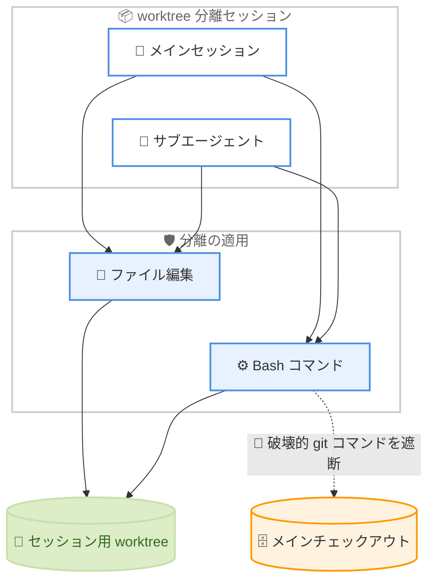

# Claude Code v2.1.222: worktree 分離の強化とバックグラウンドタスクの権限修正

## メタデータ

| 項目 | 内容 |
|------|------|
| 発表日 | 2026-08-04 |
| ソース | Claude Code Changelog |
| カテゴリ | ツールアップデート |
| 公式リンク | https://github.com/anthropics/claude-code/blob/main/CHANGELOG.md |

## 概要

Claude Code v2.1.222 がリリースされた。本リリースは、セキュリティと権限制御に関する重要な修正を中心としたリリースである。worktree 分離セッションとそのサブエージェントがメインチェックアウトに対して破壊的な git コマンドを実行できてしまう問題が修正され、分離はすべてのセッション種別でファイル編集と Bash に適用されるようになった。また、バックグラウンドエージェントタスク (サマリー生成、コンパクション、リネーム) で PreToolUse の auto-allow フックがツール制限をバイパスできてしまう問題も修正された。さらに、auto モードの安全性向上として、`SendMessage` で他のエージェントセッションに送信されるメッセージが送信前に権限分類器で評価されるようになった。そのほか、HTTPS プロキシ環境での起動時接続チェックの修正、`/usage` の MCP サーバーへの使用量の過剰帰属の修正、`/diff` ビューの改善など、多数の修正と改善が含まれる。ultraplan 機能は削除された。

## 詳細

### 背景

Claude Code は worktree 分離機能により、セッションごとに独立した git worktree で作業させ、メインの作業ディレクトリを保護できる。しかし、分離の適用範囲に漏れがあると、分離されているはずのセッションがメインチェックアウトへ影響を及ぼす可能性がある。同様に、PreToolUse フックの auto-allow はユーザーが明示的に設定した自動許可の仕組みだが、バックグラウンドエージェントタスクのようにツールが制限された文脈では、制限がフックより優先されるべきである。v2.1.222 はこうした「分離・制限が適用されるべき境界」の漏れを塞ぐことに重点を置いたリリースであり、加えてマルチエージェント運用 (`SendMessage`) の安全性も強化されている。

### 主な変更点

#### セキュリティ修正

- **worktree 分離の強化**: worktree 分離セッションとそのサブエージェントが、メインチェックアウトに対して破壊的な git コマンドを実行できてしまう問題を修正。分離はすべてのセッション種別で、ファイル編集と Bash の両方に適用されるようになった
- **PreToolUse auto-allow フックのバイパス修正**: バックグラウンドエージェントタスク (サマリー生成、コンパクション、リネーム) において、PreToolUse の auto-allow フックがツール制限をバイパスできてしまう問題を修正

#### バグ修正

- **`/usage-credits` の修正**: Team および Enterprise で、以前のリクエストが却下 (dismiss) されたメンバーに「すでに利用クレジットリクエストを送信済み」と表示され、新しいリクエストを送信できない問題を修正
- **HTTPS プロキシ環境での起動時接続チェックの修正**: 起動時の接続チェックが HTTPS プロキシの背後でハングした後に失敗する問題を修正。API リクエストと同じプロキシ対応トランスポートを使用し、明確なメッセージとともにタイムアウトするようになった
- **「Connection closed mid-response」エラーの修正**: 実際には完了していたレスポンスに対して「Connection closed mid-response」エラーが報告される問題を修正
- **`/usage` の MCP サーバー使用量の過剰帰属の修正**: MCP サーバーへの使用量の帰属が、サーバーへの呼び出し以降のすべてのターンではなく、そのツール結果を実際に消費したリクエストのみを反映するようになった
- **プルリクエストとのセッション連携の修正**: ブランチのプッシュ後に作成されたプルリクエスト (GitHub REST API 経由を含む) にセッションがリンクされない問題を修正
- **モデルファミリーエイリアスのステップダウン修正**: 組織で制限された `model: opus` のようなサブエージェント・チームメイトのファミリーエイリアスが、親モデルにフォールバックするのではなく、組織で許可された同ファミリーの最新モデルへ正しくステップダウンするようになった
- **カスタムゲートウェイでのストリームアイドルタイムアウトの修正**: カスタム `ANTHROPIC_BASE_URL` ゲートウェイで、サーバーのキープアライブ ping が届いているにもかかわらずストリームアイドルタイムアウトが発生する問題を修正
- **claude.ai コネクタの誤った認可要求表示の修正**: セッショントークンが無効な場合に、claude.ai コネクタが誤って「認可が必要」と表示される問題を修正。代わりに `/login` のヒントが表示されるようになった
- **利用不可ツールのエラー表示の修正**: MCP サーバーの削除後など、ローカルで利用できなくなったツールのエラーが表示されない問題を修正
- **`SendMessage` の長いサマリーの修正**: 長いサマリーが拒否される問題を修正。文字数制限を超えた場合は切り詰められるようになり、送信が失敗しなくなった
- **サブエージェントの effort 表示の修正**: サブエージェントのトランスクリプトビューで、スピナーの effort ラベルがサブエージェント自身の `effort:` 設定ではなくセッションの effort レベルを表示する問題を修正
- **ファイルウォッチャーのクラッシュ修正**: ファイルウォッチャーがファイルシステムエラーに遭遇した場合や、ティアダウン中にまれに発生するクラッシュを修正
- **スクリーンリーダーの読み上げ修正**: `--ax-screen-reader` モードで、バックスペースのたびに入力行全体が再読み上げされる問題を修正。行末での削除は削除した文字だけをエコーするようになった
- **ホストのモデル選択キーの優先順位修正**: `CLAUDE_CODE_PROVIDER_MANAGED_BY_HOST` 設定時に、ホストのモデル選択キーが古いディスク上の `managed-settings.json` より優先されない問題を修正

#### 改善

- **auto モードの安全性向上**: `SendMessage` で他のエージェントセッションに送信されるメッセージが、送信前に権限分類器で評価されるようになった
- **`disable-model-invocation` スキルの拒否動作の改善**: `disable-model-invocation` が設定されたスキルを Claude が呼び出そうとした場合、そのワークフローを複製するのではなく、ユーザーにスキルの実行を依頼するよう指示されるようになった
- **`/diff` ビューの改善**: `/diff` ビュー、Remote Control のワークスペース diff、Claude Code on the web セッションのファイル編集 diff が、ワークスペースで設定された diff ドライバーや textconv を無視して、生の git blob コンテンツを使用するようになった

#### 動作変更

- **Remote Control 自動起動の設定スコープ変更**: リポジトリローカル設定 (`.claude/settings.json` または `.claude/settings.local.json`) からは Remote Control の自動起動を有効化できなくなった (無効化は引き続き可能)。有効化はユーザースコープで `/config` から行う

#### 削除

- **ultraplan 機能の削除**: ultraplan 機能が削除された

### 技術的な詳細

#### worktree 分離の強化

worktree 分離セッションは、メインの作業ディレクトリとは独立した git worktree の中で作業することで、メインチェックアウトへの影響を防ぐ仕組みである。しかし修正前は、分離セッションやそのサブエージェントが `git reset --hard` や `git checkout` のような破壊的な git コマンドをメインチェックアウトに対して実行できてしまう経路が存在した。worktree は同じ `.git` リポジトリを共有するため、git コマンドの実行対象が worktree の外に及ぶと、メインチェックアウト側の作業状態を破壊するおそれがある。

v2.1.222 では、分離がファイル編集と Bash の両方に対して、すべてのセッション種別 (サブエージェントを含む) で一貫して適用されるようになった。これにより、worktree 分離セッションで並行作業させている間も、メインチェックアウトの安全性が保証される。

#### PreToolUse auto-allow フックのバイパス修正

PreToolUse フックはツール実行前に呼び出されるユーザー定義のフックであり、auto-allow を返すことで権限プロンプトなしにツール実行を許可できる。一方、サマリー生成、コンパクション、リネームといったバックグラウンドエージェントタスクは、本来限られたツールしか使用できないよう制限されている。修正前は、auto-allow フックの判定がこのツール制限より優先されてしまい、バックグラウンドタスクが本来使えないはずのツールを実行できる可能性があった。修正後は、ツール制限がフックの判定に関係なく適用される。

#### auto モードにおける SendMessage の権限分類

マルチエージェント構成では、`SendMessage` ツールを使ってエージェントセッション間でメッセージを交換できる。auto モードでは権限分類器がツール実行の安全性を評価するが、修正前は他のセッションへ送信されるメッセージ自体は評価の対象外だった。v2.1.222 からは、送信前にメッセージ内容が権限分類器で評価されるため、危険な指示が他のエージェントセッションへそのまま渡ることを防げる。エージェント間の指示の連鎖を通じた制御の迂回に対する防御層が追加された形である。

#### `/diff` ビューでの生の git blob コンテンツの使用

git では `.gitattributes` などでカスタム diff ドライバーや textconv を設定でき、`git diff` の出力を変換できる。しかし、Claude Code の diff 表示がこれらの変換に依存すると、実際のファイル内容と表示される差分が一致しない可能性がある。v2.1.222 では、`/diff` ビュー、Remote Control のワークスペース diff、Claude Code on the web の diff が、ワークスペース設定の diff ドライバーや textconv を無視して生の git blob コンテンツを使用するようになった。これにより、表示される差分が常にファイルの実際の変更内容を反映する。

#### Remote Control 自動起動の設定スコープ変更

Remote Control の自動起動は、リポジトリローカル設定 (`.claude/settings.json` や `.claude/settings.local.json`) からは有効化できなくなった。リポジトリをクローンしただけで、リポジトリに含まれる設定ファイルによって Remote Control が意図せず有効化されることを防ぐための変更である。無効化は引き続きリポジトリローカル設定でも可能であり、有効化したい場合はユーザースコープで `/config` から設定する。

## 開発者への影響

### 対象

- worktree 分離セッションやサブエージェントで並行作業を行うすべてのユーザー (worktree 分離の強化)
- PreToolUse フックで auto-allow を設定しているユーザー・管理者 (フックバイパス修正)
- `SendMessage` によるマルチエージェント構成を運用する開発者 (auto モード安全性向上)
- HTTPS プロキシ経由で Claude Code を使用する企業環境のユーザー (起動時接続チェック修正)
- カスタム `ANTHROPIC_BASE_URL` ゲートウェイを利用する開発者 (ストリームアイドルタイムアウト修正)
- Team および Enterprise プランの管理者・メンバー (`/usage-credits` 修正)
- 組織のモデル制限下でサブエージェント・チームメイトのファミリーエイリアスを使用する開発者 (ステップダウン修正)
- Remote Control を利用する開発者 (自動起動の設定スコープ変更)
- スクリーンリーダーで Claude Code を使用するユーザー (アクセシビリティ修正)

### 必要なアクション

1. **アップデートの適用**: worktree 分離と PreToolUse フックに関するセキュリティ上重要な修正が含まれるため、速やかなアップデートを推奨する
2. **Remote Control 設定の確認**: リポジトリローカル設定で Remote Control の自動起動を有効化していた場合、その設定は無効になる。必要であれば `/config` からユーザースコープで有効化する
3. **ultraplan 利用者の移行**: ultraplan 機能は削除されたため、依存するワークフローがある場合は通常のプランモードなどへ移行する
4. **`/usage` の数値の再確認**: MCP サーバーへの使用量の帰属方法が変わったため、MCP サーバーごとの使用量をモニタリングしている場合は数値の変化に注意する

```bash
# Claude Code 組み込みコマンド
claude update

# npm を使用する場合
npm update -g @anthropic-ai/claude-code
```

## コード例

### Remote Control 自動起動の設定 (v2.1.222 以降)

```text
# リポジトリローカル設定 (.claude/settings.json) からの有効化は不可
# ユーザースコープで /config から有効化する

/config
```

### サブエージェントの effort 設定 (表示修正の対象)

```markdown
---
name: my-reviewer
description: コードレビュー用サブエージェント
effort: high
---

レビュー手順の指示...
```

v2.1.222 以降、サブエージェントのトランスクリプトビューのスピナーには、セッションの effort レベルではなく、この `effort:` 設定が正しく表示される。

## アーキテクチャ図

worktree 分離強化後のセッション分離の適用範囲を示す。



## 関連リンク

- [Claude Code Changelog](https://github.com/anthropics/claude-code/blob/main/CHANGELOG.md)
- [Claude Code GitHub リポジトリ](https://github.com/anthropics/claude-code)
- [Claude Code ドキュメント](https://docs.anthropic.com/en/docs/claude-code)
- [Claude Code v2.1.221 レポート](./2026-08-03-claude-code-v2-1-221.md)

## まとめ

Claude Code v2.1.222 は、分離と権限の境界を厳密にすることに焦点を当てたリリースである。worktree 分離がすべてのセッション種別でファイル編集と Bash の両方に適用されるようになったことで、分離セッションやサブエージェントからメインチェックアウトを破壊する経路が塞がれた。また、バックグラウンドエージェントタスクにおける PreToolUse auto-allow フックのバイパスが修正され、`SendMessage` のメッセージも権限分類器の評価対象となったことで、フックやエージェント間通信を通じた制限の迂回に対する防御が強化された。プロキシ環境やカスタムゲートウェイでの安定性向上、`/usage` の帰属精度改善、アクセシビリティの改善も含まれており、セキュリティ関連の修正が複数含まれるため、全ユーザーに速やかなアップデートを推奨する。
