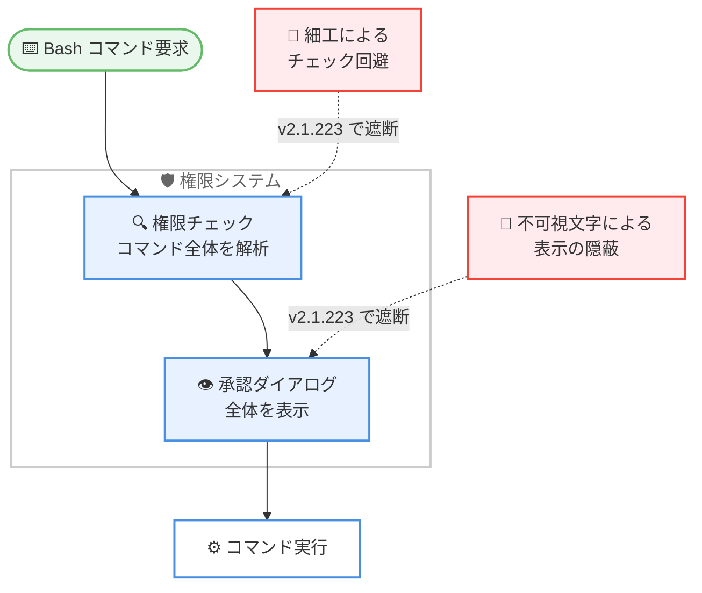

# Claude Code v2.1.223: 権限バイパス修正とマーケットプレイス管理のワイルドカード対応

## メタデータ

| 項目 | 内容 |
|------|------|
| 発表日 | 2026-08-05 |
| ソース | Claude Code Changelog |
| カテゴリ | Claude Code |
| 公式リンク | https://github.com/anthropics/claude-code/blob/main/CHANGELOG.md |

## 概要

Claude Code v2.1.223 がリリースされた。本リリースはセキュリティ関連の修正が多数含まれる重要なアップデートである。細工されたコマンドが権限チェックから自身の一部を隠せる Bash 権限バイパス、タブや不可視 Unicode 文字によって承認ダイアログからコマンドの一部を隠せる問題、ワークフロースクリプトが動的 `import()` でサンドボックス外のコードを実行できる問題、エージェント定義の `bypassPermissions` モードが組織ポリシーを無視する権限ギャップなど、権限とサンドボックスの境界に関わる複数の脆弱性が修正された。

機能追加としては、`strictKnownMarketplaces` と `blockedMarketplaces` 管理設定でオーナーワイルドカード (`"owner/*"`) がサポートされ、GitHub org 配下の全マーケットプレイスリポジトリを一括で許可またはブロックできるようになった。また、`/review` が `/code-review` のエイリアスとなり、レベル指定や PR 番号指定によるレビューフローが整理されたほか、1M コンテキストや未知のモデル ID に対する auto-compaction の動作も変更されている。

## 詳細

### 背景

Claude Code の権限システムは、実行されるコマンドをユーザーが承認ダイアログで確認し、許可ルールと照合することで安全性を担保している。しかし、コマンド文字列の解析や表示に隙があると、承認時に見えている内容と実際に実行される内容が一致しない「見た目と実行の乖離」が生じ、権限システム全体の信頼性を損なう。v2.1.223 は、この種の権限チェック・承認ダイアログの回避経路を塞ぐことに重点を置いたセキュリティリリースである。あわせて、企業管理者向けのマーケットプレイス制御の柔軟性向上や、コードレビューコマンドの整理も行われた。

### 主な変更点

#### 追加 (Added)

- **マーケットプレイス管理設定のオーナーワイルドカード**: `strictKnownMarketplaces` と `blockedMarketplaces` 管理設定でオーナーワイルドカード (`"owner/*"`) がサポートされ、GitHub org 配下のすべてのマーケットプレイスリポジトリを一括で許可またはブロックできるようになった
- **サブエージェントモデル制限時の警告**: ワークフローエージェント、フォークされたスキル、スラッシュコマンド、再開されたバックグラウンドエージェントについて、要求されたサブエージェントモデルが制限されて親モデルで実行される場合に警告が表示されるようになった
- **`/teleport` ヒント**: クラウドセッションで `claude --teleport <session id>` によるローカル継続方法を示す `/teleport` ヒントが追加された

#### 修正 (Fixed)

セキュリティ関連の修正が多数含まれる。

- **Bash 権限バイパスの修正**: 細工されたコマンドが権限チェックから自身の一部を隠せる問題を修正
- **権限プロンプトの表示回避の修正**: タブや不可視 Unicode 文字でパディングされたコマンドが、承認ダイアログからコマンドの一部を隠せなくなった
- **ワークフロースクリプトのサンドボックス回避の修正**: ワークフロースクリプトが動的 `import()` を使ってサンドボックス外のコードを実行できる問題を修正
- **`bypassPermissions` の組織ポリシー無視の修正**: エージェント定義の `bypassPermissions` モードが、組織の bypass-permissions 無効化ポリシーを無視する権限ギャップを修正
- **`/cd` 後のセッション再開の修正**: セッション途中の `/cd` 後にセッション再開が空になる問題を修正
- **プロバイダープレフィックス付きモデル ID の検出修正**: `vertex_ai/claude-*` や `bedrock/anthropic.claude-*` などプロバイダープレフィックス付き ID で登録された Claude モデルが、ゲートウェイモデル検出で隠れる問題を修正
- **`modelOverrides` キーの扱いの修正**: Anthropic モデル ID でない `modelOverrides` キーが、セッションの正規モデル ID として扱われる問題を修正
- **管理設定のマージ動作の修正**: サーバー配信設定がマシンローカルの `managed-settings.json` や MDM プロファイルの env ブロックを無効化しなくなり、管理者 env はキーごとにマージされるようになった
- **Linux サンドボックスの起動失敗の修正**: `sandbox.filesystem.denyWrite` が作業ディレクトリをカバーする場合に、Linux でサンドボックスコマンドが起動しない問題を修正
- **フォークされたバックグラウンドエージェントの修正**: resume 失敗時のスタック問題を修正
- **不正な diagnostics attachment の修正**: 不正な diagnostics attachment を含む履歴で、セッション再開が毎ターン失敗する問題を修正
- **`git push` 出力パースのハング修正**: 特殊な `git push` 出力のパース時に稀に発生するハングを修正

#### 変更 (Changed)

- **`CLAUDE_CODE_DISABLE_1M_CONTEXT` の適用範囲拡大**: ネイティブ 1M コンテキストウィンドウを持つすべての Claude モデルを、auto-compaction で 200K に制限するようになった
- **未知のモデル ID の auto-compaction**: 未知のモデル ID のセッションも、想定コンテキストウィンドウ内に auto-compact で維持されるようになった。旧動作に戻すには `CLAUDE_CODE_DISABLE_UNKNOWN_MODEL_WINDOW_ENFORCEMENT=1` を設定する
- **`/review` の `/code-review` エイリアス化**: `/review` は `/code-review` のエイリアスとなった。`/code-review <level> <pr#>` で diff や PR をレビューでき、`/code-review ultra` でディープクラウドレビューを実行できる
- **`/code-review` のレベル記憶**: レベル指定なしの `/code-review` は、前回入力したレベルを再利用するようになった

### 技術的な詳細

#### Bash 権限バイパスと承認ダイアログの表示回避

Claude Code は Bash コマンドの実行前に、コマンド内容を権限ルールと照合し、必要に応じてユーザーの承認を求める。修正前は、細工されたコマンド文字列によって権限チェックの解析対象からコマンドの一部を隠すことが可能であり、承認されていない操作が権限チェックをすり抜ける経路が存在した。また、タブ文字や不可視の Unicode 文字でコマンドをパディングすることで、承認ダイアログ上の表示からコマンドの一部を視覚的に隠すことも可能だった。ユーザーが「見た内容」と「実際に実行される内容」が一致することは権限システムの前提であり、v2.1.223 ではこの両方の経路が塞がれた。

#### ワークフロースクリプトの動的 import() によるサンドボックス回避

ワークフロースクリプトはサンドボックス内で実行されることが想定されているが、修正前は動的 `import()` を使うことでサンドボックス外のコードを読み込んで実行できた。これはサンドボックスによる隔離の前提を崩す問題であり、v2.1.223 で修正された。

#### bypassPermissions の組織ポリシー適用

組織管理者は、ポリシーによって bypass-permissions モードを無効化できる。しかし修正前は、エージェント定義に `bypassPermissions` モードが指定されている場合、この組織ポリシーが適用されない権限ギャップが存在した。修正後は、エージェント定義経由でも組織の無効化ポリシーが一貫して適用される。

#### マーケットプレイス管理のオーナーワイルドカード

`strictKnownMarketplaces` はプラグインマーケットプレイスを既知のもののみに制限する管理設定であり、`blockedMarketplaces` は特定のマーケットプレイスをブロックする設定である。従来はリポジトリを個別に指定する必要があったが、v2.1.223 からは `"owner/*"` 形式のワイルドカードにより、GitHub org 配下の全リポジトリを一括で許可またはブロックできる。自社 org のマーケットプレイスのみを許可する、といった運用が簡潔に記述できるようになった。

#### auto-compaction とコンテキストウィンドウの扱い

`CLAUDE_CODE_DISABLE_1M_CONTEXT` は 1M コンテキストの利用を無効化する環境変数だが、v2.1.223 からはネイティブ 1M ウィンドウを持つすべての Claude モデルに適用され、auto-compaction によってセッションが 200K に制限されるようになった。また、Claude Code が認識していないモデル ID を使うセッションでも、想定されるコンテキストウィンドウ内に収まるよう auto-compact が行われる。カスタムゲートウェイなどで独自のモデル ID を使用しており、この動作が不都合な場合は `CLAUDE_CODE_DISABLE_UNKNOWN_MODEL_WINDOW_ENFORCEMENT=1` で旧動作に戻せる。

#### /code-review への統合

コードレビュー機能は `/code-review` に統合され、`/review` はそのエイリアスとなった。`/code-review <level> <pr#>` の形式でレビューの深さと対象 PR を指定でき、`/code-review ultra` ではディープクラウドレビューが実行される。レベルを省略した場合は前回入力したレベルが再利用されるため、日常的なレビューフローでの入力が簡潔になる。

## 開発者への影響

### 対象

- Claude Code を使用するすべてのユーザー (Bash 権限バイパス、承認ダイアログ表示回避、サンドボックス回避などのセキュリティ修正)
- 組織ポリシーで bypass-permissions を無効化している企業の管理者 (`bypassPermissions` の権限ギャップ修正)
- `strictKnownMarketplaces` や `blockedMarketplaces` でマーケットプレイスを管理する管理者 (オーナーワイルドカード対応)
- Vertex AI や Amazon Bedrock などプロバイダープレフィックス付きモデル ID を使うゲートウェイ利用者 (モデル検出修正)
- カスタムゲートウェイで未知のモデル ID を使用する開発者 (auto-compaction の動作変更)
- `CLAUDE_CODE_DISABLE_1M_CONTEXT` を設定している開発者 (適用範囲の拡大)
- Linux 上でサンドボックスの `denyWrite` 設定を使用する開発者 (起動失敗の修正)
- `/review` コマンドを利用する開発者 (`/code-review` への統合)

### 必要なアクション

1. **速やかなアップデートの適用**: Bash 権限バイパス、承認ダイアログの表示回避、サンドボックス回避、組織ポリシーの権限ギャップなど、権限システムの根幹に関わるセキュリティ修正が複数含まれるため、全ユーザーに速やかなアップデートを推奨する
2. **マーケットプレイス管理設定の見直し**: 個別リポジトリを列挙していた `strictKnownMarketplaces` や `blockedMarketplaces` は、オーナーワイルドカードで簡潔に書き換えられる
3. **auto-compaction 動作の確認**: 未知のモデル ID や 1M コンテキストモデルを使用している場合、auto-compaction の動作変更によりセッションのコンパクションタイミングが変わる可能性がある。旧動作が必要な場合は `CLAUDE_CODE_DISABLE_UNKNOWN_MODEL_WINDOW_ENFORCEMENT=1` を検討する
4. **レビューコマンドの移行**: `/review` は引き続き利用できるが、`/code-review` が正式なコマンドとなったため、ドキュメントやワークフローの記述を更新するとよい

```bash
# Claude Code 組み込みコマンド
claude update

# npm を使用する場合
npm update -g @anthropic-ai/claude-code
```

## コード例

### マーケットプレイス管理設定のオーナーワイルドカード (managed-settings.json)

```json
{
  "strictKnownMarketplaces": [
    "my-org/*"
  ],
  "blockedMarketplaces": [
    "untrusted-org/*"
  ]
}
```

`"my-org/*"` により、GitHub の `my-org` 配下のすべてのマーケットプレイスリポジトリが一括で許可される。

### /code-review の使用例

```text
# 前回のレベルを再利用してレビュー
/code-review

# レベルと PR 番号を指定してレビュー
/code-review thorough 1234

# ディープクラウドレビュー
/code-review ultra
```

### クラウドセッションのローカル継続

```bash
# クラウドセッションをローカルで継続する
claude --teleport <session id>
```

## アーキテクチャ図

v2.1.223 で塞がれた権限チェック・承認ダイアログの回避経路を示す。



## 関連リンク

- [Claude Code Changelog](https://github.com/anthropics/claude-code/blob/main/CHANGELOG.md)
- [Claude Code GitHub リポジトリ](https://github.com/anthropics/claude-code)
- [Claude Code ドキュメント](https://docs.anthropic.com/en/docs/claude-code)
- [Claude Code v2.1.222 レポート](./2026-08-04-claude-code-v2-1-222.md)

## まとめ

Claude Code v2.1.223 は、権限システムとサンドボックスの信頼性を高めるセキュリティ中心のリリースである。Bash 権限バイパス、不可視文字による承認ダイアログの表示回避、動的 `import()` によるサンドボックス回避、`bypassPermissions` の組織ポリシー無視という 4 つの重要な経路が塞がれ、ユーザーと管理者が承認・設定した内容が確実に適用されるようになった。また、マーケットプレイス管理のオーナーワイルドカード対応により企業での運用が簡潔になり、`/code-review` への統合や auto-compaction の動作変更など日常的な利用体験の改善も含まれる。セキュリティ修正が多数含まれるため、全ユーザーに速やかなアップデートを推奨する。
