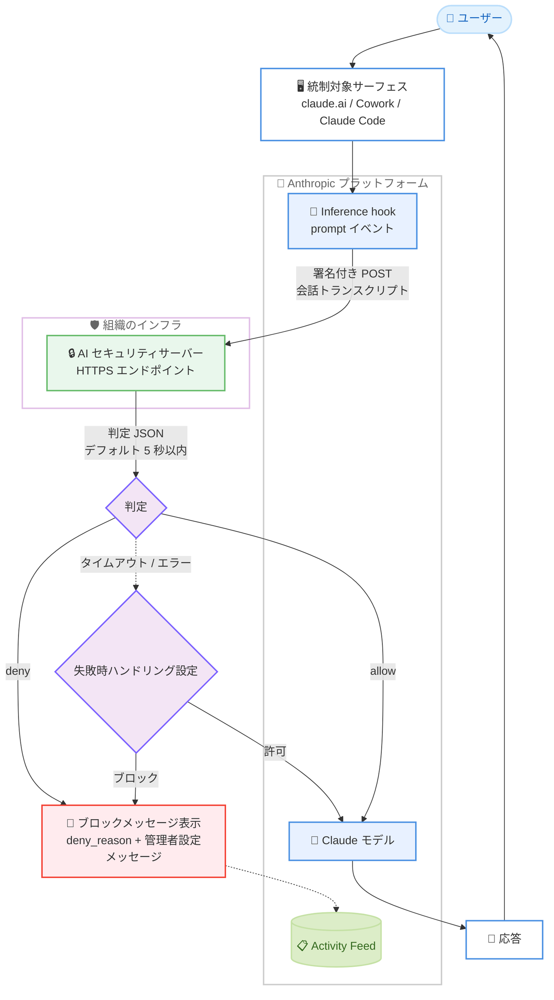

# Inference hooks ベータ提供開始と Claude Opus 4.1 の廃止

## メタデータ

| 項目 | 内容 |
|------|------|
| 発表日 | 2026-08-05 |
| ソース | Claude API Release Notes |
| カテゴリ | エンタープライズ機能 / モデルライフサイクル |
| 公式リンク | https://platform.claude.com/docs/en/release-notes/overview |

## 概要

2026 年 8 月 5 日、Claude Platform のリリースノートで 2 件の更新が発表されました。1 つ目は、Claude Enterprise 組織向けの新機能 **Inference hooks (ベータ)** の提供開始です。組織が指定した AI セキュリティサーバーに対して、claude.ai、Cowork、Claude Code 全体の governed prompt (統制対象プロンプト) を推論実行前に送信し、allow/deny の判定を受け取る仕組みで、DLP (データ損失防止) などのポリシーをインラインで強制できます。

2 つ目は、**Claude Opus 4.1 (`claude-opus-4-1-20250805`) の廃止 (retired)** です。同モデルへのすべてのリクエストはエラーを返すようになり、Claude Opus 5 へのアップグレードが推奨されています。

## 詳細

### 背景

エンタープライズ組織では、従業員が AI に送信するデータに対して、規制対象データの流出防止や社内ポリシーの強制といったガバナンス要件があります。従来、Anthropic は事後監査のための Compliance API を提供していましたが、リクエストがモデルに到達する**前**に介入する手段はありませんでした。Inference hooks はこのギャップを埋める機能で、Anthropic のサーバー側で動作するため、ユーザーのデバイスに何もインストールせずにすべての統制対象リクエストへ一律に適用されます。

モデルライフサイクルの面では、Claude Opus 4.1 は 2025 年 8 月 5 日にリリースされたモデルであり、後継の Claude Opus 5 の提供開始に伴い、ちょうど 1 年で廃止となりました。

### 主な変更点

#### 1. Inference hooks (ベータ)

Claude Enterprise 組織向けにベータ提供が開始されました。主なポイントは以下のとおりです。

- **対象組織**: Claude Enterprise 組織。設定には claude.ai の `organization:manage` 権限が必要 (組み込みの Admin、Owner、Primary owner ロールが保持)
- **対象サーフェス**: claude.ai、Cowork、Claude Code のセッション全体 (Web、デスクトップアプリ、CLI を問わず 1 つのフックで統制)
- **フックイベント**: 現時点では `prompt` イベントのみ。統制対象の推論リクエストごとに、推論開始前に 1 回発火。レスポンス側の強制は将来のイベントとして計画中
- **判定の仕組み**: 拒否されたリクエストはモデルに一切到達しない。すべての拒否は組織の Activity Feed (コンプライアンス機能) に記録される

#### 2. Claude Opus 4.1 の廃止

- `claude-opus-4-1-20250805` へのすべてのリクエストはエラーを返します
- **推奨移行先**: Claude Opus 5
- 研究者は External Researcher Access Program を通じて継続アクセスを申請できます

### 技術的な詳細

公式ドキュメントによると、Inference hooks の動作フローは以下のとおりです。

1. ユーザーが統制対象サーフェスでプロンプトを送信する
2. Anthropic が組織の設定した AI セキュリティサーバーのエンドポイントに HTTPS `POST` を送信する。リクエストボディには会話トランスクリプトが含まれ、組織が署名シークレットを生成すると各リクエストは [Standard Webhooks](https://www.standardwebhooks.com/) 仕様に従って署名されるため、サーバー側で Anthropic からの送信であることを検証できる
3. AI セキュリティサーバーがコンテンツを評価し、組織が設定した判定タイムアウト (デフォルト 5 秒) 以内に判定を返す
4. `allow` の場合は推論が通常どおり実行される。`deny` の場合はリクエストが拒否され、ユーザーには判定の `deny_reason` フィールドの理由と、管理者が設定した定型メッセージ (問い合わせ先や例外申請の案内など) を組み合わせたブロックメッセージが表示される

**判定 (verdict) の形式**: `{"action": "allow"}` のような小さな JSON オブジェクトで、拒否の場合はユーザー向けの理由を含みます。

**サーバーに送信される内容**: AI セキュリティサーバーはユーザーが見るものと同じ内容 (トランスクリプトのテキスト、ツール呼び出しとその結果、添付ファイルから抽出されたテキスト) を受け取ります。ファイルや画像の生バイト、システムプロンプト、Anthropic 内部のコンテキストは送信されません。

**失敗時のハンドリング**: サーバーに到達できない、エラーを返す、タイムアウト以内に応答しない場合の挙動は、組織の設定 (リクエストをブロックするか、検査なしで許可するか) で決まります。

**段階的なロールアウト**: いきなり全員をブロックしない導入が可能です。

- **シャドウモード**: 実トラフィックで判定を観測するだけで、何もブロックしない
- **ロールアウト割合**: 選択した割合のリクエストのみを検査する
- **除外設定**: 選択したロールのメンバーを完全に対象外にする

**ユースケース**: 以下の用途が想定されています。

- **DLP**: トランスクリプトを DLP スキャナーに転送し、規制対象データや機密データを含むプロンプトを拒否 (最も一般的なデプロイ)
- **リアルタイムのトランスクリプトアーカイブ**: 常に `allow` を返しつつトランスクリプトを保存する、Compliance API のポーリングに代わるプッシュ型の手段
- **プロンプトテレメトリ**: 組織の Claude 利用状況を利用時点で計測
- **ポリシーエンジン**: モデルの許可リスト、プロジェクト単位の制限、勤務時間制御など独自ルールの強制

**現在の制限事項**: 以下の制限があります。

- 添付ファイルはメタデータと抽出テキストで表現される。生バイトは送信されないため、画像のみのコンテンツ (文書のスクリーンショットなど) は検査されない
- 判定は allow/deny のみ。プロンプトの書き換えや部分的な削除 (リダクション) は非対応
- Platform 組織 (Claude Platform 経由の API アクセス) は対象外
- Amazon Bedrock、Google Cloud では利用不可
- 会話タイトル生成などの付随的リクエストは送信されない。音声モードは対象外

#### Compliance API との比較

| | Inference hooks | Compliance API |
|---|---|---|
| 動作タイミング | インライン、推論実行前 | 事後 |
| 機能 | 統制対象リクエストをリアルタイムに許可/拒否 | 監査・エクスポート用にアクティビティ、チャット、ファイル等を取得 |
| 方向 | Anthropic が組織のサーバーを呼び出す | 組織が Anthropic の API を呼び出す |

## 開発者への影響

### 対象

- **Claude Enterprise 組織の管理者・セキュリティ/コンプライアンスチーム**: Inference hooks によるインラインのポリシー強制が可能になります
- **AI セキュリティサーバーを構築する開発者**: リクエスト/判定スキーマと署名検証を実装する必要があります
- **Claude Opus 4.1 (`claude-opus-4-1-20250805`) を利用中のすべての開発者**: リクエストがエラーになるため、即時の移行が必要です

### 必要なアクション

**Inference hooks を導入する場合**は以下の手順を実施します。

1. 組織またはセキュリティベンダーが運用する HTTPS の AI セキュリティサーバーを用意する
2. リクエスト/判定スキーマと Standard Webhooks 仕様の署名検証を実装する ([Develop an integration](https://platform.claude.com/docs/en/manage-claude/inference-hooks-endpoint) を参照)
3. 管理画面で組織の設定を行い、失敗時ハンドリング (ブロック/許可) と判定タイムアウトを選択する
4. シャドウモードで観測を開始し、ロールアウト割合を段階的に引き上げて本番強制へ移行する

**Claude Opus 4.1 を利用中の場合**は以下の対応が必要です。

- モデル ID を Claude Opus 5 に更新する
- 研究目的で旧モデルへのアクセスが必要な場合は、External Researcher Access Program に申請する

### 移行ガイド (該当する場合)

Claude Opus 4.1 から Claude Opus 5 への移行では、API リクエスト内のモデル ID を変更します。

```python
# 変更前 (エラーを返す)
model = "claude-opus-4-1-20250805"

# 変更後
model = "claude-opus-5"
```

移行後は、既存のプロンプトとツール定義が期待どおりに動作するか回帰テストを実施することを推奨します。

## コード例

AI セキュリティサーバーが返す判定 (verdict) の例です。

```json
{
  "action": "allow"
}
```

拒否する場合は、ユーザーに表示される理由を含めます。

```json
{
  "action": "deny",
  "deny_reason": "このプロンプトには社外秘に分類されたデータが含まれています。"
}
```

## アーキテクチャ図

Inference hooks の処理フローは以下のとおりです。



## 関連リンク

- [Claude Platform Release Notes](https://platform.claude.com/docs/en/release-notes/overview)
- [Inference hooks 概要](https://platform.claude.com/docs/en/manage-claude/inference-hooks)
- [Inference hooks の設定](https://platform.claude.com/docs/en/manage-claude/inference-hooks-configuration)
- [Inference hooks インテグレーション開発](https://platform.claude.com/docs/en/manage-claude/inference-hooks-endpoint)
- [Compliance API](https://platform.claude.com/docs/en/manage-claude/compliance-api)
- [Standard Webhooks 仕様](https://www.standardwebhooks.com/)
- [External Researcher Access Program](https://support.claude.com/en/articles/9125743-what-is-the-external-researcher-access-program)

## まとめ

今回のリリースは、エンタープライズガバナンスとモデルライフサイクルの両面で重要な更新です。Inference hooks は、事後監査の Compliance API に対して「推論前のインライン強制」という新しい統制レイヤーを追加するもので、DLP やポリシーエンジンを Anthropic のサーバー側で一律に適用できます。シャドウモードやロールアウト割合により段階的な導入が可能な点も、実運用を意識した設計です。一方、Claude Opus 4.1 は完全に廃止されたため、該当モデルを利用中のシステムは Claude Opus 5 への移行を直ちに実施する必要があります。
