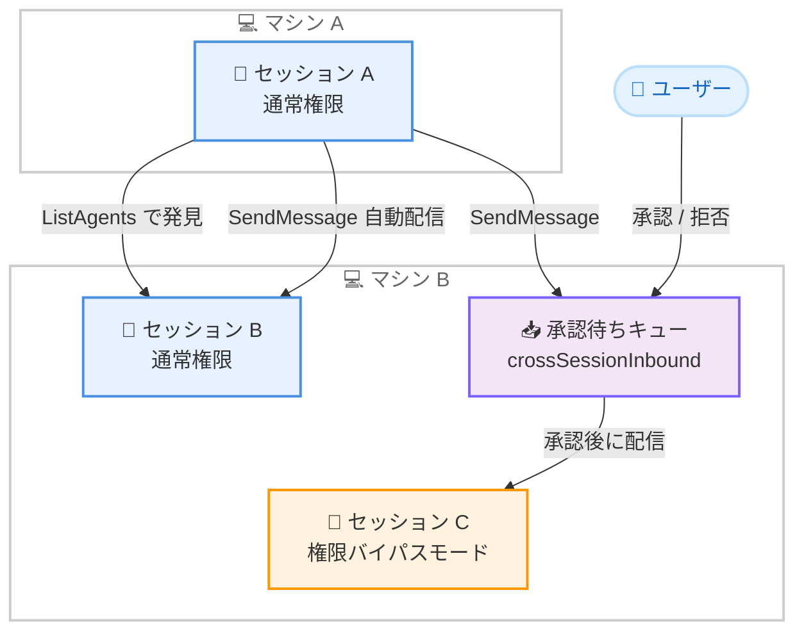

# Claude Code v2.1.224: セルフホスト実行環境とクロスセッションメッセージングの追加

## メタデータ

| 項目 | 内容 |
|------|------|
| 発表日 | 2026-08-07 |
| ソース | Claude Code Changelog |
| カテゴリ | Claude Code |
| 公式リンク | https://github.com/anthropics/claude-code/blob/main/CHANGELOG.md |

## 概要

Claude Code v2.1.224 がリリースされた。本リリースの目玉は、Team および Enterprise プラン向けの **セルフホスト実行環境** である。`claude self-hosted-runner` コマンドにより、自社のマシンやコンテナを Claude Code の Web、モバイル、デスクトップセッションの実行場所として利用できるようになった。また、**クロスセッション `SendMessage`** により、macOS と Linux 上の Claude Code セッション同士が任意のマシン間でメッセージを送り合えるようになり、`ListAgents` で他のセッションを発見できる。

そのほか、git や npm を使わず HTTPS 経由の zip からプラグインをインストールできる `archive` プラグインソース、Bedrock のクロスリージョン推論プロファイルを明示指定する `ANTHROPIC_BEDROCK_REGION_PREFIX` 環境変数、JWT や AWS SigV4 に対応したサンドボックスの認証情報マスキングオプションなどが追加された。修正面では、末尾スラッシュ付きのサンドボックス filesystem deny エントリが黙って回避可能だった問題や、200 文字を超えるプロジェクトパスが別プロジェクトのセッションディレクトリに解決される問題など、重要な修正が含まれる。また、セッションあたり 200 サブエージェントの生成上限が撤廃された。

## 詳細

### 背景

Claude Code は CLI にとどまらず、Web、モバイル、デスクトップ、Remote Control、SDK と実行形態を拡大してきた。一方で、クラウドセッションの実行環境は Anthropic 管理のインフラに限られており、社内ネットワークへのアクセスや独自のツールチェーンを必要とする企業ユースには制約があった。v2.1.224 のセルフホスト実行環境はこのギャップを埋めるものである。また、複数セッション・複数マシンにまたがるエージェント運用が一般化する中で、セッション間の連携手段 (クロスセッションメッセージング) と、その安全性を担保する設定 (`crossSessionInbound`) が同時に導入された点も特徴的である。

### 主な変更点

#### 追加 (Added)

- **セルフホスト実行環境**: `claude self-hosted-runner` により、自社のマシンやコンテナを Claude Code の Web、モバイル、デスクトップセッションの実行場所にできる。Team および Enterprise プランで利用可能
- **`archive` プラグインソース**: git や npm を使わずに、HTTPS 経由の zip ファイルからプラグインをインストールできる。SHA-256 によるピン留めにも対応
- **クロスセッション `SendMessage`**: Claude Code セッション同士が、任意のマシン間でメッセージを送信できるようになった。`ListAgents` で他のセッションを発見できる (macOS および Linux)
- **`crossSessionInbound` と `dialogExpiry` 設定**: 権限バイパスモードで実行中のセッションに送られたクロスセッションメッセージはユーザーの承認まで保留され、その他のセッションへのメッセージは自動配信される
- **サンドボックスの認証情報マスキングオプション**: 構造化された環境変数値向けの `extract` と `onExtractNoMatch`、JWT を解釈してマスクする `decode: "jwt"` と `maskClaims`、AWS SigV4 再署名のための `awsPairs`/`sigv4` が追加された。これらは `network.tlsTerminate` が必要で、ユーザー設定、管理設定、`--settings` からのみ有効
- **`ANTHROPIC_BEDROCK_REGION_PREFIX` 環境変数**: Bedrock で、`AWS_REGION` から導出されるものより優先して特定のクロスリージョン推論プロファイルを指定できる
- **ペースト削除時のキャンセル確認**: 利用不能なペーストの削除がコマンドのテキストを変えてしまう場合に、キャンセルして確認するステップが追加された

#### 修正 (Fixed)

- **長いプロジェクトパスのセッションディレクトリ混同の修正**: 200 文字を超えるプロジェクトパスが、サニタイズ後のプレフィックスを共有する別プロジェクトのセッションディレクトリに解決される問題を修正。セッション一覧、リネーム、フォーク、削除、`/resume` がプロジェクトをまたがなくなった
- **サンドボックス deny エントリの末尾スラッシュ回避の修正**: 末尾スラッシュ付きで書かれた filesystem deny エントリ (例: `denyRead: "~/.aws/"`) が、Linux と macOS で黙って回避可能だった問題を修正
- **サンドボックス違反詳細の表示修正**: サンドボックス違反の詳細が Bash ツール結果に一切表示されなかった問題を修正。どのファイルやネットワークアクセスが、なぜ拒否されたかを Claude が確認できるようになった
- **`SendMessage` の誤成功報告の修正**: 相手のインボックスへの書き込みが実際には失敗していたのに「Message sent」と報告される問題を修正。配信失敗はエラーとして報告される
- **ターン途中で接続した MCP ツールの修正**: ツール検索向けに遅延される際、モデルに名前が通知されない問題を修正
- **プラグインインストール記録の破損修正**: 同じプラグインを複数プロジェクトにインストールした際に、インストール記録が黙って破損する問題を修正
- **ペースト復元の修正**: ペーストが期限切れになった場合やプレースホルダー番号が衝突した場合に、誤ったデータが添付されたりテキストが黙って失われたりする問題を修正
- **Wayland のコピーオンセレクト修正**: 2 つの選択書き込みが競合し、クリップボードに届かないことがある問題を修正
- **フィードバックサーベイの共有失敗の修正**: 長いセッションでトランスクリプト共有が黙って失敗する問題を修正。失敗時は成功メッセージではなくエラーが表示される
- **Remote Control の自動起動修正**: 古いログイントークンでのコールドスタート時に「Remote credentials fetch failed」で断続的に失敗する問題を修正
- **出力なしコマンド後の表示修正**: `/clear` などの出力のないコマンドの後、Remote Control と SDK クライアントに空の「(no content)」メッセージが表示される問題を修正
- **Remote Control セッション再作成時の履歴混入の修正**: サーバーセッションの期限切れ後に再作成されたセッションへ、以前のローカル会話履歴がアップロードされる問題を修正
- **Remote Control オフ設定の尊重**: ユーザーが Remote Control をオフにした後、セッション再開時に黙って再接続される問題を修正 (`--resume`、SDK ホスト、VS Code 拡張)
- **[VSCode] 接続失敗後の表示修正**: 接続が失敗した後も Remote Control が接続中と表示される問題を修正
- **[VSCode] `remoteControlAtStartup` の修正**: 明示的に有効化した場合にセッションが設定を尊重しない問題を修正

#### 削除 (Removed)

- **200 サブエージェント上限の撤廃**: セッションあたり 200 サブエージェントの生成上限が撤廃され、長時間実行セッションが新しいエージェントを拒否しなくなった (並列数と深さの制限は引き続き適用される)

#### 変更 (Changed)

- **フィードバックサーベイのトランスクリプト共有内容の拡大**: ユーザーの同意のもと、最後のリクエストのモデル設定 — システムプロンプト (`CLAUDE.md` の指示を含む)、ツール定義、モデルパラメータ — もアップロードされるようになった。シークレットは従来どおり秘匿化され、共有サイズが大きすぎる場合はこれらのフィールドから先に削除される
- **管理設定の承認プロンプト**: 組織の設定に変更がない場合、再ログインや組織切り替えの後に承認プロンプトが再表示されなくなった
- **Bash ツール説明の変更**: コマンド出力はモデルに表示されるものであり、ユーザーに確実に表示されるとは限らないことを常に明記するようになった
- **ペーストプレースホルダーの番号変更**: 復元されたペーストのプレースホルダー番号は、入力に取り込まれた時点で振り直されるようになった
- **Remote Control のセッションアーカイブ**: コンパクションや `/resume` の後に新しいセッションが発行された場合、死んだセッションを一覧に残す代わりに、古いサーバーセッションをアーカイブするようになった

#### 改善 (Improved)

- **フルスクリーンモードのスクロールバック**: 繰り返しのコンパクションをまたいで、直近の区間だけでなくコンパクション前の全履歴をスクロールバックに保持するようになった
- **Remote Control のコンパクション表示**: 接続中の Web およびモバイルクライアントに、無音の停止ではなくコンパクションの進捗とコンパクション後の境界が表示されるようになった。`/clear` によるリセットも接続中のクライアントに伝播する
- **Remote Control の接続失敗表示**: 8 秒間のトーストのみではなく、詳細と再接続ショートカット付きの永続的な失敗インジケーターが表示されるようになった

### 技術的な詳細

#### セルフホスト実行環境

`claude self-hosted-runner` は、自社管理のマシンやコンテナを Claude Code のクラウド系クライアント (Web、モバイル、デスクトップ) のセッション実行場所として登録するコマンドである。従来、これらのクライアントから開始したセッションは Anthropic 管理の実行環境で動作していたが、セルフホストランナーを使うことで、社内ネットワーク上のリソース、独自のビルドツールチェーン、機密データを扱う環境など、自社インフラの制約や要件に沿った場所でセッションを実行できる。CI のセルフホストランナーと同様の考え方であり、Team および Enterprise プランで利用できる。

#### クロスセッション SendMessage と受信制御

macOS と Linux で、Claude Code セッションが `SendMessage` によって他のセッションへメッセージを送信できるようになった。宛先は同一マシンに限定されず、ユーザーの任意のマシン上のセッションを `ListAgents` で発見して指定できる。複数のセッションが並行して別々の作業を進めながら、進捗や成果物の情報を交換するマルチエージェント的な運用が可能になる。

安全面では、新しい `crossSessionInbound` と `dialogExpiry` 設定が導入された。権限バイパスモード (bypassed permissions) で実行中のセッションに届いたクロスセッションメッセージは、自動では処理されずユーザーの承認まで保留される。バイパスモードのセッションは確認なしにアクションを実行できるため、外部からのメッセージ注入が直接の操作につながるリスクを、承認ステップで遮断する設計である。あわせて、配信失敗時に「Message sent」と誤報告されていた問題も修正され、失敗はエラーとして報告される。

#### archive プラグインソース

プラグインのインストール元として、HTTPS 経由で配布される zip アーカイブを指定できる `archive` ソースが追加された。git リポジトリや npm レジストリを用意できない環境でも、静的な HTTPS エンドポイントに zip を置くだけでプラグインを配布できる。オプションで SHA-256 ハッシュによるピン留めが可能であり、配布物の改ざんや意図しない更新を検出できる。

#### サンドボックスの認証情報マスキング強化

サンドボックスの認証情報マスキングに、より高度なオプションが追加された。

- **`extract` / `onExtractNoMatch`**: 環境変数値が JSON などの構造を持つ場合に、マスク対象の部分を抽出して扱える
- **`decode: "jwt"` と `maskClaims`**: JWT を解釈し、指定したクレームをマスクできる
- **`awsPairs` / `sigv4`**: AWS SigV4 署名付きリクエストの再署名に対応し、認証情報を隠しながら AWS API 呼び出しを通過させられる

これらのオプションは `network.tlsTerminate` (TLS 終端) を必要とし、ユーザー設定、管理設定、または `--settings` フラグで指定された設定からのみ有効となる。プロジェクト設定からは有効化できないため、リポジトリ側の設定によって認証情報の扱いが変更されることはない。

#### サンドボックスの修正: 末尾スラッシュ回避と違反詳細

セキュリティ上重要な修正が 2 件含まれる。1 つ目は、filesystem deny エントリを `denyRead: "~/.aws/"` のように末尾スラッシュ付きで書いた場合、Linux と macOS でその拒否設定が黙って回避可能だった問題の修正である。拒否したつもりのパスが実際には保護されていなかったため、該当する書き方をしている場合は本バージョンへの更新が推奨される。2 つ目は、サンドボックス違反の詳細が Bash ツール結果に表示されなかった問題の修正で、どのファイルやネットワークアクセスがなぜ拒否されたかを Claude 自身が確認できるようになり、違反時の原因調査やリトライの精度が向上する。

#### Bedrock のクロスリージョン推論プロファイル指定

Amazon Bedrock 利用時、従来はクロスリージョン推論プロファイルのプレフィックス (`us.`、`eu.` など) が `AWS_REGION` から導出されていた。新しい `ANTHROPIC_BEDROCK_REGION_PREFIX` 環境変数により、この導出結果を上書きして特定のプレフィックスを優先指定できる。リージョンとは異なる推論プロファイルを使いたい構成 (例: グローバルプロファイルの利用) に対応しやすくなる。

#### フィードバックサーベイの共有内容の透明化

フィードバックサーベイでトランスクリプトを共有する際、ユーザーの同意のもとで、最後のリクエストのモデル設定もアップロードされるようになった。具体的にはシステムプロンプト (`CLAUDE.md` の指示を含む)、ツール定義、モデルパラメータである。シークレットは従来どおり秘匿化され、共有サイズの上限を超える場合はこれらのフィールドから先に削除される。組織のポリシーとして `CLAUDE.md` に機密性の高い記述がある場合は、共有時の同意判断の材料として認識しておくとよい。

#### サブエージェント上限の撤廃

セッションあたり 200 サブエージェントという生成上限が撤廃された。長時間実行されるセッションや、多数のサブエージェントを順次生成するワークフローが、上限到達によって新しいエージェントの生成を拒否されることがなくなった。なお、同時実行数と深さの制限は引き続き適用されるため、無制限に並列化されるわけではない。

## 開発者への影響

### 対象

- 自社インフラで Claude Code のクラウドセッションを実行したい Team / Enterprise プランの組織 (セルフホスト実行環境)
- 複数セッション・複数マシンでのマルチエージェント運用を行う開発者 (クロスセッション `SendMessage`、`ListAgents`、サブエージェント上限撤廃)
- サンドボックスの filesystem deny 設定を末尾スラッシュ付きで記述しているユーザー (回避可能だった問題の修正)
- サンドボックスで認証情報マスキングを使用する組織 (JWT / AWS SigV4 対応の追加)
- git や npm を使わずにプラグインを配布したい組織 (`archive` プラグインソース)
- Amazon Bedrock でクロスリージョン推論プロファイルを使う開発者 (`ANTHROPIC_BEDROCK_REGION_PREFIX`)
- 200 文字を超える深いプロジェクトパスを使用する開発者 (セッションディレクトリ混同の修正)
- Remote Control や VS Code 拡張の利用者 (接続表示、履歴混入、オフ設定尊重などの多数の修正)
- フィードバックサーベイでトランスクリプトを共有するユーザー (共有内容の拡大)

### 必要なアクション

1. **アップデートの適用**: サンドボックス deny エントリの末尾スラッシュ回避や、プロジェクトパスの混同など、データ保護に関わる修正が含まれるため、アップデートを推奨する
2. **サンドボックス deny 設定の確認**: `denyRead: "~/.aws/"` のような末尾スラッシュ付きエントリを使用している場合、更新前のバージョンでは保護が効いていなかった可能性がある。設定が意図どおり機能しているか確認する
3. **セルフホストランナーの検討**: Team / Enterprise プランで、社内リソースへのアクセスが必要なクラウドセッションがある場合、`claude self-hosted-runner` の導入を検討する
4. **クロスセッションメッセージングの受信ポリシー確認**: 権限バイパスモードのセッションを運用している場合、`crossSessionInbound` によるメッセージ保留の動作を確認し、必要に応じて `dialogExpiry` を調整する
5. **フィードバック共有時の同意判断**: トランスクリプト共有にシステムプロンプト (`CLAUDE.md` を含む) やツール定義が含まれるようになったため、機密情報を含むプロジェクトでは共有時に留意する

```bash
# Claude Code 組み込みコマンド
claude update

# npm を使用する場合
npm update -g @anthropic-ai/claude-code
```

## コード例

### セルフホストランナーの起動

```bash
# 自社マシンやコンテナを Claude Code セッションの実行場所として登録する
claude self-hosted-runner
```

### archive プラグインソースの指定例

```json
{
  "source": "archive",
  "url": "https://example.com/plugins/my-plugin.zip",
  "sha256": "e3b0c44298fc1c149afbf4c8996fb92427ae41e4649b934ca495991b7852b855"
}
```

SHA-256 を指定すると、取得した zip のハッシュが一致しない場合にインストールが拒否される。

### Bedrock のクロスリージョン推論プロファイル指定

```bash
# AWS_REGION から導出されるプレフィックスの代わりに global プロファイルを優先する
export AWS_REGION=us-east-1
export ANTHROPIC_BEDROCK_REGION_PREFIX=global
```

## アーキテクチャ図

v2.1.224 で追加されたクロスセッションメッセージングと受信制御の流れを示す。



## 関連リンク

- [Claude Code Changelog](https://github.com/anthropics/claude-code/blob/main/CHANGELOG.md)
- [Claude Code GitHub リポジトリ](https://github.com/anthropics/claude-code)
- [Claude Code ドキュメント](https://docs.anthropic.com/en/docs/claude-code)
- [Claude Code v2.1.223 レポート](./2026-08-05-claude-code-v2-1-223.md)

## まとめ

Claude Code v2.1.224 は、実行環境とエージェント連携の両面で運用の幅を広げるリリースである。セルフホスト実行環境により Team / Enterprise プランの組織は自社インフラ上でクラウドセッションを実行できるようになり、クロスセッション `SendMessage` と `ListAgents` によりマシンをまたいだセッション間連携が可能になった。権限バイパスモードのセッションへのメッセージを承認制にする `crossSessionInbound` など、新機能に対する安全設計も同時に導入されている。あわせて、末尾スラッシュ付き deny エントリの回避や長いプロジェクトパスのセッション混同といった重要な修正、JWT / AWS SigV4 対応の認証情報マスキング、200 サブエージェント上限の撤廃など、セキュリティと大規模運用の双方に効く変更が多数含まれる。サンドボックスの deny 設定を使用しているユーザーは、設定が意図どおり機能しているかの確認とあわせて、アップデートの適用を推奨する。
