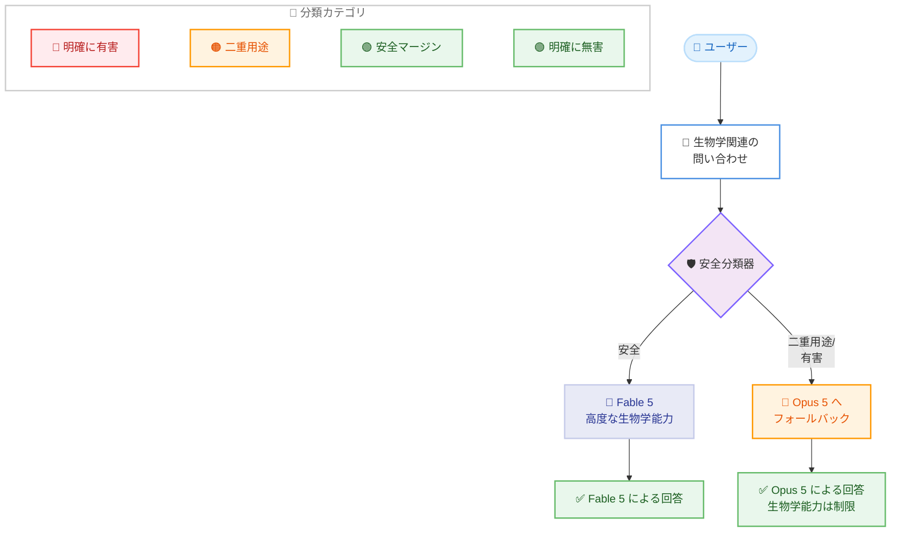

# Fable 5 の生物学関連安全対策の改善

## メタデータ

| 項目 | 内容 |
|------|------|
| 発表日 | 2026 年 8 月 7 日 |
| ソース | Anthropic 公式ニュース |
| カテゴリ | 製品アップデート、安全性 |
| 公式リンク | https://www.anthropic.com/news/improving-fable-5-s-biology-safeguards |

## 概要

Anthropic は Claude Fable 5 の生物学関連の安全対策を大幅に改善し、誤検知 (false positive) を大幅に削減しました。これにより、日常的な健康や教育目的の質問が不必要にブロックされるケースが約 85% 削減され、より使いやすくなりました。一方で、悪用リスクの高いウイルス学、毒物学、分子設計などの二重用途 (dual-use) の問い合わせについては、引き続き Opus 5 へのフォールバックを維持し、安全性を確保しています。

## 詳細

### 背景

**なぜ強力な安全対策が必要だったのか。**

- Fable 5 は複雑な生物学タスクにおいて専門家を上回る能力を持ち、悪意のある行為者に「他では得られない能力」を提供する可能性がありました
- 有益な生物学利用と有害な利用の区別が困難な場合が多く存在します。
  - 例: 生ワクチンは、予防しようとする病原体そのものを培養する必要があります
  - 例: 降圧薬カプトプリルは、血圧を急降下させる毒性のあるヘビ毒成分を分離して開発されました
- 米国情報機関の 2026 年版年次脅威評価では、バイオテクノロジーの進歩が「新たな生物学的脅威につながる可能性」を警告し、複数の国家が攻撃的な生物兵器プログラムを運営している可能性を指摘しています
- Anthropic は Fable 5 のローンチ時、誤検知が高くなることを受け入れながら、ほぼすべての生物学関連の問い合わせをブロックしました。なぜなら、悪用は「壊滅的な結果を招く可能性」があるためです

**ローンチ時の戦略。**

- 広範な分類器 (classifier) を使用することで、ユーザーが Fable 5 に早期アクセスできるようにしました
- 精緻化された安全対策を待っていれば、リリースが数週間から数ヶ月遅れていました

### 主な変更点

**誤検知の大幅削減。**

生物学関連のフォールバックが約 85% 削減されました。製品別の予想削減率は以下の通りです。

| 製品 | フォールバック削減率 |
|------|---------------------|
| Claude.ai | 67% |
| Cowork | 55% |
| Claude Code | 17% |
| Claude Platform | 7% |

**ユーザー体験の改善。**

- 日常的な健康や教育に関する質問で不必要にブロックされるケースが減少しました。
  - 検査結果の解釈
  - 症状の理解
  - 生物学の学習
- 医療専門家が臨床タスクでより多くのサポートを受けられるようになりました

**依然としてブロックされる内容。**

- Fable は二重用途のリクエストに対しては、引き続き Opus 5 にフォールバックします。
  - ウイルス学
  - 毒物学
  - 分子設計
- プロフェッショナルな生物学研究や医薬品開発には引き続き利用できません
- Anthropic は、最先端の生物学機能に対する「信頼されたアクセス経路」の提供に引き続き取り組んでいます

### 技術的な詳細

**安全対策の仕組み。**

**安全分類器の動作。**

- 小規模な自動化された AI システムが、保護対象の生物学リクエストや有害な出力を検出します
- トリガーされると、リクエストは Opus 5 (能力は高いが生物学能力は低いモデル) にルーティングされます
- 分類器のチューニングは、誤検知と見逃し (false negative) のバランスを取り、ジェイルブレイクに抵抗する必要があります

**今回のアップデート手順。**

1. **憲法の書き直し**: 分類器の憲法 (保護対象と許可されるコンテンツを区別するルール) を書き直し、無害な用途を慎重に切り分けました
2. **専門家からのフィードバック**: 内部および外部の専門家からフィードバックを収集しました
3. **新しいトレーニングデータの開発**: 新しいトレーニングデータを開発し、分類器を再トレーニングしました
4. **検証**: 有害および二重用途の研究コンテンツでは依然としてトリガーされる一方で、より多くの無害な用途を許可することを確認しました

**コンテンツカテゴリの境界変更。**

- ローンチ時 (A): 境界が左側に位置し、多くの無害なリクエストをブロックしていました
- アップデート後 (B): 境界が右側に移動し、より多くの無害な問い合わせを許可するようになりました
- 明確に有害 (赤) → 二重用途 (オレンジ) → 安全マージン (薄緑: 無害の可能性が高いが念のためブロック) → 明確に無害 (濃緑)

## 開発者/ユーザーへの影響

### 対象ユーザー

**改善の恩恵を受けるユーザー。**

- 一般ユーザー: 日常的な健康相談や生物学学習
- 医療専門家: 臨床タスクのサポート
- 教育関係者: 生物学教育における Fable 5 の活用

**依然として制限されるユーザー。**

- 専門的な生物学研究者
- 医薬品開発に従事する研究者
- ウイルス学、毒物学、分子設計などの二重用途分野の研究者

### 必要なアクション

- 特別なアクションは不要です
- 今回のアップデートはすべてのユーザーに自動的に適用されます
- 依然として誤検知が発生する場合は、Anthropic にフィードバックを提供することが推奨されます

### 今後の展望

- 誤検知は安全マージン内で引き続き発生します
- 二重用途の専門的な生物学および医薬品開発の問い合わせは、引き続きブロックされます
- Anthropic は、研究者向けの安全でスケーラブルな信頼されたアクセス経路の提供に引き続き取り組んでいます

## 関連リンク

- [公式発表: Improving Fable 5's biology safeguards](https://www.anthropic.com/news/improving-fable-5-s-biology-safeguards)
- [Tino Cuéllar が Chief Global Affairs Officer として参加](https://www.anthropic.com/news)
- [サイバーセキュリティ評価における実際のインシデント調査](https://www.anthropic.com/news)
- [Anthropic のオープンウェイトモデルに関する立場](https://www.anthropic.com/news)

## まとめ

Anthropic は Fable 5 の生物学関連安全対策を大幅に改善し、誤検知を約 85% 削減しました。これにより、日常的な健康相談や生物学学習がより快適になる一方で、悪用リスクの高い二重用途の問い合わせに対しては引き続き厳格な制限を維持しています。この慎重なバランスアプローチは、AI の安全性と有用性を両立させる取り組みの好例と言えます。Anthropic は、専門的な生物学研究者向けの信頼されたアクセス経路の構築にも引き続き注力しています。
